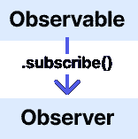

# 观察对象 vs 主体 vs 行为主体

> 原文：<https://javascript.plainenglish.io/eli5-observables-vs-subjects-vs-behavior-subjects-f2494f14813d?source=collection_archive---------0----------------------->

## 像我 5 岁时一样解释:可观察对象 vs 主体 vs 行为主体

## 内容

*   可观察到的与承诺
*   ELI5 时尚的观察者模式
*   热对比冷观察
*   主体与行为主体

# 可观察到的与承诺

可观察值和承诺一样是异步的，但是关键的区别是可观察值可以随时间返回多个值，而承诺只返回一个值。

*   直到我们使用 subscribe()方法订阅它们，观察对象才会被执行，并且它们可以发出多个事件。
*   承诺处理单个事件，即使您没有附加回调方法，承诺也会被执行。

**关于反应式编程的一句话:**

你可能听说过反应式编程，在我看来，它听起来总是超级时髦。简单来说就是设计你的程序来等待事件，并在事件发生时做出反应。在前端开发中，事件无处不在。从标准的键盘事件到您自己创建的自定义事件，毫无疑问，事件在前端开发中非常重要。RxJS 库提供了一个坚实的工具箱来对这些事件做出反应。

# ELI5: **观察者模式**

你可能已经遇到了`Observer Pattern`的技术图表和解释，只是为了摆脱它，就像你以前一样困惑。也许你的冒名顶替综合症开始发作了。

相反，让我们应用一个类比，而不是进入技术图表。

假设你正在浏览*youtube.com，*找到一个你喜欢的 DIY 频道。你可以观看一些制作*完美胡桃木餐桌的视频。(不好意思，我是新爸爸，这些东西让我感兴趣。)*

如果您想获得该频道的通知，您需要先点击`subscribe` 按钮**。** `Subscribing` *连接*你这个消费者，到`Observable`的数据。youtube 频道就像持有数据的观察者，当你订阅时，你(观察者)会在新视频制作时收到通知。如果你忘记订阅，那么你将不会得到最新的更新，你将会错过任何新发生的事情。

**外卖&术语:**

*   `Observer:`订阅和收听变化的事物。在 youtube 的例子中，你可以和观察者相比，因为你在等待你最喜欢的 youtube 频道发布新的视频。
*   `Observable:`只是一个函数，当你订阅时，它随时间返回数值。例如，如果你订阅了你最喜欢的 youtube 频道的通知，那么当新视频发布时，你将会收到多个通知。
*   `Producer:`是你的可观察值的来源。频道创建者是你订阅内容的`producer`。

# 热与冷的对比观察:

有两种主要的可观察类型:热对冷。它们都是通过订阅以相同的方式访问的。

**寒冷:**

*   **单播** —只有一个观察者订阅并监听变化。当您订阅时，会为该实例创建一个新的生成器。如果您取消订阅，将会发生拆除过程，订阅将不再可用。

**热:**

*   **多播** —当有多个观察者监听变化时。当你订阅时，你只是众多订阅者/观察者中的一员。如果您取消订阅，生产者将继续存在并继续产生价值，直到所有人都取消订阅。

## **常规可观测冷&单播:**

如果你在家观看网飞上的电影，当你按下 play ( *subscribe* )时，电影流是为你新创建的，并且电影从头到尾都是完全可用的。*想象一下，按下播放就相当于订阅。*

这是一个冷观察，因为电影流(*又名观察*)是专为你创造的。您是这个流的唯一观察者(*单播*)，并且您可以完全控制它何时开始或停止。如果世界各地的其他人按下播放，就会产生一个新的可观察流，他们也可以看到完整的电影。为它们创建新的独立流，并且新的观察者通过订阅或取消订阅来完全控制可观察流的开始/停止。

**外卖:**

*   冷可观测量是单播的。单播意味着观察者和数据生产者之间是一对一的关系。在网飞，当您按下电影上的播放按钮时，一个新的电影流会专门为您创建/制作。
*   Cold observables 主要用于读取或更新当前状态，通常是通过 HTTP GET 或 PUT 请求。

## **科目和行为科目火热&组播:**

相比之下，当你在电影院时，你是**而不是**唯一观看电影的人。你不能控制电影什么时候开始，因为它是在预定的放映时间开始的。当该时间开始时，胶片卷轴被加载并播放。如果你来晚了(订阅晚了)，你会错过电影的开头。因此，如果您在可观察对象已经发出一些值之后订阅，那么您将会错过订阅之前发生的数据。其他较早到达的观众将会看到完整的电影。

*   电影院有多个观众(组播)和一部电影要看(流/制片人)。
*   每个观察者都可以随时走进或走出，但演出将继续进行。这意味着每个人都可以看到整部电影的不同场景。

**两种类型的热观测值**

1.  **科目:**

主体是**热**可观察的，因为它们有多个观察者(多播)。如果你走出电影院去小卖部买更多的爆米花和可口可乐，那么你可能会错过一些东西。你不会有机会赶上或看到任何已经发生的事情，你只会看到接下来发生的事情。

*   当你订阅一个主题时，你只会看到新的事件，而不是过去发生的任何事情。它只向订阅的观察器发送数据，任何以前发出的数据都不会发送给新的观察器。你只能对你关注的事情做出反应。
*   没有初始值。
*   您可以通过调用方法`next(). subject$.**next**(‘Hello World’);`将值提供给流

什么时候可以使用主语？

我主要使用主题来表示应用程序中的自定义事件。只是一辆“活动大巴”。例如，您可以创建一个在事件发生时在 UI 中弹出通知的主题。

你可以传递任何值给它:`subject$.**next**(‘example value pushed to the subject’)`，然后每个观察者都会看到`‘example value pushed to the subject’.`

**2。行为主体:**

与没有提供访问已经传递的值的方法的 Subject 相反，Behavior Subject 有一个`.getValue()`方法，可以让您访问最后发出的值。就好像你在剧院旁边的朋友把最后一幕留在记忆里(发射值)，告诉你从小卖部回来的时候发生了什么。

*   行为主体在订阅时接收最后发出的/最新的值。此功能对于将数据存储在服务中以便在应用程序间共享非常有用。
*   需要传递初始值。`const behaviorSubject$ = new **BehaviorSubject**("Hello World");`
*   如果没有最新的值，那么它发出初始值。

**什么时候可以使用行为主体？**

根据我的经验，行为主体主要用于在服务中存储数据。购物车是需要跨组件同步数据的一个很好的例子。您可能在页面标题组件中有一个显示总金额的标题，以及一个允许您编辑购物车的差异组件。为了保持这些同步，您可以在服务级别使用一个行为主体，作为事实的单一来源。

## 结论:

# 感谢阅读。如果你学到了什么，点击跟随按钮！

对于如何使用观察和行为主题的实际、深入的例子，我强烈推荐阅读我的朋友 Vidal 的这篇教程。[https://medium . com/@ vidalquevedo/how-to-share-data-between-components-in-angular-b86ce 8254965](https://medium.com/@vidalquevedo/how-to-share-data-between-components-in-angular-b86ce8254965)

*更多内容请看*[***plain English . io***](http://plainenglish.io)