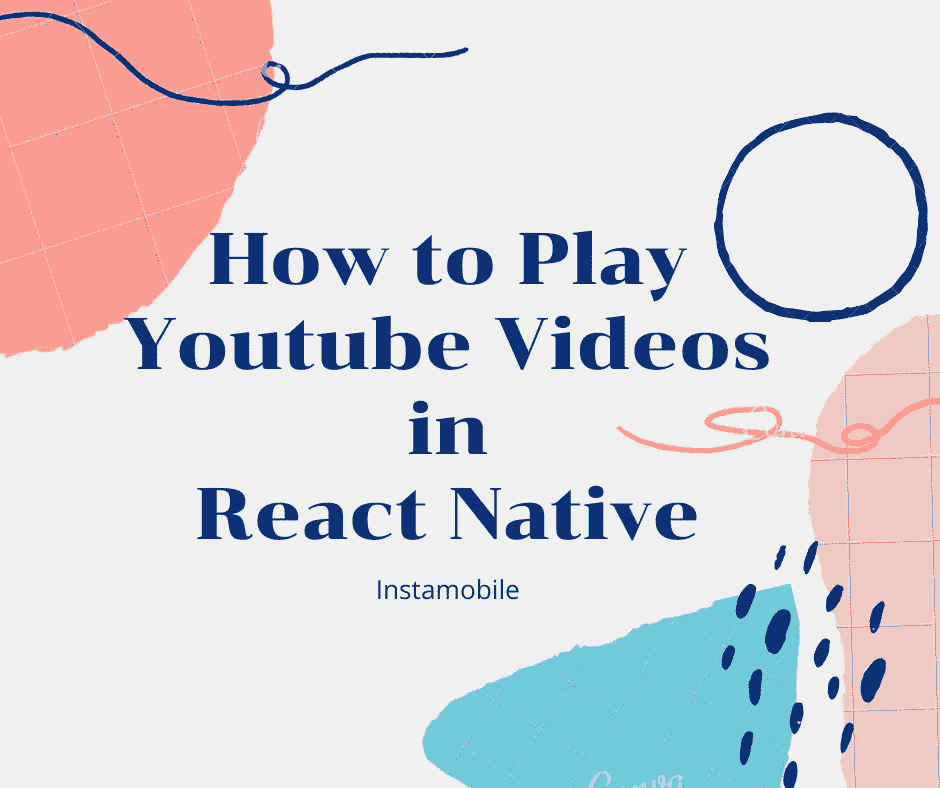
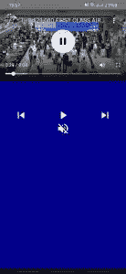

# 将 YouTube 视频嵌入 React 本机应用程序

> 原文：<https://javascript.plainenglish.io/embed-youtube-video-in-a-react-native-app-7edbf38bbe36?source=collection_archive---------12----------------------->



视频支持是一项让你的应用更生动、更具互动性、更有趣的功能。到本文结束时，您将能够轻松地在 React Native 应用程序中嵌入您选择的任何 YouTube 视频。为了理解本教程，你应该熟悉 React Native 中 [**useRef**](https://reactjs.org/docs/hooks-reference.html#useref) 和 [**useState**](https://reactjs.org/docs/hooks-state.html) 的用法。

为了在 React Native 中播放 YouTube 视频，我们将使用名为[**React-Native-YouTube-iframe**](https://www.npmjs.com/package/react-native-youtube-iframe)**的 npm 依赖项。**我们将通过将该库完全集成到应用程序中来使用它。

## 装置

你需要先安装 **react-native-webview** 。只需运行:

```
yarn add react-native-webview

or

npm install react-native-webview
```

然后安装**react-native-YouTube-iframe:**

```
yarn add react-native-youtube-iframe

or 

npm install react-native-youtube-iframe
```

## 使用

```
/**
 * Sample React Native App
 * https://github.com/facebook/react-native
 *
 * @format
 * @flow strict-local
 */

import React from 'react';
import {View} from 'react-native';
import YoutubePlayer from 'react-native-youtube-iframe';

const App = () => {

  return (
    <View>
      <YoutubePlayer
        height={300}
        play={true}
        videoId={'84WIaK3bl_s'}
      />
    </View>
  );
};
```

这里需要的道具是 ***身高*** 和你打算在 React 原生应用中播放的 YouTube 视频的 ***videoId*** 正如在下面的应用中看到的，我们展示了一个 Casey Neistat 旅行 vlog:


***播放*** 道具设置为 true，所以让我们更进一步，控制播放和暂停动作:

```
/**
 * Sample React Native App
 * [https://github.com/facebook/react-native](https://github.com/facebook/react-native)
 *
 * @format
 * @flow strict-local
 */import React, {useState, useCallback} from 'react';
import {Button, View, Alert} from 'react-native';
import YoutubePlayer from 'react-native-youtube-iframe';const App = () => {
  const [playing, setPlaying] = useState(false); const togglePlaying = () => {
    setPlaying((prev) => !prev);
  } return (
    <View>
      <YoutubePlayer
        height={300}
        play={playing}
        videoId={'84WIaK3bl_s'}
      />
      <Button title={playing ? 'pause' : 'play'} onPress={togglePlaying} />
    </View>
  );
};
```

现在我们可以控制 YouTube 视频的播放和暂停。最好添加一个功能，通过传递依赖项提供的***onChangeState***prop 等回调来告诉用户视频已经播放完毕:

```
/**
 * Sample React Native App
 * [https://github.com/facebook/react-native](https://github.com/facebook/react-native)
 *
 * @format
 * @flow strict-local
 */import React, {useState} from 'react';
import {Button, View, Alert} from 'react-native';
import YoutubePlayer from 'react-native-youtube-iframe';const App = () => {
  const [playing, setPlaying] = useState(false); const onStateChange = (state) => {
    if (state === 'ended') {
      setPlaying(false);
      Alert.alert('video has finished playing!');
    }
  } const togglePlaying = () => {
    setPlaying((prev) => !prev);
  } return (
    <View>
      <YoutubePlayer
        height={300}
        play={playing}
        videoId={'84WIaK3bl_s'}
        onChangeState={onStateChange}
      />
      <Button title={playing ? 'pause' : 'play'} onPress={togglePlaying} />
    </View>
  );
};
```


既然我们已经学习了这个 YouTube 播放器依赖项的基本用法，让我们继续为我们的视频播放器建立播放、暂停、跳过和静音的完全控制。

```
import React, {useState, useRef} from 'react';
import {View, Alert, StyleSheet} from 'react-native';
import YoutubePlayer from 'react-native-youtube-iframe';
import {Icon} from 'react-native-elements';const App = () => {
  const [playing, setPlaying] = useState(false);
  const [isMute, setMute] = useState(false);
  const controlRef = useRef(); const onStateChange = (state) => {
    if (state === 'ended') {
      setPlaying(false);
      Alert.alert('video has finished playing!');
    }
    if (state !== 'playing') {
      setPlaying(false);
    }
  }; const togglePlaying = () => {
    setPlaying((prev) => !prev);
  }; const seekBackAndForth = (control) => {
    console.log('currentTime');
    controlRef.current?.getCurrentTime().then((currentTime) => {
      control === 'forward'
        ? controlRef.current?.seekTo(currentTime + 15, true)
        : controlRef.current?.seekTo(currentTime - 15, true);
    });
  }; const muteVideo = () => setMute(!isMute); const ControlIcon = ({name, onPress}) => (
    <Icon onPress={onPress} name={name} size={40} color="#fff" />
  ); return (
    <View style={styles.container}>
      <YoutubePlayer
        height={300}
        ref={controlRef}
        play={playing}
        mute={isMute}
        videoId={'84WIaK3bl_s'}
        onChangeState={onStateChange}
      />
      <View style={styles.controlContainer}>
        <ControlIcon
          onPress={() => seekBackAndForth('rewind')}
          name="skip-previous"
        />
        <ControlIcon
          onPress={togglePlaying}
          name={playing ? 'pause' : 'play-arrow'}
        />
        <ControlIcon
          onPress={() => seekBackAndForth('forward')}
          name="skip-next"
        />
      </View>
      <ControlIcon
        onPress={muteVideo}
        name={isMute ? 'volume-up' : 'volume-off'}
      />
    </View>
  );
};const styles = StyleSheet.create({
  container: {
    flex: 1,
    backgroundColor: 'darkblue',
  },
  controlContainer: {
    flexDirection: 'row',
    justifyContent: 'space-around',
  },
});
```

我们在之前已经拥有的原始组件中添加了更多自定义控件，并添加了回调以使用***player ref***ref 向前和向后查找。静音控制基本上由 ***isMute*** 状态管理，但值得注意的是，依赖关系提供了一个方法 ***isMuted*** (如果视频静音，则返回解析为 true 的承诺，否则为 false)来确定视频是否静音。



## 结论

在 React 原生应用中嵌入和播放 YouTube 视频是无缝的，也是在应用中显示视频的更经济的方式，因为 YouTube 将支持托管视频本身的成本。我们描述的 npm 依赖项非常容易使用，并且高度可定制，正如我们在上面添加了前进和后退控件的代码片段中看到的那样。

下次你想添加 YouTube 视频支持来反应本地应用时，请参考本教程。如果你喜欢这个项目，请考虑与你的朋友和社区分享这个链接。干杯！

[最初发布于 instamobile.io](https://www.instamobile.io/react-native-tutorials/play-youtube-videos-react-native/)