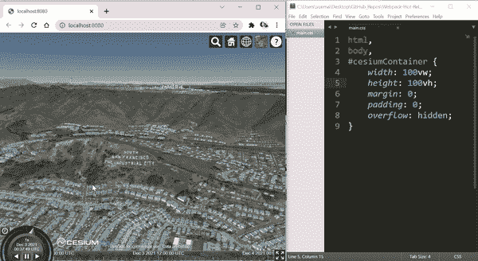
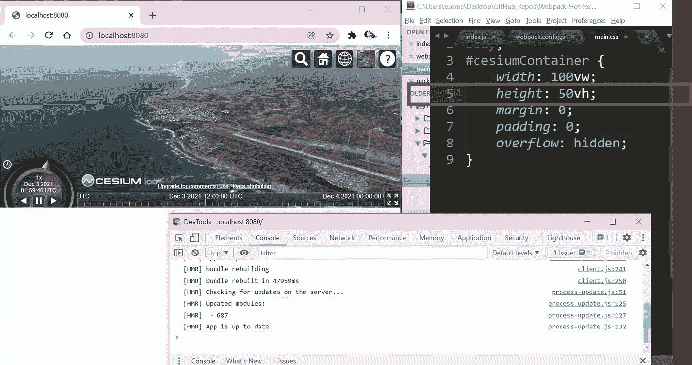
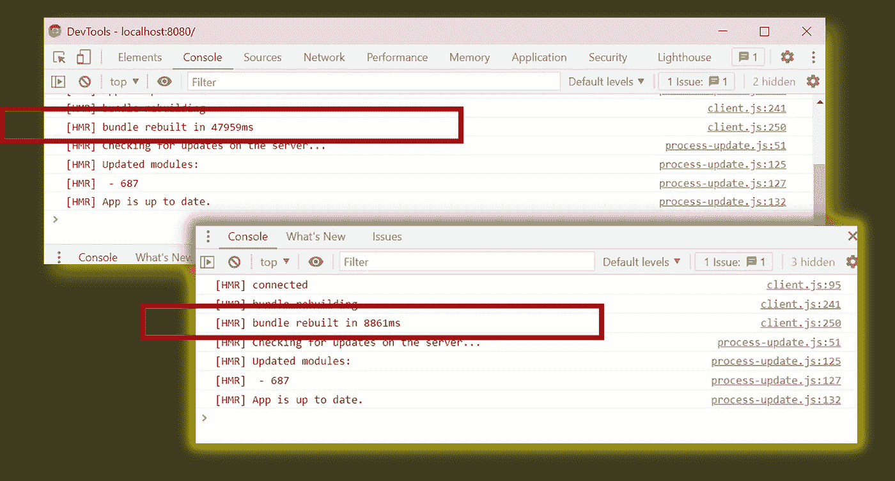

# 在 Webpack 5 样板文件中启用不带 Webpack-Dev-Server 的热重装

> 原文：<https://javascript.plainenglish.io/enable-hot-reload-without-webpack-dev-server-in-webpack-5-boilerplate-76a9644a6e67?source=collection_archive---------0----------------------->

## 用例:铯 JS 网络包的例子。完整的代码实现。


Photo by [AltumCode](https://unsplash.com/@altumcode?utm_source=medium&utm_medium=referral) on [Unsplash](https://unsplash.com?utm_source=medium&utm_medium=referral)

对于使用 bundler 工具 [Webpack](https://webpack.js.org/) 的 Node.js web 开发人员来说，许多人可能已经注意到了其配套模块 [Webpack-Dev-Server](https://github.com/webpack/webpack-dev-server) **(本文发稿时为 v4)——**中的最新功能，即内置的“热加载”功能。(**参考消息:**[web pack](https://webpack.js.org/)bundler 最新版本为 **v5** 。)

# 解释和说明热重装

## 用例演示:[铯](https://cesium.com/)，一个 JS 工具，用于呈现 3D 网络内容

对于本文的演示，所使用的 starter Webpack 样板文件将从[铯与 Webpack](https://github.com/CesiumGS/cesium-webpack-example) 中检索，这是一个用 [Webpack-Dev-Server](https://github.com/webpack/webpack-dev-server) 配置的最小 Webpack 模板。(由[铯](https://cesium.com/)团队创造)

基本上,“热重新加载”功能旨在通过动态更改 web 布局，而无需主动选择刷新按钮来重新呈现网页，从而使 web 开发成为一个无缝的过程。例如，在使用配置有 [Webpack-Dev-Server](https://github.com/webpack/webpack-dev-server) 的 Webpack 运行[铯时，当同时对 CSS 文件**(右侧)**中的样式表进行更改时，会反映 web 布局**(左侧)**中的地图显示:](https://github.com/CesiumGS/cesium-webpack-example)



Screen Capture by Author | Illustrating corresponding changes made to the map application on the left upon modification of the ‘main.css’ file | Height of layout is reduced to half when the `height` property in main.css file is changed to `50vh`

这提供了主要优势，例如:

*   无需主动选择“刷新”按钮
*   如上例所示，最小程度地改变应用程序的当前状态

> 如果发生了完全刷新，上面的地图将恢复到其初始位置，用户将需要再次将地图平移到所需的位置。

幸运的是，由于对 [Webpack-Dev-Server](https://github.com/webpack/webpack-dev-server) 的最新调整，这可以通过 *webpack.config.js* 文件快速配置，方法是将参数`mode`设置为`**development**` ，就像上面的演示一样。

在 *package.json* 中包含以下脚本后:

```
"start": "node_modules/.bin/webpack serve --config webpack.config.js --open"
```

该应用程序可以通过以下命令运行:

```
npm start
```

> 虽然上面的设置提供了方便的优势，但是这仅用于具有基本功能且很少需要定制的 Webpack 应用程序。

为了覆盖[**web pack-Dev-Server**](https://github.com/webpack/webpack-dev-server)的严格设置，下一节将演示[**web pack-Dev-Server**](https://github.com/webpack/webpack-dev-server)**如何被[**web pack-Hot-Middleware**](https://github.com/webpack-contrib/webpack-hot-middleware)和[**web pack-Dev-Middleware**](https://github.com/webpack/webpack-dev-middleware)所取代，以实现相同的热重新加载功能，并提供更大的定制空间**

# **在 Webpack 样板文件中配置热重装**

**参考[铯的网络包样板](https://github.com/CesiumGS/cesium-webpack-example)，**

## ****第一步。**继续按顺序运行以下`npm`命令**

```
npm uninstall webpack-dev-server --save-dev
npm install webpack-dev-middleware webpack-hot-middleware express regenerator-runtime rimraf cross-env openurl --save-dev
```

## ****第二步。**修改 webpack.config.js 文件**

**一、将参数`mode`值从`development`更改为`production`(热重装不再需要通过`mode`参数使能)并将参数`devtool`更改为`inline-source-map`**

```
{
    context: __dirname,
    mode: 'production', // changed from 'development'
    devtool: 'inline-source-map' // changed from 'eval'
}
```

**二。对于参数`entry`，包含在`webpack-hot-middleware/client`中如下:**

```
{
    context: __dirname,
    mode: 'production',
    devtool: 'inline-source-map',  

    entry: {
        app: 'webpack-hot-middleware/client', './src/index.js'
    }
}
```

**三。对于参数`plugins`，包含以下 webpack 中间件:**

```
{
    context: __dirname,
    mode: 'production',
    devtool: 'inline-source-map',
    entry: {
        app: ['webpack-hot-middleware/client', './src/index.js']
    },
    plugins: [
        new webpack.HotModuleReplacementPlugin(),
        new webpack.NoEmitOnErrorsPlugin(), 
        new HtmlWebpackPlugin({
            template: 'src/index.html'
        }),
        new CopyWebpackPlugin({
            patterns: [                
            { from: path.join(cesiumSource, cesiumWorkers), 
              to: 'Workers' },                
            { from: path.join(cesiumSource, 'Assets'), 
              to: 'Assets' },                
            { from: path.join(cesiumSource, 'Widgets'), 
              to: 'Widgets' }            
            ]        
        }),        
        new webpack.DefinePlugin({
            // Define relative base path in cesium for loading assets             
            CESIUM_BASE_URL: JSON.stringify(''),
            'process.env': {
              'NODE_ENV': JSON.stringify('production')
            }        
        })
    ]
}
```

## ****第三步。**设置 express.js 服务器配置[**web pack-Hot-Middleware**](https://github.com/webpack-contrib/webpack-hot-middleware)和[**web pack-Dev-Middleware**](https://github.com/webpack/webpack-dev-middleware)**

**一、在 **src** 文件夹下新建一个文件夹“server”和“index.js ”:**

```
(root) celsium-webpack-modified
  |--src
  |   |--css
  |   |   |--main.css
  |   |--index.html
  |   |--index.js
  |   |
  |   |--server
  |        |--index.js
  |
  |--package.json
  |--webpack.config.js
```

**二。为了更好地组织项目结构，将出现在 **src** 文件夹中的其他文章嵌套在一个“ **app** 文件夹中:**

```
(root) celsium-webpack-example 
  |--src
  |   |--app
  |   |   |--css
  |   |   |--main.css
  |   |   |--index.html
  |   |   |--index.js
  |   |--server
  |        |--index.js
  |
  |--package.json
  |--webpack.config.js
```

**三。在 server/index.js 文件中，设置 express Node.js 服务器，如下所示:**

```
// server/index.js
const express= require('express');
const app = express();
const path= require('path');
const HOSTNAME = 'localhost';
const PORT = 8080;
const webpack= require('webpack');
const webpackconfig = require('../../webpack.config.js');
const webpackMiddleware= require('webpack-dev-middleware');
const webpackHotMiddleware= require('webpack-hot-middleware');
const buildDir = '../../dist/';
app.use(express.static(path.join(__dirname, buildDir)));
const webpackCompiler=webpack(webpackconfig);
const wpmw = webpackMiddleware(webpackCompiler,{ });
app.use(wpmw);
app.use(webpackHotMiddleware(webpackCompiler));
app.listen(PORT, (err) => {
    if (err) { return console.error(err); }
    console.log(`Server running on ${HOSTNAME}:${PORT}`);
    require("openurl").open(`http://${HOSTNAME}:${PORT}`);
});
```

## ****第四步。**修改 webpack.config.js，更新 *src/index.html* 和入口文件*各自的路径。/src/index.js***

*   **在`resolve`下，为 css 文件夹添加一个新的别名(这是为了引用应用程序中的所有 css 文件)**

```
{
    context: __dirname,
    mode: 'production',
    devtool: 'inline-source-map',
    entry: {
        app: ['webpack-hot-middleware/client', './src/app/index.js']
    },
    resolve: {
        alias: {
            cesium: path.resolve(__dirname, cesiumSource),
            css: path.resolve(__dirname, 'src/app/css')
        },
        mainFiles: ['index', 'Cesium']
    },
    plugins: [
        new webpack.HotModuleReplacementPlugin(),
        new webpack.NoEmitOnErrorsPlugin(), 
        new HtmlWebpackPlugin({
            template: 'src/app/index.html'
        }),
        new CopyWebpackPlugin({
            patterns: [                
            { from: path.join(cesiumSource, cesiumWorkers), 
              to: 'Workers' },                
            { from: path.join(cesiumSource, 'Assets'), 
              to: 'Assets' },                
            { from: path.join(cesiumSource, 'Widgets'), 
              to: 'Widgets' }            
            ]        
        }),        
        new webpack.DefinePlugin({
            // Define relative base path in cesium for loading assets             
            CESIUM_BASE_URL: JSON.stringify(''),
            'process.env': {
              'NODE_ENV': JSON.stringify('production')
            }        
        })
    ]
}
```

*   **更新对 *src/app/index.js* 文件中 *main.css* 文件的引用**

```
import "css/main.css" // changed from "../src/css/main.css"
```

## **第五步。更新 package.json**

```
{  
  "main": "src/server/index.js",
  "scripts": {
    "build": "rimraf dist && cross-env webpack",
    "start": "node src/server/index.js"
  }
}
```

## **➜测试运行修改后的 Webpack 应用程序**

**要确保成功实施热重装功能，请运行以下命令来运行更新的铯网络包应用程序:**

```
npm run build
npm start
```

**同样，当高度属性从“100vh”更改为“50vh”时，以下更改将反映在地图位置不变的情况下**(仅供参考:这可能需要 1 分钟)**:**

****

**Screenshot by Author | Similar to before, when the height property is changed the layout of the map re-renders accordingly**

# **减少热重装的渲染时间**

**显然，虽然 webpack-dev-server 的热重新加载只需要几秒钟就可以重新呈现地图，但是中间件服务器的热重新加载需要 49 秒才能完成，因为这个过程涉及到重新构建导入的节点模块。为了减少包的重建过程，有几个方面需要修改。**

## **1) webpack.config.js —优化参数**

**回想一下`mode`参数值现在是“生产”。将参数`optimization`添加到 webpack.config.js 文件中:**

```
{
    optimization: {
        // chunkIds: 'named',
        // moduleIds: 'deterministic',
        concatenateModules: true,
        mangleExports: true,
        mangleWasmImports: true,
        // mergeDuplicateChunks: false,
        minimize: false,
        innerGraph: false,
        minimizer: [
            new CssMinimizerPlugin(),
            new TerserPlugin({
                parallel: true,
                terserOptions: {
                    compress: true,
                    // minify: TerserPlugin.uglifyJsMinify,
                    mangle: true
                },
            extractComments: false
          })
        ],
        emitOnErrors: false,
        nodeEnv: 'production',
        removeAvailableModules: false
        // splitChunks: {
        //     chunks: 'all',
        //     name: false
        // }
   },
}
```

**如上所示，使用了最小化插件，如[CSS-minimizer-web pack-plugin](https://www.npmjs.com/package/css-minimizer-webpack-plugin)和 [terser-webpack-plugin](https://www.npmjs.com/package/terser-webpack-plugin) 。因此，通过运行以下命令来安装这些模块:**

```
npm install terser-webpack-plugin css-minimizer-webpack-plugin --save
```

**使用以下代码将这两个模块导入 webpack.config.js:**

```
const CssMinimizerPlugin = require('css-minimizer-webpack-plugin');
const TerserPlugin = require('terser-webpack-plugin');
```

****仅供参考:**您可以在 [Optimization | webpack](https://webpack.js.org/configuration/optimization/) 查看关于这些参数的官方文件，以评估哪些设置最适合您的 webpack 应用程序的最终版本。**

## **2) webpack.config.js —文件加载器**

**请注意，根据应用程序提供的文件类型，不同的加载器可以显著减少渲染时间。因为这个演示的应用程序由文件扩展名组成，比如*。json* 和*。jpg* 文件，可以分别使用 [json-perf-loader](https://www.npmjs.com/package/json-perf-loader) 和 [image-webpack-loader](https://www.npmjs.com/package/image-webpack-loader) (注意:可以随意使用其他加载器。这些只是建议。)**

*   **通过 npm 命令安装加载程序**

```
npm install json-perf-loader image-webpack-loader file-loader --save
```

*   **在 webpack.config.js 中的参数`module`下，配置这些加载器来处理各自的文件类型**

```
{   
    module: {
        rules: [{
            test: /\.css$/,
            use: [ 'style-loader', 'css-loader' ]
        },
        {
            test: /\.(png|gif|jpg|jpeg|svg)$/i, 
            use: [
                'file-loader?name=[path][name][ext]',
                {
                    loader: 'image-webpack-loader',
                    options: { 
                      bypassOnDebug: true, // webpack@1.x
                      disable: true, // webpack@2.x and newer                           
                      optipng: {                
                        enabled: false
                      }
                    }
                }
            ]
        },
        {        
            test: /\.(json|geojson)$/,
            use: [
                'file-loader?name=[path][name][ext]',
                {  
                    loader: 'json-perf-loader'
                }
            ]
        },
        {
            test: /\.(png|gif|jpg|jpeg|svg|xml|json)$/,
            use: [ 'url-loader' ]
        }]
    },
}
```

## **3) src/server/index.js —捆绑压缩**

**除了点 **1)** 和点 **2)** 之外，在 **src/server/index.js** 文件中设置了 webpack-dev-中间件和 webpack-hot-中间件的 express.js 服务器的地方，通过运行`npm install compression --save`安装模块[压缩](https://www.npmjs.com/package/compression)**

**在文件顶部包括以下行: **src/server/index.js****

```
const express= require('express');
const app = express();

const compression = require('compression');
app.use(compression());
```

## **➜重新运行应用程序**

**通过执行以下 npm 命令运行更新的 Celsium Webpack 应用程序:**

```
npm run build
npm start
```

**与之前类似，调整 CSS 并观察在开发人员控制台中重建 webpack 模块所需的时间:**

****

**Screenshot by Author | The above console belongs to the initial reload time taken by the middleware. The console below (with yellow outline) belongs to the current reload time taken.**

> **显然，虽然之前只花了~48 秒，但经过上述调整后，花的时间要短得多~9 秒。**

**完整的源代码可以在我的 GitHub Repo 上找到:[Celsium-Webpack-样板文件](https://github.com/incubated-geek-cc/Celsium-Webpack-Boilerplate)**

# **结论**

**虽然内置的热重新加载功能使 NodeJS web 开发人员能够在设置 Webpack 中间件时节省大量时间，但它确实限制了应用程序的可伸缩性，因此更适合于基本上是静态的简单用例。**

**然而，如果应用程序需要额外的功能数组或框架迁移，那么从长远来看，在 Node.js webpack 应用程序上投入更多的时间和精力是值得的。**

# **Webpack 中间件应用程序中的潜在加载项列表**

*   **记录**
*   **在 express.js 服务器中构建 API**
*   **提供静态文件路径**
*   **使用 express.js 路由器配置代理请求**

## **非常感谢你坚持到这篇文章的结尾！❤希望你觉得这个指南有用，如果你想了解更多 GIS、数据分析& Web 应用相关的内容，请随时[关注我的 Medium](https://medium.com/@geek-cc) 。会非常感激😀**

## **以防你错过了这个链接，这里是本教程的完整源代码。随意叉为己用:[Celsium-web pack-Boilerplate](https://github.com/incubated-geek-cc/Celsium-Webpack-Boilerplate)**

**[](https://geek-cc.medium.com/membership) [## 通过我的推荐链接加入灵媒——李思欣·崔

### 获得李思欣·崔和其他作家在媒体上的所有帖子！😃您的会员费直接…

geek-cc.medium.com](https://geek-cc.medium.com/membership) 

*更多内容看* [***说白了就是***](http://plainenglish.io/) ***。*** *报名参加我们的* [***免费每周简讯点击这里***](http://newsletter.plainenglish.io/) ***。*****