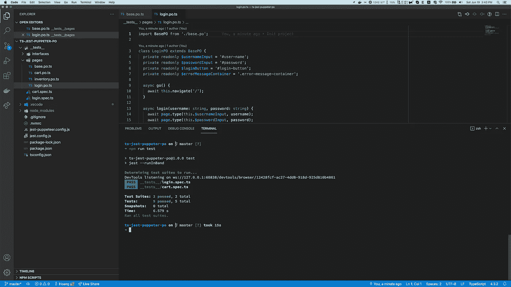
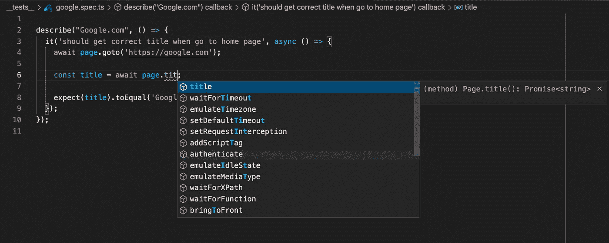
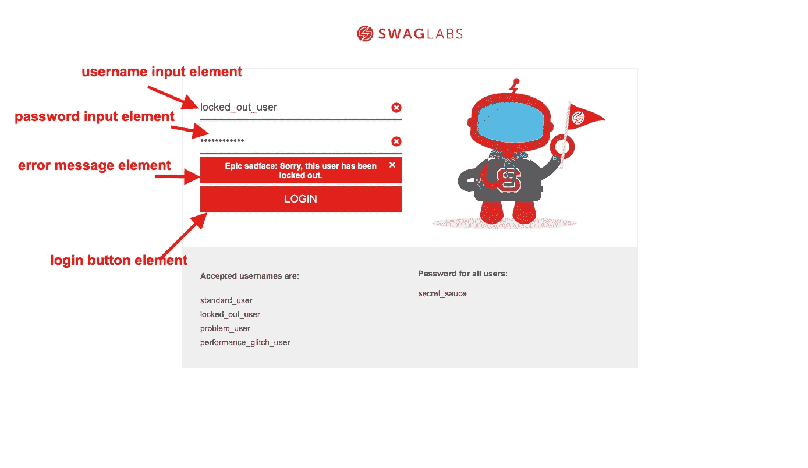

# Jest 和 Puppeteer 的端到端测试:使用 TypeScript 的页面对象模型

> 原文：<https://javascript.plainenglish.io/end-to-end-testing-using-jest-and-puppeteer-page-object-model-with-typescript-7fbd099f1b42?source=collection_archive---------4----------------------->



**页面对象模型(POM)** 是一种设计模式，广泛用于为 web UI 元素创建对象存储库的测试自动化中。该模型的优点是它减少了代码重复并改进了测试维护。

这个故事是一个关于如何使用木偶师，打字稿和笑话写一个简单的端到端测试(E2E)的教程。本教程将编写一些测试来涵盖一些简单的测试用例。本教程还使用页面对象模式来完成这些测试用例。

我们将使用一个演示电子商务网站—[https://www.saucedemo.com/](https://www.saucedemo.com/)。

有了这个网站，我们可以为登录页面编写完整的例子，并添加购物车流量。

**登录:**当用户名或密码无效或帐户被锁定时，应返回正确的错误消息。

**向购物车添加商品:**在主页上，向购物车添加一些商品。转到购物车页面，这些项目应该已经出现。

# E2E 项目与木偶，打字稿，和笑话

## 初始项目

在您的项目目录中，让安装 TypeScript 并创建`tsconfig.json`文件:

```
$ npm init -y # Init nodejs project
$ npm install typescript
$ npx tsc --init # Create tsconfig.json file with default values
```

安装依赖包:

```
$ npm install jest jest-puppeteer puppeteer ts-jest @types/jest @types/jest-environment-puppeteer @types/puppeteer
```

*   Jest-puppet er:Jest 预置，让你更容易配置 puppet er 无头浏览器。
*   [@ types/jest-environment-puppeter](https://www.npmjs.com/package/@types/jest-environment-puppeteer):用 Jest 和 puppeter 写 ts 代码时，类型定义支持 TypeScript。

配置类型脚本、Jest 和木偶师:

`tsconfig.json`:

```
{
  "compilerOptions": {
    "target": "es5",
    "module": "commonjs",
    "strict": true,
    "esModuleInterop": true,
    "skipLibCheck": true,
    "forceConsistentCasingInFileNames": true,
    "rootDir": "./__tests__",
    "sourceMap": true,
    "types": [
      "jest",
      "puppeteer",
      "jest-environment-puppeteer",
    ],
    "outDir": "dist",
  },
  "include": [
    "./__tests__",
  ]
}
```

`jest-puppeteer.config.js`:

```
module.exports = {
  launch: {
    dumpio: true,
    headless: process.env.HEADLESS === 'true',
    args: ['--disable-infobars', '--window-size=1200,800'],
    defaultViewport: null,
  },
  browserContext: 'default',
};
```

`jest.config.js`:

```
module.exports = {
  testTimeout: 30000,
  testMatch: ['**/?(*.)+(spec|test).[t]s'],
  preset: 'jest-puppeteer',
  transform: {
    '^.+\\.ts$': 'ts-jest',
  },
  testPathIgnorePatterns: ['/node_modules/', 'dist'],
};
```

为项目创建一个测试脚本。让我们更新`package.json`文件:

```
...
  "scripts": {
    "test": "jest --runInBand"
  },
...
```

使 jest 连续运行所有测试用例的`--runInBrand`选项。

## 创建一个简单的测试

在`__test__`目录下创建一个简单的 spec 文件。并编写一个简单的测试“访问 google 主页，并确保页面标题是`Google`”

`google.spec.ts`

```
describe("Google.com", () => {
  it('should get correct title when go to home page', async () => {
    await page.goto('[https://google.com'](https://google.com')); const title = await page.title(); expect(title).toEqual('Google');
  });
});
```

使用`@types/jest-environment-puppeteer`我们可以很容易地在 TS 文件中使用`page`对象作为木偶页面对象。



VSCode suggestion for puppeteer object

运行测试脚本:

```
# Run in normal mode
$ npm run test # Or `npm test` or `npm t`# Run with headless mode
$ HEADLESS=true npm run test
```

输出将如下所示:

```
Determining test suites to run...
DevTools listening on ws://127.0.0.1:63472/devtools/browser/6a96a46a-6fea-4511-9374-5d9511557abb
 PASS  __tests__/google.spec.ts
  Google.com
    ✓ should get correct title when go to home page (859 ms)Test Suites: 1 passed, 1 total
Tests:       1 passed, 1 total
Snapshots:   0 total
Time:        2.649 s, estimated 3 s
Ran all test suites.
```

# 实现页面对象模型

创建一个基本页面对象—该对象包括一些常用函数

`./__test__/pages/base.po.ts`

这是一个具有`go`抽象函数的抽象类——导航到每个页面的正确 url 的函数。

关注我们的第一个测试案例——演示网站的登录页面。看一下登录页面:



Login page

然后，登录页面对象模型将包括 4 个元素和 1 个动作。

`./__test__/pages/login.po.ts`

我们的动作是`login`和一个助手函数`getErrorMessage`来获取当前的错误消息。

现在，我们可以为登录页面创建一个测试规范:

`./__test__/login.spec.ts`

我们使用 Jest 的`[test.each](https://jestjs.io/docs/api#2-testeachtablename-fn-timeout)`语法来创建 3 个“失败”的测试用例。

现在，您可以再次运行测试`npm run test`，结果将如下所示:

```
Determining test suites to run...
DevTools listening on ws://127.0.0.1:64018/devtools/browser/ef8bc336-90ee-414b-bb1e-2df87fe8fe4c
 PASS  __tests__/login.spec.ts
  Login
    ✓ should display "Epic sadface: Username and password do not match any user in this service" when username|password is "wrong_username|secret_sauce" (366 ms)
    ✓ should display "Epic sadface: Username and password do not match any user in this service" when username|password is "standard_user|wrong_password" (185 ms)
    ✓ should display "Epic sadface: Sorry, this user has been locked out." when username|password is "locked_out_user|secret_sauce" (150 ms)
    ✓ should go to inventory page when username and password are correct (193 ms)Test Suites: 1 passed, 1 total
Tests:       4 passed, 4 total
Snapshots:   0 total
Time:        3.418 s
Ran all test suites.
```

这就是登录页面的全部内容。

将商品添加到购物车规范比登录规范更复杂。规范故事将是这样的:

```
GIVE: List of products on the inventory pageWHEN: Click "Add to cart" button on some products
THEN: Number of cart item (top-right badge) should be updated corectly.
WHEN: Go to cart page
THEN: The added products should be appeared
```

先来看一下`cart.spect.ts`文件:

我们获取库存页面上的所有产品，随机挑选 3 件商品，然后尝试将它们添加到购物车中。断言购物车计数。

转到购物车页面，获取此页面上的所有项目，并与 3 个项目进行比较。

e2e 规范可以使用一个或多个页面对象。和我们的 spec 一样，它使用了`inventory page object`和`cart page object`。

`inventory.po.ts`

`cart.po.ts`

使用`--verbose`选项执行测试脚本:

```
$ npm run test -- --verbose# Result
Determining test suites to run...
DevTools listening on ws://127.0.0.1:56282/devtools/browser/61fb6612-de1f-4b08-8729-be984829f009
 PASS  __tests__/login.spec.ts
  Login
    ✓ should display "Epic sadface: Username and password do not match any user in this service" when username|password is "wrong_username|secret_sauce" (367 ms)
    ✓ should display "Epic sadface: Username and password do not match any user in this service" when username|password is "standard_user|wrong_password" (196 ms)
    ✓ should display "Epic sadface: Sorry, this user has been locked out." when username|password is "locked_out_user|secret_sauce" (147 ms)
    ✓ should go to inventory page when username and password are correct (181 ms)PASS  __tests__/cart.spec.ts
  Cart
    ✓ should add correct products to cart (488 ms)Test Suites: 2 passed, 2 total
Tests:       5 passed, 5 total
Snapshots:   0 total
Time:        3.92 s, estimated 5 s
Ran all test suites.
```

我们完成了一个 e2e 教程，使用页面对象模型。

# 结论

*   TypeScript 木偶页面对象模型使我们的 e2e 测试代码可维护和可重用。
*   有了 jest-puppeter 预置，我们可以在 Jest 项目的任何地方“注入”`page`和`browser`对象，轻松创建页面对象类。

本文使用的源代码发表在 [Github](https://github.com/codetheworld-io/ts-jest-puppeter-po) 上。

感谢您的阅读！

*更多内容请看*[***plain English . io***](http://plainenglish.io)