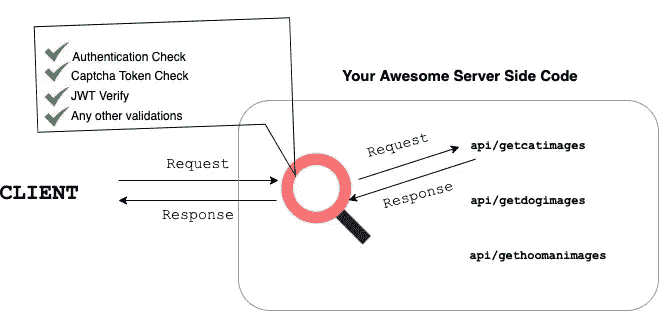

# 端点处理器 101

> 原文：<https://javascript.plainenglish.io/endpoint-handlers-101-c9aad2e62ebb?source=collection_archive---------14----------------------->

👋嘿，伙计们！

今天，我们将讨论端点处理程序！



Built using Draw.io by https://twitter.com/imabptweets

如上图所示，端点处理程序是一种对所有进入服务器的请求进行观察和验证的工具。它对任何端点的每个传入请求运行重要的安全验证。

如果一切顺利，服务器将处理请求，否则，将根据验证结果向客户端抛出 400/403 禁止错误。

*PS:任何以 4XX 开头的错误都与客户端有关。*

## **构建您的端点处理程序类型脚本。**

这是我最喜欢的部分。我们将看到如何实现端点处理程序。

首先，让我们创建一个端点。

```
const getCatImages = async(req, res)=>{
    if(req.method!=='GET') return res.status(400).end();
    return res.status(200).json({url: "s3.images.blah/cat1.jpg"})
}export default getCatImages
```

我们已经创建了一个端点，几乎可以完成获取猫图像的工作。

现在我们有以下限制。

1.只有爱猫人士才应该得到猫的图像。
2。只有经过身份验证的用户才能获得图像。
3。任何被禁止获取猫图像的用户都应该收到禁止请求。

现在我们可以构建端点了，包括这些限制。但是，如果我们有 100 个端点呢？当需要更新限制时，我们可能需要更新所有这 100 个端点。

接下来是端点处理程序的角色。
所以让我们构建一个端点处理器，它**返回一个“函数返回承诺”**。

```
const EndpointHandler = async(endpoint, validations)=>{
    return async(req,res) =>{

 **//Only Authenticated Users**     if(validations.onlyAuthenticated){
     const response = await checkAuth(req)
     if(response.status !== 200)
     return res.status(403).json({message: 'Unauthenticated User"})
    } **//Cat Lovers Only Allowed**     if(validations.onlyCatLovers)
     {
      const response = await CheckCatLovers(req.cookies)
      if(response.status !== 200)
      return res.status(403).json({message:"You are not a cat lover"}) } **// Banned Users Check**     if(validations.bannedUsersNotAllowed){
         const response = await checkUserisBanned(req.cookies);
         if(response.status !== 200)
         return res.status(403).json({message:"You have been banned. Contact Group Admin"});
} }
}
export default EndpointHandler
```

所以现在，我们的端点检查所需的验证。

现在我们必须将这个端点处理程序包装到我们的端点。

让我们回到第一段代码。

```
import EndpointHandler from './EndpointHandler';const getCatImages = async(req, res)=>{
    if(req.method!=='GET') return res.status(400).end();
    return res.status(200).json({url: "s3.images.blah/cat1.jpg"})
}export default EndpointHandler(getCatImages,
{
onlyAuthenticated:true,
onlyCatLovers:true,
bannedUsersNotAllowed:true
});
```

这就是我们如何成功地将端点处理程序与端点集成在一起的。这种方法有助于我们编写更好、更安全的代码，只需一个验证文件源。

## **好处**

您可以将更多的精力放在编写业务逻辑上，并将处理程序包装在内部，而不用担心端点的安全。

你有一个可维护的和容易调试的代码库。

你知道一个可以在任何地方应用的最佳实践

## **缺点**

不是这样的，但是它更适合具有一致端点的服务。具有不同操作的系统可能需要不同的端点处理程序。

这是所有的乡亲。

*如果你学到了什么，一定要在推特上分享:*[*https://twitter.com/imabptweets*](https://twitter.com/imabptweets)

我很想试试。

*更多内容请看* [***说白了就是***](http://plainenglish.io/) ***。*** *报名参加我们的* [***免费每周简讯这里***](http://newsletter.plainenglish.io/) ***。***