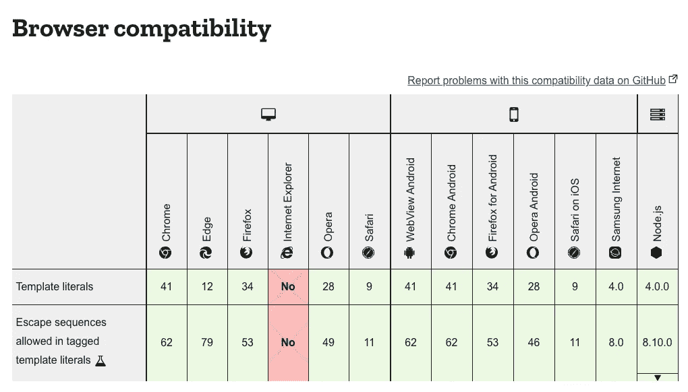
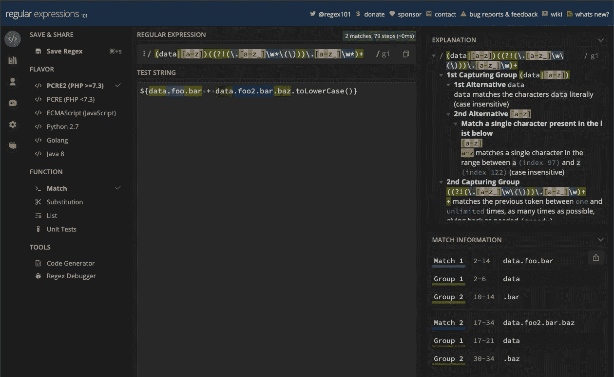
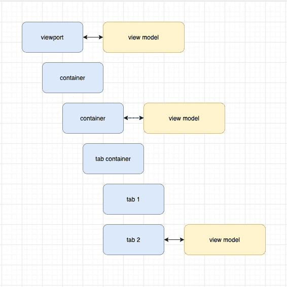
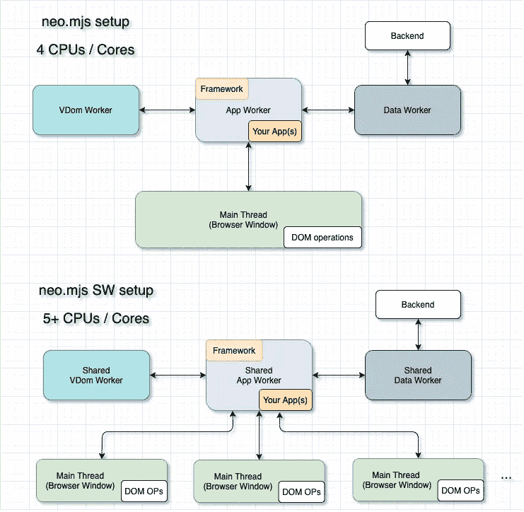

# 使用视图模型增强您的前端状态管理—第 2 部分

> 原文：<https://javascript.plainenglish.io/enhance-your-frontend-state-management-with-view-models-part2-5a9384bd863c?source=collection_archive---------6----------------------->


Photo by [Florian Olivo](https://unsplash.com/@florianolv?utm_source=medium&utm_medium=referral) on [Unsplash](https://unsplash.com?utm_source=medium&utm_medium=referral)

***引擎盖下:*** *设计目标并实现基于* [*模板文字*](https://developer.mozilla.org/en-US/docs/Web/JavaScript/Reference/Template_literals) *的视图模型。*

如果这个名字听起来没有印象，模板文字以前被称为模板字符串。从语法上来说，它们看起来像一个字符串，只是包装在``中。

示例:``<button>${myButtonText}</button>``

模板文字在给定的范围内直接解析像`${myButtonText}`这样的变量。

我们可以用它们做更多的事情！

**欢迎来到第 2 部分！**

> **旁注—** 本文是对“使用模板文字创建绑定引擎”的扩展重写。对于 neo.mjs 第 2 版，关于如何使用绑定格式化程序的语法从字符串转换为函数，这在以前的文章中没有反映出来。如果你已经读过，看看新的内容部分 3 & 4。

# 内容

1.  介绍
2.  如何使用视图模型改进前端架构的示例
3.  如何从字符串中提取数据变量？
4.  如何从模板文本中提取数据变量？
5.  在哪里存储绑定格式化程序中使用的数据属性？
6.  我们如何获取嵌套数据属性的变更事件？
7.  如何在内部保存绑定？
8.  源代码位置
9.  支持绑定格式化程序中的方法
10.  最后的想法

# 附录

1.  neo.mjs 是什么？

# 1.介绍

对于 [neo.mjs](https://github.com/neomjs/neo) 视图模型实现，我的目标是支持模板引擎的通用特性，而根本不构建或使用模板引擎。

阅读本文不需要任何使用 neo.mjs 的经验。

模板文字是一个完美的选择，因为在这一点上浏览器的支持是惊人的:



我们确实希望手动解析绑定格式化程序，以确定包含哪些变量。我们需要在使用的变量和组件配置之间建立绑定，组件配置使用绑定格式化程序来动态更新值，以防任何使用的变量发生变化。

由于模板文字的本质是立即解析变量，所以我们不能使用``来定义格式化程序。

例如:

```
`Hello ${1+2} ${data.button1Text + data.button2Text}`
```

不会包含任何关于所用变量的信息。

相反，我们将文字包装到函数中，以防止直接执行:

```
data => `Hello ${1+2} ${data.button1Text + data.button2Text}`
```

您可以使用箭头函数来获得更好的可读性，real 函数的性能稍好一些，因为我们是在离绑定组件最近的视图模型的范围内执行它们的。

```
data: function(data) {
    return `Hello ${1+2} ${data.button1Text + data.button2Text}`
};
```

# 2.如何通过使用视图模型来改进前端架构的示例

如果您对查看视图模型实现的实例(代码、视频、在线演示)感兴趣，我强烈推荐您阅读本文的第 1 部分:

[](https://tobiasuhlig.medium.com/enhance-your-frontend-state-management-with-view-models-7bf49e1a0991) [## 使用视图模型增强您的前端状态管理

### 您很可能使用过 MobX、Redux 或 React 上下文 API。

tobiasuhlig.medium.com](https://tobiasuhlig.medium.com/enhance-your-frontend-state-management-with-view-models-7bf49e1a0991) 

显而易见的答案:[正则表达式](https://developer.mozilla.org/en-US/docs/Web/JavaScript/Guide/Regular_Expressions)。

对于 neo.mjs 上下文，所有变量都存储在一个`data`属性中。

我去了:

```
/(data|[a**-**z])((?!(\.[a**-**z_]\w*\(\)))\.[a**-**z_]\w*)+/gi
```

我肯定不是 regex 方面的专家，所以我使用了一个在线工具来测试和修改它:

[](https://regex101.com/) [## regex101:构建、测试和调试 regex

### 正则表达式测试器，语法高亮，解释，PHP/PCRE，Python，GO，JavaScript 的备忘单…

regex101.com](https://regex101.com/) 

只需将“风味”更改为 ECMAScript，就可以开始了:



1.  我们确实想支持嵌套变量
2.  变量可能以一个类似于`toLowerCase()`的函数结束，我们确实想忽略它(这是负前瞻的原因)。

对于那些读过本文前一版本的读者:

正则表达式的开始已被更改:

以前是`data`，现在是`(data|[a-z)])`。

虽然旧的正则表达式在 dev 模式和 dist/development 中工作得很好，但在字符串到文字的 fn 更改之后，它不再在 dist/production 中工作。

原因很简单:

```
bind: {
    value: **data** => `${**data**.button3Text}`
}
```

功能确实变小了。

```
bind:{value:**e**=>`${**e**.button3Text}`}
```

因此正则表达式还需要支持起点的任何 1 个字符长的变量名。模型。组件逻辑得到了增强，仍然可以将找到的数据属性映射到`this.data`。

# 4.如何从模板文本中提取数据变量？

简而言之:不可能。

这就是为什么**以前的**视图模型版本使用模板文本格式的字符串，解析这些字符串，然后将它们转换成文本。

```
const fn = new ***Function***('data', 'return `' + formatter + '`;');
```

忘记你已经看过这个把戏，因为它是一个安全问题。

`new Function()`在幕后调用`eval()`,你可以利用这一点来添加“卑鄙的”代码。

**好消息:**有一个优雅的解决方案。

如果我们将格式化程序定义为函数，我们可以选择调用 function.toString()。

在您的控制台中尝试:

```
let bind = {
    value: data => `${data.button3Text}`
};

bind.value.toString();// logs: "data => `${data.button3Text}`"
```

这绝对足以用作正则表达式解析的输入。

之前的`resolveFormatter()`方法被替换为:

它将在绑定组件
(scope → this)的最近视图模型上被调用。

# 5.在哪里存储绑定格式化程序中使用的数据属性？

在 neo.mjs 中，您现在可以使用视图模型来存储数据属性。您可以简单地将它们定义为组件内部的对象，或者扩展`model.Component`。[本文的第 1 部分](https://tobiasuhlig.medium.com/enhance-your-frontend-state-management-with-view-models-7bf49e1a0991)涵盖了这一点。

一个简单的例子:

在“现实生活”的应用程序中，你很可能有一个深度嵌套的视图结构。



1.  每个视图都可以有一个视图模型
2.  我们需要访问父模型中的数据属性
3.  绑定格式化程序可以同时包含不同视图模型的数据属性

# 6.我们如何获取嵌套数据属性的变更事件？

在我们的视图控制器中，我们希望能够直接分配一个新值，比如:

```
this.getModel().data.button1Text = value;
```

我们还希望能够一次更改多个数据属性:

```
this.getModel().setData({
    button1Text: value1,
    button2Text: value2
});
```

`model.Component`正在使用一个`data_`配置。多亏了类系统的增强(config system)，尾随的下划线使我们能够使用一个`afterSet()`方法:

如果您在模型类或实例定义中为`data`赋值，就会触发这个事件。

我们递归解析嵌套的数据属性。

如果任何级别的属性尚未转换，我们将调用`createDataProperty()`

这已经是了:我们正在通过`get()`和`set()`转换任何级别的每个属性。这些值以一个前导下划线存储，现在我们已经有了我们的变更处理方法→ `onDataPropertyChange()`。

如果模型数据属性发生变化，我们解析存储的绑定来获取所有被绑定的组件。然后我们访问组件最接近的模型并调用`getHierarchyData()`，这给了我们一个组件父模型链中所有数据属性的合并对象。

组件可以有多个配置绑定，包括更改的数据属性，所以我们调用`component.set(config)`来一次分配所有的更改。这样，我们将只触发虚拟 dom 引擎一次。

# 7.如何在内部保存绑定？

每个`component.Base`的构造器(包括所有的类扩展)将检查最接近的模型，如果在这个模型上有匹配调用`parseConfig()`。

例如，在按钮定义中，您可以添加:

```
bind: {
    text: data => `${data.button2Text.toLowerCase()}`
}
```

我们调用`createBindings()`并立即在每个配置上设置解析值。

如果我们没有绑定`Neo.data.Store`，我们将调用`createBindingByFormatter()`。

由于格式化程序可以包含多个变量，我们正在做(前面在 3。)正则表达式解析，并为它们中的每一个调用`createBinding()`。

我们以下列格式存储绑定:


data property path→componentId→configName:formatter

`createBinding()`将始终使用模型父链中最接近的数据属性匹配(您可以在父模型中使用相同的名称)。

当然，一个组件将 ping 最近的模型，以防它被破坏，从而删除模型父链中的所有绑定。我们不想发生内存泄漏。

# 8.源代码位置

您可以在此查看完整的源代码:

[](https://github.com/neomjs/neo/blob/dev/src/model/Component.mjs) [## 近地天体

### 此时您不能执行该操作。您已使用另一个标签页或窗口登录。您已在另一个选项卡中注销，或者…

github.com](https://github.com/neomjs/neo/blob/dev/src/model/Component.mjs) 

到目前为止，全视图模型实现只需要 600 行代码。

如果不使用模板文字，它将会是很多(！)更多。

# 9.支持绑定格式化程序中的方法

我在这里开始了这个话题的新讨论:

[](https://github.com/neomjs/neo/discussions/1754) [## 模型。组件:支持绑定格式化程序内部的方法讨论#1754 neomjs/neo

### 此时您不能执行该操作。您已使用另一个标签页或窗口登录。您已在另一个选项卡中注销，或者…

github.com](https://github.com/neomjs/neo/discussions/1754) 

感谢您的反馈！

# 10.最后的想法

模板文字使我们能够做伟大的事情，如果我们想一点点的话。

我希望这篇文章不会太超前。我意识到代码不容易理解，即使对于有经验的 Javascript 开发人员来说也是如此。

不过，我尽量保持逻辑简单。

有了视图模型的实现，你现在可以完全遵循 MVVM 设计模式，如果你想的话。

再次感谢您的反馈！

问候&快乐编码，
托拜厄斯

***PS:neo . mjs 第二版发布公告将于明天发布！***

# 附录

# 1.neo.mjs 是什么？

neo.mjs 是一个麻省理工学院许可的开源项目，它使您能够构建多线程前端，而无需考虑工人设置或通信层。



一个扩展的 ES8+类配置系统帮助你在专业水平上创建 JavaScript 驱动的 UI 代码。

一个独特的方面是，开发模式直接在浏览器中运行，没有任何构建或转换。对于调试来说，这可以节省大量时间。

只需更改一个顶级框架配置，就可以切换到 SharedWorkers 模式。这种模式使您能够创建下一代 ui，否则这将是非常难以实现的。

您可以在以下位置找到存储库:

[](https://github.com/neomjs/neo) [## 近地天体

### neo.mjs 使您能够使用一个以上的 CPU 创建可扩展的高性能应用程序，而无需使用…

github.com](https://github.com/neomjs/neo) 

*更多内容请看*[*plain English . io*](http://plainenglish.io/)