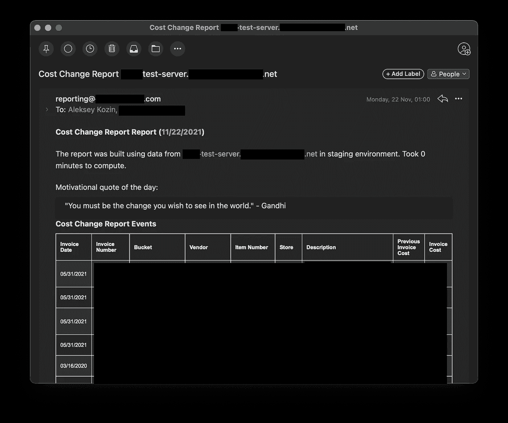

# 享受数百万企业的颂歌

> 原文：<https://javascript.plainenglish.io/enjoy-the-%D1%81ode-of-a-multimillion-business-9874d967b2aa?source=collection_archive---------3----------------------->

## 代码的艺术

## 24 行代码演示了 TypeScript 函数组合的强大功能和美妙之处。

costChangeReportFeature()

# 请享受这段代码

看看上面代码的美妙之处。那么()，map()，[，pipe()](https://www.freecodecamp.org/news/10-ways-to-write-pipe-compose-in-javascript-f6d54c575616/) 组成函数多好啊。`=>`如何剥去`{}`让你感觉轻盈干净。

强大的领域模式如何抽象出标准化、清理和验证的复杂逻辑。我们如何将 SQL 查询注入到特性中。TypeScript 如何验证所有的部分都适合在一起，并带来自信的感觉。

看这段代码 5-10 秒钟。并回答问题:**这段代码给你什么感觉？**

# 了解业务需求

我们有一个零售业务:我们从供应商那里购买，然后卖给最终客户。有时，供应商改变价格，企业希望对这种变化做出反应。这就是我们每天调用 costChangeReportFeature()的原因。该函数收集最近购买的物品改变了其价格的数据。并向所有利益相关者发送电子邮件。

# 深入研究实现

costChangeReportFeature()有几个显著的特性，您可以享受一下。

我们发现了一个抽象`getReport(): Report<T>`,我们用在所有的报告中。它将运行`getData(): Promise<T[]>`，并用系统信息收集执行时间。它还会消耗所有异常，并生成错误报告来代替它们。

costChangeReportMSSQL()将构建一个 SQL 查询来完成繁重的连接数据的工作。这允许我们在报告中或者在一个单独的文件中的测试中插入查询。

mssqlQueryWithBigTimeout()只是一个 SQL 服务。我们使用一个大的超时连接池。构建报告可能需要 10 分钟。

CostChangeEventSchema()将把我们的域模式应用到查询结果中。它将清理、规范化和验证所有数据。它还将从“未知”转换为具体的 TypeScript 类型。

然后我们选择报告列名，并用 stringSchema()将所有报告值转换成字符串。该模式将处理日期(例如 05/31/2021)格式和数字格式。

服务 sendReportToStakeholders()将使用 React 将报告呈现为 HTML，并通过电子邮件发送给所有利益相关者:

The email the stakeholders get daily

> 一个很酷的想法:我喜欢在我的报告中添加一段激励性的引言，这样利益相关者的工作就容易一些。

# 代码的艺术

编码可以是一种深奥的艺术形式。你创造出鼓舞人心的美丽的东西，为你的客户创造价值，为你的灵魂带来纯粹的快乐。

我经常花 30-60 分钟来润色一段我喜欢的代码。程序已经运行了，它被测试覆盖了，我有完全的自由去重构。我花时间移动东西。我仔细观察对代码的理解是如何变化的。我想编写代码:

*   简单的
*   强大的
*   美丽的

我希望你喜欢这篇文章，你今天会觉得更有灵感。再见。

特别感谢推荐加管的[尼克·霍华德](https://medium.com/u/52e936b1a62b?source=post_page-----9874d967b2aa--------------------------------)

*更多内容看* [*说白了。在这里注册我们的*](http://plainenglish.io/) [*免费周报*](http://newsletter.plainenglish.io/) *。*