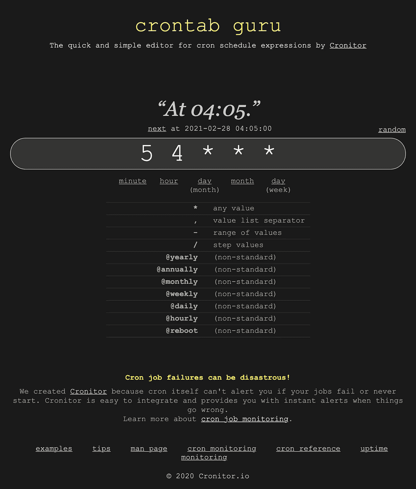

# Node.js Cron 作业中的环境变量和文件 I/O

> 原文：<https://javascript.plainenglish.io/environment-variables-file-i-o-in-node-js-cron-jobs-5e8558202fc7?source=collection_archive---------9----------------------->

## “我在哪里？”

Garbage + CRON + NodeJS = GoodTimes

# 介绍

这是我开发的一个[小 Node.js 应用](https://github.com/d-otis/tweetStreets)上的一个偶然系列的一部分，用来让我了解费城街道部门的垃圾/回收收集状况。像过去一年的许多事情一样，由于疫情和 2021 年冬季风暴的突然袭击，垃圾/回收收集在我们地区变得非常不稳定。

如果我的垃圾要到周三或者下周五才会被清理，为什么要在周五把它们拿出来呢？这个小小的 Node.js 应用程序试图缓解这种情况，并通过每小时查看费城街道部门的 Twitter，如果有延迟，给我发电子邮件，防止我的垃圾被扔得到处都是。

一切都很好，直到我不得不把我的 MacBook Pro 拿到店里进行一些维修。我一直通过`launchctl load`命令和我放在`Launch Agents`文件夹中的`.plist`文件从 macOS 的内置`launchd`中启动任务。在这里阅读。我想让我的应用程序在我的笔记本电脑停止运行的 1.5 周内保持运行，所以我把所有东西都移植到我基于 Debian 的 Raspberry Pi 上，并使用`cron -e`设置了一个 CRON 作业。阅读关于在树莓平台上设置 CRON 作业的信息。我不能发表这篇文章而不包括[这个奇妙的资源](https://crontab.guru/)来拨入你的 CRON 时间表表达式。下面是一张有趣的截图:

Screenshot from crontab guru ❤

# 问题

## 第一部分。环境变量

我开始收到错误消息，说我对 Twitter API 的访问依赖于凭证，不知何故，这些凭证没有从我的`.env`文件传递到我的节点应用程序，该应用程序在我的 PI 上作为 CRON 作业运行。原来，与在 Mac 上运行来自`launchd`的进程不同，CRON 作业从根目录执行，所以我的节点应用程序试图通过`process.env.<ENV_VARIABLE_HERE>`与`[dotenv](https://www.npmjs.com/package/dotenv)` npm 包合谋获取我的凭证，并得出 nada。下面是我如何使用访问环境变量的简化版本:

Original Code for Accessing .env Environment Variables

## 第二部分。文件输入输出

为了跟踪我从应用程序中通过电子邮件发送给自己的内容——一旦推特标识通过我的标准并通过电子邮件发送给我，我就会保存它们，并且在程序启动时也会阅读保存的标识，以避免重复。以下是我如何使用`process.cwd()`将我的身份证写入文本文件。有一次我在我的覆盆子馅饼上做 CRON 工作时，它对我非常生气！

Original Logic for Writing IDs to File Using process.cwd()

# 解决方法

## 第一部分。环境变量

由于`dotenv.config()`通过`path.resolve(process.cwd(), ‘.env’)` [将当前工作目录解析为默认的](https://github.com/motdotla/dotenv#path)目录，我们需要在引擎盖下查看并更改它的外观，以防我们从根调用该进程成为一个 la CRON 作业。下面我们将通过`.config()`方法传递一个带有`path`键的对象，指向 JS 文件的`__dirname`，然后在目录级别上更进一步，非常明确地指向`.env`。祈祷手表情符号。

Custom configuration for dotenv module usage

## 第二部分。文件输入/输出

使用类似的工具可以解决文件 I/O 问题。在这里，我们拉入`path`模块和`.join()` `__dirname`指令，通过`‘..’`进入保存我们的`ids.txt`文件的`/db`目录所在的位置。

Updated Accessing of ids.txt File

# 结论

概括地说:当以一种新的执行方式运行 Node.js 应用程序时(CRON 对比`launchd`)，我遇到了一些环境变量和文件位置的问题。通过一点谷歌搜索，我找到了一个在 CRON 和`launchd`流程中都有效的解决方案。我希望这能帮助其他人！

在[推特](http://www.twitter.com/_dan_foley_) & [推特](http://github.com/d-otis)上跟我来！