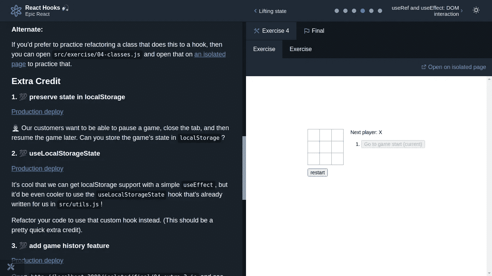

# Epic React — React 挂钩

> 原文：<https://javascript.plainenglish.io/epic-react-react-hooks-ceb04b8ec513?source=collection_archive---------3----------------------->

发现自己深入探究肯特·c·多兹的 React Hooks 的来龙去脉。

Hooks

开发人员必须根据状态来决定他们希望在应用程序中使用的组件类型的日子已经一去不复返了。如果状态-类组件，否则-功能。这是 React v16.8.0 发布之前的传统商标。当前情景—钩子像风暴一样席卷市场。那为什么不是我们？

*热烈欢迎。*欢迎来到*史诗反应*系列的第二篇文章，在这里，我将写&开篇，讲述我在课程中学到的东西——*史诗反应*——作者不是别人，正是大师本身——**肯特·c·多兹**。如果你碰巧错过了这个系列的第一次阅读，那么一定要读一读

 [## Epic React — React 基础知识

### 这是你的老朋友肯特·c·多兹的课程——史诗般的反应。在…的第一部分呈现一段阅读

javascript.plainenglish.io](/epic-react-react-fundamentals-cf76b6cedaf1) 

介绍性的闲聊到此为止，让我们写点真正的生意吧。

# 钩住

如果你以反应著称，那么你知道——陈述。数据存储。都是关于它的。Hooks 是由脸书 React 团队开发的 API，使用状态(数据存储)和其他生命周期方法(执行动作)的功能，可用于类组件到功能组件。*让生活代码更简单。*

**那是什么意思**是——现在你不局限于使用类组件了。你可以从中选择，因为它们几乎有相同的特点。

**这并不意味着**你应该避免使用类组件，或者在已经开发的应用程序中用 functional 替换它们。React 两者都支持。没有人处于被否决的边缘。

> 没有从 React 中移除类的计划——我们都需要继续发布产品，并且负担不起重写。我们建议在新代码中尝试钩子。~脸书开发团队

这不是一个隐藏的事实/关于热门话题的争论— *功能性 Vs 类*组件。你可以走进这个热狗，了解更多信息——

 [## 反应类别与功能组件

### 类和功能组件的定义、道具、纯组件、内部状态、生命周期和性能

better 编程. pub](https://betterprogramming.pub/react-class-vs-functional-components-2327c7324bdd) 

现在，如果我们决定使用钩子，那么让我们看看主人(肯特)在他的部分有什么—

这一节详细解释了钩子的类型以及如何使用它们。在本节结束时，您将看到自己正在构建高级*井字游戏*。请注意，这并不像你想象的那么简单。完全头脑风暴。

Dark theme hits another level, isn’t it?

我们走吧？

1.  **使用状态**

首先也是最重要的钩子。一个特殊的钩子——用来存储任何数据。类似于您在类组件中所做的事情— *this.state*

关键点-

*   **参数** —接受单个参数
*   **返回** —一个数组，包含传递的初始值(单个参数)和一个更新函数来改变该值。*控制台日志&想知道数组如何包含不同的数据类型——却发现数组是 JavaScript 中类似列表的对象*。
*   **约定** —给更新器函数加上前缀`set`，例如，setName，setData。
*   **Render** —针对值的任何变化重新渲染组件，除非它没有被卸载

2.**使用效果**

React 将组件呈现给 DOM 后运行自定义代码的函数。就当是对`componentDidMount`、`componentDidUpdate`和`componentWillUnmount`的替代吧。但它们并不等同于彼此。

关键点-

*   **参数** —接受 2 个参数，回调&依赖项(数组)。
*   **回调** —包含副作用逻辑。在 React 完成更改后正确执行
*   **依赖关系** —决定何时运行副作用逻辑的可选数组。每次渲染都不传递数组来运行逻辑。
*   **返回** —除了清除功能，什么都不做。
*   **HTTP requests** —不要在 useEffect 回调函数前面放置`async`关键字来运行任何异步任务(这是一个常见的副作用)。这个不行，w *hy？*因为 async/await 返回一个承诺& useEffect 不排除清理。

3. **useRef**

创建引用的钩子。访问特定值或 DOM 元素的引用。

关键点-

*   **参数** —接受初始值作为单个参数。
*   **返回** —具有特殊属性`current`的对象(或 ref)。您可以通过`ref.current`访问或更新该值。
*   **DOM** —直接引用 DOM 交互的节点元素。&然后你可以在节点元素上做所有你以前用`ref.current`做的事情。例如，`ref.current.click()`为按钮，`ref.current.value`为输入值，等等。
*   **必看的** —坚持下来了。*含义？*组件重新渲染之间保持不变。&与更新`state`不同，更新`ref`不会触发组件重新渲染。

**参考与状态差异**:

*   更新一个`state`会触发组件重新渲染，而`ref`不会。
*   `ref`为同步，`state`为异步。

这些主要包括在课程的第二部分练习&额外的学分练习中。显然，你只能通过在代码库中实际弹奏来掌握它们。但是还有一些东西，作者在这两者之间提到了—

一般要点-

*   **惰性状态初始化** —一般来说，这是一种延迟创建某些东西(对象、值或任何进程)直到第一次需要它的策略。用于改善某些情况下的性能问题。你可以在这里读到更详细的[。](https://kentcdodds.com/blog/use-state-lazy-initialization-and-function-updates)
*   **提升状态** —决定状态在应用程序中的理想位置，以便所需的组件可以访问它。在这种情况下，当两个相近的兄弟想要访问数据时，可以方便地将状态提升到它们相近的父节点。
*   **共同定位状态** —将状态放在需要的地方&避免全局状态，除非必要。简单地说——如果只有一个子组件(甚至不是初始化状态的父组件)需要状态中的特定数据，那么父组件中绝对没有必要有状态。在特定子组件中移动数据状态块是明智的。明智的你自己关于州共管[这里](https://kentcdodds.com/blog/state-colocation-will-make-your-react-app-faster)。
*   **错误边界**——这不是什么新鲜事。错误是我们的亲戚&无论我们如何努力，我们都应该错过。Kent 讲述了如何通过创建自定义类组件来处理这些错误。*阶级？* React 16 后来为类组件引入了“错误边界”的概念。现在，你知道为什么了吧？对于泛函来说，它不起作用，而且对于这种情况没有任何挂钩。*我是不是忘了告诉你，在泛函的类组件中使用的一些方法是没有等价的？*e . x .`getSnapshotBeforeUpdate``componentDidCatch``getDerivedStateFromError`还有我们说的`error boundary`。这些看起来像外星人，不是吗？但它们确实存在。返回到错误边界，该边界用于捕捉子组件中任何位置的错误，记录这些错误，并显示一个回退 UI。用户体验不佳。
*   **反应错误边界** —如果你不愿意用类组件构建错误边界，那么，这里有一个 npm [包](https://github.com/bvaughn/react-error-boundary)。这提供了一个简单且可重用的包装器，您可以用它来包装您的组件。组件层次结构中的任何呈现错误都可以得到很好的处理(从 react-error-boundary 文档的直接来源)。

好吧好吧。感觉真好。确实如此。但这只是预告片。*图片 abhi baki hai dost* (朋友，电影还没结束呢！).其余的挂钩(非常重要&危险)将在课程的下一部分讲述。名为——高级挂钩。是的，你们都被**史诗般的反应给迷倒了。**

这是 React 钩子的车间仓库—

 [## GitHub - kentcdodds/react-hooks:学习 React Hooks！🎣 ⚛

### 学习 React 钩子的来龙去脉。我将带你深入了解 React 挂钩，并向你展示你需要什么…

github.com](https://github.com/kentcdodds/react-hooks) 

下一步是什么？

拿起一杯咖啡，进入反应状态。

同时，你可以在这里找到我的承诺—

 [## TidbitsJS -概述

### 很高兴见到你，我是 Sujata Gunale 又名 TidbitsJS🤓自学开发者👩‍💻从事 Web 开发📝正在写作…

github.com](https://github.com/TidbitsJS) 

***哈夫塔亚👋***

*更多内容请看*[***plain English . io***](http://plainenglish.io/)