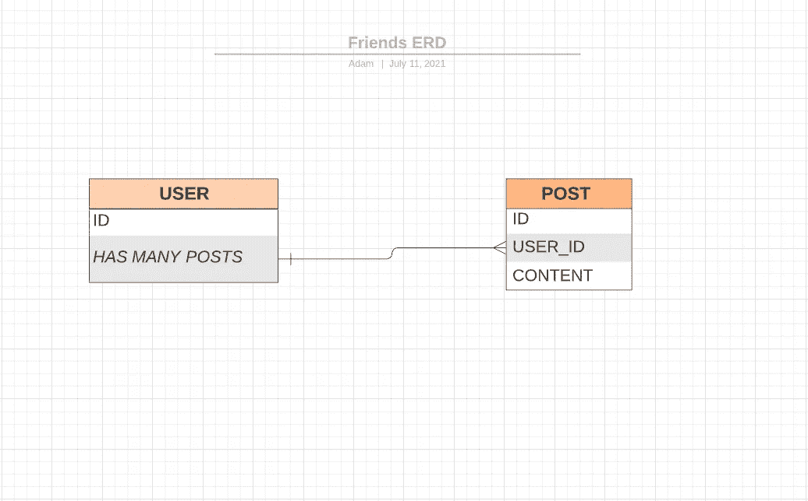
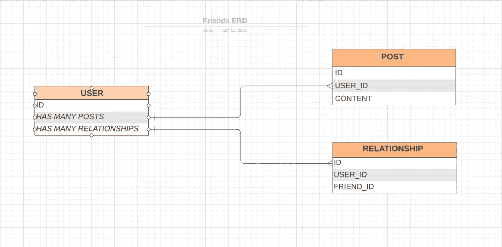
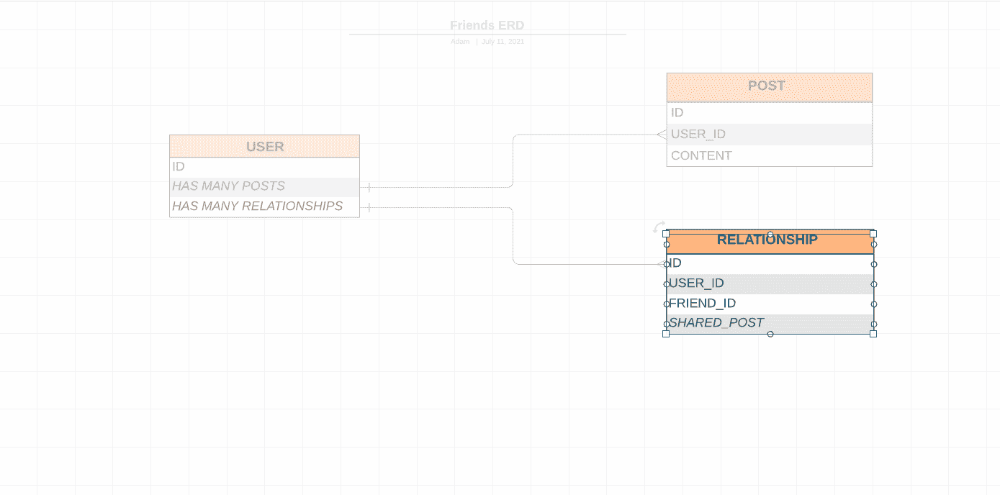
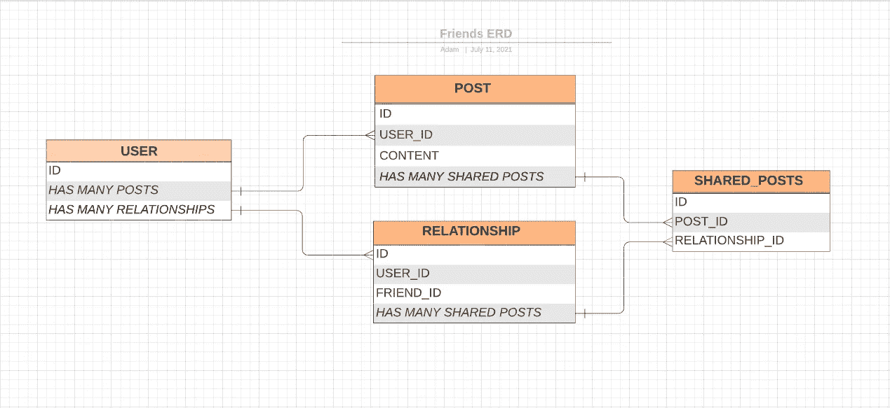

# ERDs:为什么你会考虑在你的下一个项目中使用它

> 原文：<https://javascript.plainenglish.io/erds-why-you-might-want-to-consider-using-one-for-your-next-project-8b481e476a46?source=collection_archive---------16----------------------->

数据库模式可能会变得非常复杂，并且很难可视化表之间的关系。这可能会导致一些严重的时间延迟，并且通常是规划阶段的一个挫折来源。进入 ERD，或“实体关系图”。实体关系图可以帮助我们以可视化的方式设计模式，让我们可以看到我们的表和它们之间的关系。这不仅节省了我们的时间，还让我们有机会在实现模式之前对其进行试验。

在本文中，我们将通过使用 [Lucidchart](https://www.lucidchart.com/) 构建一个简单的模式来进一步了解实体关系图。Lucidchart 有一个免费版本，非常直观。至于模式，我们将构建一些非常简单的东西。基本上，我们会希望用户有朋友和职位。我们还希望用户能够分享朋友的帖子。

我们开始吧！

我们知道我们需要一个用户表和一个 POST 表。一个用户应该有很多帖子，一个帖子应该属于一个用户。一个帖子也要有内容。让我们看看 ERD 是什么样的。

不错！我们可以看到一个用户有一个 ID，有很多帖子。帖子也有一个 ID，它们属于一个用户(USER_ID ),它们有内容。为这个简单的关系构建一个 ERD 可能并不完全必要，也不值得花费额外的时间，但是让我们看看当我们将模式变得更复杂时会发生什么。

让我们建立一个表格，显示用户和他们的朋友之间的关系。我们称这个表为关系。因为“朋友”只是另一个用户，所以关系将属于两个用户。一个将由用户标识表示，另一个由朋友标识表示。一个用户也应该有许多关系。

好的，这有点复杂。这里我们有一个属于两个用户的关系。这可能会令人困惑，但是通过我们的模式的可视化表示，我们可以看到我们的用户和关系表是如何相互关联的。用户有许多朋友，我们可以使用用户的唯一 ID 以及其他用户(他们的“朋友”)的唯一 ID 来访问这种关系。

现在分享一个朋友的帖子怎么样？这里有几个选项，这将给我们一个机会去实验，找到最佳的解决方案。我们可以将每个共享的帖子添加到关系表中。

看起来会有点混乱。我想我们不要 78359023458235704980234 列的表。让我们尝试另一种解决方案。如果我们制作另一个表，并将其命名为 SHARED_POSTS。我们可以说，一个关系有许多共享帖子，一个用户通过关系有许多共享帖子。我们也可以说一个帖子可以分享很多次。让我们看看那是什么样子。

啊，好多了！

实体关系图在规划过程中是非常有用的工具。它们为我们的模式提供了一个可视化的表示，并允许我们在它们成为我们程序的一部分之前尝试不同的解决方案。随着关系变得越来越复杂，这变得越来越有用。祝您构建自己的实体关系图和快乐编码愉快！

*更多内容看*[***plain English . io***](http://plainenglish.io/)