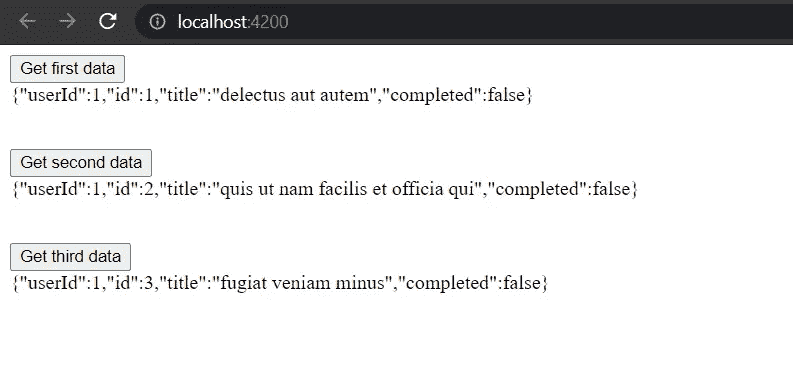

# Angular HTTP 的错误处理

> 原文：<https://javascript.plainenglish.io/error-handling-for-angular-http-e39485398e61?source=collection_archive---------4----------------------->


Photo by [David Pupaza](https://unsplash.com/@dav420?utm_source=medium&utm_medium=referral) on [Unsplash](https://unsplash.com?utm_source=medium&utm_medium=referral)

在本文中，我们将讨论在 Angular 中发出 HTTP 请求时处理错误的一些方法。

首先，我们创建一个新的 Angular 项目，名称为`exercise1`。然后，我们将在这个项目中创建三个组件和一个服务。该项目的`src`目录如下所示。


在`app.module.ts`中，我们将导入`HttpClientModule`。

在`app.component.html`中，我们将包括以下所有三个部分—

现在，我们将在`api-call.service.ts`文件中编写我们的 HTTP 请求服务。

现在，我们将在三个组件中创建三个按钮。单击一个按钮时，将调用附加到该按钮的一个函数，该函数又向 API 端点发送一个 HTTP GET 请求，并在页面上显示数据。

`example-one.component.html`和`example-one.component.ts`具有以下代码—

类似地，其他两个组件具有以下代码—

现在，如果我们点击这些按钮，我们会得到以下结果—



# 处理错误

在进行 HTTP 请求时，我们经常会在某个时间点遇到错误。为了在不影响用户体验的情况下有效地处理这些错误，我们有一些方法，解释如下

让我们在`api-call.service.ts`文件中的`baseUrl`处打个小错别字。我们将改变`baseUrl`

从

```
https://jsonplaceholder.typicode.com/todos/
```

到

```
https://jsonplaceholder.typicode.com/tod/
```

## ***第一法***

因为我们知道`subscribe`方法的第二个参数是一个错误处理函数，所以我们可以用它来捕捉错误响应。

我们将在`example-one.component.ts`和`example-one.component.html`中做一些修改。

现在，当我们点击第一个按钮时，我们会得到以下结果—


## ***第二法***

在这个方法中，我们将使用`rxjs`中的`Subject`。

为此，我们必须修改`api-call.service.ts`文件。

这里，我们使用`Subject`为结果和错误创建两个新的可观察值。如果`fetchDataTwo()`函数内部的 HTTP 调用成功，那么它将发出响应数据。但是如果失败，就会发出一条错误消息。

我们还将修改`example-two.component.ts`和`example-two.component.html`文件。

现在，当我们点击第二个按钮时，我们将得到以下结果——


## 第三种方法

在这种方法中，我们使用`rxjs`的`catchError`运算符来处理错误。

我们将按如下方式修改`api-call.service.ts`文件——

这里，在`fetchDataThree()`功能中，如果我们得到了成功的响应，那么我们就使用`rxjs`的`map`算子修改响应。如果我们在获取数据时出错，那么我们就是在使用`rxjs`的`catchError`运算符来捕捉该错误。捕捉到错误后，我们将使用`throwError`可观测值发出该错误响应。

我们还会修改`example-three.component.ts`和`example-three.component.html`文件。

现在，当我们点击第三个按钮时，我们将得到以下结果——


*多内容于* [***中***](http://plainenglish.io/)