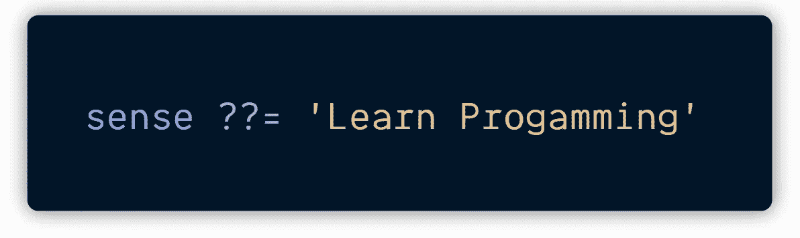
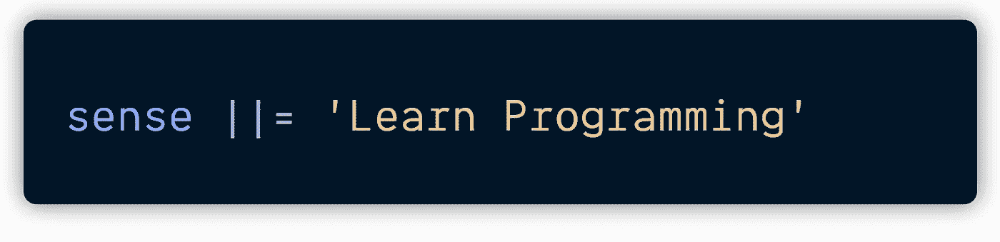

# ES12 将让您的生活更加轻松！

> 原文：<https://javascript.plainenglish.io/es12-is-going-to-make-your-life-easier-6be8d131e117?source=collection_archive---------0----------------------->

了解如何在您当前的代码库中包含 ECMAScript 2021 即将推出的强大功能。

[📷](https://unsplash.com/@luddyphoto?utm_source=medium&utm_medium=referral)

JavaScript 是一种每年都在进步的语言。自 2015 年 ES6 出现以来，我们见证了该语言的蓬勃发展。每年都有新的功能加入其中。

今年，我们将获得一些非常棒的特性，这将使开发人员的工作变得更加容易。

让我们解开其中的一些谜团吧！

# 害怕正则表达式？不用担心，replaceAll 方法就在这里！

正则表达式有一个令人生畏的名声。尽管如此，即使是一些有经验的程序员也对它们怀有同样的敬畏和恐惧。

> "永远不要太安逸，你是可以被取代的."
> 
> —匿名

在 JavaScript 中，如果不使用全局 RegExp (/RegExp/g)，就无法替换字符串中子字符串的所有实例。

# 对芒果的爱——对生活的爱

现在是夏天。对许多人来说，夏天意味着芒果。我所有的奶昔里都有芒果。谁不喜欢芒果？

We could only replace one apple!

为了替换所有的苹果，我们必须使用 RegExp——不是每个人都习惯使用它。

字符串原型中添加了一个新的`replaceAll`方法。`replaceAll`方法是`[String.replace](https://developer.mozilla.org/en-US/docs/Web/JavaScript/Reference/Global_Objects/String/replace)`方法的延续，只是用`replacement`替换了第一次出现的`pattern`。

现在我们可以用芒果代替所有的苹果，而不需要使用 RegExp。

哇！这看起来太美味了。

`replaceAll`方法允许您轻松替换字符串上的内容，在这种情况下，您不再需要使用 regex。这个特性在很多情况下都会派上用场，尤其是当你正在开发一个文字处理软件的时候。

# 做决定有困难？赋值运算符可以帮助您。

我们在编程中做的最重要的事情之一就是做决策——你做得越好，你的代码设计就越好。

> “永远不要凭一时的感觉做永久的决定。”
> 
> —乔达摩，佛陀

在编程中，我们利用逻辑赋值运算符来做出决策。ES12 引入了非常有用的逻辑赋值操作符，

`??=` `&&=` `||=`

# `??=`

很棒的建议，但是`??=`操作符可以让它看起来很圆滑。

This checks if the sense is either null or undefined then assigns a value to it.

# `&&=`

This statement checks if and only if the person has truthy value then only it will assign it a new value

# `||=`

**的重要区别？？=** 和 **||=** 第一个检查`null`或`undefined`的值，另一个只检查虚假值。

# 在数字上有困难吗？下划线可以提高你的分数！

> “数字是只属于人类的智力见证。”
> 
> **—巴尔扎克**

How much is it? Let me know in the comment section.

# 了解第一个，并以此为乐。

在编程中，很多时候我们是异步做事情的。也就是说，我们启动了某件事，甚至在它完成之前，我们启动了另一项任务。

ES6 的引入承诺合理地处理异步任务。有时我们可以启动许多 promises 对象——最终结果的占位符**。**

ES12 给了我们一个功能`**Promise.any()**` ，可以帮助我们知道哪个承诺对象先完成。

**Promise.any()** 接受一个承诺数组作为参数。在所有被解析的承诺中，首先被解析的承诺将由 Promise.any()返回。如果所有的承诺都被拒绝，你会得到一个错误。

在现实生活中，假设你向三个不同的人提议约会，你想知道哪一个先给出了肯定的回答。

太好了！你要和凯尔约会了。

**Promise.any()** 返回 Kyle，因为它是第一个被解决的。如果所有的承诺都被拒绝，我们将得到一个包含拒绝原因的[***aggregate error***](https://developer.mozilla.org/en-US/docs/Web/JavaScript/Reference/Global_Objects/AggregateError)。

在 web 编程中——我们可以利用这一点——因为在服务器和客户端之间存在持续的数据交换，它们是 [***异步***](https://www.computerhope.com/jargon/a/asynchro.htm#:~:text=Alternatively%20referred%20to%20as%20async,has%20received%20all%20its%20data.) ***。***

我没有涉及其他一些功能，比如 [WeakRef](https://developer.mozilla.org/en-US/docs/Web/JavaScript/Reference/Global_Objects/WeakRef) 。你可以在[这篇伟大的文章](https://v8.dev/features/weak-references)中了解到它及其用法。

# **想要在您当前的代码库中包含 ES2021 特性吗？只要按照这些简单的指示！**

*   安装以下软件包:

*   在项目的根目录下创建一个`babel.config.json`文件:

*   在项目的根目录下创建一个`.browserlistrc`文件，指定 Babel 转换代码的目标浏览器:

*   运行:

仅此而已。你可以走了。立即开始使用 ES2021 吧！

🔴[单击此处](https://gist.github.com/SidWorks/6a98ae6b8998fc9bb230422fbe539094)访问本文中使用的代码。🟥

# 摘要

*   `replaceAll()`有两个参数:我们想要替换 的字符**；我们想要替换为** 的字符**。**
*   `replaceAll()`允许您在不使用正则表达式的情况下用 ***替换字符串中指定的所有字符***
*   ES2021 引入了三个有用的逻辑赋值操作符:`&&=`、`||=`和`??=`
*   逻辑赋值运算符**？？=** 检查第一个值是否为空或未定义。如果是，则将第二个值赋给它。
*   逻辑赋值运算符 **||=** 也用于两个值之间。如果第一个值不是真值( *falsie* )，第二个值将被赋值给它。
*   逻辑赋值运算符 **& & =** 用于两个值之间。如果第一个值是*真值*，第二个值将被分配给它。
*   **的主要区别？？=** 和 **||=** 第一个检查`null`和`undefined`的值，另一个只检查虚假值。
*   ***下划线*** 可以用作数字分隔符。
*   `**Promise.any()**`接受一系列承诺作为参数。在所有解决的承诺中，最先解决的将由`**Promise.any(**)`返回。如果所有的承诺都被拒绝，你会得到一个错误。

# 感谢信

我想利用这最后的机会说声谢谢。

感谢您的光临！没有像你这样的人，我不可能做我现在做的事情。

我希望你能 [**加入我的**](https://polymathsomnath.medium.com/subscribe)[**我未来的博客文章**](https://polymathsomnath.medium.com/subscribe) 并留下来，因为我认为我们这里有一些伟大的东西。我希望在未来的许多年里，我能在你的职业生涯中帮助你！

下次见。再见！

*更多内容请看*[*plain English . io*](http://plainenglish.io/)