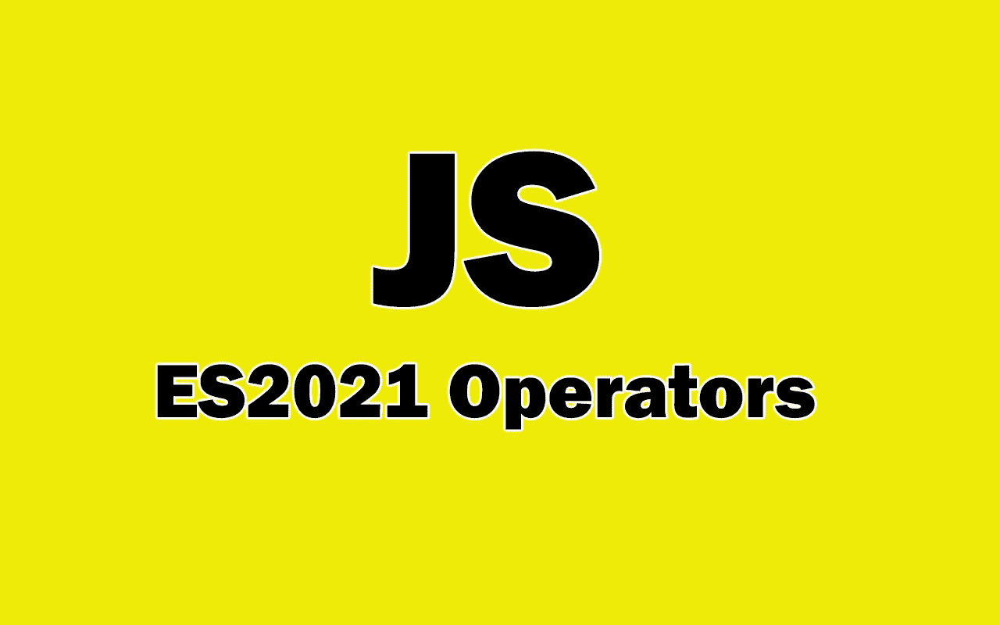

# JavaScript 中的 ES2021 逻辑赋值运算符

> 原文：<https://javascript.plainenglish.io/es2021-logical-assignment-operators-in-javascript-c6a8290dc510?source=collection_archive---------6----------------------->

## 您需要了解的新 ES12 逻辑赋值运算符。



Image created with ❤️️ By author.

每年，JavaScript 都会收到有趣的更新，向语言中添加新的有用特性。作为使用 JavaScript 的开发人员，您需要了解最新的特性。

ES2021 引入了一些有用的功能，开发人员可以从中受益。逻辑赋值运算符包含在列表中。

因此，在本文中，我们将看看 JavaScript 中的 ES2021 逻辑赋值操作符。让我们开始吧。

# 逻辑运算符&&=

逻辑赋值运算符`&&=`可用于两个变量或两个值之间。如果第一个变量为真，那么逻辑运算符`&&=`将第二个变量赋给它。

逻辑赋值运算符`&&=`相当于下面的条件语句:

```
let firstOne = 15;
let secondOne = 22;**if(firstOne){
 firstOne = secondOne;
}** console.log(firstOne); //22
```

正如你所看到的，如果第一个变量是真的，第二个变量就被赋值给它。这就是为什么`firstOne`变成了 22。

我们可以使用逻辑赋值操作符`&&=`来实现同样的事情。

下面是一个例子:

```
let firstOne = 15;
let secondOne = 22;**firstOne &&= secondOne;** //output: 22console.log(firstOne); //output: 22
```

所以逻辑操作符`&&=`允许我们用更短的语法实现同样的事情。

# 逻辑运算符||=

逻辑赋值运算符`||=`也用于两个变量之间。但与`&&=`不同的是，如果第一个变量是 falsy，那么逻辑运算符`||=`会将第二个变量赋给它。

下面是等效的条件语句:

```
let firstOne = null;
let secondOne = 22;**if(!firstOne){
 firstOne = secondOne;
}** console.log(firstOne); //22
```

因为变量`firstOne`是 falsy(null)，所以变量`secondOne`被赋值给它。

因此，我们可以使用逻辑赋值操作符`||=`实现上面的相同功能。看看下面的代码示例:

```
let firstOne = null;
let secondOne = 22;**firstOne ||= secondOne;** //output: 22console.log(firstOne); //output: 22
```

在这种情况下，如果变量`firstOne`不是 falsy (truthy ),那么什么都不会发生。

# 逻辑运算符？？=

逻辑赋值操作符`??=`略有不同。如果第一个变量为空或未定义，第二个变量将被赋给它。否则，什么都不会发生。

下面是等效的条件语句:

```
let firstOne = undefined;
let secondOne = true;**if(firstOne == null || firstOne == undefined){
 firstOne = secondOne;
}** console.log(firstOne); //true
```

我们可以使用操作符`??=`实现上面的相同功能。看看下面的代码:

```
let firstOne = undefined;
let secondOne = true;**firstOne ??= secondOne;** //trueconsole.log(firstOne); //true
```

如你所见，第二个变量的值赋给了第一个变量，因为它是未定义的。所以`??=`只在值为空或未定义时才改变值。

# 结论

逻辑赋值操作符是 ES12 的一个很酷的特性，它允许你在 javascript 代码中使用更短的语法。现在，您可以不使用条件语句来赋值。

*感谢您阅读本文。此外，如果你觉得我的内容有用，而你不是一个媒体成员，你可以抓住你的媒体成员* [***这里***](https://mehdiouss.medium.com/membership) *(媒体推荐链接)获得无限制的访问媒体上的所有文章，并支持我们作为作家。*

[](https://mehdiouss.medium.com/membership) [## 通过我的推荐链接加入 Medium-Mehdi Aoussiad

### 作为一个媒体会员，你的会员费的一部分会给你阅读的作家，你可以完全接触到每一个故事…

mehdiouss.medium.com](https://mehdiouss.medium.com/membership) 

**更多阅读**

[](/5-javascript-projects-you-can-add-to-your-portfolio-e07f0d668d25) [## 您可以将 5 个 JavaScript 项目添加到您的投资组合中

### 您可以使用 JavaScript 构建出色的项目。

javascript.plainenglish.io](/5-javascript-projects-you-can-add-to-your-portfolio-e07f0d668d25) 

*更多内容请看*[***plain English . io***](https://plainenglish.io/)