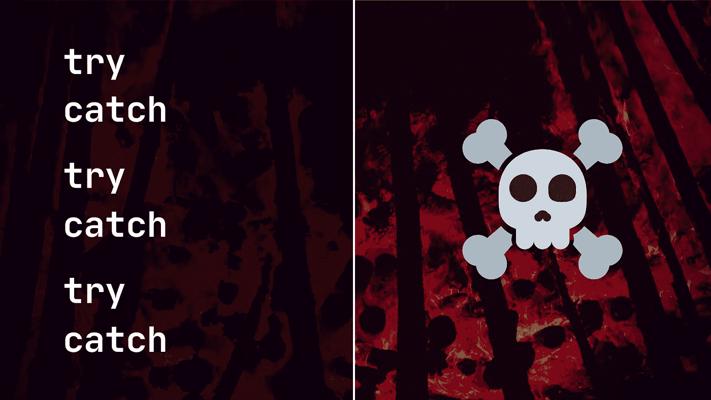
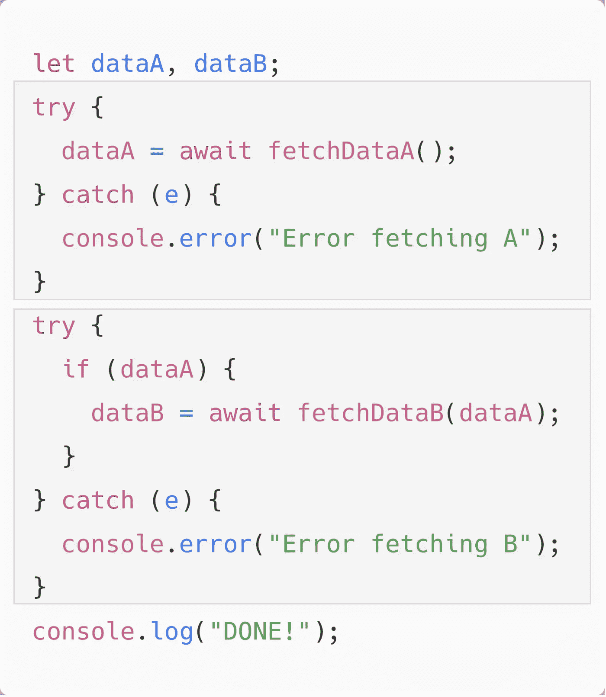
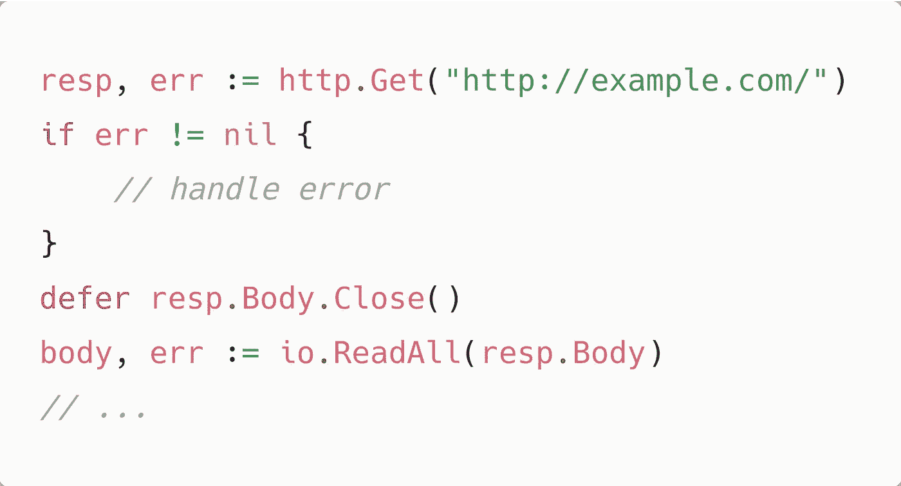
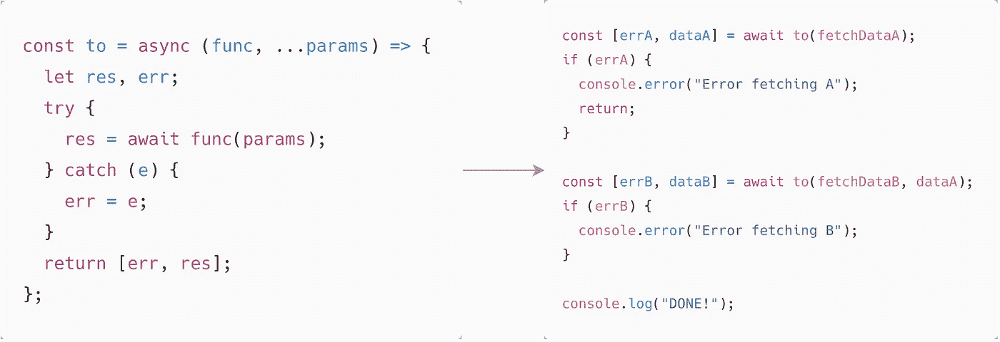
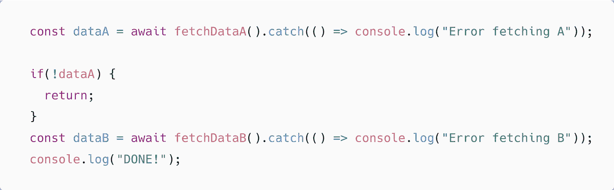
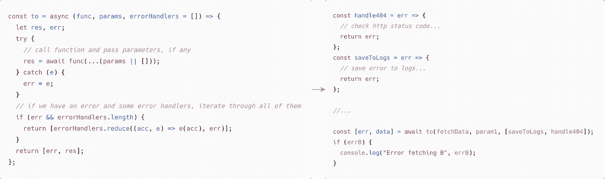

# 如何逃离试捕地狱

> 原文：<https://javascript.plainenglish.io/escaping-the-try-catch-hell-176884be4ff2?source=collection_archive---------6----------------------->

## 承诺修复回调地狱，异步/等待修复承诺地狱，但还有一件事…

在本文中，我将在 async/await 的上下文中解释什么是 try-catch 地狱，并且我还将分享一些如何避免这种情况的技巧。

在我们深入研究解决方案之前，让我们回顾一下过去和现在的情况。

起初，我们有回调，这是没问题的，直到我们必须执行多个顺序异步操作，这导致了深度嵌套。为了解决这个问题，ES6 引入了承诺。承诺提供了**然后**、**捕捉**、**最后**等方法来处理不同的状态变化。ECMAScript 2017 中引入了 async/await。它基本上充当承诺之上的语法糖，使异步代码更容易编写和阅读。

## 什么是试捕地狱？试捕塔！

除非必须处理错误，否则使用 async/await 非常有用。让我们来看看这个例子:

Try-catch hell

我们有两个将按顺序运行的请求。

如您所见，为了对每个请求执行错误处理，我们需要为每个 **await 添加一个 **try-catch** 块。**

也许看起来不太糟，但是如果我们有 3 个请求呢？..还是 4？..还是 10？

我希望你同意这会变得很混乱。

## **如何逃离试捕地狱？**

我不是 go-lang 开发人员，你可能也不是，但是让我们快速看一下 go-lang 通常是如何处理错误的。

An HTTP request. Source: [https://golang.org/pkg/net/http/](https://golang.org/pkg/net/http/)

不使用 try-catch 块，而是返回一对两个值**【结果，错误】**。用 javascript 实现类似的东西很容易，我们只需要一个助手函数来包装返回一个承诺。

Additional function to handle errors

这个看起来干净多了。

另一个解决方案是将 promises 中的 **catch** 方法与 **await** 关键字结合起来，就像这样:

Combining promises with async/await

## 最后一点

使用一个额外的函数作为错误处理的包装器，可以为代码的可重用性提供一系列的可能性。例如，我们可以修改**到**函数来接收自定义功能，如下所示:

Custom error functionality

这不仅可以摆脱 try-catch 地狱，还可以使代码更易于维护和阅读。

我希望这些建议有用！

*更多内容请看*[***plain English . io***](http://plainenglish.io/)