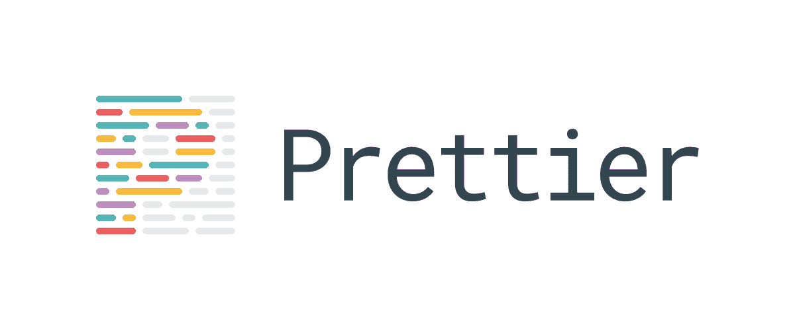
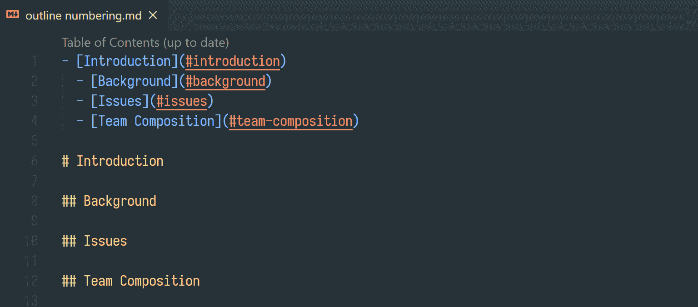
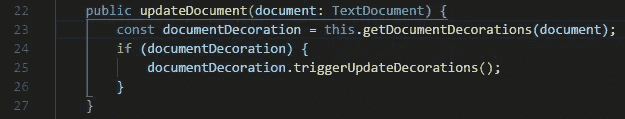
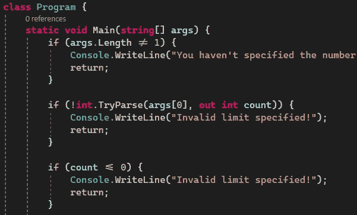

# Visual Studio 代码的基本扩展

> 原文：<https://javascript.plainenglish.io/essential-extensions-for-visual-studio-code-32eaec6c6054?source=collection_archive---------9----------------------->

## 专注于你的代码，别无他求。

Photo by [Ferenc Almasi](https://unsplash.com/@flowforfrank?utm_source=unsplash&utm_medium=referral&utm_content=creditCopyText) on [Unsplash](https://unsplash.com/s/photos/code?utm_source=unsplash&utm_medium=referral&utm_content=creditCopyText)

这是我最喜欢的(在我看来也是必不可少的)Visual Studio 代码扩展的一个非常固执的列表。

我尽可能根据我最常用的各种工作负载对它们进行了分组。

# 常规代码编辑

## 孔雀([链接](https://marketplace.visualstudio.com/items?itemName=johnpapa.vscode-peacock))

Peacock 是一个超级有用的小扩展，它允许你给你的 VSCode 工作空间加上颜色标签。如果你习惯了打开多个工作区，你会喜欢孔雀。

Peacock in action

## 更好的评论([链接](https://marketplace.visualstudio.com/items?itemName=aaron-bond.better-comments)

老实说，这是我今年遇到的最好的扩展之一。更好的评论可以让你区分待办事项、问题、特别重要的评论等等。简直太有才了！

Better Comments in action

## 漂亮点([链接](https://marketplace.visualstudio.com/items?itemName=esbenp.prettier-vscode))

代码格式。代码格式化就像吃青菜。你知道你必须这么做，但是你不喜欢。老实说，如果你不用做就能得到所有的好处，你会选择那个选项。

更漂亮是一个选择。安装扩展，打开保存格式，你就再也不用考虑代码格式了。我真的需要多说吗？

如果你想更深入地了解如何按照你的口味来配置 beautiful，beautiful 的网站位于。

提示:如果你把更漂亮的东西和 es-lint 结合起来，你会得到更多的格式化和遗忘的好处。

## Markdown All in One ( [链接](https://marketplace.visualstudio.com/items?itemName=yzhang.markdown-all-in-one))

作为一种文档标准，Markdown 已经变得越来越流行，所以你可能不得不写一些 Markdown。Markdown All in One 通过添加 Github 风格的 Markdown、自动目录生成、额外的键盘快捷键等等，使得编辑 Markdown 文档变得非常非常容易。我最喜欢的特性是 ToC 生成。你呢？

Table of contents and sections. Nice!

## 支架对着色机 2 ( [连杆](https://marketplace.visualstudio.com/items?itemName=CoenraadS.bracket-pair-colorizer-2)

依我看，括号(和大括号)在某种程度上是一种必要的邪恶。尤其是在编码 React 时，很容易迷失在所有的嵌套和子嵌套中。括号对着色帮助你在这里给每个括号和括号对一个独特的颜色。就像罐头上写的一样，对吧？它已经为我节省了很多很多次时间。

Backet Pair Colorizer 2 in action

# 集装箱、码头和 Kubernetes

除非你一直生活在岩石下(作为一名开发人员，每个人似乎都认为你是)，否则你一定听说过或读到过容器、Docker 和 Kubernetes。

对这些技术非常简短的总结是，容器是微小的、自包含的(抱歉)小虚拟机，您可以使用它来运行和部署您的软件，而不用担心底层操作系统、版本、可用资源、网络等。*容器*是这些虚拟机的总称。 *Docker* 是实现容器的标准，而 *Kubernetes* 是组织多个容器一起工作的方法(也称为编排)。

## Docker ( [链接](https://marketplace.visualstudio.com/items?itemName=ms-azuretools.vscode-docker))

如果你像我一样，懒得记住所有的`docker`命令，那么这个扩展是完美的。你可以得到你的(运行的和停止的)容器、图像、连接的注册表甚至你的网络的列表。

除此之外，您还可以在 VSCode 中添加大量命令，从为项目添加 Docker 支持，到管理容器、图像和注册表等等。您还可以获得 Docker 图像文件的智能感知。

## Kubernetes ( [链接](https://marketplace.visualstudio.com/items?itemName=ms-kubernetes-tools.vscode-kubernetes-tools))

这个扩展为您提供了与开发和管理 Kubernetes 相关的一切，无论是本地的(它支持 Minikube)还是云中的(支持 Azure、AWS 和 GCP)。它还为 Kubernetes 和 Helm 文件提供了智能感知。

在使用这个扩展之前，需要安装一些依赖项，所以请务必先阅读文档。真的，会有回报的。

# Python 开发

## Python ( [链接](https://marketplace.visualstudio.com/items?itemName=ms-python.python))

如果您正在使用 VSCode 进行 Python 开发，那么您可能已经安装了这个扩展。它基本上启用了 Python 语言，并添加了版本选择、调试、单元测试和开发人员可能需要的所有功能。

## 挂架([连杆](https://marketplace.visualstudio.com/items?itemName=ms-python.vscode-pylance)

PyLance 是微软相对较新的扩展，它为您的 Python 编码体验提供了(更好的)智能感知、代码完成、自动导入和许多其他好处。我已经用了几个月了，它让我更有效率了！

尽管上述两个扩展在很多方面有所重叠，但两者的结合造就了一个强大的生产力特性。

# 。净发展

## C# ( [链接](https://marketplace.visualstudio.com/items?itemName=ms-dotnettools.csharp))

几乎所有的结尾都是 C#和的扩展。NET 在 Visual Studio 代码中的支持。像 Python 扩展一样，这个扩展基本上实现了。NET Framework 和 VSCode 中的 C#语言，提供了语法高亮、IntelliSense、代码格式化、代码导航、调试等功能。没有它，你真的无法生存。

# 额外奖励:带连字的 Cascadia 字体

不是延伸，但我还是想在这里提一下。Cascadia 字体是一种令人惊叹的编码优化字体，支持连字。连字是一个非常酷的特性，它让像`<=`和`!=`这样的东西看起来很漂亮(而且更易读，我知道)。看看下面的截图，看看我的意思。

它也比非常相似的 [Firacode](https://github.com/tonsky/FiraCode) 稍胖一点，我认为这在眼睛上更容易一点。

您可以在这里下载 Cascadia Font [。](https://github.com/microsoft/cascadia-code)

*更多内容参见* [***普通英语。io***](http://plainenglish.io)