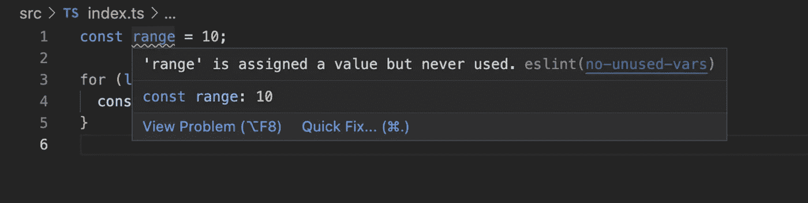
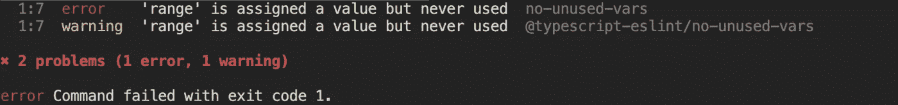

# 基本 JavaScript 工具

> 原文：<https://javascript.plainenglish.io/essential-javascript-tooling-574797521da4?source=collection_archive---------15----------------------->

## 开发者体验很重要


Photo by [JESHOOTS.COM](https://unsplash.com/@jeshoots?utm_source=medium&utm_medium=referral) on [Unsplash](https://unsplash.com?utm_source=medium&utm_medium=referral)

# 快速小结

软件开发很棒也很有趣，但是如果开发人员的体验没有得到重视和优先考虑，它会变得一塌糊涂并产生非常坏的影响。一些标准的开发实践和适当的工具可以极大地改善这种体验。这也有助于保持代码库的干净和存储库的健康。在本文中，我们将介绍一些开发实践和基本工具，以帮助您改善开发体验。

# 观众

本文主要面向 JS 开发人员，涵盖了 JS 生态系统中的工具，但是，同样的概念也可以用其他语言中可用的工具来应用。我们将在本文中讨论以下主题。

*   使用 [ESLint](https://eslint.org/) 对林挺进行编码。
*   使用[更漂亮的](https://prettier.io/)进行代码格式化。
*   为林挺和代码格式化设置 [Git 挂钩](https://git-scm.com/book/en/v2/Customizing-Git-Git-Hooks)。
*   常规提交使用[提交](https://github.com/commitizen/cz-cli)。
*   [用于 CI/CD 的 Github 操作](https://github.com/features/actions)。

# 代码-林挺

代码林挺是必不可少的，尤其是当你使用 JavaScript 这样的解释性语言时。Linters 本质上是静态代码分析器，它扫描你的代码而不运行它，并标记任何编程错误、风格错误和任何可疑的契约。在您的代码库中正确设置 linter 有助于尽早发现错误，并确保遵循一些标准实践。这使得代码库干净并且有助于代码审查。

Linters 可以强制执行代码样式和规则，比如没有未使用的变量或没有 console.log 语句或没有未使用的导入事实上，它是一个非常强大的工具，可以做的远不止这些。

设置 Linters 可能是乏味和累人的，但一旦你采用它并开始在你的团队中正确使用它，它会带来很大的效果。我个人认为，linters 和这样的工具应该与语言本身一起提供，开发人员不应该担心设置一个。这种体验通过[deno](https://deno.land/)(JavaScript 和 TypeScript 的安全运行时)得到了很大的改善，它带有内置的 linter 和 JavaScript 和 TypeScript 格式化程序。

现在我们对 linters 有了基本的了解，让我们看看如何在 TypeScript 项目中设置它。我们将使用 ESLint，它在 JS 生态系统中非常流行，并且是完全可插拔的。ESLint 中的每个规则都是一个插件，这意味着你可以从一个基本配置开始，然后通过添加更多的规则作为插件来扩展规则以满足你的需求。

创建一个新文件夹并运行`npm init -y`来初始化您的项目，这将在根目录中创建一个带有一些存根字段的`package.json`。

接下来，将所需的`dev-dependencies`安装到项目中。

```
yarn add -D nodemon ts-node eslint typescript @typescript-eslint/eslint-plugin @typescript-eslint/parser
```

让我们首先通过运行`tsc --init`快速设置 TypeScript，这将初始化项目根目录中的`tsconfig.json`文件，我们唯一要改变的是`outdir`选项并将其改为`dist`

```
// tsconfig.json"outDir": "dist"
```

接下来，在项目的根目录中添加一个`.eslintrc`文件。这将是`eslint`的配置文件，我们可以在这里定制我们的规则。为了快速开始，让我们向该文件添加一个最低限度的配置。

```
{
  "root": true,
  "parser": "@typescript-eslint/parser",
  "plugins": ["@typescript-eslint"],
  "extends": [
    "eslint:recommended",
    "plugin:@typescript-eslint/recommended",
  ]
}
```

让我们简单地看一下这些选项，`root`键基本上告诉 eslint 停止在父目录中查找配置文件。默认情况下，eslint 会在所有父文件夹中查找配置文件，直到找到根目录，这可能会导致意外的结果，此外，当您有一个 monorepo 并且每个项目使用不同的配置时，这个选项会非常方便。

`extends`键允许您添加您想要用于项目的配置。这可以是指定配置的字符串或配置文件的路径，这里我们使用了两个配置，第一个是 [eslint 推荐的](https://eslint.org/docs/rules/)，下一个是 typescript-eslint 推荐的。也可以用[Airbnb-typescript](https://www.npmjs.com/package/eslint-config-airbnb-typescript)config，也很受欢迎。

现在让我们在`package.json`中添加一些脚本，以开发模式运行我们的项目，并为林挺添加一个脚本。

```
"dev": "nodemon --watch '**/*.ts' --exec 'ts-node' src/index.ts",
"lint": "eslint . --ext .ts"
```

为了测试我们的 eslint 设置，让我们创建一个`index.ts`文件和一个非常简单的 for 循环，其中包含一个未使用的变量。

```
//src/index.tsconst range = 10;for (let i = 0; i < 10; i++) {
  console.log("i : ", i);
}
```

现在让我们运行`yarn lint`，我们将在控制台上得到一个警告。

这很好，我们的 eslint 设置正在工作，但是假设我们希望对我们的代码库更加严格，希望这是一个错误，并导致 lint 失败，那么就在您的`.eslintrc`文件中添加下面的规则。

```
{
  "root": true,
  "parser": "@typescript-eslint/parser",
  "plugins": ["@typescript-eslint"],
  "extends": ["eslint:recommended", "plugin:@typescript-       eslint/recommended"],
  "rules": {
    "no-unused-vars": "error"  // "error" | "warn" | "off"
  }
}
```

现在，如果你运行`yarn lint`，你的控制台会显示这是一个错误，lint 不会成功，如果你在 vs 代码上安装了 eslint 扩展，它也会突出显示这个问题。



Lint-error



Lint-script-result

我们还可以添加另一个脚本来自动修复 lint 问题，请注意，并非所有问题都可以自动修复，您可以在这里[获得可以自动修复的所有规则的列表](https://eslint.org/docs/rules/)。

```
"lint-fix": "eslint . --ext .ts --fix"
```

这就是林挺的设置，我希望你现在可以为自己创建一个心智模型，看看这个工具如果使用得当会有多有用。

# 代码格式

让我们接受这一点，在回购中看到不同的代码风格是混乱的，如果不加以控制，你可以看到回购中遵循的各种代码约定。这就是代码格式化程序帮助我们的地方，但是在我们开始在项目中设置代码格式化程序之前，我们首先需要理解代码格式化程序和 linters 本质上是不同的东西，尽管它们之间只有一线之隔，但是它们都服务于不同的目的。代码格式化程序本质上处理代码的格式化，并应用您指定的代码样式，它们不检查代码中潜在的错误或问题，并遵循样式。

prettle 是 JS 生态系统中一个非常著名的工具，我们将在我们的项目中设置它，用它我们可以强制样式规则，比如最大长度、标签宽度、单引号、分号等等。它基本上是一个自以为是的代码格式化程序，获取您的代码并将其解析为 AST(抽象语法树),放弃原始样式，之后它只是用您指定的代码样式漂亮地打印 AST。

让我们开始吧，首先我们需要安装开发依赖项:

```
yarn add -D prettier eslint-config-prettier eslint-plugin-prettier
```

让我们快速解释一下上面的开发依赖性以及它们的用途。

*   `prettier`:固执己见的代码格式化者。
*   `eslint-config-prettier`:用于禁用所有可能与 prettier 冲突的 eslint 规则。
*   `eslint-plugin-prettier`:作为一个 eslint 规则运行起来更漂亮

现在在你的根目录下创建一个`.prettierrc`文件，并添加下面的配置。

```
//.prettierrc{
  "semi": true,
  "trailingComma": "none",
  "singleQuote": false,
  "printWidth": 120,
  "tabWidth": 2,
  "arrowParens": "always",
  "bracketSpacing": true
}
```

这些规则指定在末尾使用分号，删除尾部逗号，对字符串使用双引号等，你可以在这里阅读更多关于规则[的内容，并根据你的喜好设置它们。](https://prettier.io/docs/en/options.html)

现在我们已经设置好了规则，让我们添加一个脚本来格式化我们的代码。

```
"format": "prettier --config .prettierrc 'src/**/*.ts' --write"
```

这就是我们已经在我们的项目中配置得更漂亮了，现在每当你运行这个脚本时，它将根据你定义的配置格式化你在`src`目录中的所有源代码。测试一下，使用一些单引号或者去掉分号，然后运行`yarn format`。也可以安装更漂亮的 vs 代码扩展，并在保存时将其设置为 format。

现在我们有了更漂亮的设置，让我们用 eslint 配置它，如下更新你的`.eslintrc`,你就可以更漂亮地使用 eslint 并在 eslint 配置中配置为插件。

```
{
  "root": true,
  "parser": "@typescript-eslint/parser",
  "plugins": ["@typescript-eslint", "prettier"],
  "extends": [
    "eslint:recommended",
    "plugin:@typescript-eslint/recommended",
    "prettier"
  ],
  "rules": {
    "no-unused-vars": "error",
    "prettier/prettier": "error"
  }
}
```

# Git 挂钩

酷，如果你一直在关注这里，这是最令人兴奋的地方，你一定想知道我们设置了这些工具是多么好，但有人仍然可以在不运行这些脚本的情况下提交回购，这就是 g it 钩子来拯救我们的地方。Git 挂钩只是每当存储库中发生事件时自动运行的脚本。我们将使用一个叫做 [husky](https://github.com/typicode/husky) 的工具，它使得使用 git-hooks 变得容易。

让我们快速地将它安装为一个开发依赖项。

```
yarn add -D husky// Also add a prepare script to your package.json as below."prepare": "husky install"// Now runyarn prepare
```

`prepare`是一个 npm 生命周期脚本，将在`npm install`上运行，这将确保无论何时安装节点模块，husky 也会被安装。点击阅读更多关于生命周期脚本的信息[。](https://docs.npmjs.com/cli/v7/using-npm/scripts#life-cycle-scripts)

就这样， [husky](https://github.com/typicode/husky) 现在已经在我们的项目中设置好了，我们可以配置它在提交之前运行我们的`lint`和`format`脚本，为此我们可以使用在提交之前运行的`pre-commit`钩子。现在让我们添加钩子，到终端，运行下面的命令。

```
npx husky add .husky/pre-commit "yarn lint && yarn format"
```

您会注意到，现在在您的 repo 的根目录下有一个`.husky`文件夹，其中包含一个文件`pre-commit`，其内容如下。这个钩子会在你每次提交回购时运行。

```
#!/bin/sh
. "$(dirname "$0")/_/husky.sh"yarn lint && yarn format
```

现在试着在 repo 中提交一些东西，你会注意到`lint`和`format`脚本首先被执行。如果一切正常，您的提交将被成功添加，如果出现问题，它将不会被提交到回购，您必须解决这些问题才能进行提交。现在，您应该能够对此建立一个心理模型，这可以确保没有潜在错误或样式问题的代码提交到回购中。如果正确遵循这些约定，这可以帮助您节省大量的代码审查时间。

这种配置很好，但如果您注意到这种方法有一个问题，如果我们有一个非常大的代码库，并且我们在代码库中对每次提交都运行林挺和格式化，这可能会花费更长时间，这不是预期的用例，我们只想对已准备提交的文件运行它，因为理想情况下，只应检查那些正在提交到回购的文件，这是另一个工具`lint-staged`来拯救我们的地方，它将确保我们的预提交挂钩只在准备文件上运行。这也可以快速配置。

```
yarn add -D lint-staged// Add below config to your package.json"lint-staged": {
  "src/**/*.ts": [
    "yarn lint",
    "yarn format"
  ],
},
```

并且更新你的`pre-commit`钩子运行`npx lint-staged`而不是运行`yarn lint && yarn format`

```
#!/bin/sh
. "$(dirname "$0")/_/husky.sh"npx lint-staged
```

就是这样，现在 lint 将只对暂存的文件运行，您可以通过在 repo 中创建一个有 lint 问题的文件来快速测试它，并且不要暂存它，同时暂存一些符合 lint 规则的其他文件，您应该注意到 git commit 将正常运行，但是如果您暂存有 lint 问题的文件，它将阻止提交，并在终端上向您提供应该修复的 lint 错误。如果你想 lint 整个项目，你仍然可以通过运行`yarn lint`来完成。现在，我们的工具已经设置得足够好了，可以确保整个团队能够遵循它，并坚持相同的编码标准和风格指南。

# 常规提交

我们的开发设置已经非常完整了，但是团队仍然有一个地方可以采用不同的约定，那就是提交消息，是的，没错，人们在添加提交消息时可以有不同的偏好，我们需要确保团队符合标准约定。我们将在我们的项目中采用[常规提交规范](https://www.conventionalcommits.org/en/v1.0.0/)，并使用名为`commitizen`的工具来确保它

该规范的一般语法如下:

```
<type>[optional scope]: <description>[optional body][optional footer(s)]// Examplefeat(landing-page): add new landing pageA new landing page for the website...Closes #<github-issue-number>
```

好了，现在我们已经理解了规范，让我们配置我们的项目来使用这个工具。

```
yarn add -D commitizen cz-conventional-changelog
```

并将此添加到您的`pacakge.json`:

```
"config": {
  "commitizen": {
    "path": "cz-conventional-changelog"
  }
}"scripts": {
  "cz": "cz",
	... 
}
```

*注意:如果您最终将脚本命名为* `*commit*` *，那么它可能会运行两次，因为回购协议上提到了* [*这个问题*](https://github.com/commitizen/cz-cli#optional-install-and-run-commitizen-locally) *。*

现在，尝试通过运行`yarn cz`提交回购，终端上会提示您几个问题，以便正确提交。很好，现在我们的常规提交已经设置好了，我们也可以通过运行下面的命令，并使用由`git commit`调用的`prepare-commit-msg`钩子运行 commitizen，将其设置为 git 钩子，但是这种方法有一个问题，当运行`yarn cz`时会触发 git 提交两次。这个问题是在回购[这里](https://github.com/commitizen/cz-cli/issues/844)打开的，我会建议不要使用这种方法，直到这个问题得到解决，并依靠以前的脚本`yarn cz`

```
npx husky add .husky/prepare-commit-msg "exec < /dev/tty && node_modules/.bin/cz --hook || true"
```

# Github 操作

在最后一部分中，我们将重点介绍如何设置 Github 动作，以确保每次提交时都运行 lint 和 format 作业，以及 GitHub 动作如何在 CI/CD 管道中提供帮助。在现代软件开发中，建立一个好的、快速的 CI/CD 管道是非常必要的。随着软件的发展，手动编译版本可能会成为一项非常乏味的任务，如果需要在多个平台上编译，可以想象这会花费多长时间。

Github actions 是一个自动化软件工作流的便捷工具，它提供了您的 Github 代码报告之外的 CI/CD。Github 动作是事件驱动的，基本上需要一个`.yml`文件，您可以在其中逐步提供您的配置。

使用 Github 动作时需要考虑的一些关键术语包括

*   **工作流程:**包含一个或多个作业的自动化工作程序。
*   **事件:**触发工作流的活动(如推送到分支)
*   **作业:**在同一个流道上执行的一组步骤。
*   **步骤:**可以在作业上执行命令的任务。

你可以在官方文件上读到更多关于这些的信息。

首先，通过运行`git init`初始化项目中的 git repo，并将您的更改提交给 repo。确保您添加了一个`.gitignore`文件，并在其中添加了`node_modules`和`dist`，这样它们就不会被提交给回购。

接下来，在你的 Github 账户上创建一个 repo，复制遥控器的原始 URL，现在转到你的本地 repo 并运行

```
git remote add origin <remote-repo-origin>
git push -u origin <branch-name>
```

接下来转到你的 Github repo，点击 Actions 选项卡，选择 set up a workflow yourself

在编辑器中，将文件命名为`lint.yml`，并清除默认动作，将其替换为。

Lint-action

这个操作文件非常简单，您应该能够很容易地浏览它，我们将工作流名称声明为 Lint，它只有一个作业`lint`。一个工作流可以有多个作业，默认情况下，作业并行运行，但是可以通过使用`.yml`文件中的`needs <job-id>`语法对其进行配置，使其按顺序运行

接下来，我们指定在 Ubuntu 的最新版本上运行作业，并使用 [marketplace 动作](https://github.com/marketplace/actions/setup-node-js-environment)设置节点 v14.16.1。之后，我们只是安装节点模块并运行 lint/format 脚本。

请注意，这是一个非常简单的示例，但是您可以根据需要扩展它，例如，假设您已经在 repo 中设置了测试，那么您可以定义在`lint`作业之后运行的另一个`test`作业，如果测试作业成功，您可以运行`build`作业来编译构建并部署到 staging。您基本上可以配置它来适应您的需求并自动化您的开发工作流。Github actions 确实是一个强大的工具，你绝对应该探索它们。

你可以在我的 GitHub repo [这里](https://github.com/asjadanis/ts-tooling)看到这一切

# 结论

这个博客的想法不是深入每个工具，而是给你一个所有这些工具的概述，这些工具可以在我们的开发过程中帮助你，并确保更好的开发人员体验。设置这些工具可能是一项非常无聊和繁琐的任务，但这些工具是你的朋友，一旦你在代码库中恰当地采用它们，你就不会后悔。欢迎在评论区与我分享你的想法，或者在 Twitter 上与我联系。

*更多内容请看*[***plain English . io***](http://plainenglish.io)