# 快速网站开发的基本技巧

> 原文：<https://javascript.plainenglish.io/essential-tips-for-quick-website-development-b8bd281b433e?source=collection_archive---------17----------------------->

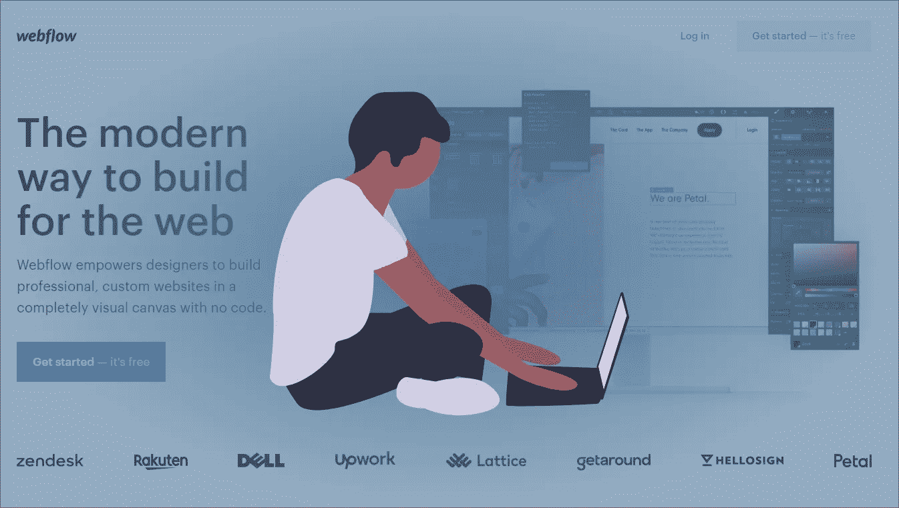

建立一个网站可能需要几个月的时间。

幸运的是，有一些框架、最少的代码和无代码的解决方案可以帮助任何人快速构建网站。

这里有 4 个从零开始建立自己网站的技巧。

# **提示 1:使用 Web 框架**

首先，web 框架。web 框架或 web 应用程序框架是一种软件框架，旨在标准化 web 应用程序的构建和部署。

流行的 web 框架如 Ruby on Rails、Flask、Django 都是框架。

**姜戈**

*版本:3.1.7*

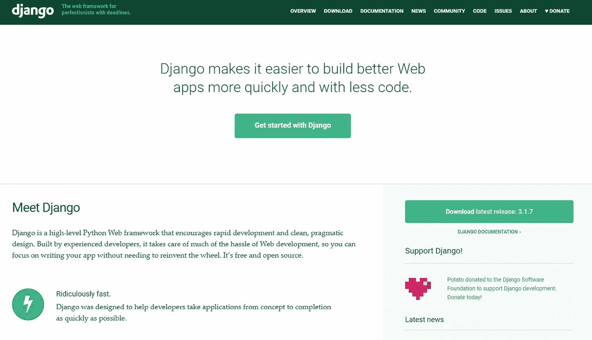

Django Web Framework 是一个免费的开源软件，遵循 2005 年首次创建的模型-模板-视图架构模式。

如果你想创建一个更大的基于数据的网站，Django 是一个很好的基于 Python 的框架。

YouTube、Dropbox 和 Spotify 等应用程序都是使用 Django 构建的。

它更像是一个全功能的 web 应用程序，除了表单验证之外，还附带了预构建的身份验证和消息框架，以便于实现。

在您的计算机上配置一个 Django 项目大约需要 10 分钟，而将它部署并投入生产只需要几周时间。

此外，还有数千个专门为 Django 项目设计的 Python 包，它们弥补了框架中尚未包含的任何附加特性。

如果您是编码新手，这可能听起来令人生畏。但是，如果你想创建一个网站，在网站和用户之间进行用户交互，这是非常值得的。

这包括用户通知、用户登录和动态页面呈现等功能。

我们有一个[初学者 Django Web 应用程序课程](../../../course-details)，它将带你了解第一次使用 Django 时需要知道的一切。

**为什么要用 Django？**

*   管理面板
*   用户认证
*   消息传递框架
*   表单验证
*   URL 路由
*   排除故障
*   对象关系映射
*   静态文件处理

**烧瓶**

*版本:1.1*

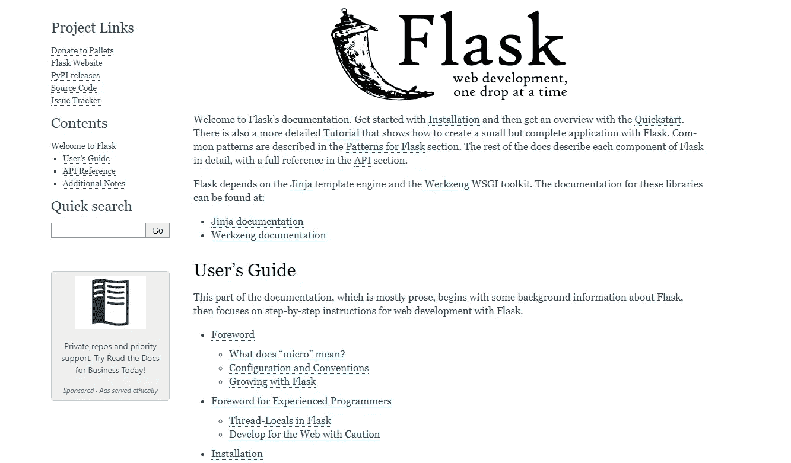

Flask 开发于 2010 年，是另一个也是用 Python 编写的 web 框架。它类似于 Django，只是稍微向下配对。

Flask 被认为是一个“微型”web 框架，因为它确实需要特定的工具或库来使用。

Flask 不包括身份验证、对象关系映射(ORM)和表单验证等功能，因此您可以决定项目是否需要这些功能。

但是不要担心，有一个很大的 Flask 开发者社区和大量的 Flask 扩展和库可供选择，所以你不必自己编写所有的代码。

使用 Flask 选择的自由确实有一点学习曲线和出错的风险，但对于数据库和项目规模的灵活性来说，这是值得的。

总的来说，如果你对 Python 有基本的了解，并且正在寻找创建一个更小的站点，并且有一些你实际需要的特性来完成你的项目，Flask 是很棒的。

**为什么要用烧瓶？**

*   发展的灵活性
*   消息传递框架
*   URL 路由
*   内置调试
*   静态文件处理

**轨道上的红宝石**

*版本:6.1.3*

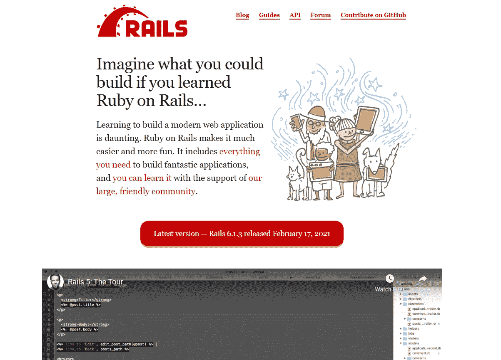

发布于 2004 年的 Ruby on Rails (RoR)是一款开源软件，运行于模型-视图-控制器框架之上。

Github、Hulu、Twitch 和许多其他应用程序都是使用 Ruby on Rails 构建的。

这个免费的 web 框架是基于 Ruby 编程语言的，带有 ORM、URL 路由和插件。

然而，你应该知道 RoR 有一个很高的学习曲线，而且关于软件包(gems)的文档通常是有限的。

这不是最快的安装，因为在安装 Rails 框架之前，您需要安装几个包。

但是 Ruby 考虑到了灵活的语法和提高的速度和效率，考虑到了不创建约定的开发原则。

唯一要考虑的是你对 Ruby 的了解和你学习的意愿。如果你不愿意精通 Ruby，它可能不适合你。

为什么应该使用 Ruby on Rails？

*   灵活的语法
*   表单验证
*   URL 路由
*   排除故障
*   对象关系映射
*   静态文件处理
*   包装(宝石)

# **技巧 2:使用 CSS 框架**

创建非常干净、有凝聚力的 CSS 需要时间——诚实地说，最好把时间花在营销你的网站或接触潜在客户上。

诸如 Bootstrap、TailwindCSS、Materialize 和布尔玛之类的 CSS 框架只是一些可用的开源 CSS 框架。它们都可以免费使用，并且有自己独特的设计风格。

**自举**

*版本:5.0.0-beta2*

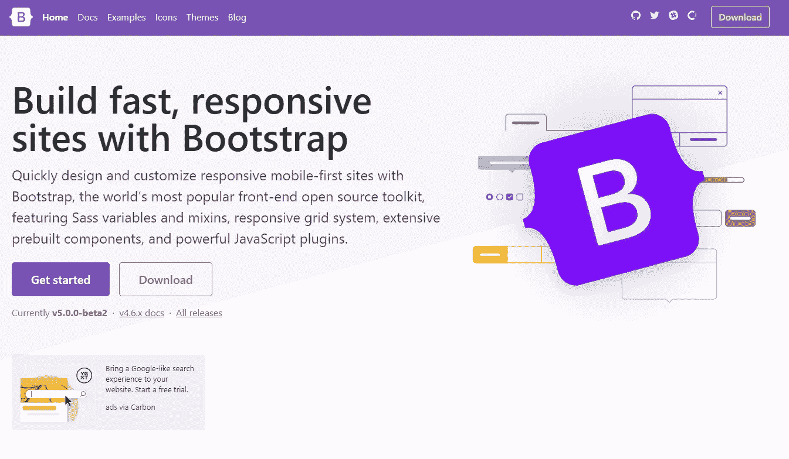

如果你是编码和 CSS 新手，我推荐 [Bootstrap](../../../blog/article/top-3-css-frameworks#bootstrap-css) 。

使用 CDN 脚本很容易实现，文档中充满了代码片段，可以直接复制并粘贴到代码中。

Bootstrap 允许你在创建一个非常专业的网站的同时拥有有限的 CSS 样式。

它提供了按钮、卡片、手风琴、导航条和图标，都是预先构建的。

**为什么要使用 Bootstrap？**

*   超过 20 种预制组件
*   8 种颜色变化
*   免费图标

**物化**

*版本:1.0.0*

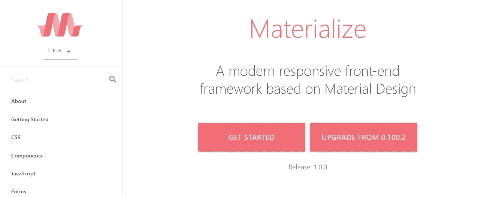

[Materialize](../../../blog/article/top-3-css-frameworks#materialize-css) 是另一个带有预构建组件的 CSS 框架。它类似于 Bootstrap，但具有更有角度的 CSS 设计。

Materialize 是一个精简版的 Bootstrap，颜色变化无穷。

这个框架提供了构建网站所需的所有基本组件——导航栏、页脚、卡片、按钮。

为什么要使用物化？

*   超过 10 个预制组件
*   100 多种颜色
*   免费图标

**顺风 CSS**

*版本:2.0.3*

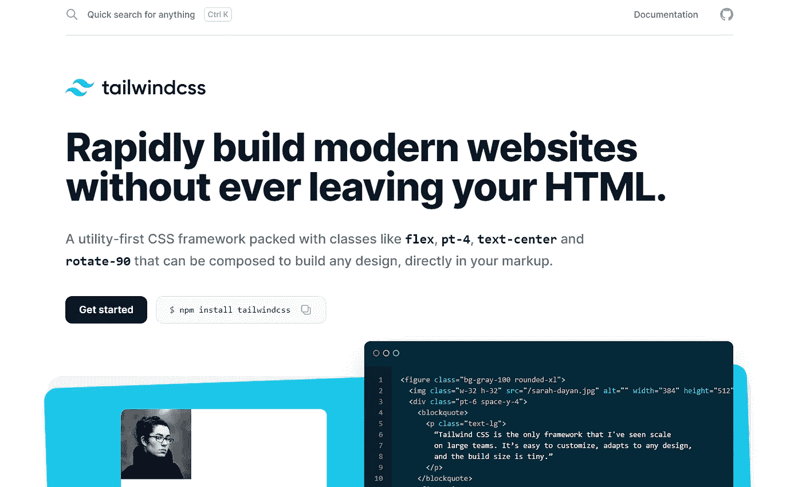

我会说 [Tailwind CSS](../../../blog/article/top-3-css-frameworks#tailwind-css) 是编写你自己的定制样式表和使用 Bootstrap 之间的桥梁。

TailwindCSS 是为那些希望构建自己的定制组件并反对 Bootstrap 的千篇一律的组件的人准备的。

但它仍然是一个易于使用的 CSS 框架。除了免费的示例组件之外，还提供了自定义类属性。

Tailwind UI 提供了一些免费的 HTML 代码片段，而不是简单的预建组件。

我最近收集了一批[顺风 CSS 卡](../../../blog/article/17-tailwindcss-cards)，如果你想抢先一步的话。

CSS 的可能性是无限的，你不再局限于预构建组件。

**为什么要用 TailwindCSS？**

*   构建 UI 组件
*   完全可定制的组件
*   90 多种颜色

# **提示 3:使用 JS 动画库**

React、Anime.js、ScrollReveal 和 Chart.js 只是几个前端 JavaScript 库，如果有策略地使用，可以为您的站点添加额外的视觉有趣元素。

同样，使用现有的库可以节省开发时间，而不是自己编写全部代码。

**反应**

*版本 17.0.1*

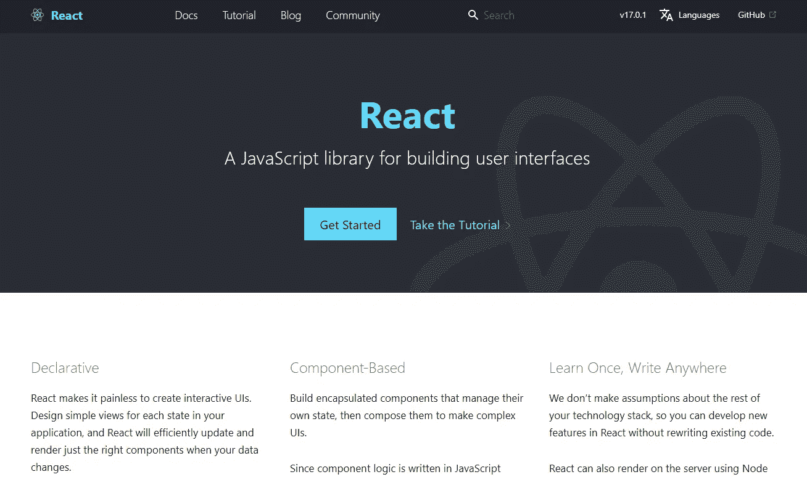

[React](../../../blog/article/reactjs-beginners-tutorial) 是一个用来创建 UI 组件的前端 JavaScript 库。

React 最初由脸书开发，提供了更好的整体用户体验，因为数据更改无需重新加载页面。

反应的关键是可重用组件。这个想法是创建简单的视图，在需要时呈现正确的组件。

React 最棒的地方在于，你可以根据自己的意愿随意使用。它是为逐渐适应而构建的，所以你可以使用 React 构建任何东西，从聊天机器人到整个电子商务商店。

为什么要使用 React？

*   轻松添加到现有项目中
*   编码任何组件
*   不重新加载页面

**Typed.js**

*版本 2.0.11*

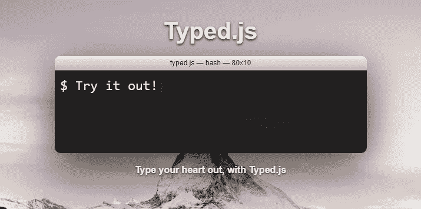

如果你想给你的网站添加一个很酷的打字动画，使用 Typed.js。该库非常易于使用，并且足够简单，可以根据您的喜好进行定制。

它非常适合在你的网站上快速放置一个干净的视觉动画，而不会太花哨。

CDN 易于使用，有几个属性可以自定义速度、循环和退格。

**为什么要用 Typed.js？**

*   易于使用
*   视觉冲击

**ScrollReveal**

*版本:4.0.8*

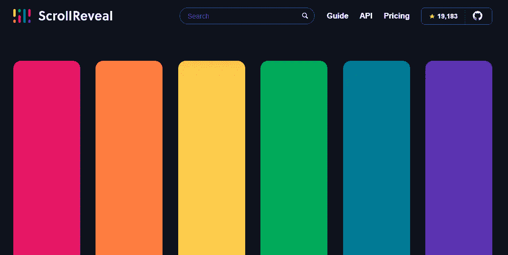

ScrollReveal 是一个有趣的动画库，顾名思义，它允许你在用户向下滚动页面时显示你的网站的一部分。

这是一个很好的方法，可以让你的网站更上一层楼，并通过强迫用户关注出现的特定事物来创造难忘的用户体验。

唯一的警告是谨慎使用，因为如果用得太重，它会压倒一切。

**为什么要使用 ScrollReveal？**

*   可以增加 UX 的经验
*   易于实施
*   视觉冲击

去 [5 JavaScript 动画库](../../../../../blog/article/top-javascript-animation-libraries)找一些我推荐的其他 JavaScript 库。

# **提示#4:使用无编码解决方案**

如果你读到这里，仍然觉得不熟悉，那么无代码解决方案是很棒的。

如果你想少写些代码，多做些营销/社会推广，它们也很有帮助。

没有任何代码应用程序可以帮助你构建、部署和自动化你的网站，而不需要接触任何一行代码。

我将简要介绍两种 web 开发无代码解决方案。

**气泡**

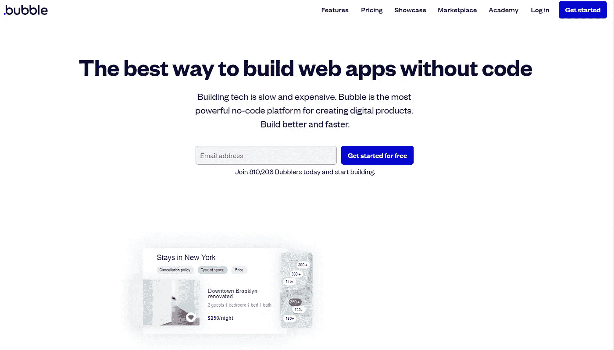

Bubble 是一个强大的无代码解决方案，可以让你从头开始构建你的网站。

它允许 web 流处理数据提交，而不需要接触一行代码。

将鼠标悬停在任何元素上，就会出现一个网格，便于元素对齐。预览按钮使网站看起来像是已部署的。

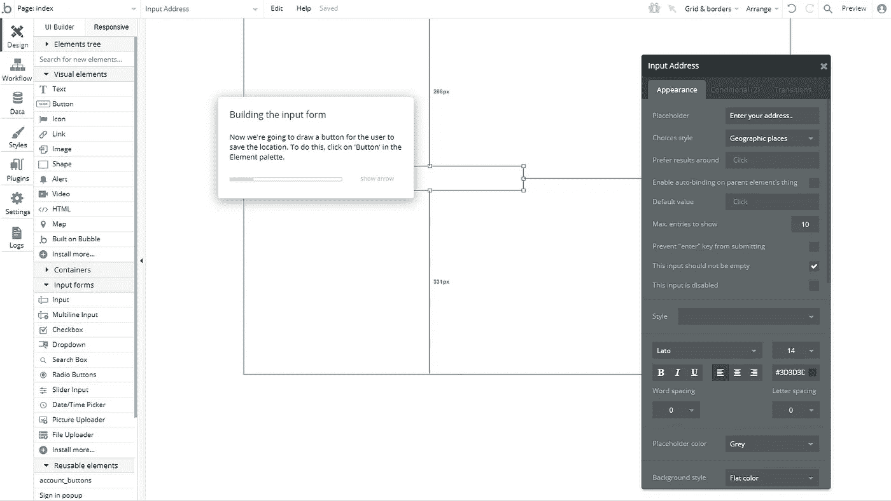

它还带有一个内置的调试器来帮助您解决任何编码错误。

但是编辑器是基于逻辑的，所以如果你有兴趣在站点中添加任何用户交互，我建议你跟随课程开始。

可能会有一个轻微的学习曲线开始，但这就是教训发挥作用的地方。

**为什么要用泡泡？**

*   更“高级”
*   保存并发送数据
*   API 集成
*   创建用户流
*   免费模板

**WebFlow**

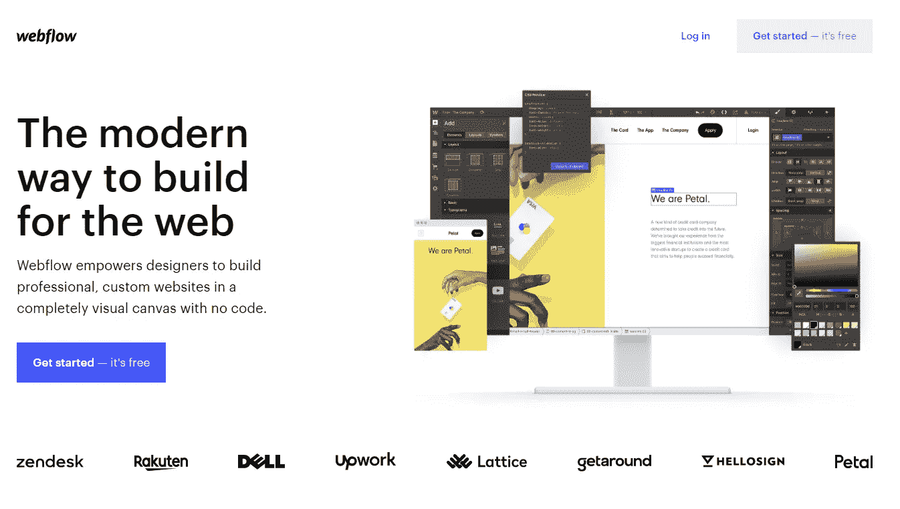

如果你熟悉任何 Adobe 程序，你会喜欢 WebFlow 的。

它的操作类似于用来改变组件颜色、方向和字体的侧导航条。

将组件拖放到页面上，然后在多个设备上查看您的作品，而无需使用浏览器工具。

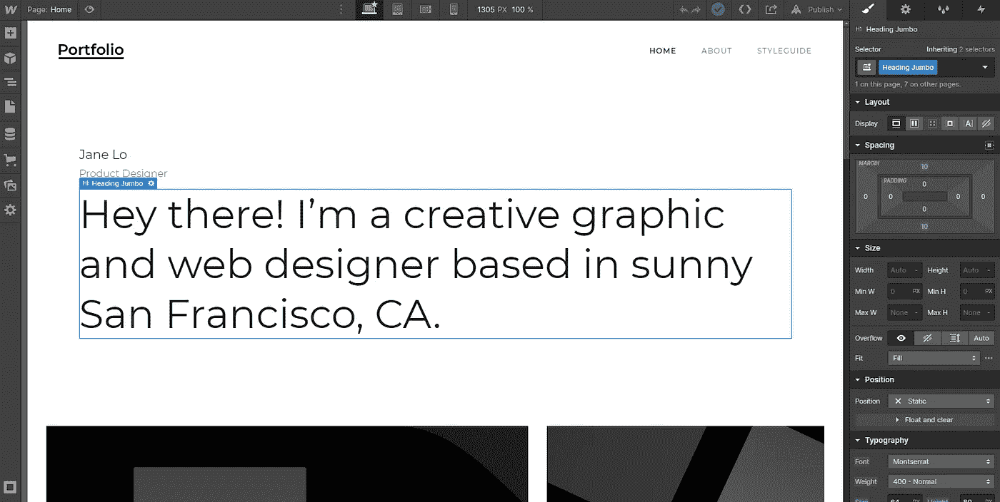

如果您不想从头开始，也可以使用初学者模板。

表单提交和 API 集成都是在项目设置下处理的。

**为什么要使用 WebFlow？**

*   简单界面
*   2 个免费项目
*   在 webflow.io 上部署
*   免费模板
*   表单提交
*   API 集成

我建议尝试所有这些链接，看看你更喜欢哪一个。它们都被设计成可以相对快速地启动和实施。

如果您想使用框架、库或无编码站点，启动一个示例项目并没有坏处。

在一天结束时，个人偏好将决定你使用哪些技巧。

*最初发表于*[*【https://www.ordinarycoders.com】*](https://www.ordinarycoders.com/blog/article/4-hacks-quickly-build-website)*。*

*更多内容请看*[*plain English . io*](http://plainenglish.io/)