# 如何仅用随机数在代码中精确估计圆周率

> 原文：<https://javascript.plainenglish.io/estimate-pi-cbf96eadb417?source=collection_archive---------3----------------------->

## 一个巧妙的面试问题和一个绝妙的解决方案

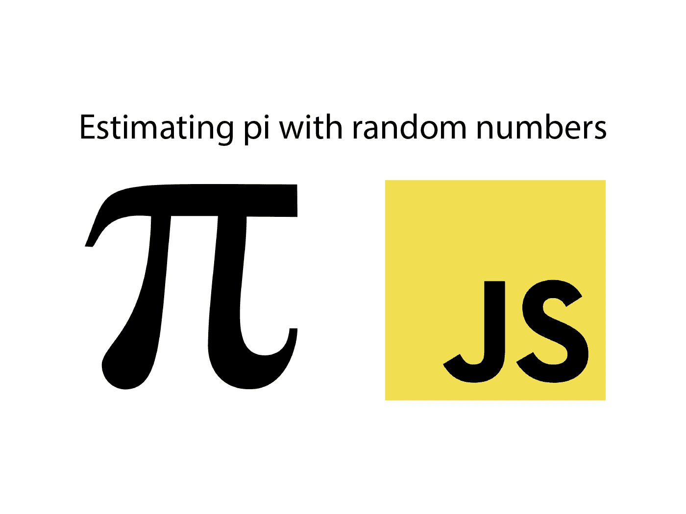

这可能是我知道的最难的面试问题之一。

虽然该解决方案不需要复杂的代码，但它需要非常复杂的方法。我们将理解这种方法并实现代码。

回到开始。想象你自己在一次编码面试中。面试官问了以下问题:

*在您选择的编程语言中，您将如何使用内置的伪随机数函数来近似确定 pi？*

他继续解释了一些细节:

这个内置函数，比如 Java 或者 JS 中的`Math.random()`，为你提供了`0.00`和`0.9999...`之间的浮点数。我们可以在任何编程语言中找到它。

还有，估计圆周率最多 3141 就够了。

就是这样。如果你瞬间有了一个想法，你可能是一个天才(或者你以前解决过这个问题)。

我对这个问题的第一反应是，这到底有没有可能。是的，它是。基于伪随机数，我们可以在代码中非常精确地估计圆周率。想看看怎么做吗？好吧，我们走！

**提示:**这段代码可以用任何编程语言实现。我们只需要生成随机数的能力。我将用 JavaScript 展示给你看，因为它的语法非常易读和通用。

让我们从最具挑战性的部分开始:获得如何解决这个问题的想法。

# 这个想法

所以我们想得到圆周率。稍微提醒一下这个常数是什么:
**圆周率是一个圆的周长与其直径的比值。**

因此，我们可以从一个圆得到圆周率——这就是我们想要的。我们想要接收圆周率。所以要解决我们的问题，首先需要一个圆。

简单来说，我们取一个半径为 1 的所谓单位圆。因为半径是 1，所以它的直径是 2。

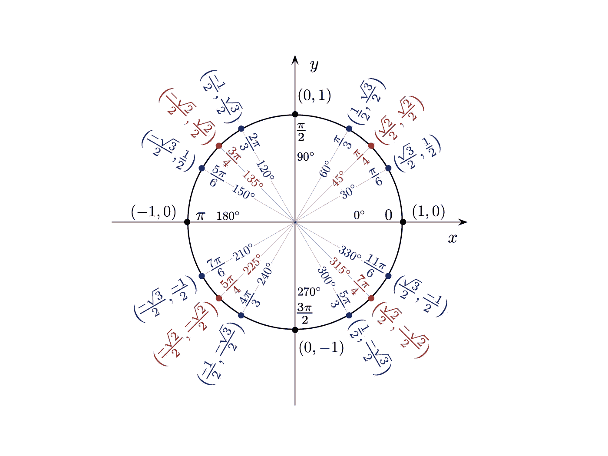

Credit: Wikipedia Creative Commons

现在，我们可以把我们的单位圆变成一个正方形。下列正方形每边的长度是圆半径的两倍:

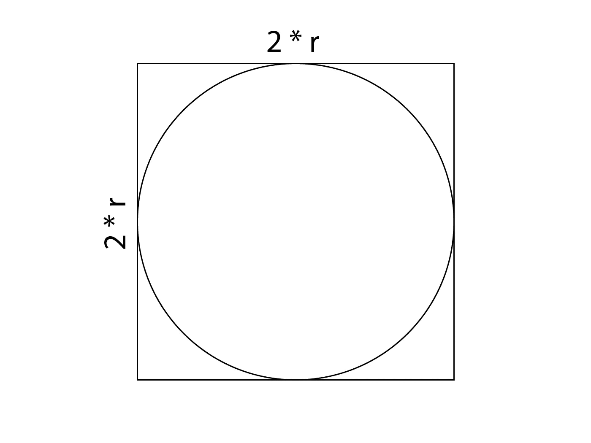

但是为什么是这个正方形呢？我们一会儿将回到这一点。

重要的是要明白我们的圆是单位圆。因此，它有一个正的和一个负的 X 轴和 Y 轴部分。然而，我们的伪随机数函数只生成正数。

说到坐标系:要得到坐标系中的一个点，我们需要两个数:所以我们可以调用 Math.random 函数两次来得到一个点。因为这个函数的值总是正的，所以我们只得到在坐标系和圆的右上四分之一处的点:

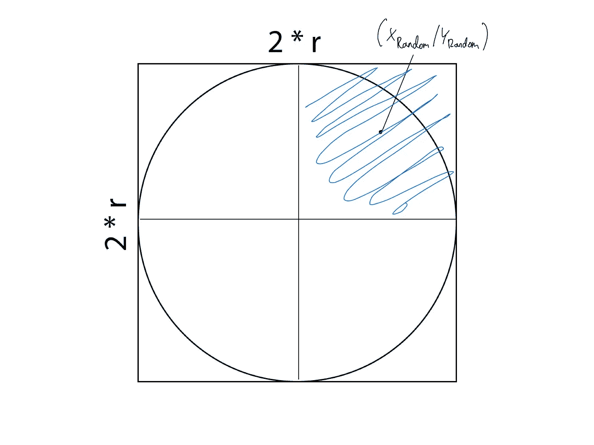

需要理解的重要一点是，我们在坐标系(Math.random() / Math.random())中生成的点也可以在正方形的右上角，因此在圆的外面。

点(0.99/0.99)是一个很好的例子，它位于圆的外面，在我们正方形的右上角。

幸运的是，我们可以计算出我们是否在坐标系中产生了一个位于圆内的随机点。为此，我们可以使用勾股定理。它帮助我们计算到坐标系原点的距离，即(0/0)。

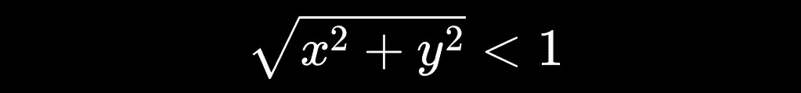

x 是我们坐标点的第一个值，y 是第二个值。

所以，如果距离小于 1，那么点在圆内，而不是在圆外。

举个简单的例子:我说过，点(0.99 / 0.99)在圆的外面。如果我们将它输入到上面显示的公式中，我们会得到大约 1.4-这个点在圆的外面，因为它不小于 1。

到目前为止，我们可以生成位于正方形右上部分的坐标，还可以检查这些点是否也位于圆内。

为了得到圆周率，我们必须重新排列一个方程，就像在数学中一样。
但是首先我们需要一个圆周率出现的方程。

这就是圆的面积与正方形的面积之比发挥作用的地方。由于 Math.random 函数允许我们生成许多随机但均匀分布的坐标，我们可以用它们来确定比例。

由于圆覆盖了正方形的大部分区域，所以应该有更多的随机坐标是在圆内的**，而不是在圆外的:**

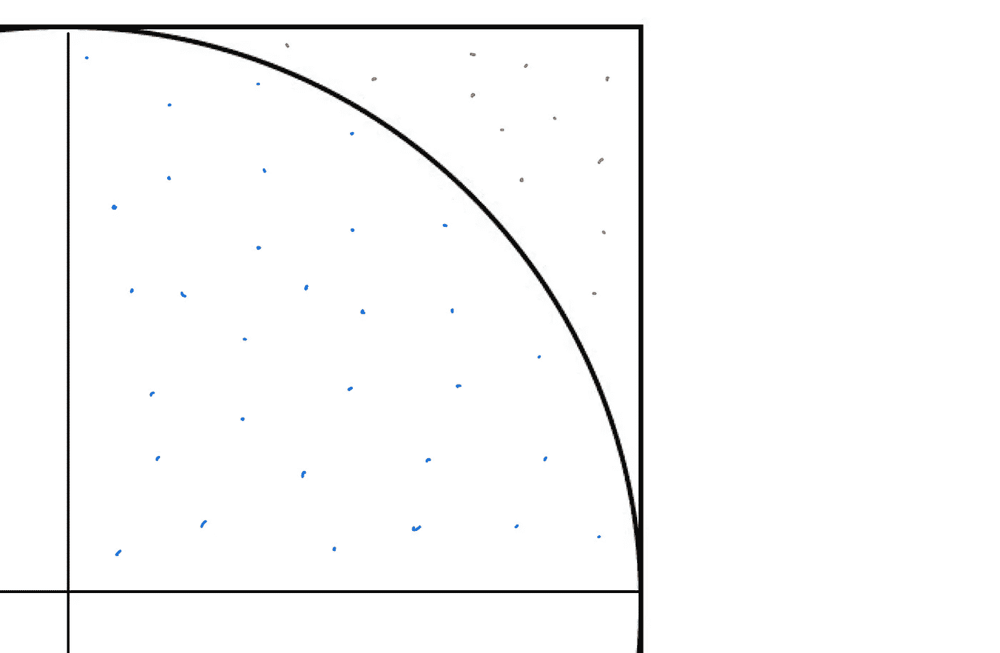

如果我们产生足够多的这些随机坐标，它们在圆和正方形中的分布比例就代表了圆和正方形面积的比例。这是一个艰难的判决。吸一口气；你应得的。

我想现在更容易理解我们如何得出尺寸的比例了。

回到数学。这是圆的面积与正方形的面积之比:

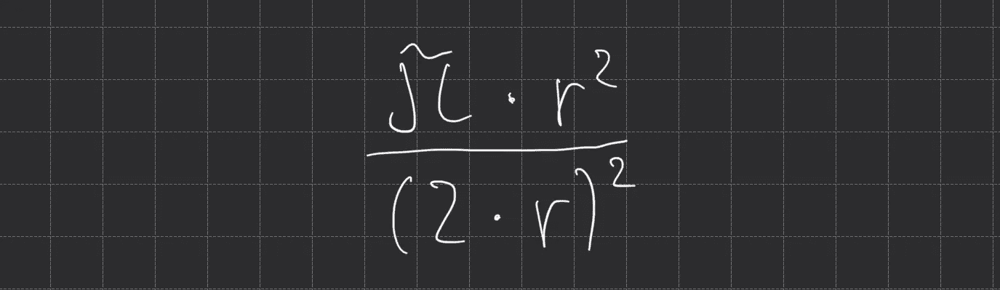

这个比率背后的数学包括整个圆和整个正方形。
但是因为我们只能接触到圆和正方形的上四分之一，我们不得不把方程简化成那样。毕竟，我们的 Math.random 只生成正范围内的坐标。

值得庆幸的是，上面显示的比率只不过是圆圈中的点数与正方形中的点数之比，所以:

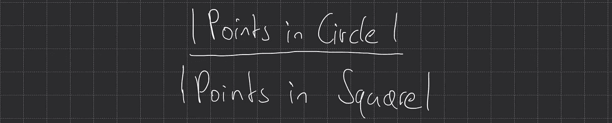

我之前说过，我们可以从随机点分布的比值推导出面积比。从技术上讲，圆中的点仍然在正方形中，但你得到了点——比率“圆中的点”的上半部分是在正方形中但同时在圆中的点。

我们用 Math.random 生成的点数越多，结果就越精确。

当你看倒数第二张图片时，你会发现我们需要提供一个半径值。由于我们的圆是单位圆，我们知道半径是 1。因此，我们可以将圆的面积与正方形的面积之比改写为:

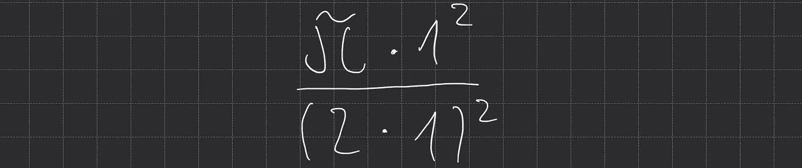

通过计算，我们得出结论，上面显示的比率就是`pi / 4`。

已知计算出的圆的面积与正方形的面积之比大约等于圆中的点与正方形中的点之比，我们得到:

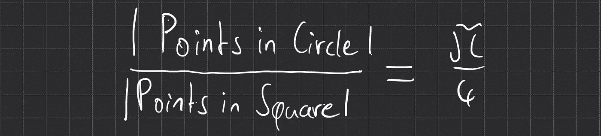

现在，等式两边都乘以 4，我们得到这个:

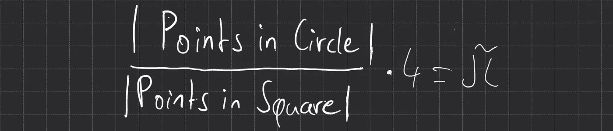

这就是我们如何得到圆周率的方法——我们需要的只是圆中的点数，将它与正方形中的点数成比例，然后乘以 4。

既然我们知道如何计算一个点是否在圆内，我们就把所有的东西都集合起来了。我们用代码写这个用随机数估计圆周率吧！

为此，我创建了一个名为“generatePi”的函数，它将应该生成的随机坐标的数量作为参数。在函数内部，我们计算圆内的点数和圆外(正方形内)的点数。

坐标点通过两个元素的数组来表示:

```
[Math.random(), Math.random()]
```

现在，让我们用代码来计算距离，这需要我们之前的不等式的左边部分:


在代码中，距离是:

```
Math.sqrt(Math.pow(point[0], 2) + Math.pow(point[1], 2))
```

添加圆和正方形中的点数很容易，我们最后返回的是这些点的比率乘以 4。

以下是完整的 JavaScript 代码:

由于我们使用随机生成的数字，我们的近似圆周率不断变化。然而，对于提供的 1000 万个坐标，得到的圆周率大部分是 3.141…

当提供高于 1000 万的数字时，会花费更多的时间，但会使我们的 pi 更精确。

这就是我们的解决方案——这不是很棒吗？我希望你能跟上。感谢您的阅读！:)

## [在 Twitter 上关注我，了解最新消息](https://twitter.com/louispetrik)

*更多内容尽在*[***plain English . io***](http://plainenglish.io/)