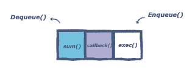

# JavaScript 中的事件循环:JavaScript 如何在幕后工作

> 原文：<https://javascript.plainenglish.io/event-loop-in-javascript-how-javascript-works-51c7bd73f07?source=collection_archive---------3----------------------->

JavaScript 是一种单线程语言。换句话说，它一次只能做一件事。JavaScript 在单线程上执行所有操作，但是使用一些智能数据结构，给了我们多线程的错觉。**事件循环**是 JavaScript 异步编程背后的秘密。


JavaScript 引擎自上而下执行脚本，创建执行上下文，将函数推入和弹出调用堆栈。


[link](https://developer.mozilla.org/en-US/docs/Web/JavaScript/EventLoop)

> **幕后——奇迹是如何发生的..！！**

Javascript 有一些有趣的数据结构，帮助它看起来像一种多线程语言。

**1—**

随着执行逐行进行，方法调用按执行顺序被推送到调用堆栈上。一旦执行完成，该方法将从堆栈中弹出。


[link](https://www.educative.io/edpresso/what-is-an-event-loop-in-javascript)

**2—**

对象被分配在一个堆中，堆只是一个名称，用来表示一个大的(大部分是非结构化的)内存区域。

**3—**

**事件队列**负责将新函数发送到轨道进行处理。它遵循队列数据结构来维护所有操作发送执行的正确顺序。



[link](https://www.educative.io/edpresso/what-is-an-event-loop-in-javascript)

在[事件循环](https://developer.mozilla.org/en-US/docs/Web/JavaScript/EventLoop#event_loop)的某个时刻，运行时开始处理队列中的消息，从最老的开始。为此，从队列中删除消息，并使用该消息作为输入参数调用其相应的函数。像往常一样，调用一个函数会创建一个新的堆栈框架供该函数使用。

每当调用一个异步函数时，它就被发送到一个*浏览器 API* 。这些是浏览器内置的 API。根据从调用堆栈收到的命令，API 启动自己的单线程操作。


[link](https://blog.sessionstack.com/how-javascript-works-event-loop-and-the-rise-of-async-programming-5-ways-to-better-coding-with-2f077c4438b5)

> **事件循环是做什么的？**

事件循环有一个简单的任务——监视调用堆栈和回调队列。如果调用堆栈为空，事件循环将从队列中取出第一个事件，并将它推送到调用堆栈，调用堆栈将有效地运行它。


[link](https://blog.sessionstack.com/how-javascript-works-event-loop-and-the-rise-of-async-programming-5-ways-to-better-coding-with-2f077c4438b5)

这样的迭代在事件循环中被称为**滴答**。每个事件只是一个函数回调。

> **例子**

我从[这里](https://blog.sessionstack.com/how-javascript-works-event-loop-and-the-rise-of-async-programming-5-ways-to-better-coding-with-2f077c4438b5)拿了这个绝妙的例子。这是我目前为止看到的最好的解释。
我就在这里浓缩一下。

```
console.log(‘Hi’);
setTimeout(function cb1() { 
  console.log(‘cb1’);
}, 5000);
console.log(‘Bye’);
```


[link](https://blog.sessionstack.com/how-javascript-works-event-loop-and-the-rise-of-async-programming-5-ways-to-better-coding-with-2f077c4438b5)

## **来源和好读物**

[https://blog . session stack . com/how-JavaScript-works-event-loop-and-the-rise-of-async-programming-5-ways-to-better-coding-with-2f 077 c 4438 b 5](https://blog.sessionstack.com/how-javascript-works-event-loop-and-the-rise-of-async-programming-5-ways-to-better-coding-with-2f077c4438b5)

[https://www . educative . io/edpresso/what-a-event-loop-in-JavaScript](https://www.educative.io/edpresso/what-is-an-event-loop-in-javascript)

[https://www.javascripttutorial.net/javascript-event-loop/](https://www.javascripttutorial.net/javascript-event-loop/)

[https://developer . Mozilla . org/en-US/docs/Web/JavaScript/event loop](https://developer.mozilla.org/en-US/docs/Web/JavaScript/EventLoop)

*更多内容请看*[***plain English . io***](http://plainenglish.io/)