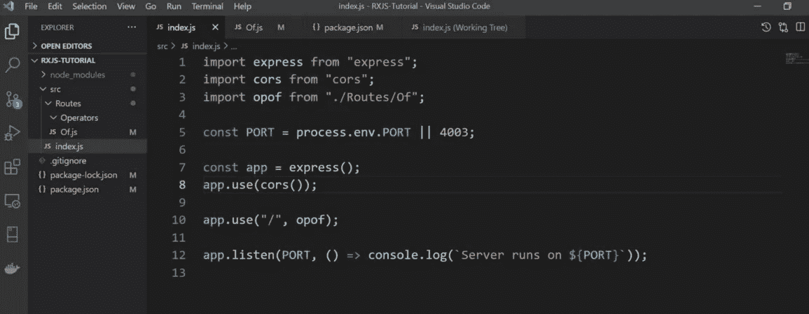

# RxJS 操作符大家应该都知道

> 原文：<https://javascript.plainenglish.io/everyone-needs-these-rxjs-operators-46cc0dbf4c25?source=collection_archive---------3----------------------->


> 如果涉及到数据流，并且你使用 JavaScript 库，你很可能需要 RxJS 的一些方法，这是 JavaScript 的另一个框架。在这篇文章中，我将谈论其中一些，这是经常使用的。

无论是在*前端*还是在*后端*工作，流都是一个极其重要的问题。有许多框架可以处理这个问题，在本文中，我们将重点关注一个 JavaScript 库，**RxJS**(JavaScript 的反应扩展库)。

*RxJS* 是一个利用*可观察*序列组成*异步*和基于事件的程序的库。

您可以在*前端*项目中使用 *RxJS 方法*，如 **Angular** 以及*后端*项目中使用 [**NodeJS**](https://nodejs.org/en/) 。可以找一些 npm 包给它。这篇文章将给出一些关于这些方法的信息和它们的用法的例子。我更喜欢用**NodeJS 内置的一个 **RESTful API** 项目来举例。而且我会用 **Visual Studio 代码**作为 *IDE* 。**

(它必须已经在您的 PC 上安装了 *NodeJS* 。)

让我们一步一步来，从项目的创建开始。首先我们转到将要创建项目的文件，用下面的代码创建项目的 **package.json** 文件:

```
npm init -yes
```

为了构建服务，我们安装了以下软件包:

```
npm install express cors nodemon
```

为了语法方便，让我们安装一些包。

```
npm install @babel/cli @babel/core @babel/ node @babel/preset-env
```

为了使用 [**babel**](https://babeljs.io/) ，我们将下面的代码添加到 *package.json* 文件中:

```
“scripts”: {
  “start”: “ nodemon — exec babel-node src/index.js”,
  ...
}{
  ... 
 “babel”: {
   “presets”: [“@babel/preset-env”]
  ...
}
```

我将使用 [**Axios**](https://axios-http.com/docs/intro) 来发出 *HTTP 请求*:

```
npm install axios
```

最后当然是:

```
npm i rxjs
```

创建完 *package.json* 文件后，我创建了如下图左侧所示的文件树:



而我正在编辑右边的 *index.js* 文件。对于每个操作员，我会在**路由器文件夹**下创建文件，并在 *index.js* 中给这些文件赋予*端点*(如下图)。

```
app.use(“/”, opof)
```

## 什么是运算符？

运算符是在 *RxJS* 中定义的一组方法，在数据流期间使用。

本文将要讨论的操作符列表如下所示。将给出关于该列表中操作符的简要信息，并将在该列表下添加关于每个操作符的示例代码。

*   [共](#d038)
*   [来自](#2ab4)
*   [间隔](#1e90)
*   [定时器](#61ec)
*   [轻击](#6a57)
*   [抛出错误](#3357)
*   [延迟时间](#f36e)
*   [retryWhen](#f36e)
*   [过滤器](#aa6e)
*   [地图](#8b42)
*   [扫描](#bcef)
*   [串联图](#eef3)
*   [合并地图](#2fbb)
*   [开关图](#7b11)

## 关于

操作器的*的作用类似于*。map()* 我们从 JavaScript 中熟悉的函数。差异；即使你没有一个数组，它也能收集任何类型的数据，并发出*个观察值*。例如，假设我们有一些不相关的数据，如下图所示。*

```
1 — “mike” — true — 4 — { country: “German” }
```

现在让我们在控制台上按顺序显示这些数据，就好像它们是数组的元素一样:

```
const source = of(1, “mike”, true, 4, { country: “German” });
const subscribe = source.subscribe((val) => 
 console.log(val)
);
```

输出:

```
1
mike
true
4
{ country: ‘German’ }
```

## 从

从数组、类数组对象、承诺、可迭代对象或类可观察对象创建可观察对象。

对于一个真实的流，让我们用 */people* *端点*从[*【https://swapi.dev/】*](https://swapi.dev/)中获取一些数据，并用中的*将它们作为可观察值发出。*

如您所见，我们可以使用*将来自*的输入数据转换为可观察数据，然后使用*订阅它。subscribe()* 方法。

输出:

```
{
  name: ‘Luke Skywalker’,
  height: ‘172’,
  …
}
{
  name: ‘C-3PO’,
  height: ‘167’,
  …
}
...
```

## 间隔

创建一个可观察对象，它在指定的时间间隔内发出连续的数字。

输出:

```
1
2
3
...
```

## 计时器

创建一个可观察对象，它将在发出数字 0 之前等待一个指定的时间段或确切的日期。

## 轻敲，水龙头

使用 *tap* 操作器，可以进行*测井*等不影响输出的操作。

输出:

```
map’ten önce: 1
map’ten sonra: 11
11
map’ten önce: 2
map’ten sonra: 12
12
map’ten önce: 3
map’ten sonra: 13
13
map’ten önce: 4
map’ten sonra: 14
14
map’ten önce: 5
map’ten sonra: 15
15
```

## 投掷误差

它是一个操作符，如果在流中发生错误，您可以使用它打印错误和关于错误的消息。

## retryWhen 和 delayWhen

顾名思义，当根据流期间确定的情况抛出错误时，该错误在 *retryWhen* 中被捕获，相关函数再次运行。使用*delay 当*时，在这些错误情况下，流可以等待一段时间。下面是两个运算符的用法示例。

## 过滤器

您可以使用 *filter* 操作符过滤流发出的值。该过滤规则将是您指定的规则。在下面的例子中，来自[](https://swapi.dev/)*服务器的人的身高信息被打印到控制台上。作为过滤规则，它被确定为大于 100。*

## *地图*

*使用 *map* 操作符，我们可以转换一个 *iterable* 对象的每个元素。这个操作符的工作方式与 *JavaScript* 的*非常相似。map()* 函数。不同的是；它的作用不是对现有数组中的元素进行更改，而是对流(从可观察对象发出)时获得的元素进行更改。*

*在下面的例子中，从服务器获取对象的一个字段，并将其转换为一个*整数*值，然后向其中添加 50 并打印到控制台。*

*在这里，**。**管子()【方法】脱颖而出。使用这种方法，可以使用多个运算符，用逗号分隔。也就是说，一个值可以连续处理多次。*

*由于*映射*操作符返回*可观察*，我们还要注意，我们是通过*订阅*来获取值的。*

## *扫描*

**扫描*通过对数据流中的每个值求和来继续。也就是说，它创建一个*累加值*，并且每个最后的值都被加到这个累加值上。*

*我们可以在下面的例子中看到，它显示了数组中的每个元素都被添加到先前值的总和中。*

*输出:*

```
*10
30
60
100
150
210*
```

*让我们再举一个例子，它将相同的值彼此相加，作为*字符串*:*

*输出:*

```
*10
10–20
10–20–30
10–20–30–40
10–20–30–40–50
10–20–30–40–50–60*
```

## *串联图*

*在流中的活动订阅过程结束之前，该操作符不会启动下一个操作符，而是根据数据源中的顺序提供流。因此，有可能使用以前的数据作为下一个变量。*

*输出:*

```
*With concatMap: Delayed by: 3000ms
With concatMap: Delayed by: 2000ms
With concatMap: Delayed by: 1000ms*
```

*由于延迟过程将根据源中数据的顺序，第一个数据将在 3 秒后打印，第二个数据将在 2 秒后打印，最后一个数据将在 1 秒后打印。*

## *合并地图*

*与 *concatMap* 不同的是， *mergeMap* 快速地一个接一个地映射所有订阅，不考虑数据源中的数据顺序，也不关注前一个数据操作的完成情况。*

*因此，mergeMap 最常见的用例之一是不应该被取消的请求。*

*输出:*

```
*With mergeMap: Delayed by: 1000ms
With mergeMap: Delayed by: 2000ms
With mergeMap: Delayed by: 3000ms*
```

*这可以在控制台中观察到；由于它不使用前一个*预订*结果作为下一个的变量，并且由于没有注意顺序，延迟功能不能很好地工作。*

## *开关图*

**switchMap* 的特点区别于 *mergeMap* 和*concat map*；当数据由*开关映射*发射时，先前的发射被取消，新的结果被订阅。*

*以下示例比较了 map 和*开关 Map* 。*映射*操作符发出可观察值。 *MergeMap* 创建一个内部可观察对象，订阅它，并将其值作为可观察对象发出。*

**映射*返回值为`(val*2)`，而*合并映射*使用`[of](https://www.tektutorialshub.com/angular/rxjs-observable-using-create-of-from-in-angular/)`函数返回值为可观察值`(of(val*2))`。它还订阅新创建的可观察对象，并将其值发送给流。*

*在下面的例子中，我们看到*开关映射*取消了前一个，并在新的输入到来时重新启动。您可以尝试在示例中使用 *concatMap* 和 *mergeMap* 而不是 *switchMap* 来查看区别。*

# *结论*

*本文主要关注 14 个 RxJS 操作符，它们对于在流中操作数据非常有用。当然，还有更多的操作符可用。有关更多信息:*

*   *[https://www . rxjs . dev](https://rxjs.dev)*
*   *[**https://www . learn rxjs . io**](https://www.learnrxjs.io)*

*为了到达给出示例代码的项目:*

*   *[**https://github.com/azizkale/RxJS——教程**](https://github.com/azizkale/RxJS---TUTORIAL)*

**更多内容请看*[***plain English . io***](http://plainenglish.io)*