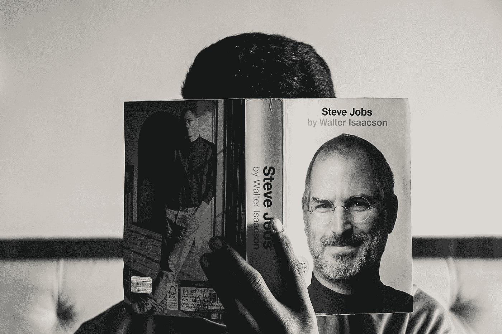

# 每个人都应该像学习阅读和写作一样学习编程

> 原文：<https://javascript.plainenglish.io/everyone-should-learn-programming-in-the-same-way-as-reading-and-writing-89fb8ed77eb1?source=collection_archive---------14----------------------->

## 根据史蒂夫·乔布斯、比尔·盖茨和马克·扎克伯格的说法

Photo by [Md Mahdi](https://unsplash.com/@mahdi17?utm_source=medium&utm_medium=referral) on [Unsplash](https://unsplash.com?utm_source=medium&utm_medium=referral)

给那些想知道什么是编程的人一个简短的介绍。

所以，基本上，编程是一种与我们的计算机交流并命令它们执行特定任务的技能。可以使用像 **Python** 、 **C++** 、 **JavaScript、**等等编程语言进行编程。

我已经在编程领域工作了大约 5 年，相信我，编程在我生活的以下领域帮助了我

*   得到一份体面的工作。
*   以建设性的方式利用我的时间。
*   **创建用户友好的网站。**
*   **参与竞争性编程，与全球顶尖程序员同台竞技。**

我真的相信你应该开始在编程领域迈出你的小步，我保证你不会后悔你的决定。

以下是伟大的科技领袖们强调编程重要性的语录

> 15 年后，我们将像教授阅读和写作一样教授编程…并想知道为什么我们没有早点这么做——马克·扎克伯格

> 这个国家的每个人都应该学习如何编程，因为它教会你如何思考——史蒂夫·乔布斯

> 学习编写程序可以拓展你的思维，帮助你更好地思考，创造一种思考问题的方式，我认为这在所有领域都是有用的——比尔·盖茨

> 大多数优秀的程序员从事编程不是因为他们期望得到报酬或得到公众的奉承，而是因为编程很有趣

> 无论你是想揭开宇宙的秘密，还是只想在 21 世纪从事职业，基本的计算机编程都是一项必须学习的技能——斯蒂芬·霍金

> 无论你的职业抱负是什么，学习编码都是有用的——阿里安娜·赫芬顿

> 为了为 21 世纪的需求做好准备，并利用其机遇，我们今天的学生有必要学习基本的计算机编程技能，无论他们想从事什么领域的工作

> 学习编码就是学习创造和创新——恩达·肯尼

读完所有这些令人着迷的引语，你应该已经理解了编程在当今时代的重要性。如果你打算在技术领域开始一个好的职业生涯，对编程的基本理解是非常必要的。

如果你和我一样属于 **Gen Z** ，那么相信我，学习基础编程对你会有很大的帮助。我个人会推荐你每天至少 **15 分钟**练习编程。在未来，编程将成为人类的一项基本技能。因此，你有一个很好的优势，在编程领域留下巨大的影响。

我希望你能从这篇文章中受到启发，并且有动力用一种好的编程语言编写你的第一个代码。如果你是一个完全的新手，我会推荐你从 Python 开始。坚持编程，坚持练习。祝你编程之旅好运。

[**花 5 美元购买 Medium 会员资格，阅读 Medium 上的所有文章——点击这里**](https://aniketz.medium.com/membership) **(当你使用这个链接时，我得到一小部分)**

# 也读—

*   [**3 个面向程序员的 YouTube 频道**](/3-youtube-channels-every-programmer-should-follow-66952f1f24e4)
*   [**每个程序员都应该看的 3 本书**](/3-books-every-programmer-should-read-97ac12422cfb)
*   [**十大编程语言**](/top-10-programming-languages-of-2021-d2d48c634ae7)
*   [**Noob 对 Python 的专家**](https://blog.devgenius.io/how-i-went-from-noob-to-expert-in-python-programming-8c4e141a0be1)
*   [**C++教程—完全初学者**](https://blog.devgenius.io/c-tutorial-for-complete-beginners-3d090ca8dd5f)
*   [**数据科学 Vs 软件开发者**](https://blog.devgenius.io/will-data-science-replace-software-developers-9eee00a6ebd6)

对于任何**“赞助/写作项目”**你可以通过—**writeaniketz@gmail.com**联系我

*更多内容请看*[***plain English . io***](http://plainenglish.io/)