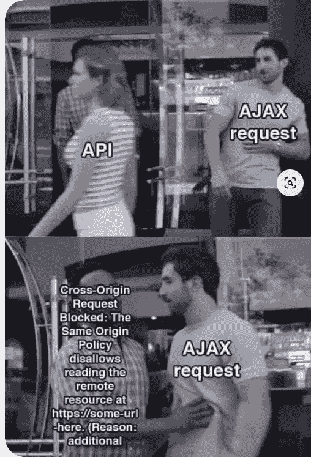
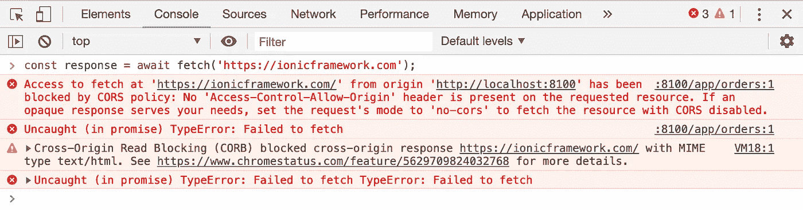
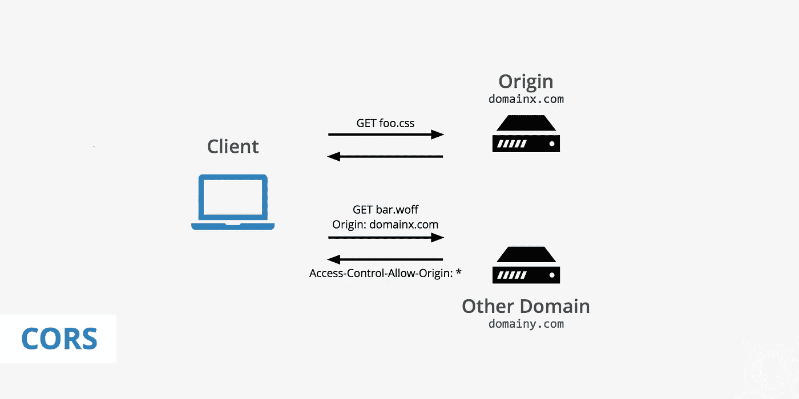
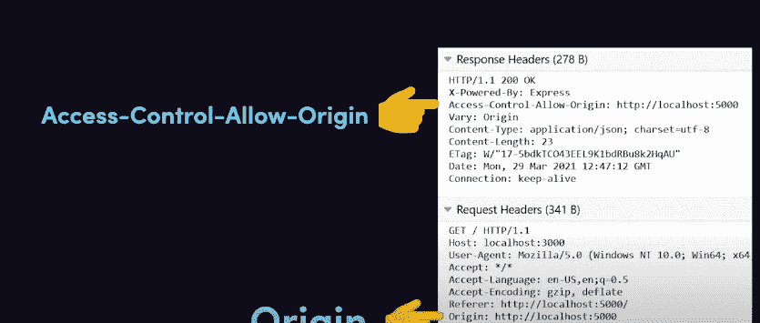
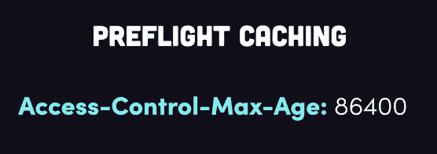
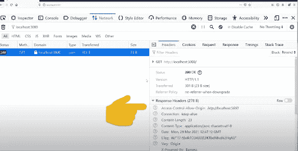

# 如何解决与 CORS 的问题

> 原文：<https://javascript.plainenglish.io/everything-about-cors-resolve-with-simple-step-758ae7410a53?source=collection_archive---------2----------------------->


每个 web 开发人员在开发网站时都会面临 CORS 问题。MDN 文档中对 CORS 的描述是:

*“跨来源资源共享(CORS)是一种基于 HTTP 报头的机制，它允许服务器指示除其自身以外的任何其他来源(域、方案或端口),浏览器应该允许从这些来源加载资源。CORS 还依赖于一种机制，通过这种机制，浏览器向托管跨源资源的服务器发出“预检”请求，以检查服务器是否允许实际的请求。在预检过程中，浏览器会发送指示 HTTP 方法的标头和将在实际请求中使用的标头。*

CORS 又名。跨源资源共享是一种机制，这意味着网站从一个 URL 向另一个 URL 请求数据，它对前端和后端都不利，因为它注定要被发现。



例如，你试图从一个不同的网址加载一个图像到你的工作网站，突然你看到它变成了一个损坏的图像，或者你可能试图调用 API，结果在控制台出现 CORS 错误。



CORS console error

这是因为浏览器将相同的原始策略作为其安全模块的一部分。这意味着浏览器可以很好地工作在自己的 URL 或相同的主机上，但阻止来自外部 URL 的任何内容，除非双方的某些条件匹配。

所以尽量用简单的语言去理解。

因此，当浏览器发出请求时，它会将来源添加到请求头中，并与 API 一起发送，相同的头在后端共享，这样，后端将检查头来源，如果来源相同，则资源将被共享，而不会询问任何问题。



CORS issue

如果两端的源报头不同，则添加带有跨源报头的响应。

```
Access-Control-Allow-Origin:foo.com
```



这是最常见的问题。出于安全原因，浏览器会发生这种情况。解决这一常见方法的一个方法是在后端添加一个通配符*，这样任何请求 URL 都可以共享资源，但这使您的服务器处于更危险的模式，可能会受到黑客攻击。

别担心，我们有适当的方法来解决这个问题。

# **如何克服这个问题**

因此，有几种方法可以解决这个问题，但这取决于哪种方法与服务器配置有关。

## 用选项配置 CORS

您还可以使用 CORS 的配置选项对此进行进一步定制。

您可以使用配置来允许单个域或子域访问，根据您的要求配置允许的 HTTP 方法，如 GET 和 POST。以下是如何使用 CORS 选项允许单个域访问:

```
const express = require('express');
const cors = require('cors'); 
const app = express(); 

var corsOptions = { origin: ‘[http://localhost:8080'](http://localhost:8080'),   optionsSuccessStatus: 200 // For legacy browser support}app.use(cors(corsOptions));
app.get('/', (req, res) => { 
  res.json({ 
    message: 'Hello World' 
  }); 
});
app.listen(2020, () => { 
   console.log('server is listening on port 2020'); 
});
```

如果愿意，您还可以配置允许的 HTTP 方法

```
var corsOptions = {    
    origin: 'http://localhost:8080',    
    optionsSuccessStatus: 200 *// For legacy browser support*                
    methods: "GET, PUT" 
}  
app.use(cors(corsOptions));
```

这些代码行将在所有 HTTP 响应中添加源头。

## 预检非标准标题

现在，某些 HTTP 方法，如 PUT、DELETE、PATCH，是非标准报头，需要进行预检。这就像机场对乘客的健康检查一样，只是为了确保乘客现在已经为航班起飞做好了充分的检查。

对于这些 HTTP 方法，浏览器以同样的方式知道何时使用名为**选项**的 HTTP 动词进行预检，并且作为响应，服务器将 204 为*是，我允许这个源发出 HTTP 请求，但是使用以下方法。*这一切的要点是确保主请求发生时没有任何灾难。


让我提一些飞行前的要点。服务器可以允许预检缓存具有最大期限，以便浏览器可以在一定时间内缓存请求。



## 仍然面临 CORS 问题？

如果你在浏览器中仍然面临 CORS 问题，那么你需要做提到的步骤来找出你所面临的问题。

原因 1:打开您的网络标签，并检查允许-控制-允许-起源，如果它不存在，那么你必须在服务器上启用 CORS。



原因 2:如果存在，则可能是 URL 与请求 URL 和响应 Allow-Control-Allow-Origin 不匹配，或者您可以添加通配符*来允许所有请求 URL。

原因 3:如果是预检，那么服务器可能不允许提及 HTTP 方法，对于给定的请求，那么您可以确保 HTTP 方法是正确的。

所以这些是你可以面对 CORS 问题的以下情况，你可以用给定的方法解决这些问题。

继续编码，感谢阅读这篇博客。