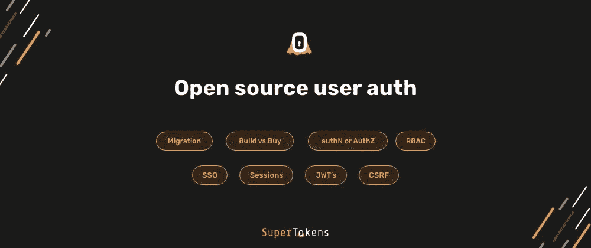
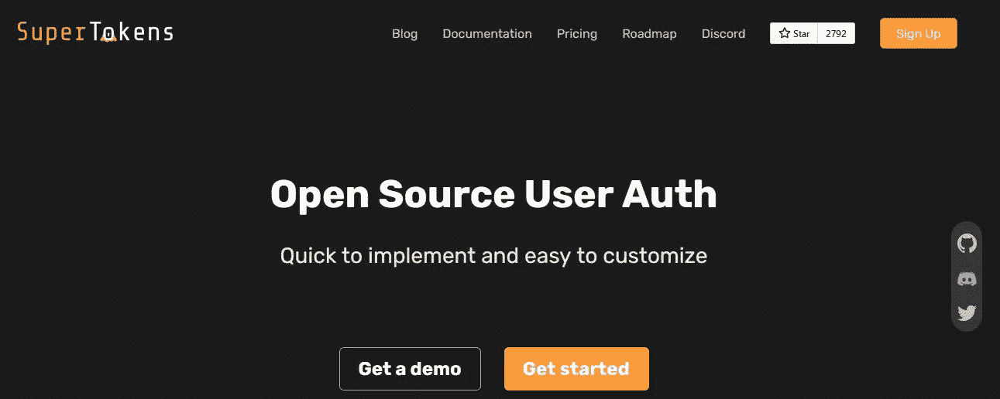
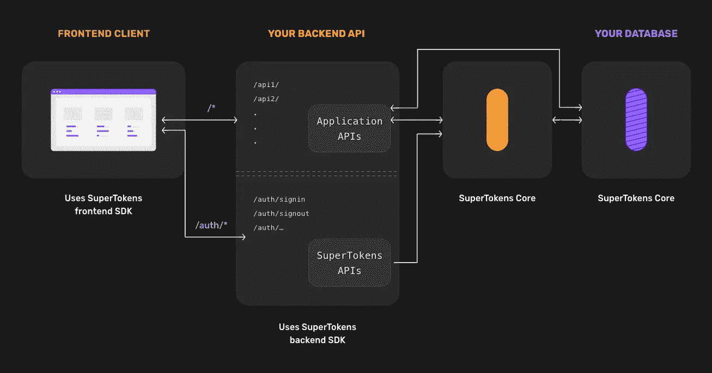
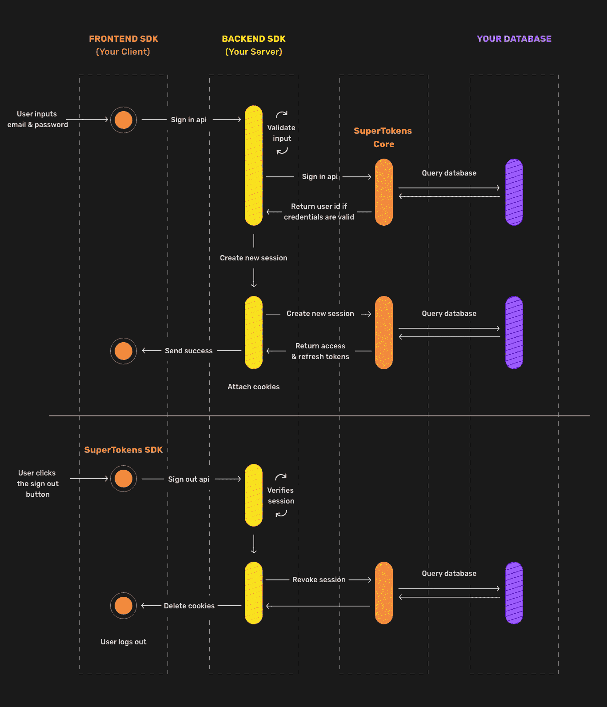

# 关于 SuperTokens 的一切:Auth0、Firebase Auth 和 AWS Cognito 的开源替代方案

> 原文：<https://javascript.plainenglish.io/everything-about-super-tokens-an-open-source-alternative-to-auth0-firebase-auth-and-aws-cognito-125baad4e504?source=collection_archive---------3----------------------->

当涉及到安全预算时，身份验证和授权对于组织来说是成本高昂的事情，这是每个公司或个人开发人员的主要关注点，如果你是开发人员/创始人，你会花很多时间为你的应用程序创建一个完美的安全系统。

> 你花了几天时间为产品创建一个登录和注册页面。

在那之后，你的工作仍然没有完成。

您需要:

*   社交登录
*   忘记密码流程
*   会话管理
*   电子邮件验证
*   用户管理
*   双因素认证和一些业务功能。

所有这些都需要在发布产品之前完成，看起来很容易，但并不总是如此。

你将花费大量的时间和计划来设置你的应用程序。

所以，如果我告诉你我找到了一个很棒的开源平台来拯救，也就是[超级坦克](https://supertokens.io/)。

> 我上周在一个兼职项目中使用了“超级令牌”,我必须说这是一个很棒的开源“用户认证”,实现起来很快，很容易定制。⬇
> 
> *-使用电子邮件 ID &密码
> 登录/注册-安全会话管理
> -电子邮件验证
> -社交登录*
> 
> *您使用的是哪个用户授权？*[*pic.twitter.com/g355g9GuXN*](https://t.co/g355g9GuXN)*——安库尔💻🎧💪(@ TheAnkurTyagi)*[2021 年 11 月 9 日](https://twitter.com/TheAnkurTyagi/status/1458054589136113666?ref_src=twsrc%5Etfw)

# 超级油轮有很多好处:

*   易于设置。
*   实现 AUTH 很快，我很喜欢它！
*   它使用包含访问令牌的 Cookies，该访问令牌会过期，并且必须使用刷新令牌进行刷新。

SuperTokens 还提供了一个更加端到端的解决方案，允许您轻松地实现一些功能，如在许多设备上同步会话数据，或者限制用户可以登录的设备数量。

它使您能够以最安全的方式让您的用户长时间登录。

# 1.在您的应用中快速设置身份验证非常简单:

使用**超级令牌**实现社交和电子邮件密码登录。

**在 React 和 Node.js app 中实现 SuperTokens 的教程。👇**

🔗[使用超级令牌实现社交和电子邮件密码登录](https://youtu.be/l_hRs1KY9mI)

在本演示中，您将了解到:

*   显示登录用户界面
*   按指定路线发送
*   保护网站路由
*   在前端获取用户信息
*   会话管理和注销。

# 2.它是开源的。

*   开源:超级令牌可以永久免费使用，没有用户数量限制。
*   内部部署，以便您使用自己的数据库控制 100%的用户数据。
*   具有登录、注册、用户和会话管理的端到端解决方案，没有 OAuth 协议的所有复杂性。
*   易于实施和更高的安全性。
*   扩展性:任何人都可以贡献，让超级代币变得更好！

> ***退房***[***GitHub***](https://github.com/supertokens/supertokens-core)***回购。***

# 3.入门/食谱:

**1。第三部分邮箱密码**

**特点**:

*   注册/使用电子邮件 ID 和密码登录
*   注册/登录第三方提供商(例如:谷歌、脸书)
*   使用电子邮件忘记密码流程
*   安全会话管理
*   电子邮件验证

你可以看看为这个菜谱制作的演示 app >[**链接**](https://thirdpartyemailpassword.demo.supertokens.io/auth?rid=thirdpartyemailpassword&redirectToPath=)

[**查看演示应用**](https://github.com/supertokens/supertokens-auth-react/tree/master/examples/with-thirdpartyemailpassword) 的源代码

**2。OnlyEmailPassword:**

*   注册/使用电子邮件 ID 和密码登录
*   使用电子邮件忘记密码流程
*   安全会话管理
*   电子邮件验证

你可以看看为这个菜谱制作的演示 app >[**链接**](https://emailpassword.demo.supertokens.io/auth?rid=emailpassword&redirectToPath=)

[**查看演示应用**](https://github.com/supertokens/supertokens-auth-react/tree/master/examples/with-emailpassword) 的源代码

**3。OnlySocialLogin:**

*   向第三方提供商注册/登录
*   安全会话管理
*   电子邮件验证

你可以看看为这个菜谱制作的演示 app >[**链接**](https://thirdparty.demo.supertokens.io/auth?rid=thirdparty&redirectToPath=)

[**查看演示应用**](https://github.com/supertokens/supertokens-auth-react/tree/master/examples/with-thirdparty) 的源代码

# 4.支持的技术堆栈:

**后端实现:**

*   节点. js
*   戈朗
*   Python (FastAPI，Django，Flask)

**前端**实现:

*   React:它们支持所有当前功能(注册、管理授权令牌、社交登录等)。
*   部分支持——Vanilla JS、Angular、Vue.js 和 React Native:它们只提供会话管理，您必须构建登录的前端 UI。

# 5.超级令牌的三个组成部分:

*   **前端 SDK** :负责渲染登录 UI 小部件，自动管理会话令牌。
*   **后端 SDK:** 提供注册、登录、注销、会话刷新等 API。你的前端会和这些 API 对话。
*   **超级令牌核心:**这是一个 HTTP 服务，包含 auth 的核心逻辑。它负责与数据库接口，并由我们的后端 SDK 用于需要数据库的操作。

# 例如:签到/签退流程:

> ***您可以看到这三个组件是如何为登录和注销流程(使用电子邮件和密码)进行交互的:***

**这篇博客到此为止。**

我希望你今天学到了新东西。

如果你有，请点赞/分享，这样其他人也能看到。

> 如果你经常阅读，谢谢你，你是我能够与你分享我的生活/职业经历的重要原因。

让我知道你将如何使用 [**超级令牌**](https://supertokens.io/) 来创建你的下一个项目。

如果你有任何问题，你可以加入我们的 [**不和谐服务器**](https://discord.gg/hk5VnDsF) **。**

**在 Twitter 上关注** [**超级令牌**](https://twitter.com/supertokensio) **获取最新更新。**

在 [**推特**](https://twitter.com/TheAnkurTyagi) 上和我联系

**如果喜欢这样。我鼓励大家注册订阅我的时事通讯。**

它是免费的。

你可以通过电子邮件问我你的问题。

点击此处查看旧版本:

[**Ankur**](https://www.getrevue.co/profile/AnkurTyagi)的 2–1–1 开发者成长简讯

*原载于*【https://theankurtyagi.com】**。**

**更多内容看* [*说白了. io*](http://plainenglish.io/) *。在这里注册我们的* [*免费周报*](http://newsletter.plainenglish.io/) *。**