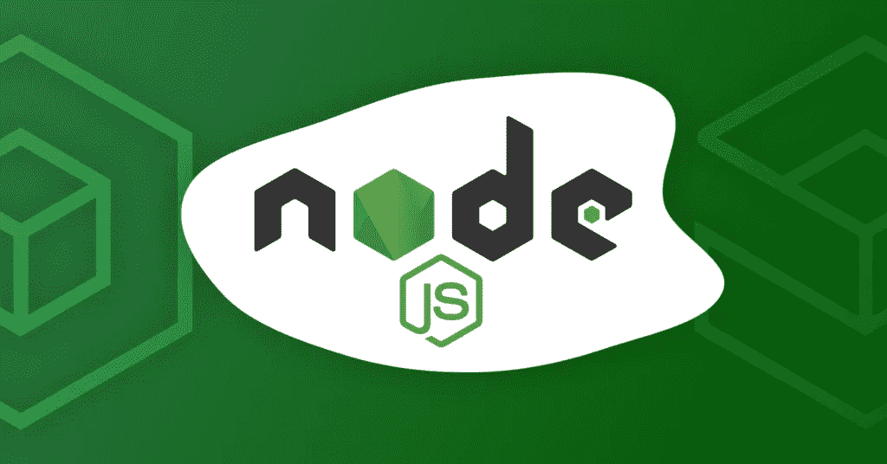
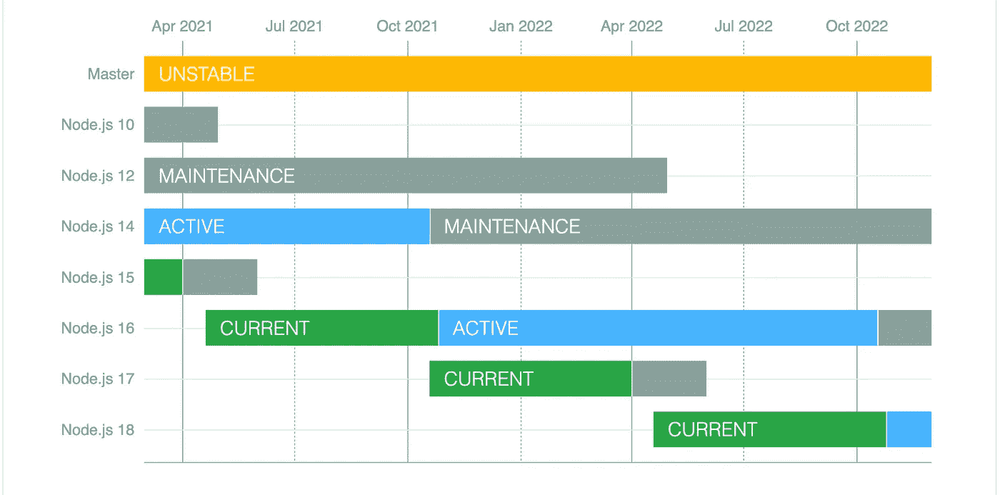

# 关于最新 Node.js 版本| Node.js 16 的一切

> 原文：<https://javascript.plainenglish.io/everything-about-the-latest-node-js-release-node-js-16-6d319331c27c?source=collection_archive---------9----------------------->

## Node.js v16 来了！



但是等等，我刚刚把我的项目升级到 Node 12，而你告诉我一个新版本已经发布了！我甚至还没有将我的项目升级到节点 14 或 15！我现在应该直接去 16 号节点吗？但是等等，有哪些突破性的变化？还有，有什么新功能？甚至升级有什么好处吗？我应该想到它吗？

如果你曾经有过这些问题，不要担心，因为我在这里告诉你你需要知道的关于 Node.js 最新版本的一切，如果你需要升级到它，有什么突破性的变化，有什么新功能。

让我首先解决房间里的大象:您需要将您的项目升级到节点 16 吗？答案是还没有。Node.js 16 将是未来 6 个月的“当前”版本，然后在 2021 年 10 月提升为长期支持(LTS)。

*Node.js 12 将保持长期支持直到 2022 年 4 月，Node.js 14 将保持长期支持直到 2023 年 4 月。Node.js 10 将于本月底(2021 年 4 月)停产。*

*每当 Node.js 发布奇数版本时，它不会被提升到 LTS；每当它发布偶数版本时，你应该真正将应用程序升级到偶数版本，因为它将获得长期支持，并将保持很长时间。*



[NodeJS Release Schedule](https://github.com/nodejs/Release#release-schedule)

# 主要变化概述:

1.  Node.js v16.0.0 是第一个为 Apple Silicon 预构建二进制文件的版本。
2.  标准[网络加密 API](https://www.w3.org/TR/WebCryptoAPI/) 的实验实现
3.  **中止控制器:**这是 Node.js v15 中引入的一个实验性实现，非常有用，现在在 Node v16 中已经稳定。它允许我们拒绝或中止任何基于承诺的 API。
4.  **Npm 7:**node . js v 16 中的 npm v7.10.0。
5.  **V8 9.0:** v8 JavaScript 引擎已经升级到 9.0。对于那些不知道 Node.js v15 已经发布了 8.6 的人。
    - ECMAScript RegExp 匹配索引
    -性能提升
    -稳定计时器承诺 API
6.  **重大变更:**无

# Web 加密 API

在 Node.js v16 之前，需要安装外部库来执行加密操作，这就对其效率提出了质疑。

*密码操作需要所有种类的加密和描述、散列、签名生成、多因素认证等。*

Node.js v16 对此类操作提供了内置支持，这使得使用 Node.js 执行此类操作变得简单而高效。

点击阅读更多关于网络加密 API [的信息。](https://www.w3.org/TR/WebCryptoAPI/)

# 堕胎控制员

这很酷，因为在此之前，我们只能取消订阅我们已经发出的 API 调用，但我们并没有真正中止它们，它们仍然在执行，我们只是没有听到响应。使用 AbortController，我们实际上可以中止任何类型的 API 请求:它可以是响应主体类型，甚至可以是流(比如下载视频)。

```
var controller = new AbortController();
var signal = controller.signal;

var downloadBtn = document.querySelector('.download');
var abortBtn = document.querySelector('.abort');

downloadBtn.addEventListener('click', fetchVideo);

abortBtn.addEventListener('click', function() {
  controller.abort();
  console.log('Download aborted');
});

function fetchVideo() {
  ...
  fetch(url, {signal}).then(function(response) {
    ...
  }).catch(function(e) {
    reports.textContent = 'Download error: ' + e.message;
  })
}
```

首先，我们需要使用中止控制器构造函数创建一个控制器，然后使用该控制器获取对其相关信号的引用。信号属性。

现在我们在 HTML 中有两个按钮，基本上是一个下载按钮和一个中止按钮。在 download 按钮上，我们添加了一个事件，它基本上监听一个点击事件，每当点击事件发生时，它就开始获取视频。另一方面，中止按钮也侦听点击事件，但它实际上中止了控制器，然后它记录“下载中止”。

点击阅读更多关于堕胎控制器[的信息。](https://developer.mozilla.org/en-US/docs/Web/API/AbortController)

[堕胎控制员实例](https://mdn.github.io/dom-examples/abort-api/)

# ECMAScript 正则表达式匹配索引

这提供了捕获的字符串的开始和结束索引。当正则表达式有`/d`标志时，索引数组通过 match 对象的`.indices`属性可用。

```
> const matchObj = /(Java)(Script)/d.exec('JavaScript');
undefined

> matchObj.indices
[ [ 0, 10 ], [ 0, 4 ], [ 4, 10 ], groups: undefined ]

> matchObj.indices[0]; // Match
[ 0, 10 ]

> matchObj.indices[1]; // First capture group
[ 0, 4 ]

> matchObj.indices[2]; // Second capture group
[ 4, 10 ]
```

# 稳定的计时器承诺 API

Timers Promises API 提供了一组可选的定时器函数，这些函数返回 Promise 对象，不需要使用`util.promisify()`。

```
import { setTimeout } from 'timers/promises';

async function run() {
  await setTimeout(5000);
  console.log('Hello, World!');
}

run();
```

我希望这篇文章能帮助您理解最新的 Node.js 版本。感谢阅读。如果你有任何问题，请随时回复。

# 资源

*   [https://medium . com/the-node-js-collection/node-js-16-available-now-7f 5099 a97e 70](https://medium.com/the-node-js-collection/node-js-16-available-now-7f5099a97e70)
*   [https://www . the immigrant programmers . com/p/everything-about-the-latest-nodejs](https://www.theimmigrantprogrammers.com/p/everything-about-the-latest-nodejs)
*   [https://developer . Mozilla . org/en-US/docs/Web/API/abort controller](https://developer.mozilla.org/en-US/docs/Web/API/AbortController)
*   [https://github.com/nodejs/Release#release-schedule](https://github.com/nodejs/Release#release-schedule)

*原载于*[*https://www.theimmigrantprogrammers.com*](https://www.theimmigrantprogrammers.com/p/everything-about-the-latest-nodejs-283)*。*