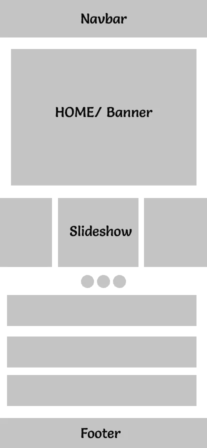
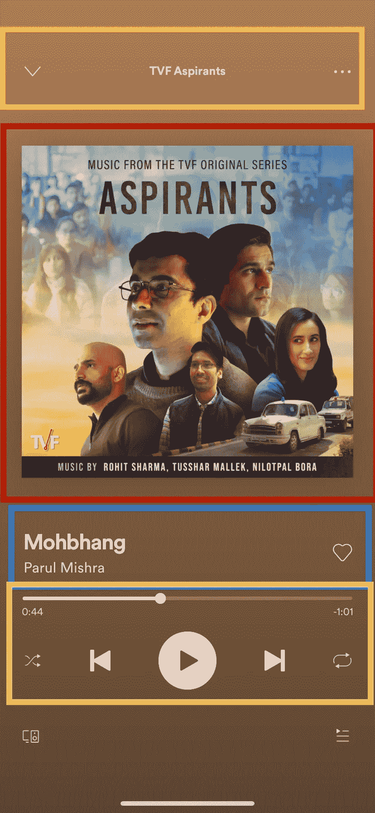

# React Native 中的一切都是以卡开始，以卡结束

> 原文：<https://javascript.plainenglish.io/everything-in-react-native-starts-with-cards-and-ends-with-cards-7d35979f6023?source=collection_archive---------8----------------------->

开发可重用组件的秘密。

Photo by [HalGatewood.com](https://unsplash.com/@halacious?utm_source=medium&utm_medium=referral) on [Unsplash](https://unsplash.com?utm_source=medium&utm_medium=referral)

我最近发表了一个关于 React Native 的 UI 库的故事。我用过 React Native Paper，React Native Elements，Native base 等等。我使用了所有列出的库，无论是在专业领域还是个人项目中。

 [## React Native 的前 5 个用户界面库

### 列出了前 5 个 React 原生 UI 库

medium.com](https://medium.com/nerd-for-tech/top-5-ui-libraries-for-react-native-2ce8a973bb1c) 

好吧，老实说，我没有面临这些 UI 库的任何重大问题。他们使开发变得非常容易。但从我的设计经验来看，我可以肯定地说，这些图书馆并不依赖于负空间的范围。

负空间基本上是布局中对象之间或对象内部的空白空间。它可以在对象之间或对象内部的任何位置。因此，为了在我的应用程序上提供完美的负空间，我遵循了划分和重用的概念。

基本上，将一个页面分成几个部分，然后在每个部分对常见组件进行分类。

划分和重用的过程使得开发和设计变得更加容易。此外，遵循这些简单的原则通常会将开发人员和设计人员带到同一个平台上，有助于开发可重用的组件，并保持应用程序每个页面的一致性。

这就是为什么我把 UI 中的所有东西都看作是一个盒子元素，比如说一张卡片。

# 到处都是卡片

好了，我在这里不是要告诉空白或负空间等等的区别。我们在这里了解如何卡应该工作，并在反应原生使用。

如果您查看任何移动应用程序的单个页面，卡片是最重要的组成部分，如下图所示。

我已经设计了一个样本移动用户界面样机设计。这个简单的 UI 锁分为几个部分，每个部分都由矩形或正方形的组件组成。

例如，有一个导航栏，接着是一个主页，接着是一个旋转木马，然后是一个用户列表，最后是底部导航栏的页脚。这些是部分，每个部分都由组件组成。

如果你作为开发者看到这个模型，你能看到什么？。

我不确定，但是我把所有东西都看作是像导航条一样的**卡**，旋转木马中的一个项目，或者一个列表。所有东西都是**卡**，不管形状如何。

在我 30 天的设计挑战中，我学到了这样一个概念:把所有东西都当成一张卡片，让所有东西看起来都那么简单和时尚。

这种假设的整个 UI 的预览使开发变得非常容易，我们现在可以在许多地方重用我们的单个组件。

# 清晰画面

让我们扩大这个方面，我分享的图片是我们应用程序的主页，让我们再举一个真实世界 UI 的例子。我正在使用 Spotify 播放音乐用户界面。

我用不同的颜色标记了每个部分，这使得我们的理解更容易。从更广泛的角度来看，Spotify 用户界面中有一张卡，每个标有不同颜色的部分都使用我们的单卡组件。

例如:

*   **橙色部分** —这是一张卡，其中有 3 个组件以灵活的顺序放置在卡中
*   **红色部分**——这又是一张有一个图像的卡片，占据了我们卡片组件的整个空间
*   **蓝色部分**——一个卡片组件，其子组件以灵活的顺序排列。
*   **黄色部分** —最后，同样是一个具有所有音频文件功能(如播放和暂停)的卡组件。

# 开发我们的单一可重复使用的卡

现在开发这个页面非常简单，我们只需要开发一个具有以下调整或功能的卡片-

*   我们的卡应该在两个方向的列或行中接受灵活顺序的孩子
*   我们的卡可以有多个孩子，也可以是单个孩子。
*   我们的卡的高度和宽度可以根据内容进行控制或调整。

现在，我们的开发方法变得更加清晰和简洁。我们只需要制作一个可重复使用的卡片，在我们的应用程序页面中，我们必须为我们的卡片提供内容和灵活的方向。

# 使用道具调整卡片内容

如果你看看其他应用程序的用户界面或设计，有些卡片在列或行的方向上有灵活的顺序，有些在任何位置对齐项目，如中心或开始等。

要开发这种可扩展的单个可重用组件，最好使用 props 来处理这些属性，并使用简单的 props 为开发人员提供 CSS 属性扩展。

例如，您可以为我们的卡组件强制设置两个道具，如-

*   **伸缩方向** —这将决定它的子对象应该按行还是按列排列。
*   **对齐项目** —对齐项目将允许开发人员在卡组件的末端或中心位置对齐项目

显然，你可以接受更多的道具，如对齐内容或对齐自我等，更多的道具，我们的卡更强大，在任何情况下都可以重复使用我们的卡。

# 使用扩展运算符扩展 CSS

卡片可以有正面或阴影，也可以有边框半径或背景色。所有这些性质本质上都是枚举，不管它们存在与否。为了处理这些情况，最好使用 ES6 的 spread 操作符为它们提供支持。

Spread 运算符允许使用对象中提到的其他属性，因此如果用户提供边界半径作为属性，那么只需在边界中添加该半径，否则不会。我们不必时不时地手动设置一切。如果我没有错的话，这叫做自动化。

# 总是使用一些边框和半径

史蒂夫·乔布斯痴迷于边框，每一款苹果产品都有一些边框半径，没有什么东西是从角落里直接指出来的。据我所知，这使得 UI 和产品优雅而美丽。

我会一直建议给你的卡片定制一些阴影或凸起的边框，让它们看起来更有吸引力，尤其是当你的卡片有点击属性的时候。

# 结论

这是我在 30 天的设计挑战中得到的最好的学习。你可能在其他任何地方都找不到它，你可以称之为我的秘密。让我知道你在前端开发 UI 的秘诀。

下次见。祝大家愉快。

 [## 在 react 应用程序中使用引导程序

### 通过 React 使用最流行的前端框架。

shreyvijayvargiya26.medium.com](https://shreyvijayvargiya26.medium.com/using-bootstrap-with-react-application-66037e808db5)  [## 掌握 2021 年下一个 JS 的 3 分钟路线图

### 2021 年掌握下一个 JS 的完整指南

medium.com](https://medium.com/nerd-for-tech/3-minute-roadmap-to-master-the-next-js-in-2021-e022fee244b0)  [## redux 很有可能被取代

### 看看 redux 的竞争对手，redux 很有可能在未来被取代。

medium.com](https://medium.com/codex/there-are-high-chances-that-redux-will-be-replaced-98f1c469bcce) 

*更多内容尽在*[*plain English . io*](http://plainenglish.io/)