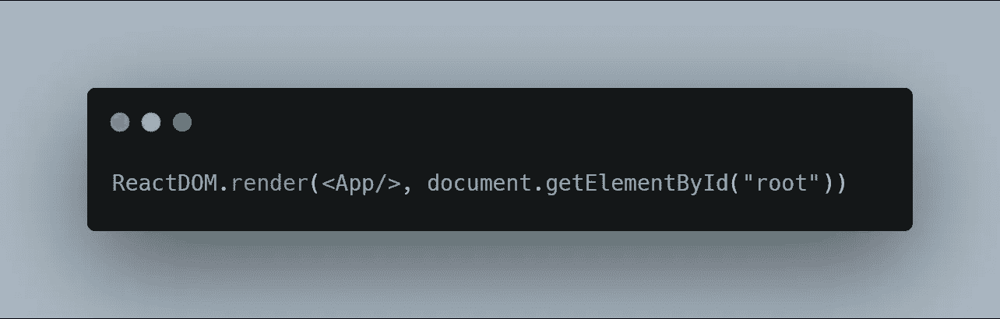
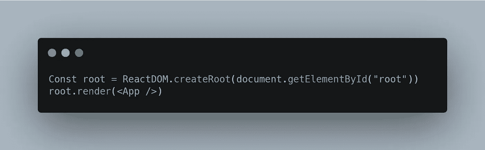
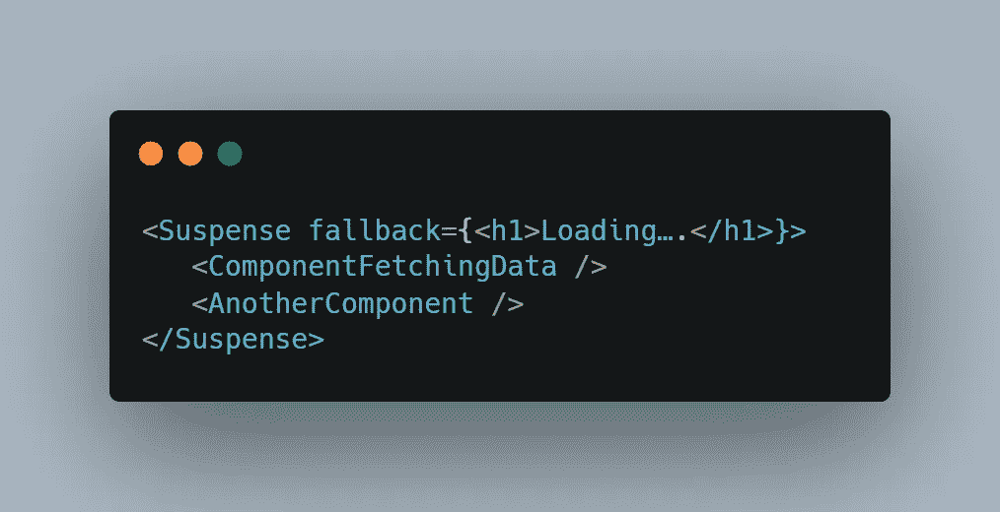
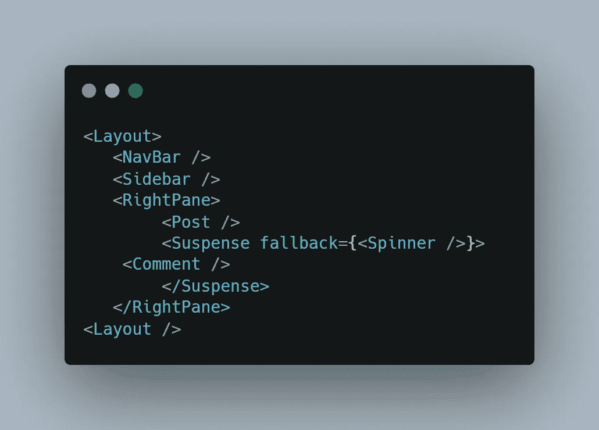
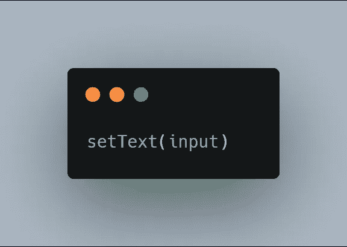
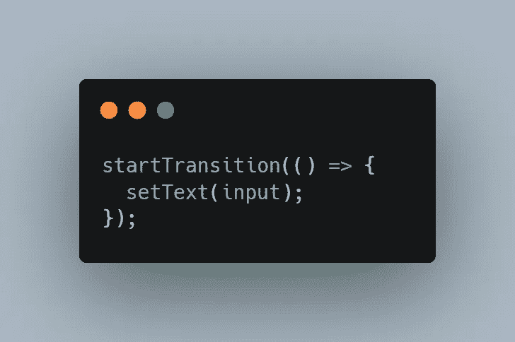
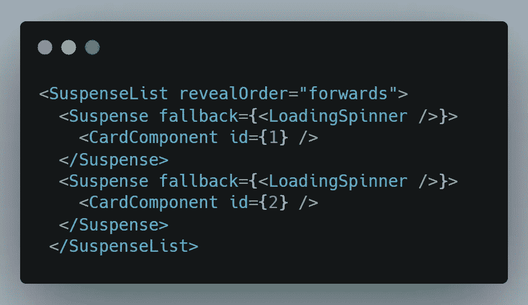
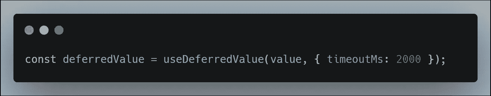
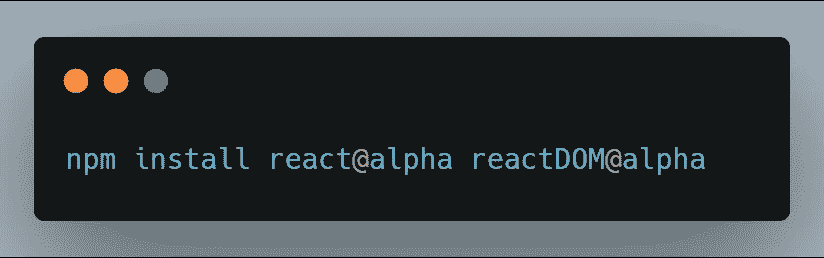

# React 18 中的新功能

> 原文：<https://javascript.plainenglish.io/everything-new-in-react-18-db459c2608de?source=collection_archive---------0----------------------->

> React 18 Alpha 在这里，React 18 增加了很多东西。React 17 没有看到太多新的加入。但 React 18 肯定不是这样。在本文中，我们将了解一些主要的更新。

## 有什么新鲜事？

# 1.新的根 API

这是我们习惯看到的

我们传递 reactDOM.render 我们的 App 组件，然后传递`document.getElementById`和我们的根元素。因此，我们非常简单地将应用程序组件呈现到页面上的根元素中。

这是新的方法

我们有一个根变量，它等于新方法 create root。这是传递给我们的根元素，然后我们调用 root.render 并传递我们的应用程序组件。

我们的应用程序组件正在以不同的方式完成同样的事情。旧的方法称为传统的根 API，它在 react 18 中仍然有效，但在某些时候会被弃用。通过使用新的根 API，您将可以访问 react 18 的所有改进，包括我们将在本文中讨论的并发功能。

# 2.焦虑

在这次更新中，我们将获得对悬念的全面支持。现在，什么是悬念，顾名思义，它暂停一些东西，直到它准备好被呈现。

在这个例子中，我们有一个组件，在它准备好被呈现之前需要时间来获取数据。悬念将使用回退，直到数据被返回并且组件被呈现。

这里需要注意的是，这里的随机组件并不等待数据，但它仍然会被挂起，直到悬念中的所有内容都准备好被渲染。

现在，悬念对于服务器端渲染非常有用。目前，通过 ssr，您将获得完全渲染的 HTML，但您的浏览器仍然需要加载 javascript 并在整个页面变成交互式页面之前对其进行水合处理。悬念可以使用 react 18 中的示例显著加快加载时间。

上面我们有一个加载了导航栏、侧边栏、文章和评论的页面。现在，我们真的不需要在网站变得互动之前加载评论，所以我们将暂停评论，以便查看者可以开始阅读文章，然后我们将在后台加载评论。

# 3.自动配料

在 React 17 和更早版本中，React 在浏览器事件(如单击)期间批量重新渲染更新。

React 17 不会批处理重新渲染，如果你需要获取数据，然后更新状态。在 react 18 中，如果你使用新的 create root API，所有的状态更新都将被自动批处理，无论它们何时发生。

如果有一些关键组件您不想批处理。您可以使用`ReactDOM.flushSync()`选择退出。

# 4.startTransition API

这是这个版本中引入的一个新 API，它有助于保持当前网页的响应性，同时能够进行大量的非阻塞 UI 更新。

这将告诉 react 哪些更新是紧急的，哪些可以等待，这将有助于 UI 保持响应。

对于像打字、悬停、点击这样的紧急更新，我们通常这样调用道具/功能:

对于非紧急或繁重的 UI 更新，我们可以将其包装在 startTransition API 中，如下所示:

# 5.悬念列表

一个`<SuspenseList />`用值向前、向后或一起接受`revealOrder`属性

这里，卡组件将向前显示(直到数据被提取，将回落到 LoadingSpinner 组件)。同样，`backwards`会以逆序揭示卡牌，together prop 会把所有东西都“一起”渲染。

# 6.useDeferredValue

`useDeferredValue`接收状态值和以毫秒为单位的超时值，并返回该值的延迟版本，该值可能“落后”它最多 timeoutMs。

当您有一些基于用户输入立即呈现的内容和一些需要等待数据获取的内容时，这通常用于保持界面的响应性。

我们可以使用以下工具立即安装 React 18 和 reactDOM:

**向上缠绕** **向上缠绕**

React 18 现在是 alpha 版本，不适合生产，但现在开始了解这些功能总是更好。

React 18 将在几个月后进入公测。

感谢您的阅读。结束。🙌

请随意联系。👇

> GitHub:[https://github.com/Push9828](https://github.com/Push9828)
> 推特:[https://twitter.com/PushkarThakur28](https://twitter.com/PushkarThakur28)
> 领英:[www.linkedin.com/in/pushkarthakur28](http://www.linkedin.com/in/pushkarthakur28)

*更多内容请看*[*plain English . io*](http://plainenglish.io/)