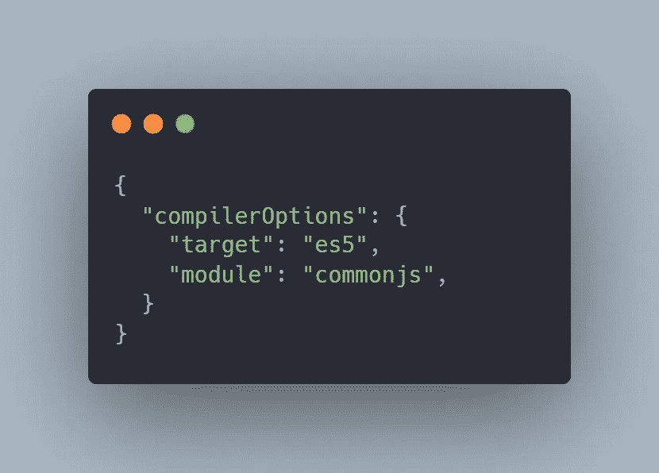
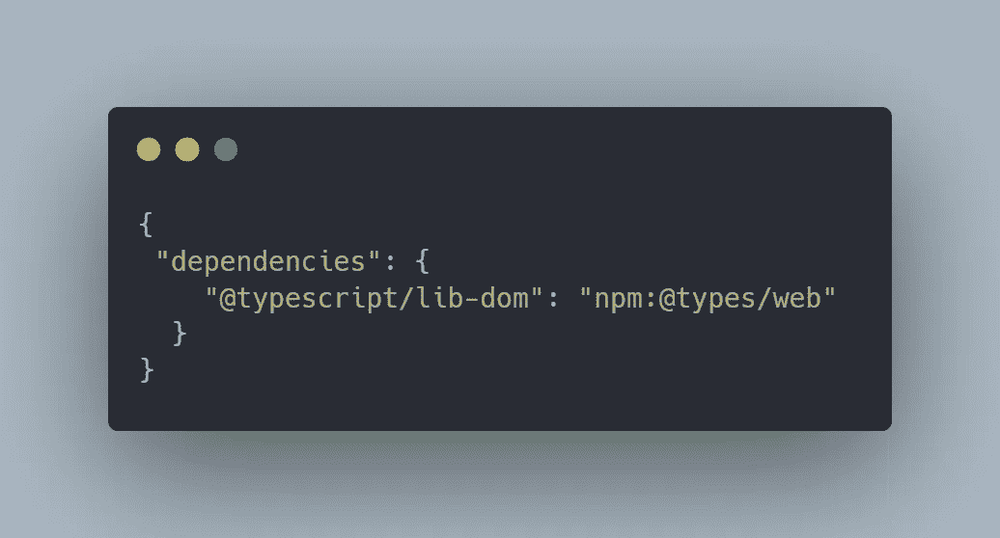
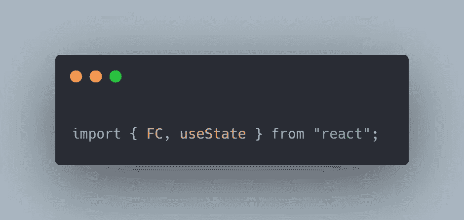
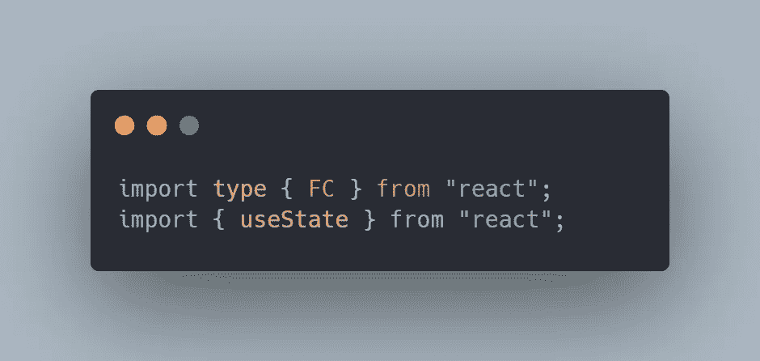
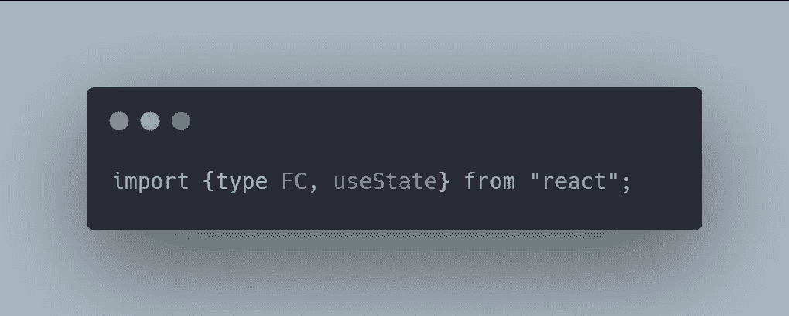

# TypeScript 4.5 中的所有新功能

> 原文：<https://javascript.plainenglish.io/everything-new-in-typescript-4-5-f57b0b3dc437?source=collection_archive---------9----------------------->

## 一个更好的 TypeScript 版本终于出现了

## 1.期待的类型和承诺的改进

在 **JavaScript 中，**开发者在使用内置方法时面临挑战，如 **promise.all** ，在 *TypeScript 4.5* 中，引入了新的**wait**类型，用于建模操作，如 **async** 函数中的**wait**。

> 此功能提供了以下功能:

*   递归展开。
*   解决类似**【the nables】**的承诺不需要类似的**承诺。**
*   **不承诺**不兑现**绝不兑现**。

## 2.nod_modules 的 Lib 支持

TypeScript 附带了一堆以 ***.d.ts*** 结尾的声明文件，这些文件用于**类型检查，**它们也代表了标准的**DOM API**和内置的**API**。

*   我们提供的*属性*，*方法* & *函数*取决于我们运行的 JavaScript 版本。因此，通过更改**目标**值来使用目标编译器设置，从而启用哪个**库**文件被加载。

*   在上面的设置中，你可以观察到 **es5** 的目标值，这意味着我们不能使用 **es6** 功能。
*   在通过改变目标值来装载哪些 **lib** 文件时，我们不得不面对处理对 TypeScript 的内置声明文件的更改的不利方面，这对于频繁变化的 DOM APIs 来说是一个挑战

> 在***TypeScript 4.5***中，我们有一种新的方法来处理内置的 **lib** 。

*   这是通过将我们的项目锁定到特定版本的**DOM API**来实现的。
*   我们要看一下 **node_modules** 中一个名为 **@typescript/lib** 的包。

*   通过将上述代码添加到我们的 **package.json** 文件中，我们可以轻松地锁定我们的项目版本的***DOM API*。**

## 3.条件类型的尾递归消除

TypeScript 附带了一个称为启发式的特性，该特性使它能够在编译具有无限递归的程序时失败。这些特性是防止堆栈溢出所必需的。

*   在以前的版本中，类型实例化深度限制是 **50** ，这意味着在 50 次迭代之后，程序将是非终止类型。
*   但是，在 4.5 版本中，实例化限制增加到了 **100** 。

## 4.导入名称的类型修饰符

在 TypeScript 中— **preserveValueImports** 防止 TypeScript 编译器在使用**类型**导入时移除有用的导入。TypeScript 需要一种方法来告诉编译器移除此类导入。

***例如:***

*   在以前版本的 TypeScript 中，导入相当混乱。

*   在这种情况下，*编译器*或*构建工具*没有办法丢弃 **FC** 并使用 **useState** 。
*   为了消除这种不确定性， **TS** 将类型导入标记为*。*

**

*   *但是在 **TypeScript 4.5** 中，我们已经得到了如下清晰的方法。*

**

## *5.模板字符串类型作为判别式*

*早期版本的 TypeScript 很难识别具有模板字符串类型的类型检查值。在***TypeScript 4.5***中，这个问题已经解决，现在 TypeScript 可以成功地使用*模板字符串类型*缩小值。*

## *6.导入断言*

*该功能与**正常导入**和**动态导入**一起工作，该功能使用户能够传递附加信息。此外，这个特性在指定模块类型时也很方便。*

## *7.新代码片段完成*

*   ***对于类中的方法:**当处理方法实现时，TypeScript 使用方法体的**完整签名**和**大括号**来完成方法名称。完成后，光标将直接跳转到方法体。*
*   ***对于 JSX 属性:**新版本的 *TypeScript* 改进了我们编写 JSX 属性的方式，增加了初始化器和智能光标。*

## *8.使用 realpathSync.native 加快加载速度*

*根据 documentation TypeScript，4.5 现在将在 Windows 机器上的某些代码库上加速项目加载 5–13%。这是由于 TypeScript 编译器现在在所有操作系统上都使用了 **Node.js** 中的***realpathsync . native***函数。*

> *注意:您可以查看 TypeScript 官方文档，了解 TypeScript 4.5 中引入的所有新特性，因为我只提到了必要的特性。*

* [## 2022 年 6 个最佳用户界面库

### 提升你的反应前端技能

javascript.plainenglish.io](/6-best-react-ui-libraries-in-2022-767989d2ee9e)  [## 6 自学成才的开发人员的 UI/UX 设计原则

### 提升你的自学程序员之旅。

javascript.plainenglish.io](/6-ui-ux-design-principles-for-self-taught-developers-c6326f6d9c0d)  [## JavaScript 中的 Object.freeze()与 Object.seal()

### 理解 JavaScript 中的不变性

javascript.plainenglish.io](/object-freeze-vs-object-seal-in-javascript-4f66f7d24754) 

*更多内容看* [***说白了. io***](http://plainenglish.io/) ***。*** *报名参加我们的* [***免费每周简讯点击这里***](http://newsletter.plainenglish.io/) ***。****