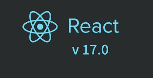

# React Native 0.64 中的所有新功能

> 原文：<https://javascript.plainenglish.io/everything-thats-new-in-react-native-0-64-hermes-on-ios-and-other-new-features-11a31d90ba0d?source=collection_archive---------4----------------------->

自 2020 年秋季 React 17 发布以来，开发者社区对 React Native 的下一版本寄予了很高的期望。React Native 0.64 于 2021 年 3 月大张旗鼓和猜测地发布。新版本包括几个令人兴奋的新功能，这将使整个社区受益，特别是一直热切期待 Hermes 在该平台上发布的 iOS 开发者。

在本指南中，我们将向您介绍 React Native 0.64 的新增功能，包括:

*   iOS 上的爱马仕
*   用 Chrome 追踪爱马仕
*   代理支持的 Hermes
*   默认情况下启用内联要求
*   反应 17
*   依赖性变化

# iOS 上的爱马仕

Hermes 是一个开源的 JavaScript 引擎，经过优化可以在多种平台上运行 React Native。爱马仕通过降低内存消耗、减少应用下载量和缩短应用可用时间(TTI)来提高应用性能。

Hermes 之前只作为可选功能提供给 Android。通过这次更新，Hermes 现在也可以在 iOS 上使用了。

随着 React 原生生态系统的发展，开发人员在大规模生产应用程序时遇到了挑战。仅举几个例子，大的包、电话内存的过度使用和交互时间的增加会导致糟糕的用户体验。

脸书的工程师设计了爱马仕作为这些问题的轻量级解决方案。然而，在 React Native 0.64 发布之前，iOS 开发人员努力保持相同的质量水平。

在 iOS 上包含 Hermes 有助于 React 原生应用程序性能更好，使它们更轻，并减少 iOS 平台上的交互时间。这将鼓励 React 本地社区进一步为爱马仕和整个平台的发展做出贡献。

# |将现有项目切换到 Hermes

在将现有项目切换到 Hermes 之前，请确保升级项目以使用 React Native 0.64。要在 iOS 上启用 Hermes，请在 pod 文件中将 hermes_enabled 设置为 true，然后运行 pod install。

值得注意的是，iOS 中对 Hermes 的支持还处于初级阶段。我们可以期待未来几天的进一步改进和支持。

# |使用 Chrome 查看爱马仕曲目

在过去的一年里，脸书赞助了大联盟黑客奖学金，并支持对 React Native 的贡献，包括使用 Chrome DevTools 中的 Performance 选项卡来可视化使用 Hermes 时 React Native 应用程序的性能。

虽然这个特性很有用，但它并不是全新的，因为你已经可以创建运行在 Hermes 上的 React 原生应用的配置文件。但是，通过运行这个新命令，您可以将 Hermes 跟踪配置文件转换为 Chrome 跟踪配置文件，并将其下载到本地机器:

了解如何在官方文档中包含爱马仕跟踪配置文件的更多信息。

# |支持代理的 Hermes

React Native 0.64 还提供了对 Hermes 的代理支持。这种支持提供了与 React Native Firebase 和 MobX 等流行社区项目的兼容性。如果您一直在使用这些包，现在您可以将您的项目迁移到 Hermes。

React 原生团队计划在未来的版本中让 Hermes 成为 Android 的默认 JavaScript 引擎。如果您在 React 原生项目中使用 Hermes 时遇到问题，您应该报告它。

# 默认情况下启用|内联要求

Inline Require 是一个 Metro 配置选项，可以通过延迟 JavaScript 模块的执行直到它们被使用来帮助加速应用程序的启动。传统上，JavaScript 模块在启动时开始执行。

这项功能作为一个选择加入的配置选项已经存在了几年，但 React Native 0.64 在默认情况下启用了该选项，以帮助您在无需额外配置的情况下构建快速的移动应用程序。

内联需要一个巴别塔转换。它接受模块导入并将其转换为内联。

让我们看一个例子，在这个例子中，内联要求将一个模块导入调用从文件的顶部转换到使用它的地方。

# |反应 17

React 17 不包含任何面向开发者的新功能或突破性变化。官方博客文章指出，React 17 是一个“垫脚石”版本，旨在更安全地将一个版本 React 管理的树嵌入到另一个版本管理的树中。它还使得将 React 集成到用其他框架构建的应用程序中变得更加容易。

此外，新的 JSX 转换确保不再需要导入 React 来使用 JSX。这是一个选择加入的功能，React 团队指出，它计划继续为经典的 JSX 转换提供支持。

# |依赖性变化

React Native 已经放弃了对 Android API 级别 16–20 的支持。既然脸书的应用程序已经放弃了对这些安卓版本的支持，React Native 也会紧随其后

*   现在需要 Xcode 12 和 CocoaPods 1.10
*   最低 Node.js 支持从版本 10 增加到版本 12
*   鳍状肢已经升级到 0.75.1

# 结论

由于全球 100 多名贡献者的努力，React Native 0.64 现已上线。这个新版本有利于并支持整个 React 原生社区。有了社区在发现 bug 方面的帮助，我们可以期待未来版本中的进一步改进。

想知道如何构建一个基于 React 语言的应用程序？印度有成千上万的 React 开发公司可以根据你的需求帮助你构建软件解决方案。

*更多内容尽在*[***plain English . io***](http://plainenglish.io/)