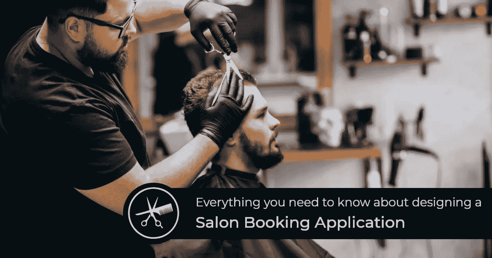
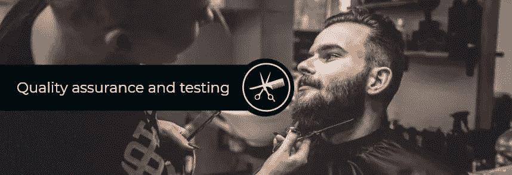

# 设计沙龙预订应用程序需要知道的一切

> 原文：<https://javascript.plainenglish.io/everything-you-need-to-know-about-designing-a-salon-booking-application-210447da6b35?source=collection_archive---------8----------------------->

## 开始设计沙龙预订应用程序之前要知道的事情。

Photo by: Milan On:Self create

我们都需要每月一次的美容，但是在沙龙里等上几个小时有多不方便呢？我们都至少有过一次在美容院排长队等待的经历，我们多么希望能马上得到服务。随着沙龙预约应用的推出，数百万人的愿望得以实现。你听说过沙龙预约 app 吗？你以前用过吗？如果没有，现在是你使用它的时候了，感谢这项技术让你的生活比以前更加简单。

沙龙预订应用程序简化了数百万用户的常规预订。使用沙龙应用程序，用户可以在线预订沙龙服务，预订时间段，告别在沙龙等待几个小时。

创造和设计一个 [***沙龙预约申请***](https://kodytechnolab.com/salon-appointment-booking-solution) 需要投入很多，因为成功不是一夜之间就能到来的。在线预约应用程序允许用户在沙龙预约，节省时间和精力。沙龙预订应用程序对顾客和沙龙所有者都有利。虽然顾客可以随时在线预约，但美容院老板可以管理和安排顾客的预约。

许多成功的沙龙应用程序正在制造行业内的所有噪音，其中一个受欢迎的沙龙预订解决方案是 Fresha。Fresha 是一个简单、灵活、功能强大的预订软件，它最近彻底改变了沙龙业务，并成为许多沙龙业务所有者的灵感来源。

这篇文章将告诉你开发一个像 Fresha 这样的应用程序，并通过在线预约和预订将沙龙业务数字化所需知道的一切。

# 如何从一个坚实的想法中开发出一个成功的沙龙预订解决方案？

# 研究和规划

扎实的研究导致扎实的计划。首先，企业主应该考虑客户面临的问题。一旦企业主解决了问题，进一步的研究是可能的。企业主应该想出解决问题的方法，并立即开始计划。

规划包括思考开发应用程序的目的。打破常规，让你的应用脱颖而出。了解像 Fresha 这样的沙龙预订应用程序的商业模式也将有助于更好地规划和分析它在未来的表现。

在计划沙龙应用程序开发时，请考虑以下几点-

*   应用程序的范围
*   目标客户
*   顾客的目标年龄组
*   现有竞争对手应用的缺陷
*   客户对应用程序的期望

Photo by: Milan On:Self create

# 应用程序的线框

在产品开发中，一个人怎能忽视线框的重要性？ 线框化提供了一种用正确的流程和策略开发应用的方法。它有助于决定在开发中什么先来，什么后来。创建线框有助于在开始视觉设计之前确定布局。线框化基本上为应用程序开发创造了一条坚实的道路，因此，这是一个关键的步骤。

你雇佣的应用程序开发人员应该能够设计一个线框，让你明白开发将如何进行。这将有助于您更好地理解应用程序开发。

# 选择平台

一个人不能在选择开发沙龙预订应用程序的正确平台上妥协。这一步需要非常小心，因为从长远来看，平台选择将影响应用程序的整体性能。

app 开发的平台选择有两个很棒的选择——Android 和 iOS。这两个平台都是众所周知的，并且有几个好处。然而，选择混合平台是明智的，因为它将比其他两个平台具有更大的影响力。然而，如果你仍然不能决定合适的平台，一个专业的移动应用程序开发人员一定会帮助你选择最好的。

# 应用程序设计和开发

现在是按需应用开发的核心。你可能想知道 [**为什么一个好的设计是项目的终极目标**](https://kodytechnolab.com/blog/focus-on-good-app-design/) **，**，我们会告诉你为什么。当你开发一个应用程序时，它的设计会像磁铁一样吸引顾客。一个设计应该是两件事——吸引人和简单。一个设计简单的应用程序将很容易被任何年龄的用户导航和使用。

为了顺利进行应用程序开发，从值得信赖的移动应用程序开发公司雇佣熟练的移动应用程序开发人员来开发一个高质量和成功的应用程序。当设计和开发阶段进展顺利时，企业所有者和开发人员都松了一口气。

Photo by: Milan On:Self create

# 质量保证和测试

没有这一步就无法启动应用程序。在开发沙龙预约解决方案时，您必须了解 [**质量保证在产品开发中的作用**](https://kodytechnolab.com/blog/role-of-quality-assurance/) 。在这一步，Q & A 施展魔法，仔细查看应用程序的错误和缺陷。然后，该团队在最终部署应用程序之前纠正所有错误，以确保其质量达标。

在质量保证之后，开发团队将应用程序作为最终产品移交给客户。然后，用户就可以启动和使用该应用程序了。

Photo by: Milan On:Self create

# 让我们来消除你对沙龙预订应用程序开发成本的一些疑虑

我们希望你已经了解开发流程，以开发一个像 Fresha 的应用程序；然而，我们知道你心中仍有一个关键问题，那就是应用程序开发的成本。你不能马上估算出成本，因为成本的变化是由许多因素造成的。最重要的是，开发成本因项目而异。

成本根据项目要求和市场需求而变化。除了这两个因素，影响应用程序开发总成本的其他因素还有-

*   定制功能和附加组件
*   技术栈
*   第三方插件
*   平台选择
*   开发人员的时薪
*   开发人员的经验
*   用户界面/UX 设计
*   发展中的复杂性

如果你想雇佣有经验的移动应用开发者，从印度雇佣应用开发者比在其他国家花费更少。您可以与我们的专业开发人员交流，开发一款功能强大、方法灵活的沙龙预订应用。我们经验丰富的开发人员根据您的需求收取大约 2 万到 5 万美元的费用。

如需了解更多相关细节，您可以与我们的团队交流，我们将为您提供最佳解决方案。

# 结论

开发一个沙龙预约 app 是一件很繁琐的工作，但是所有的努力都是值得的。如果你有一个很好的想法，但对此持怀疑态度，现在是时候打破怀疑的泡沫，继续开发一个成功的沙龙预约应用程序。如上所述，您可以从我们著名的团队中 [**雇佣按需应用程序开发人员**](https://kodytechnolab.com/hire-mobile-app-developers) ，我们将帮助您一步一步地将您的应用程序创意转化为成功的应用程序。

*更多内容看* [*说白了。报名参加我们的*](http://plainenglish.io/) [*免费周报*](http://newsletter.plainenglish.io/) *。在我们的* [*社区*](https://discord.gg/GtDtUAvyhW) *获得独家写作机会和建议。*