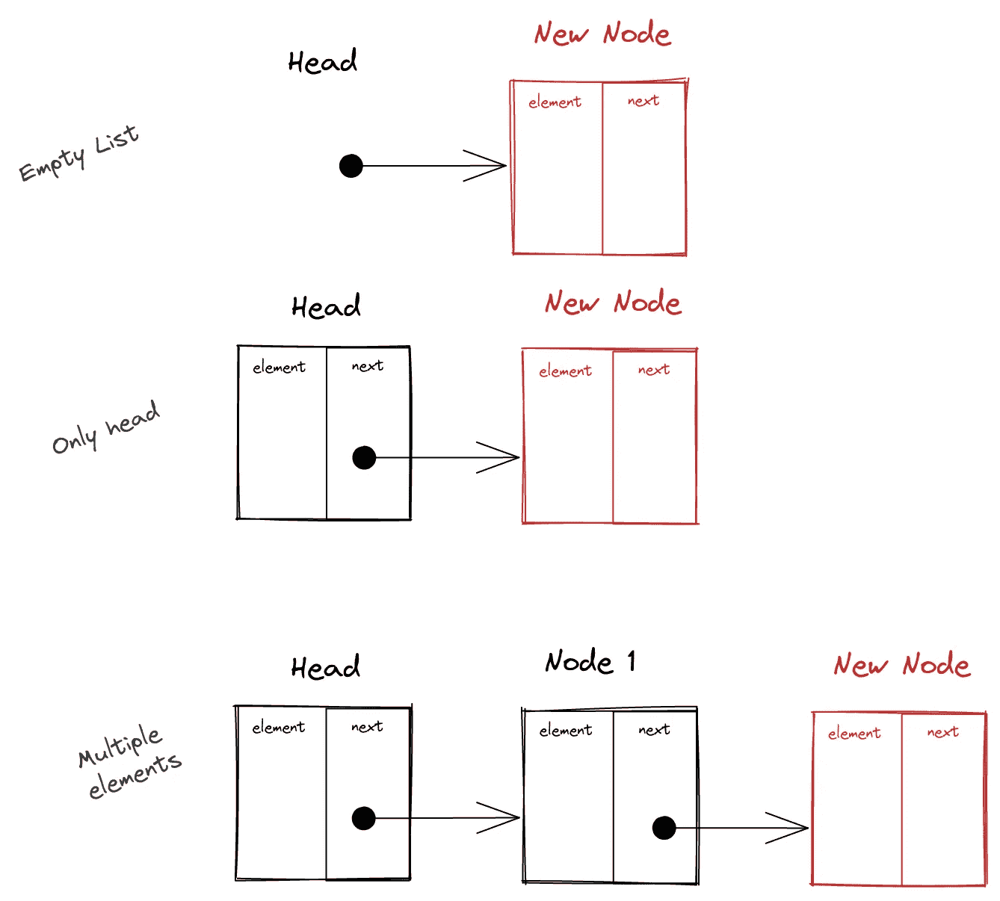
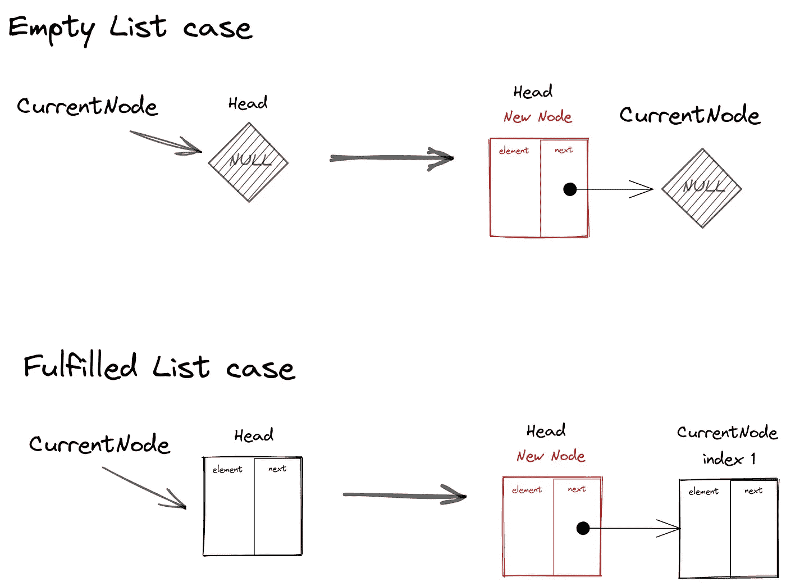
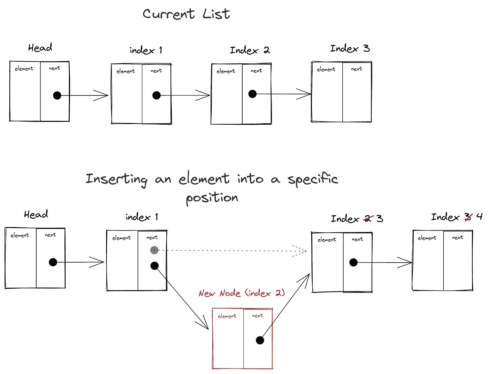
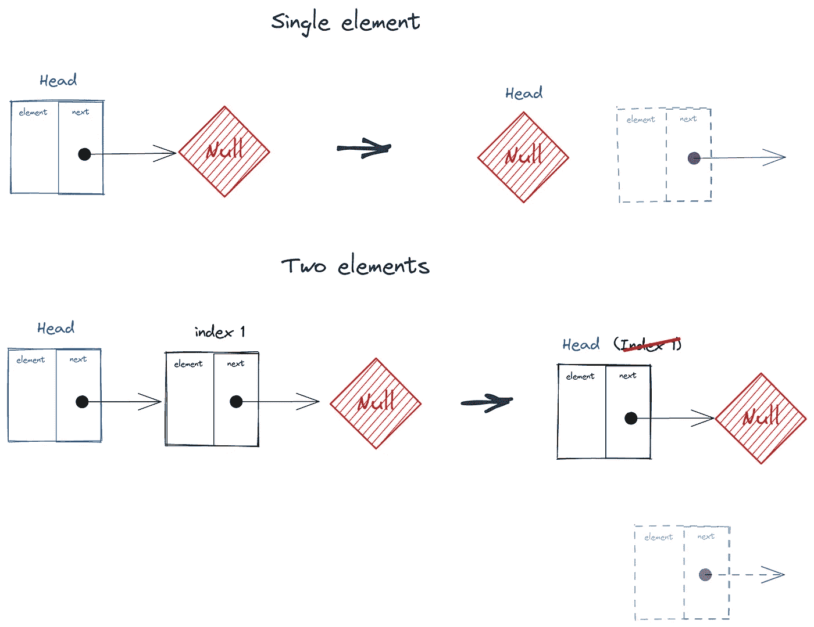
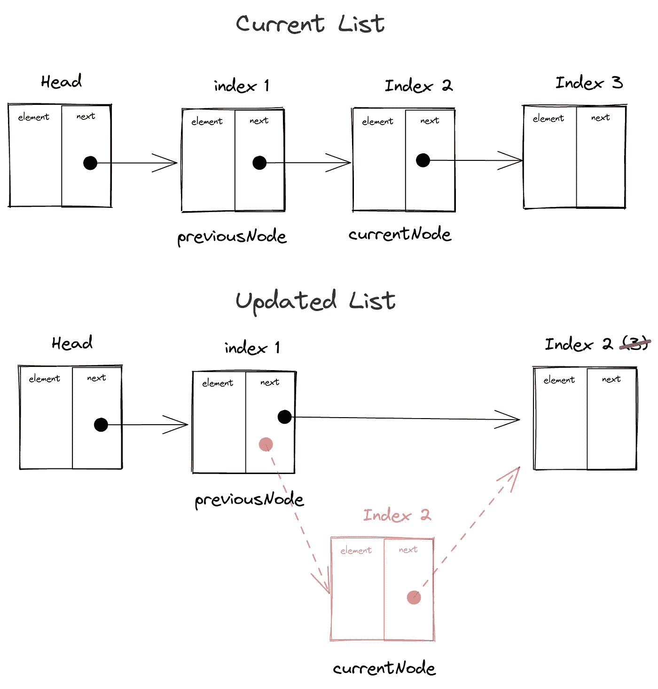

# 关于链表你需要知道的一切:JavaScript 的数据结构

> 原文：<https://javascript.plainenglish.io/everything-you-need-to-know-about-linked-lists-data-structure-with-javascript-4aee994965b0?source=collection_archive---------17----------------------->

## 什么是链表，如何用 JavaScript 实现一个基本的链表？


Photo by [Tomas Anton Escobar](https://unsplash.com/@tomasjolmes) at [Unsplash](https://unsplash.com)

> 他的帖子最初发表在:
> [**https://raulmelo . dev/blog/data-structure-with-JavaScript-linked-list**](https://raulmelo.dev/blog/data-structure-with-javascript-linked-list)

你好，德夫斯。

今天，我想深入一个非常具体的数据结构，来保存一个叫做链表的集合。

首先，我将简要解释数组问题以及链表是如何解决这些问题的，然后我们将讨论如何用 JavaScript 实现它。

我已经可以说，作为一个 JavaScript 开发人员，我没有看到大的用例，因为我们有一个相当不错的本地处理集合的方法。然而，作为一名软件工程师，我认为对它有一个基本的了解是非常重要的，以备将来需要。

请记住:

> 知识就是力量，永远不会无用。

# 关于列表

数组是存储数据集合最有效的方式之一，比如 Instagram 上的朋友列表。

在 JavaScript 中，当我们想要创建一个列表时，我们所需要的只是一个非常简单的开/闭方括号(`[]`)并把你想要的元素推送到里面。

然而，在其他一些语言中，尤其是那些关注性能的语言中，方法是不同的。在那里，如果你需要一个列表，你必须指定你的列表的大小，这有时是一个问题，因为我们经常处理动态数据。

这种方法是有意义的。如果你只有很少的内存，并且需要写一些代码来编译一种非常低级的机器语言(比如二进制)，例如，如果你说你的列表将只有 3 个元素，编译器可以说:

> 嘿，这个列表只能分配几个字节，因为我们事先知道它最多只包含 3 个元素。

此外，如果您想在某个特定位置插入或删除元素，您需要完全移动列表，这些操作可能会很繁琐且代价高昂。

在 JavaScript 中，我们对此没有太大的困扰，因为语言就是以这种方式设计的，而且我们也有原生数组方法(我认为是非常优化的)，可以删除或添加元素并重新生成列表，就像方法`[Array.prototype.splice()](https://developer.mozilla.org/en-US/docs/Web/JavaScript/Reference/Global_Objects/Array/splice)`。

```
const months = ['Jan', 'March', 'April', 'June'];// insert exactly in the index one (1, 0) the string `Feb`
months.splice(1, 0, 'Feb');console.log(months); // Array ["Jan", "Feb", "March", "April", "June"]// removes everything from the index 3 til the last el ("April" and "June")
months.splice(3, months.length)console.log(months); // ["Jan", "Feb", "March"]
```

# 链表:概念

链表实现试图解决我们可以在一个列表中存储的元素的最大数量，以及如何通过将使用的数据结构从数组改为简单的链接对象(节点)来轻松地浏览列表。

每个节点都有两个属性:

*   `element`:我们希望存储在列表中的数据；
*   `next`:到另一个节点的链接或空值(不存在的下一个节点)。

也许最好的视觉化方法是想象一列火车。

在一列火车上，我们总是有一个“头”，从那里它连接到第一辆“货车”，然后第二辆“货车”连接到第一辆，直到火车的尾部。

例如，如果我们想要移除一个有缺陷的货车，我们需要做的就是找到这个货车，将前一个货车链接到下一个货车，然后就完成了。

当我们想要添加新的“旅行车”时，原理是相同的。我们所需要的是找到我们想要添加它的地方，将前面和后面的货车连接到新的货车上。

换句话说，链表就是创建和修改节点之间的连接。

在下一节中，我们将一步一步地实现所有这些添加和删除，您会发现这是一个相对简单的概念。

# 链表:实现

在任何实现之前，让我们看一下这种列表需要的 API:

*   `.append(element)` -用于向列表末尾追加新元素的方法；
*   `.indexOf(element)` -用于知道我们的元素被添加到索引中的什么位置的方法；
*   `.insertAt(position, element)` -用于在特定位置添加元素的方法；
*   `.remove(element)` -用于从列表中删除元素的方法；
*   `.removeAt(position)` -用于移除某个特定位置的元素的方法；
*   `.toString()` -用于概览我们的列表的方法。

再一次，代替使用 JS 类/原型，我将使用我最喜欢的模式工厂，已经为我们的 API 准备了一些占位符:

```
function LinkedListFactory() {
  return {
    append,
    indexOf,
    insertAt,
    remove,
    removeAt,
    toString,
  }; function append(element) {} function indexOf(element) {} function insertAt(position, element) {} function remove(element) {} function removeAt(position) {} function toString() {}
}
```

# “全局”变量

在实现这些方法之前，我们需要创建两个几乎在所有方法中都要用到的变量:

*   `head` -变量保存我们的第一个元素，一切都将从这里开始。它将从值`null`开始；
*   `length` -一个容易保持列表大小的控制变量。它将以值`0`开始。

```
function LinkedListFactory() {
  let head = null;
  let length = 0; return {
    append,
    indexOf,
    insertAt,
    remove,
    removeAt,
    toString,
  }; function append(element) {} function indexOf(element) {} function insertAt(position, element) {} function remove(element) {} function removeAt(position) {} function toString() {}
}
```

# 。追加(元素)

在`append`方法中，我们首先需要创建一个我们称之为“节点”的内部基本结构。

一个节点是一个简单的对象，它将保存我们添加到列表中的元素和下一个元素(链接本身)。

由于 append 总是将一个元素添加到列表的末尾，`next`将总是`null`:

```
function append(element) {
  const node = {
    element,
    next: null
  }
}
```

第一种情况是当我们的列表为空时，或者当`head`为`null`时。在这种情况下，我们将把新创建的节点分配给头部:

```
function append(element) {
  const node = {
    element,
    next: null,
  }; if (head === null) {
    head = node;
  }
}
```

现在，我们必须考虑其他情况(如果不是头或倒数第二个节点的情况)。

因为我们想在列表末尾添加一个元素，所以我们必须遍历所有节点，直到`.next`等于`null`。

```
function append(element) {
  const node = {
    element,
    next: null,
  }; if (head === null) {
    head = node;
  } else {
    let currentNode = head; while (currentNode.next !== null) {
      currentNode = currentNode.next;
    }
  }
}
```

既然我们遇到了最后一个元素，我们需要做的就是将这个元素的`.next`属性链接到我们新创建的节点:

```
function append(element) {
  const node = {
    element,
    next: null,
  }; if (head === null) {
    head = node;
  } else {
    let currentNode = head; while (currentNode.next !== null) {
      currentNode = currentNode.next;
    } currentNode.next = node;
  }
}
```

最后，对于这两种情况(有没有头)，我们都需要将列表大小增加 1(`length`)，所以在条件之外是很重要的

```
function append(element) {
  const node = {
    element,
    next: null,
  }; if (head === null) {
    head = node;
  } else {
    let currentNode = head; while (currentNode.next !== null) {
      currentNode = currentNode.next;
    } currentNode.next = node;
  } length++;
}
```



# 。元素索引

这个方法的目的是找到给定元素在列表中的位置。

首先，我们需要两个控制器变量:`nodeIndex`和`currentElement`。第一个将被用作返回值，也是为了知道我们在迭代中的位置，第二个用于比较元素是否是我们正在寻找的元素:

```
function indexOf(element) {
  let nodeIndex = 0;
  let currentNode = head;
}
```

还记得我跟你说过`head`可能是`null`或者最后一个节点的`.next`会是`null`吗？我们将使用这个条件来遍历所有节点。

```
function indexOf(element) {
  let nodeIndex = 0;
  let currentNode = head; while (currentNode) {
    if (element === currentNode.element) {
      return nodeIndex;
    } nodeIndex++; currentNode = currentNode.next;
  }
}
```

现在，直到`currentNode`不是`null`，我们将首先检查元素是否是我们正在寻找的元素。如果是，我们可以直接返回`nodeIndex`的值。

如果不是，那么我们需要将 1 增加到`nodeIndex`并将`currentNode`分配给`currentNode.next`，或者换句话说，简单地移动到下一个节点，再次运行比较。

最后，如果我们找不到用户正在寻找的元素，我们必须给出一个我们找不到的指示。

传统上，对于这样的情况，这些方法返回`-1`，但是没有什么可以阻止我们返回其他值，例如`null`:

```
function indexOf(element) {
  let nodeIndex = 0;
  let currentNode = head; while (currentNode) {
    if (element === currentNode.element) {
      return nodeIndex;
    } nodeIndex++; currentNode = currentNode.next;
  } return -1
}
```

# 。insertAt(位置，元素)

在这个操作中，我们将做一个与`indexOf`(控制索引)相似的操作，另外我们必须调整节点连接。

想象以下场景:我们的列表中有 4 个链接的节点，我们想在位置 2(第二个位置，因为它是基于 0 的索引)插入一个新元素。

我们基本上需要:

1.  遍历节点；
2.  找出谁在位置 2；
3.  让这个节点`.next`指向我们正在插入的元素
4.  让我们的新节点`.next`指向我们刚刚找到的元素`.next`

这可能看起来有点混乱，但是我将一步一步地引导您实现它。

我们需要做的第一个验证是用户请求添加的职位是否存在于我们的列表中。如果我们的列表中只有 1 个元素，我们需要确保如果我们不在位置 4 添加元素:

```
function insertAt(position, element) {
  const isPositionInTheRange = position > -1 && position <= length;

  if(!isPositionInTheRange){
    return false
  }
}
```

> *提示:保存此逻辑的变量只是描述(英语中)条件的一种语义方式。*

像在其他方法中一样，我们将需要迭代我们的列表，看看我们需要在哪里添加这个元素。这意味着我们需要创建一个控制器变量和我们的节点:

```
function insertAt(position, element) {
  const isPositionInTheRange = position > -1 && position <= length;

  if(!isPositionInTheRange){
    return false
  }

  // Our brand new node
  const node = {
    element,
    next: null
  }

  // Controller to iterate over the list
  let currentNode = head;
}
```

我们这里的第一个例子是用户想在第一个位置(head)添加一个元素。我们所要做的就是说新节点`.next`将是当前元素，而头部现在将是新节点:

```
function insertAt(position, element) {
  const isPositionInTheRange = position > -1 && position <= length; if (!isPositionInTheRange) {
    return false;
  } const node = {
    element,
    next: null,
  }; let currentNode = head; const isHeadPosition = position === 0; if (isHeadPosition) {
    // Assign currentNode (head) to `node.next`
    node.next = currentNode;
    // Replace the current head with this node
    head = node;
  } else {
  }
}
```



现在我们需要处理位置在头部之后的情况。

首先，我们需要两个控制器变量，`index`(基于此进行迭代)和`previousNode`(找到位置后重新创建链接):

```
function insertAt(position, element) {
  const isPositionInTheRange = position > -1 && position <= length; if (!isPositionInTheRange) {
    return false;
  } const node = {
    element,
    next: null,
  }; let currentNode = head; const isHeadPosition = position === 0; if (isHeadPosition) {    
    node.next = currentNode;
    head = node;
  } else {
    let previousNode = null;
    let index = 0;
  }
}
```

然后，我们将使用`index`进行迭代。当指数小于期望位置时，我们将更新我们的控制器`previousNode`和`currentNode`:

```
function insertAt(position, element) {
  const isPositionInTheRange = position > -1 && position <= length; if (!isPositionInTheRange) {
    return false;
  } const node = {
    element,
    next: null,
  }; let currentNode = head; const isHeadPosition = position === 0; if (isHeadPosition) {    
    node.next = currentNode;
    head = node;
  } else {
    let previousNode = null;
    let index = 0;

    while (index++ < position){
      previousNode = currentNode;
      currentNode = currentNode.next;
    }
  }
}
```

> *记住:index++将首先计算数字，然后只加 1。*

这一步只需要遍历我们的列表，直到位置与我们想要更改的位置相匹配。

当我们达到这一点时，我们需要做的就是重新做好`previousNode`<->-`new node`->-`currentNode`之间的联系:

```
function insertAt(position, element) {
  const isPositionInTheRange = position > -1 && position <= length; if (!isPositionInTheRange) {
    return false;
  } const node = {
    element,
    next: null,
  }; let currentNode = head; const isHeadPosition = position === 0; if (isHeadPosition) {    
    node.next = currentNode;
    head = node;
  } else {
    let previousNode = null;
    let index = 0;

    while (index++ < position){
      previousNode = currentNode;
      currentNode = currentNode.next;
    }

    previousNode.next = node;
    node.next = currentNode;
  }
}
```



最后，我们需要将`+1`添加到我们的列表长度中，不管它被插入到列表中的什么位置，并返回`true`来通知用户操作成功:

```
function insertAt(position, element) {
  const isPositionInTheRange = position > -1 && position <= length; if (!isPositionInTheRange) {
    return false;
  } const node = {
    element,
    next: null,
  }; let currentNode = head; const isHeadPosition = position === 0; if (isHeadPosition) {    
    node.next = currentNode;
    head = node;
  } else {
    let previousNode = null;
    let index = 0;

    while (index++ < position){
      previousNode = currentNode;
      currentNode = currentNode.next;
    }

    previousNode.next = node;
    node.next = currentNode;
  }

  length++;
  return true;
}
```

# 。移除(位置)

removeAt 方法的实现与我们刚刚在`insertAt`中看到的非常相似，我们需要:

1.  遍历列表；
2.  在那个位置找到对应的元素；
3.  将前一个元素连接到下一个元素；
4.  减小列表大小

再次开始，让我们首先验证请求位置是否包含元素:

```
function removeAt(position){
  const isPositionInTheRange = position > -1 && position < length;

  if(!isPositionInTheRange){
    return null
  }
}
```

然后，我们需要创建控制器变量`currentNode`来迭代:

```
function removeAt(position){
  const isPositionInTheRange = position > -1 && position < length;

  if(!isPositionInTheRange){
    return null
  }

  let currentNode = head;
}
```

同样，我们会有两种情况:头或不头。如果是 head，我们需要做的就是将`head`重新分配为当前节点(在本例中是 head 元素本身)的`.next`值:

```
function removeAt(position){
  const isPositionInTheRange = position > -1 && position < length;

  if(!isPositionInTheRange){
    return null
  }

  let currentNode = head;

  if(position === 0){
    head = currentNode.next;
  }
}
```



> *如果你不知道，只要从这个元素中删除所有引用，* [*垃圾收集器*](https://developer.mozilla.org/en-US/docs/Web/JavaScript/Memory_Management#garbage_collection) *就会知道不再需要它，并从内存中删除它。*

现在，我们需要删除不是头部的元素。为此，让我们创建另外两个控制器变量，`index`和`previousNode`:

```
function removeAt(position){
  const isPositionInTheRange = position > -1 && position < length;

  if(!isPositionInTheRange){
    return null
  }

  let currentNode = head;

  if(position === 0){
    head = currentNode.next;
  } else {
    let index = 0;
    let previousNode = null;
  }
}
```

再一次，迭代所有的元素，直到我们到达我们想要的位置:

```
function removeAt(position){
  const isPositionInTheRange = position > -1 && position < length;

  if(!isPositionInTheRange){
    return null
  }

  let currentNode = head;

  if(position === 0){
    head = currentNode.next;
  } else {
    let index = 0;
    let previousNode = null;

    while(index++ < position){
      previousNode = currentNode;
      currentNode = currentNode.next
    }
  }
}
```

现在，我们通过将`previousNode.next`链接到`currentNode.next`来重新创建节点链接:

```
function removeAt(position){
  const isPositionInTheRange = position > -1 && position < length;

  if(!isPositionInTheRange){
    return null
  }

  let currentNode = head;

  if(position === 0){
    head = currentNode.next;
  } else {
    let index = 0;
    let previousNode = null;

    while(index++ < position){
      previousNode = currentNode;
      currentNode = currentNode.next
    }

    previousNode.next = currentNode.next;

  }
}
```



最后，我们需要从列表长度中减去 1，并返回我们要删除的元素，这样用户就可以对它做一些事情:

```
function removeAt(position){
  const isPositionInTheRange = position > -1 && position < length;

  if(!isPositionInTheRange){
    return null
  }

  let currentNode = head;

  if(position === 0){
    head = currentNode.next;
  } else {
    let index = 0;
    let previousNode = null;

    while(index++ < position){
      previousNode = currentNode;
      currentNode = currentNode.next
    }

    previousNode.next = currentNode.next;
  }

  length--;
  return currentNode.element;
}
```

# 。移除(元素)

这个方法实现起来非常简单。这是因为我们已经有了一个从元素中查找索引的方法(`indexOf`)和一个从位置中移除元素的方法(`removeAt`):

```
function remove(element){
  const elementIndex = indexOf(element);
  return removeAt(elementIndex);
}
```

# 。toString()

这个方法纯粹是给使用这个链表的人一个列表中所有元素的概念。

我们需要再次浏览所有节点，并将元素值连接成一个字符串:

```
function toString() {
  let result = "";
  let current = head; while (current) {
    result += `${current.element}${current.next ? ", " : ""}`;
    current = current.next;
  } return result;
}
```

> *Obs。:这只适用于原始值。如果要支持的元素有*`*objects*`*`*functions*`*等。您需要增强连接和数据解析。**

# *决赛成绩*

```
*function LinkedListFactory() {
  let head = null;
  let length = 0; return {
    append,
    indexOf,
    insertAt,
    remove,
    removeAt,
    toString,
  }; function append(element) {
    const node = {
      element,
      next: null,
    }; if (head === null) {
      head = node
    } else {
      let currentNode = head; while (currentNode.next !== null) {
        currentNode = currentNode.next;
      } currentNode.next = node;
    } length++;
  } function indexOf(element) {
    let nodeIndex = 0;
    let currentNode = head; while (currentNode) {
      if (element === currentNode.element) {
        return nodeIndex;
      } nodeIndex++; currentNode = currentNode.next;
    } return -1;
  } function insertAt(position, element) {
    const isPositionInTheRange = position > -1 && position <= length; if (!isPositionInTheRange) {
      return false;
    } const node = {
      element,
      next: null,
    }; let currentNode = head; const isHeadPosition = position === 0; if (isHeadPosition) {
      node.next = currentNode;
      head = node;
    } else {
      let previousNode = null;
      let index = 0; while (index++ < position) {
        previousNode = currentNode;
        currentNode = currentNode.next;
      } previousNode.next = node;
      node.next = currentNode;
    } length++;
    return true;
  } function removeAt(position) {
    const isPositionInTheRange = position > -1 && position < length; if (!isPositionInTheRange) {
      return null;
    } let currentNode = head; if (position === 0) {
      head = currentNode.next;
    } else {
      let index = 0;
      let previousNode = null; while (index++ < position) {
        previousNode = currentNode;
        currentNode = currentNode.next;
      } previousNode.next = currentNode.next;
    } length--;
    return currentNode;
  } function removeAt(position) {
    const isPositionInTheRange = position > -1 && position < length; if (!isPositionInTheRange) {
      return null;
    } let currentNode = head; if (position === 0) {
      head = currentNode.next;
    } else {
      let index = 0;
      let previousNode = null; while (index++ < position) {
        previousNode = currentNode;
        currentNode = currentNode.next;
      } previousNode.next = currentNode.next;
    } length--;
    return currentNode.element;
  } function remove(element) {
    const elementIndex = indexOf(element);
    return removeAt(elementIndex);
  } function toString() {
    let result = "";
    let current = head; while (current) {
      result += `${current.element}${current.next ? ", " : ""}`;
      current = current.next;
    } return result;
  }
}const linkedList = LinkedListFactory();linkedList.append(1);
linkedList.append(10);
linkedList.append(-1);
linkedList.append(40);
linkedList.append(-123);console.log(linkedList.toString()); // 1, 10, -1, 40, -123console.log(linkedList.removeAt(3)); // 40console.log(linkedList.toString()); // 1, 10, -1, -123console.log(linkedList.indexOf(1)); // 0console.log(linkedList.remove(1)); // 1console.log(linkedList.toString()); // 10, -1, -123*
```

# *结论*

*我希望我能向你解释什么是链表，以及如何简单地实现它。*

*它还有两种变体:“双重链接”(下一个和上一个链接)和循环，但我认为在另一篇文章中会更好。*

*同样，因为我们处于 JavaScript 环境中，我没有看到它的强大用法，但知道它的存在是很重要的，以防我们在其他语言中接触到它。*

*如果你对此有任何意见，请发微博给我，这样我们可以一起积累知识！*

*干杯。*

# *参考*

*   *[https://developer . Mozilla . org/en-US/docs/Web/JavaScript/Memory _ Management](https://developer.mozilla.org/en-US/docs/Web/JavaScript/Memory_Management)*
*   *[https://www . geeks forgeeks . org/applications-of-linked-list-data-structure](https://www.geeksforgeeks.org/applications-of-linked-list-data-structure)*
*   *[https://developer . Mozilla . org/en-US/docs/Web/JavaScript/Reference/Global _ Objects/Array](https://developer.mozilla.org/en-US/docs/Web/JavaScript/Reference/Global_Objects/Array)*
*   *https://en.wikipedia.org/wiki/Linked_list*

*JavaScript 数据结构*

*   *[栈](https://raulmelo-dev-nn9485d2s-raulfdm.vercel.app/blog/data-structure-in-javascript-stack)*
*   *[队列](https://raulmelo-dev-nn9485d2s-raulfdm.vercel.app/blog/data-structure-with-javascript-queue)*
*   *[链表](https://raulmelo-dev-nn9485d2s-raulfdm.vercel.app/blog/data-structure-with-javascript-linked-list)*

*3 部分系列*

*标签*

*   *[#计算机科学](https://raulmelo-dev-nn9485d2s-raulfdm.vercel.app/tag/computer-science)*
*   *[#数据结构](https://raulmelo-dev-nn9485d2s-raulfdm.vercel.app/tag/data-structure)*

**更多内容看* [***说白了. io***](http://plainenglish.io/)*