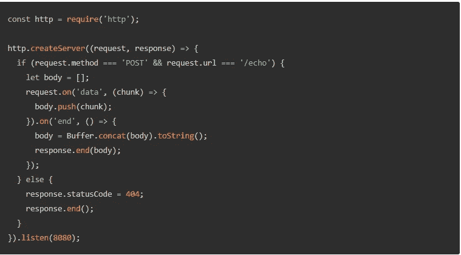
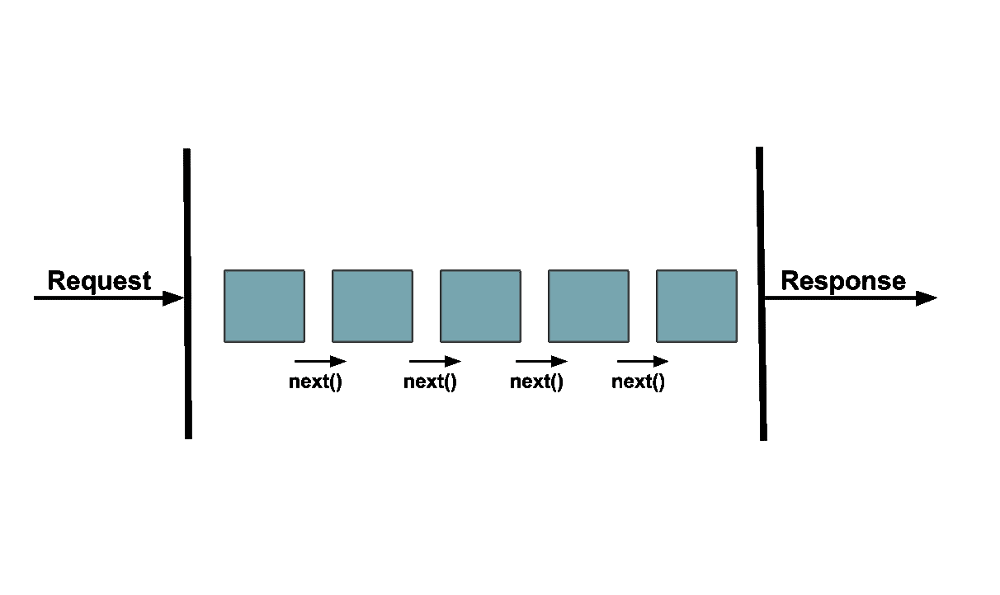

# 关于 Express 中的中间件，您需要了解的一切

> 原文：<https://javascript.plainenglish.io/everything-you-need-to-know-about-middleware-in-express-e9d57ec3f578?source=collection_archive---------16----------------------->

理解什么是中间件以及为什么需要它

Photo by [Pakatan Goh](https://unsplash.com/@pakata?utm_source=medium&utm_medium=referral) on [Unsplash](https://unsplash.com?utm_source=medium&utm_medium=referral)

如果你想成为 node.js 和 express 的大师，理解 express 中中间件的基础知识是至关重要的。不学习什么是中间件，你就阻碍了你成为一名流利的 Node.js 和 Express 开发人员的旅程。

# 了解 Node.js 如何处理请求

为了理解 express 中的中间件，我们必须首先理解 vanilla Node.js 如何处理对服务器的请求。

在 node.js 中，对服务器的请求由一个处理所有对服务器的请求的函数来处理。请看下面摘自 node.js 网站的代码:

虽然这段代码可能看起来不多，但这只是为了处理两个请求*。*一个用于 URL“echo”的 post 方法，另一个用于处理 404 错误。

现在想象一下，如果我们有 5 个、10 个甚至 100 个网址要处理呢？

您能想象在一个函数中处理所有这些请求会让我们的代码变得多么臃肿和混乱吗？

这就是 express 中间件的用武之地。

# Express 中的中间件是什么？

简而言之，Express 中的中间件是由一系列函数组成的堆栈。

暂时把技术术语放在一边。express 中的中间件到底是什么*？*

*express 中的中间件是我们将 vanilla node.js 中的一个请求处理函数分解成多个按顺序发生的处理函数的一种方式。这使得我们可以编写更简洁的代码，因为我们可以根据功能将代码分成不同的函数。*

*例如，您可以让一个中间件函数处理对 URL“ECHO”的 POST 请求，让另一个中间件函数处理对同一个 URL“ECHO”的所有 GET 请求。*

*中间件功能不仅限于处理 HTTP 请求，还可以处理大量其他用例。*

*例如，您可以创建一个记录所有请求的中间件函数和另一个为每个请求设置 HTTP 头的函数。但是，要真正理解中间件，还需要一个更重要的概念。*下一个()的概念**

# *Express 中间件的下一步*

*在标准的 Express URL 处理程序中，有两个回调参数 req 和 response(在大多数教程中通常称为 res 和 req)。*

*在 express 中间件处理程序中，有第三个回调参数。*

**next()* 参数告诉 express 移动到堆栈中的下一个函数。如果不放置 *next()* express 将会卡在堆栈中的第一个函数上，导致服务器出错。*

*如果这对你来说仍然有点困惑，不要担心。在下一节中，我们实际上将向 express 服务器添加中间件。*

**

*Diagram of how MIddleware in express works. The blue boxes represent middleware handler functions*

# *在 Express 中添加中间件*

*为了展示如何在 express 中使用中间件，我将使用我在文章[如何使用 Express](/how-to-create-a-server-in-node-js-using-express-997579e7f075) 在 Node.js 中创建服务器中写的代码。如果你还没有去那篇文章，并复制粘贴在底部的代码。*

*我们只对这段代码做一个小改动。*

*我们将添加一个中间件函数，它记录对默认“/”URL 的每个请求的 HTTP 状态代码。这方面的代码如下所示:*

*如果您要将这段代码放入 visual studio 代码中，启动服务器，并在 vs 代码终端中访问 [http://localhost:5000/](http://localhost:5000/) ，您应该会看到 200 状态代码。这只是一个小例子，但我希望您能意识到 express 中的强大中间件所提供的功能。*

# *结论*

*感谢您阅读完我关于**‘关于 Express 中间件您需要知道的一切’的文章。**我希望现在您已经对 Express 中的中间件有了更好的理解。祝你有美好的一天！*

**更多内容请看*[*plain English . io*](http://plainenglish.io/)*