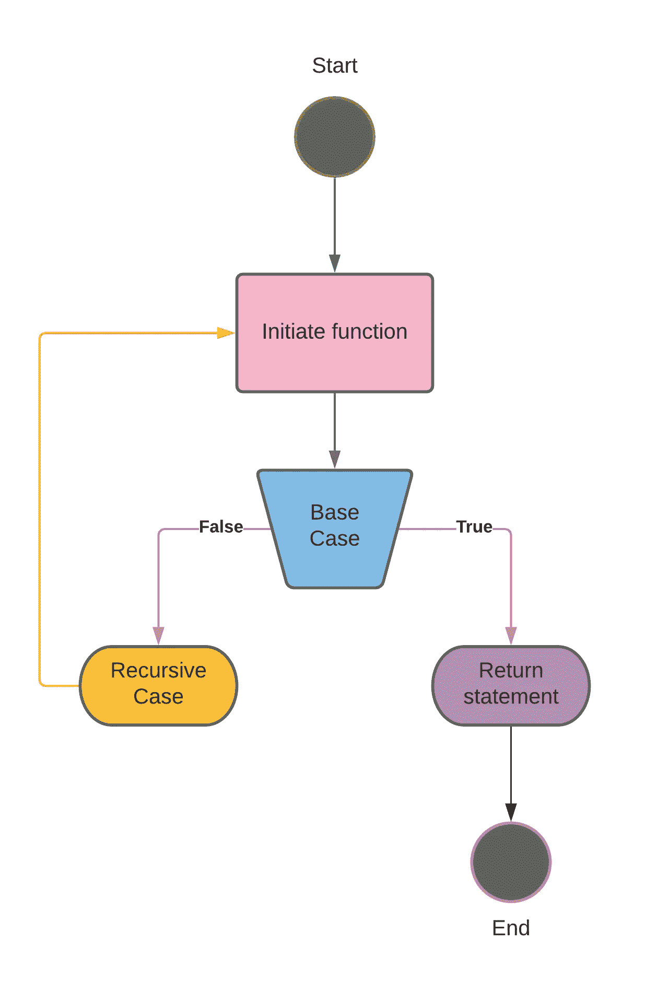
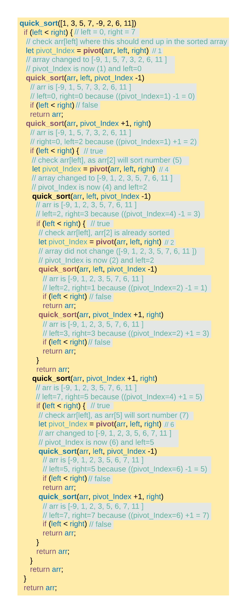
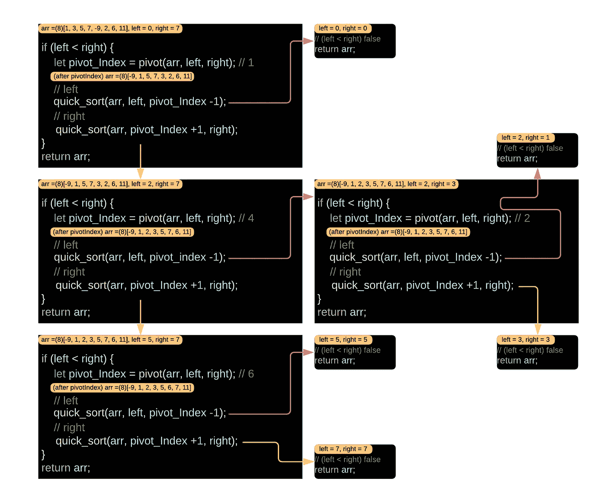

# 关于递归你需要知道的一切

> 原文：<https://javascript.plainenglish.io/everything-you-need-to-know-about-recursion-e790021a08bd?source=collection_archive---------16----------------------->



Everything You Need To Know About Recursion

递归最常见的实现在[数学](https://en.wikipedia.org/wiki/Mathematics)和[计算机科学](https://en.wikipedia.org/wiki/Computer_science)中。定义函数的地方是在它的定义中应用，虽然这将定义无限数量的实例，但它通常是以这样的方式完成的，不会触发无限循环或无限引用链。

## 目录

*   为什么你应该学习它
*   威尔，我需要递归吗？
*   性能以及为什么在使用递归之前应该思考？
*   理解它并使用它
*   循序渐进的例子
*   Factorial(调用堆栈)分步示例
*   真实世界的例子
*   循序渐进的例子
*   丰富多彩的例子
*   快速排序(调用堆栈)分步示例
*   奖金
*   结论

## 为什么你应该学习它

像谷歌、脸书、亚马逊这样的大公司经常在编码面试中使用递归。

它无处不在，你可能在不知情的情况下使用了它。下面是一些例子:“document.getElementById”、“JSON.stringify / JSON.parse。”

递归思维帮助你将大问题分解成小问题。通常，递归解比迭代解更容易阅读。几乎每一种语言都一直在使用它。

递归思维是编程学习数据结构和算法所必需的。

## 威尔，我需要递归吗？

这要看情况而定

因为任何递归解决的问题也可以用迭代来解决。(迭代意味着使用循环，比如 for 和 while)

但是一些数据结构和算法使用它，如果你试图绕过它，那么它将是不同的(数据结构或算法)

以下是一些例子:

*   **举一个例子**:对一棵树的遍历，这种只有父子链接的遍历永远不能用非递归算法来执行。实际上，如果你没有在这些方法中使用递归，那么你就有点疯狂了(即使对于命令式语言):

> 树遍历
> 
> 图表
> 
> 从语法上分析
> 
> 整理

*   固有递归算法的另一个例子是众所周知的快速排序算法。快速排序总是递归的，它永远不会变成非递归算法。因为如果你成功地做到了这一点，那么它将不再是快速排序了。这将是一个完全不同的算法。

这是一个在 unity 游戏引擎中用 C#语言构建的 Sierpinski 三角形的例子

参见 [***图片链接***](https://i.stack.imgur.com/HAEZW.gif)

你可以用递归画出一个非常简单的例子，其中调用栈分支到三个方向:

```
private void Vertices(double x, double y, double l) {
    if (l > 0.002) {
        mesh.Positions.Add(new Point3D(x, y + l, -l));
        mesh.Positions.Add(new Point3D(x - l, y - l, -l));
        mesh.Positions.Add(new Point3D(x + l, y - l, -l));
        l *= 0.5;
        Vertices(x, y + l, l);
        Vertices(x - l, y - l, l);
        Vertices(x + l, y - l, l);
    }
}
```

使用迭代做同样的事情，我想你会发现需要更多的代码来完成。其他常见的用例可能包括遍历层次结构、网站爬虫、目录比较等。

## 性能以及为什么在使用递归之前应该思考？

一、复杂递归代码是*难以理解和 ***更新*** 。这需要“挠头”，直到一个人“明白”另一方面，好的代码，如使用循环，非常简单，易于更新。*

*所以，有时候递归编程在内存上更昂贵，有时候它更清晰更可读，使用循环提高了性能。你应该重新思考问题，想出如何用迭代来解决。*

*最后，递归有时对程序员和他的性能更好，因为一些动态问题可以通过递归而不是 for 循环来轻松解决，但是用 for 循环来解决一些问题是困难的或者是完全不可能的，例如，“JSON”解析，“XML”解析等等。*

*决定用什么(**递归**还是**迭代**)取决于你想用什么，什么对你更重要(**可读性**？还是**性能**？)，问用递归还是迭代，不知何故就像问优雅还是性能。*

## *理解它并使用它*

*递归是指函数在其定义内部调用自身。*

*这是一种基于分而治之思想的解决问题的方法，基本上是你把原始问题分成更小的(更容易解决的)实例，解决这些更小的实例(通常通过再次使用相同的算法)，然后把它们重新组合成最终的解决方案。*

*每个递归函数都有两个部分:*

*   ***一个简单的*基本情况***——在满足条件时返回某个值的情况。*
*   ***一个*递归步骤***——一组规则，将所有的连续案例减少到基础案例。*

*下面是一个例子**使用**迭代**生成 n** 的阶乘*

```
*function Factorial(n) {
  let fact = 1; for(let i = 2; i <= n; i++) {
    fact = fact * i;
  } return fact;
};*
```

*这是上面同样的例子，使用了**递归***

```
*function Factorial(n) {
  if( n < 2 ) return 1; return n * Factorial( n - 1 );
};*
```

*该功能的第一部分被称为**基础案例**。*

```
*if( n < 2 ) return 1;*
```

*这也是阻止算法永远运行的原因。每当调用值为 1 或更小的函数时，它只返回值 1。*

```
*return n * Factorial( n - 1 );*
```

*第二部分被称为**递归步骤**。这里我们调用相同的方法，只是稍微修改了参数(我们将其减 1) ***n-1*** 然后将结果乘以我们的 n 的副本。*

****侧注:****

> *当定义一个循环(for 或 while 循环)时，使用一个条件在预期的输出处停止它，这个条件在递归中称为基本情况。*

## *循序渐进的例子*

```
*// In Factorial(5)
return 5 * Factorial( 5 - 1 );// which is
return 5 * Factorial(4);*
```

*这个例子应该会给你一个线索，让你知道最终的解决方案是如何得出的，我们将快速跟踪并展示下一步的每一步:*

```
*return 5 * (4 * Factorial(3));
return 5 * (4 * (3 * Factorial(2)));
return 5 * (4 * (3 * (2 * Factorial(1))));
return 5 * (4 * (3 * (2 * (1))));*
```

*当基本情况被触发时，最后的替换发生了。*

*值得注意的是，每次调用该方法都会导致触发一个基本用例，或者调用参数更接近基本用例的同一个函数。*

*如果你弄乱了**基础用例**，那么这个方法将永远运行下去。*

## *Factorial(调用堆栈)分步示例*

*当我们编写递归函数时，我们不断地把新的函数推到调用堆栈上。下面是一个基本的例子:*

```
***Factorial****(5)**
return 5 * **Factorial****(4)**
           return 4 * **Factorial****(3)**
                      return 3 * **Factorial****(2)**
                                 return 2 * **Factorial****(1)**
                                            return **1**now that we have Factorial(1) === 1
return 5 * **Factorial****(4)**
           return 4 * **Factorial****(3)**
                      return 3 * **Factorial****(2)**
                                 return 2 * **1**now that we have Factorial(2) === 2
return 5 * **Factorial****(4)**
           return 4 * **Factorial****(3)**
                      return 3 * **2**now that we have Factorial(3) === 6
return 5 * **Factorial****(4)**
           return 4 * **6**now that we have Factorial(4) === 24
return 5 * **24**now that we have Factorial(5) === 120
return **120***
```

## *真实世界的例子*

*阶乘的例子是递归的“hello world”。现在要知道现实世界的方法是如何工作的，我们需要解决其中的一个问题。*

***快速排序**是计算机行业使用最广泛的排序算法之一。*

```
*function quick_sort(arr, left = 0, right = arr.length -1) {
  if (left < right) {
    let pivot_Index = pivot(arr, left, right);
    // left
    quick_sort(arr, left, pivot_Index -1);
    // right
    quick_sort(arr, pivot_Index +1, right);
  }
  return arr;
};*
```

*如你所见，我没有定义**枢纽**函数，因为这无关紧要，让我告诉你为什么:*

*   *首先，这篇文章是关于递归的，如果我教你所有关于快速排序的知识，只会让这篇文章更复杂。*
*   ***其次**，我们只关心快速排序中递归的用法*
*   ***最后是**，如果你关心“ **pivot** 函数是做什么的？
    它的工作原理是选择一个元素(称为“pivot”)并在排序数组中找到 pivot 应该结束的索引。此外，枢纽将改变原来的数组，给我们一个新的。这里有一个例子:*

```
*let arr = [ 5, 2, 1, 8, 4, 7, 6, 3 ]
let p = pivot(arr, 0, arr.length -1)

----------- after the variable p -----------

the array will change to [ 3, 2, 1, 4, **5**, 7, 6, 8 ]
also, it will return arr[0], the number 5 in the correct indexwill change the array to [ 3, 2, 1, 4, **5**, 7, 6, 8 ]
will return arr[0], the number 5 in the correct indexwhen the array fully sorted, you will find that the number (5) will have an index of 4*
```

*   *如果你关心如何学习快速排序，我向你保证，我会找时间写一篇关于它的文章，让你足够自豪地教它。*

## *循序渐进的例子*

*“ **pivot** ”将改变原始数组，也是通过选择一个元素并找到“ **pivot** ”在排序后的数组中应该结束的索引来实现的。*

```
***quick_sort**([1, 3, 5, 7, -9, 2, 6, 11])
  if (left < right) { // left = 0, right = 7
   // check arr[left] where this should end up in the sorted array
   let pivot_Index = pivot(arr, left, right)// 1
   // array changed to [-9, 1, 5, 7, 3, 2, 6, 11 ]
   // pivot_Index is now (1) and left=0
   **quick_sort**(arr, left, pivot_Index -1)
     // arr is [-9, 1, 5, 7, 3, 2, 6, 11 ]
     // left=0, right=0 because ((pivot_Index=1) -1 = 0)
     if (left < right) // false
     return arr;
   **quick_sort**(arr, pivot_Index +1, right)
     // arr is [-9, 1, 5, 7, 3, 2, 6, 11 ]
     // right=7, left=2 because ((pivot_Index=1) +1 = 2)
     if (left < right) { // true
      // check arr[left], as arr[2] will sort number (5)
      let pivot_Index = pivot(arr, left, right)// 4
      // array changed to [-9, 1, 2, 3, 5, 7, 6, 11 ]
      // pivot_Index is now (4) and left=2
      **quick_sort**(arr, left, pivot_Index -1)
        // arr is [-9, 1, 2, 3, 5, 7, 6, 11 ]
        // left=2, right=3 because ((pivot_Index=4) -1 = 3)
        if (left < right) { // true
         // check arr[left], arr[2] is already sorted
         let pivot_Index = pivot(arr, left, right)// 2
         // array did not change ([-9, 1, 2, 3, 5, 7, 6, 11 ])
         // pivot_Index is now (2) and left=2
         **quick_sort**(arr, left, pivot_Index -1)
           // arr is [-9, 1, 2, 3, 5, 7, 6, 11 ]
           // left=2, right=1 because ((pivot_Index=2) -1 = 1)
           if (left < right) // false
           return arr;
         **quick_sort**(arr, pivot_Index +1, right)
           // arr is [-9, 1, 2, 3, 5, 7, 6, 11 ]
           // left=3, right=3 because ((pivot_Index=2) +1 = 3)
           if (left < right) // false
           return arr;
        }
        return arr;
      **quick_sort**(arr, pivot_Index +1, right)
        // arr is [-9, 1, 2, 3, 5, 7, 6, 11 ]
        // right=7, left=5 because ((pivot_Index=4) +1 = 5)
        if (left < right) { // true
         // check arr[left], as arr[5] will sort number (7)
         let pivot_Index = pivot(arr, left, right)// 6
         // array changed to [-9, 1, 2, 3, 5, 6, 7, 11 ]
         // pivot_Index is now (6) and left=5
         **quick_sort**(arr, left, pivot_Index -1)
           // arr is [-9, 1, 2, 3, 5, 6, 7, 11 ]
           // left=5, right=5 because ((pivot_Index=6) -1 = 5)
           if (left < right) // false
           return arr;
         **quick_sort**(arr, pivot_Index +1, right)
           // arr is [-9, 1, 2, 3, 5, 6, 7, 11 ]
           // left=7, right=7 because ((pivot_Index=6) +1 = 7)
           if (left < right) // false
           return arr;
        }
        return arr;
     }
     return arr;
  }
  return arr;*
```

## ***丰富多彩的例子***

**

*Recursion A step-by-step example (quick-sort)*

## *快速排序(调用堆栈)分步示例*

*展示每个递归步骤的示例*

**

*Quick-sort (call stack) in recursion*

*如果你不能理解快速排序算法，不要担心，因为这是一篇递归文章。你只需要了解递归调用是如何进行的。*

## *奖金*

**

*Chinese Folk Tales*

## *结论*

*实际上，每当需要迭代分支时，递归是最有意义的。*

*递归很好学，谁说不是他的错而是教他的老师的错。*

*阿尔伯特·爱因斯坦说:“ ***如果你不能向一个六岁的孩子解释清楚，那你自己也不明白。****

*我希望你有一个美好的一天，并随时问任何问题。*