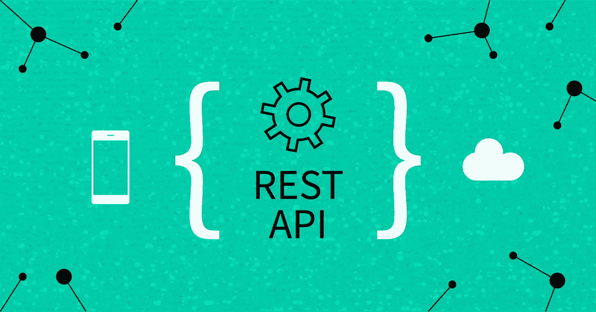

# 关于 REST API 您需要知道的一切

> 原文：<https://javascript.plainenglish.io/everything-you-need-to-know-about-rest-api-20fd8b9ae862?source=collection_archive---------9----------------------->

## 它是如何工作的，它的原理是什么，它的优点是什么？

Image source: [Nylas](https://www.nylas.com/blog/category/engineering/technical-guides/)

REST——表述性状态转移——一种基于预定规则的软件架构风格，这些规则描述了如何定义资源以及如何访问资源。罗伊·菲尔丁在 2000 年提出了它。

API——应用编程接口——定义计算机系统之间以及计算机系统与人类之间通信的一组规则。

简而言之——API 定义了用户如何与系统通信，定义了用户如何访问资源以及以何种形式接收资源的规则。另一方面，REST 是一种定义 API 形状的架构风格。

最后一个缩写是 HTTP，它与 REST API 主题有着千丝万缕的联系。超文本传输协议(Hypertext Transfer Protocol)是你每天(甚至现在)浏览网页时都会用到的协议(或者它的加密版本——HTTPS)。创建 REST API 时，通信使用 HTTP 方法，总共有 9 种方法:

*   得到
*   邮政
*   放
*   删除
*   连接
*   选择
*   找到；查出
*   修补
*   头

然而，要构建一个允许你读、写、更新和删除数据的基本 API，只有 4 个方法就足够了——GET、POST、PUT 和 delete。

# API 工作周期可以定义如下:

*   客户端以适当地址(端点)的形式准备查询，
*   客户端发送准备好的查询(请求)，
*   系统接收客户的查询并准备响应，
*   系统返回对客户询问的响应，
*   客户接收并处理响应。

对于很多人来说，我写的东西可能看起来很明显。然而，我希望每个人在读完这篇文章之后，都知道它们是干什么的，以及 API 是如何工作的。

# HTTP 方法

由于这仅仅是对这个主题的介绍，我将把自己限制在绝大多数 REST APIs 中都有的 4 个基本 HTTP 方法上:

*   GET——顾名思义，是用来下载数据的。这里足以给出一个适当的端点或修改头(headers)和参数(params query)。一个示例查询可能如下所示。使用 GET 方法的一个普遍情况是验证给定的资源是否存在。然而，在我看来，在这种情况下，更好的办法是使用 HEAD 方法。这些方法之间的主要区别在于，对 HEAD 查询的回答仅包含头部，这在所描述的情况下是足够的。但是，我们确实需要一个响应代码，例如，如果资源存在，则为 200；如果资源不存在，则为 404。
*   POST —它用于创建和发送新数据。在这种情况下，已经有必要创建一个主体来将数据传递给我们的 REST API。因此，响应应该是一个 HTTP 头位置，带有指向新创建的资源的地址。
*   PUT —非常类似于 POST 方法。PUT 的主要特点是 PUT 查询必须指向特定的资源。PUT 主要用于更新现有资源。值得一提的是，PUT 会覆盖整个资源 PATCH 方法用于部分覆盖。
*   删除—删除数据的方法。在这一点上，我想提一下所谓的软删除技术，在我的博客文章中，我用 Node.js 和 MongoDB 做了一点软删除。简而言之，这意味着通过使用 API 删除数据，我们实际上只向已被删除的实体添加了信息。因此，数据仍保留在数据库中，但在 API 级别上不可用。所以这个机制应该已经在 API 本身实现了，和 HTTP 无关。

# 构成休息的原则

为了让一个 API 被称为 RESTful 或 REST API，它必须满足几个假设:

*   将用户界面与服务器操作分开。通过“发布命令”，客户端不会影响服务器端发生的事情。反过来也一样——服务器只给客户端一个答案，无权干涉 UI。这允许在许多独立的应用程序中使用一个 REST API，并且数据将保持一致。
*   无状态——据说 REST 是无状态的——这意味着来自客户端的每个请求都必须包含所有信息，并且服务器端不存储用户会话的状态。REST 中没有状态或会话之类的术语。
*   可缓存性——来自 REST API 的用户响应必须明确定义是可缓存还是不可缓存。这对于很快就会过期的数据非常重要。对于相对很少更新的数据—例如，缓存一架高速飞行的飞机的地理坐标是没有意义的，但它的颜色或名称是有意义的。
*   端点，即资源地址，应该清楚地指出它们指的是哪个资源。因此，从它们的构造中，我们应该知道我们将得到什么具体的资源。重要的是 API 中接收的数据不应该独立于存储它们的数据库模式。当然，没有理由说数据结构应该与数据库模式相同——尽管如此，结构不应该依赖于这个模式。
*   层分离——我们应该分离数据访问、业务逻辑和表示层。任何一层都不应该与其他层直接交互。间接和外部 API 的使用(实现)应该是隐藏的。前面提到的飞机就是一个例子。例如，颜色信息可能来自完全不同的 API——客户端不需要知道它。
*   与用户共享适配器和脚本的可能性。这是一个可选的规则，但是你一定要考虑应用它。比如，如果我们知道客户会对特定的数据进行特定的操作，我们就可以为他们提供现成的解决方案。
    使用 REST API 敲门的优势

# 使用 REST API 有什么好处？

使用这种解决方案有好处——否则，没有人会使用它，我也不会写这篇文章。SOAP 架构被挤出市场，转而支持 REST，这不是没有原因的。

REST 最大的好处就是普遍性。例如，假设您需要为一家书店创建一个电话应用程序和网站。您可以创建一个应用程序和网站都将使用的 API！

第二，真正的 REST 界面直观易用。直观的界面使得与我们的 API 集成更加容易，并且减少了阅读文档所花费的时间。

我们从 API 接收的数据通常是最方便的工作格式——JSON，即 JavaScript 对象符号。有时候也有 XML 格式，但更多的是和 SOAP 架构联系在一起。使用 JSON 真的很舒服，很直观，也不会造成大的困难。

我们还可以同时从多个来源获得数据。例如，我们可以创建一个使用脸书登录和谷歌地图的应用程序。在这两种情况下，我们都将使用这些公司提供的 API。

另一个优点是能够将客户机层与服务器层分开。API 的替代方法是使用 Pug、Twig 和 Blade 等模板引擎创建视图。

提到的最后一个优点是端点的简单测试。为了这个目的，已经创造了真正伟大和普遍的工具。我最喜欢的是 Postman，我将在以后的一篇单独的文章中详细介绍他。最后，还有一个给大麻溶液爱好者的冰壶工具。

# 流行 API 的示例

*   谷歌地理定位 API，
*   YouTube 数据 API，
*   我写了一篇关于它的文章，
*   SWAPI——包括人物、行星、交通工具等。来自星球大战宇宙，
*   脸书编写的一系列接口。

我可以在这里没完没了地列举例子，但是我鼓励你至少尝试其中的一个！

我希望你从这篇文章中学到了一些新的东西，更重要的是，一些对你有用的东西。

*更多内容看*[*plain English . io*](http://plainenglish.io/)