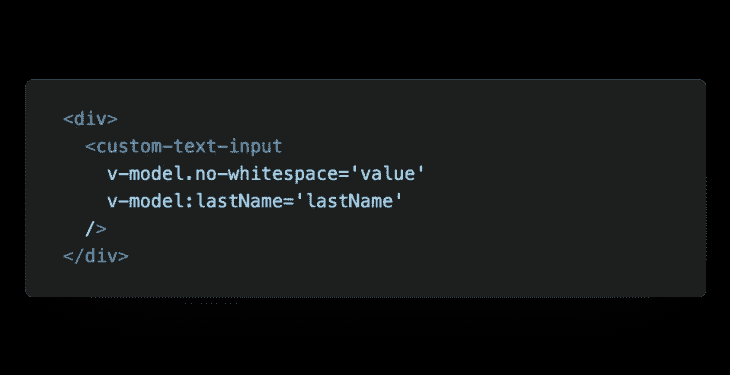
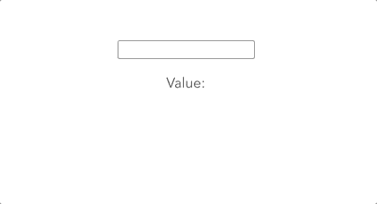
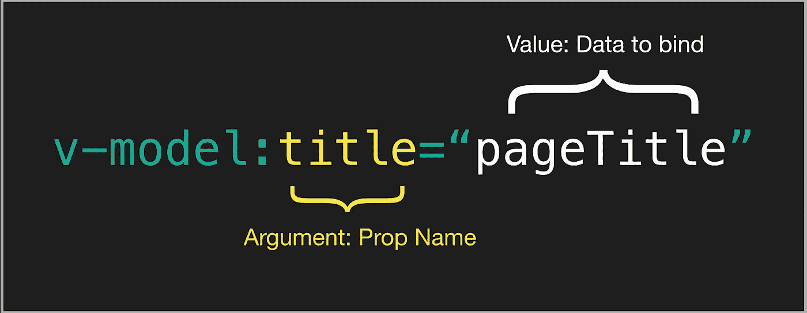
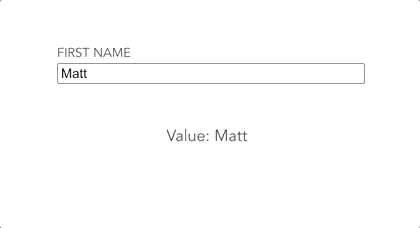
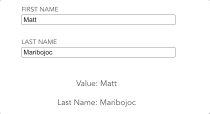
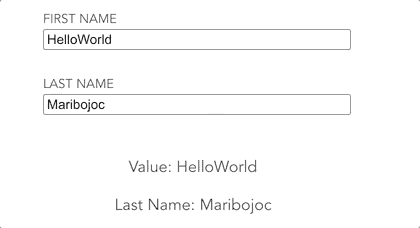

# 关于 Vue v-model 你需要知道的一切

> 原文：<https://javascript.plainenglish.io/everything-you-need-to-know-about-vue-v-model-1aa2a38b628f?source=collection_archive---------14----------------------->



Vue v-model 是一个指令，它提供输入和表单数据之间或者两个组件之间的双向数据绑定。

这在 Vue 开发中是一个简单的概念，但是 v-model 的真正威力需要一些时间来理解。

本教程结束时，您将了解 Vue v-model 的所有不同用例，并学习如何在自己的项目中使用它。

准备好了吗？

我也是。让我们开始编码吧。

## 什么是 Vue v-model？

正如我们刚刚讨论的，Vue v-model 是一个[指令](https://012.vuejs.org/guide/directives.html)，我们可以在模板代码中使用它。指令是一个模板令牌，它告诉 Vue 我们想要如何处理我们的 DOM。

在 v-model 的情况下，它告诉 Vue 我们想要在模板中的值和数据属性中的值之间创建一个双向数据绑定。

使用 v-model 的一个常见用例是当[设计表单和输入](https://learnvue.co/2020/01/9-vue-input-libraries-to-power-up-your-forms/)时。我们可以使用它让 DOM 输入元素能够修改 Vue 实例中的数据。

让我们看一个在文本输入上使用 v-model 的简单例子。

```
<template>
  <div>
    <input 
      type='text'
      v-model='value'
    />
    <p> Value: {{ value }} </p>
  </div>
</template>

<script>
export default {
  data() {
    return {
      value: 'Hello World'  
    }
  }
}
</script>
```

当我们在文本输入中键入内容时，我们会看到我们的数据属性正在发生变化。



Working with v-model!

完美。

## v-model 和 v-bind 的区别？

与 v-model 一起切换的一个指令是`v-bind` 指令。

两者的区别在于 v-model 提供了**双向数据绑定。**

在我们的例子中，这意味着如果我们的数据改变，我们的输入也会改变，如果我们的输入改变，我们的数据也会改变。

然而， **v-bind 只是单向绑定数据。**

当在应用程序中创建一个清晰的单向数据流时，这很有用。但是在 v-model 和 v-bind 之间选择时，你必须小心。

## 垂直模型的修改器

Vue 提供了几个修改器，允许我们改变 v 模型的功能。

每一个都可以像这样添加，甚至可以链接在一起。

```
<input 
  type='text'
  v-model.trim.lazy='value'
/>
```

## 。懒惰的

默认情况下，在每个[输入事件](https://developer.mozilla.org/en-US/docs/Web/API/HTMLElement/input_event)时，v-model 与 Vue 实例的状态(数据属性)同步。这包括获得/失去焦点、模糊等。

`.lazy` 修改器改变我们的 v 模型，所以它只在[改变事件](https://developer.mozilla.org/en-US/docs/Web/API/HTMLElement/change_event)之后同步。

这减少了我们的 v-model 试图与我们的 Vue 实例同步的次数——在某些情况下，可以提高性能。

## 。数字

通常，我们的输入会自动将输入类型化为字符串——即使我们将输入类型声明为 number。

确保我们的值作为数字处理的一种方法是使用`.number`修饰符。

[根据 Vue 文档](https://vuejs.org/v2/guide/forms.html#number)，如果输入发生变化，新值无法被`parseFloat()`解析，则返回输入的最后一个有效值。

```
<input 
  type='number'
  v-model.number='value'
/>
```

## 。整齐

与大多数编程语言中的 trim 方法类似。trim 修饰符在返回值之前删除前导或尾随空格。

## 在定制组件中使用 Vue v 模型

好了，现在我们知道了表单/输入内部的 v-model 的基础知识，让我们来看看 v-model 的一个有趣的用法— **在组件之间创建双向数据绑定。**

在 Vue 中，数据绑定有两个主要步骤:

1.  从我们的父母那里传递我们的数据
2.  从子实例发出一个事件来更新父实例

在定制组件上使用 v-model 允许我们传递一个 prop，并且只用一个指令就能处理一个事件。

```
<custom-text-input v-model="value" />

<!-- IS THE SAME AS -->

<custom-text-input 
   :modelValue="value"
   @update:modelValue="value = $event"
/>
```

## 好吧…这到底是什么意思？

让我们继续使用表单的 v-model 的例子，并使用一个名为`CustomTextInput.vue`的定制文本输入。

使用 v-model 传递的值的默认名称是`modelValue`，这就是我们将在我们的例子中使用的名称。

但是，我们可以像这样传递一个自定义的模型名。

```
<!-- We can name v-model, but for our example leave unnamed. -->
<custom-text-input v-model:name="value" />
```

注意:当我们使用一个定制的模型名称时，发出的方法的名称将是`update:name`

这里有一个来自 Vue 文档的方便的图表来总结它。



[Source](https://v3.vuejs.org/guide/migration/v-model.html#v-model-arguments)

## 使用自定义组件中的 v-model

我们已经设置了父组件，所以让我们从子组件中访问它。

在`CustomTextInput.vue`内我们必须做两件事:

1.  接受我们的 v-model 价值观作为支撑
2.  当我们的输入改变时发出一个更新事件

好的——让我们首先在脚本中将它声明为一个道具。

```
export default {
  props: {
    modelValue: String,
  }
}
```

接下来，让我们创建模板，将值设置为您的`modelValue`属性，只要有输入事件，我们就会通过`update:modelValue`发出新值。

```
<template>
  <div>
    <label> First Name </label>
    <input 
      type='text'
      placeholder='Input'
      :value='modelValue'
      @input='$emit("update:modelValue", $event.target.value)'
    />
  </div>
</template>
```

现在，如果我们回去看看我们的代码，我们可以看到它的作用。



## 使用 v 模型的提示

好吧！

我们已经介绍了一个使用 v-model 在两个组件之间绑定数据的基本例子。

让我们看看使用 v-model 指令的一些更高级的方法。

## 对一个组件多次使用 v-model

v-model 不仅限于每个组件使用一次。

要多次使用 v-model，我们只需确保唯一地命名每个 prop，并在我们的子组件中正确地访问它。

让我们在输入中添加第二个 v-model，名为`lastName`。

在我们的父组件内部…

```
<template>
  <div>
    <custom-text-input 
      v-model='value' 
      v-model:lastName='lastName'
    />
    <p> Value: {{ value }} </p>
    <p> Last Name: {{ lastName }} </p>
  </div>
</template>

<script>
import CustomTextInput from './CustomTextInput.vue'

export default {
  components: {
    CustomTextInput,
  },
  data() {
    return {
      value: 'Matt',
      lastName: 'Maribojoc'
    }
  }
}
</script>
```

然后，在我们的子组件中

```
<template>
  <div>
    <label> First Name </label>
    <input 
      type='text'
      :value='modelValue'
      placeholder='Input'
      @input='$emit("update:modelValue", $event.target.value)'
    />
    <label> Last Name </label>
    <input 
      type='text'
      :value='lastName'
      placeholder='Input'
      @input='$emit("update:lastName", $event.target.value)'
    />
  </div>
</template>

<script>
export default {
  props: {
    lastName: String,
    modelValue: String,
  }
}
</script>
```

如果我们去看看我们的项目，我们可以看到两个 v-model 的独立工作。



## 我们的 v 型车的自定义修改器

正如我们已经讨论过的，Vue 内置了一些修改器。但是总有一天我们会想要加入我们自己的。

假设我们想要创建一个修饰符，从输入中删除所有空格。我们称之为`no-whitespace`

```
<custom-text-input 
  v-model.no-whitespace='value' 
  v-model:lastName='lastName'
/>
```

在我们的输入组件中，我们可以使用 props 来捕获修饰符。自定义修改器的名称是`*name*Modifiers`

```
props: {
  lastName: String,
  modelValue: String,
  modelModifiers: {
    default: () => ({})
  }
},
```

好的——我们想做的第一件事是改变我们的`@input`处理程序来使用一个定制的方法。我们可以称它为`emitValue`，它将接受正在编辑的属性的名称以及事件对象。

```
<label> First Name </label>
<input 
      type='text'
      :value='modelValue'
      placeholder='Input'
      @input='emitValue("modelValue", $event)'
/>
```

在我们的`emitValue`方法中，在调用`$emit`之前，我们想要检查我们的修饰符。如果我们的`no-whitespace`修饰符为真，我们可以在将值发送给父对象之前修改它。

```
emitValue(propName, evt) {
  let val = evt.target.value
  if (this.modelModifiers['no-whitespace']) {
    val = val.replace(/\s/g, '')
  }
  this.$emit(`update:${propName}`, val)
}
```

太棒了。现在让我们看看我们的应用程序。



每当我们的输入改变，我们有一个空格，它将被删除在父值！

太棒了。

## 结论

希望本指南能教你一些关于 Vue v-model 的新知识。

在表单和输入数据等基本用例中，v-model 是一个非常简单的概念。然而，当我们开始创建定制组件并处理更复杂的数据时，我们可以真正释放 v-model 的真正力量。

如果你有任何问题，请在下面的评论中告诉我！

一如既往，快乐编码🙂

如果你有兴趣学习更多关于 Vue 3 的知识，下载我的免费的 Vue 3 备忘单，里面有一些基本的知识，比如组合 API、Vue 3 模板语法和事件处理。