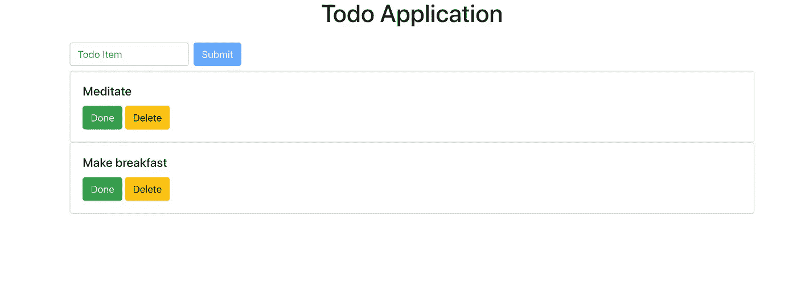
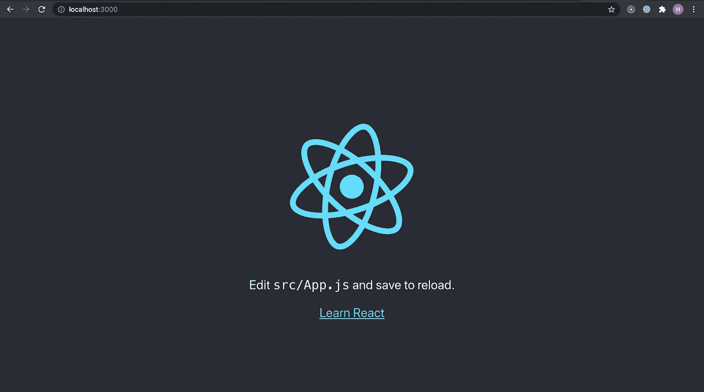
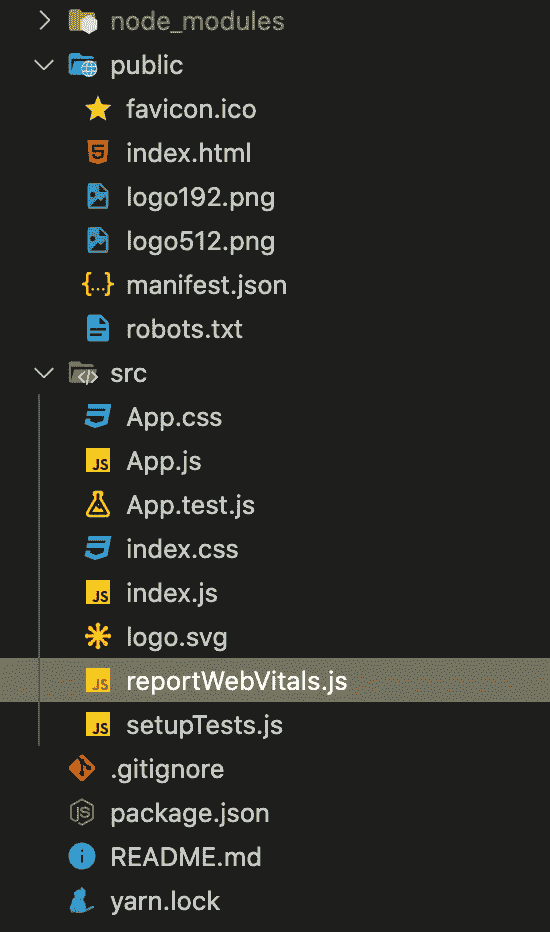
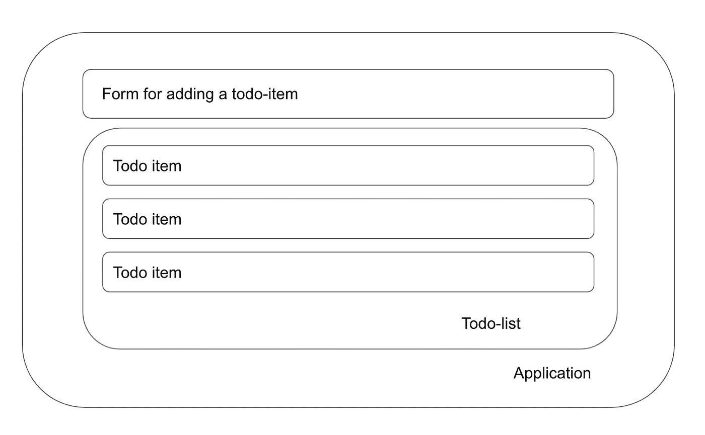
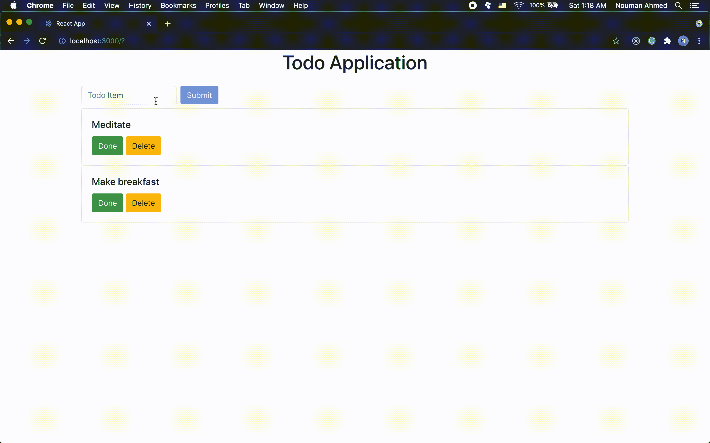

# React 入门

> 原文：<https://javascript.plainenglish.io/everything-you-need-to-know-to-get-started-with-react-2723d7f86612?source=collection_archive---------11----------------------->

## 网络开发——30 天挑战

## 在本文中，我们将使用 React 构建一个待办事项应用程序。这将是对每个学习 React 的人的介绍

本文是对 React 和一般 web 开发实践的一个很好的介绍。我们将构建一个简单的 todo 应用程序，包含基本的 web 开发操作，即 CRUD(创建、读取、更新和删除)


Image from [Pexels](https://www.pexels.com/photo/a-variety-of-writing-notebooks-5191390/)

本文分为以下几个部分:

*   关于应用程序
*   初始设置
*   应用设计
*   构建组件
*   结论

> 这是我 30 天文章写作挑战的一部分。请随意查看我的新人帖子上的文章:

[](https://nouman10.medium.com/lets-publish-30-articles-in-30-days-a0b8111855bb) [## 让我们在 30 天内发表 30 篇文章

### 在这篇文章中，我将接受挑战，在未来 30 天内写 30 篇与数据科学相关的文章…

nouman10.medium.com](https://nouman10.medium.com/lets-publish-30-articles-in-30-days-a0b8111855bb) 

# **关于 App**

这是一个简单的应用程序内状态管理待办事项。这意味着我们不会使用 Redux 或任何服务器/数据库来存储数据。这也意味着这个应用程序并不能真正替代存储和跟踪你的任务，因为你会在刷新页面时丢失它们。下面是我们将建立的应用程序:



Image by Author

# 初始设置

我们将使用`[create-react-app](https://reactjs.org/docs/create-a-new-react-app.html)`来构建我们应用程序的基本结构。若要创建结构，请运行以下命令:

```
npx create-react-app todo-app
```

要运行该应用程序，请键入以下命令:

```
cd todo-app && npm start
```

现在，进入 [http://localhost:3000](http://localhost:3000) ，你会看到下面的页面:



Image by Author

让我们现在做一些清理。下面是应用程序的目录结构:



Image by Author

我们需要删除以下文件:

*   `public/logo192.png`
*   `public/logo512.png`
*   `src/App.test.js`
*   `src/setupTests.js`
*   `src/reportWebVitals.js`(也从`src/index.js`中删除其用途)
*   `src/logo.svg`
*   `src/App.css`

用以下内容替换`src/App.js`中的内容:

出于样式的目的，我们需要`[react-bootstrap](https://react-bootstrap.github.io/)`,所以我们需要使用下面的命令来安装它:

```
npm install react-bootstrap bootstrap@4.6.0
```

这就是我们为设置需要做的全部工作。

# 应用设计

React 的工作原理是构建可重用的组件。这就是为什么确定您需要为您的应用程序构建的组件是一个好的实践。

为此，你可以在纸上或简单的 word 文档上做一个粗略的设计。对于我们的应用程序，我们可以执行以下操作:



Image by Author

我们从创建应用程序开始。这将包含两个主要组成部分，即添加待办事项和待办事项列表的形式。待办事项列表又将包含待办事项组件的列表。

# 状态管理

在开始构建组件之前，我们需要添加存储和应用待办事项列表操作的逻辑。我们将在`App.js`文件中添加所有这些逻辑。

让我们从使用 React 钩子`useState`初始化我们的待办事项列表开始:

`useState`接受一个参数，即变量的初始值，并返回两个东西，变量和在变量中设置值的函数。在任何地方调用这个函数都会告诉 React 状态发生了变化，需要重新渲染。

现在，我们将编写以下函数:

*   `addTodoItem`:这将接受新待办事项的文本，并将其添加到待办事项列表中
*   `markTodoItemComplete`:这将接受待办事项的索引，并将其标记为完成
*   `deleteTodoItem`:这也将接受待办事项的索引并删除该事项。

# 构建组件

现在让我们构建各个组件:

## TodoForm:

让我们首先创建一个带有输入框的表单，用于添加新的待办事项。这也将利用`addTodoItem`将待办事项添加到待办列表中。让我们从在`src`文件夹中添加一个`TodoForm.js`文件开始:

我们利用`useState`钩子来存储和改变表单中的值。单击 submit 按钮，我们将这个值传递给`addTodoItem`函数，该函数作为一个道具传递给组件。

## TodoItem:

再次在`src`文件夹中创建一个`TodoItem.js`文件:

这将显示文本(如果完成，会有一条线穿过它)和用于标记完成和删除它的按钮。它将关于待办事项的信息作为一个道具，还提供了标记它完成和删除它的功能。

## TodoList:

这将用于遍历待办事项列表，并将每个列表传递给`TodoItem`组件。同样，在`src/`文件夹中创建一个`TodoList.js`文件:

# 将所有这些放在一起:

现在，我们只需要将所有这些组件添加到我们的`App.js`文件中，并传递适当的道具。最终的`App.js`应该是这样的:

现在，让我们来看看这个待办事项应用程序的运行情况:



# 结论

让我们来总结这篇文章:

*   我们从设计 web 应用程序开始，以了解应用程序的结构。
*   然后，我们通过使用 react 钩子进行状态管理来处理逻辑
*   最后，我们为应用程序构建了单独的组件

**您可以尝试通过**来扩展此项目

*   为状态管理添加 Redux
*   构建一个 API 并访问该 API 获取数据
*   使用数据库保存数据

你可以在我的 GitHub [上找到这篇文章的代码](https://github.com/nouman-10/React-To-do-App)

*更多内容尽在*[***plain English . io***](http://plainenglish.io)

如果您觉得以上内容对您有用，请分享并随时支持我-->

*   [https://www.buymeacoffee.com/nouman10](https://www.buymeacoffee.com/nouman10)