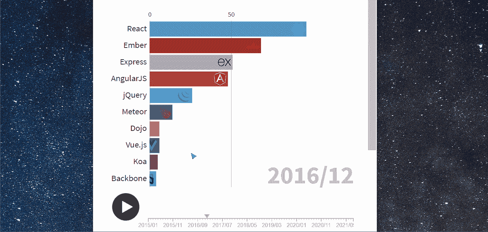

# JavaScript 框架的演变

> 原文：<https://javascript.plainenglish.io/evolution-of-javascript-frameworks-3eb861df25ad?source=collection_archive---------12----------------------->

## 媒体文章 8 年趋势

Chart by author, background: [Andy Holmes](https://unsplash.com/@andyjh07?utm_source=unsplash&utm_medium=referral&utm_content=creditCopyText) on [Unsplash](https://unsplash.com/s/photos/starry-background?utm_source=unsplash&utm_medium=referral&utm_content=creditCopyText)

JavaScript 是网络语言。因此，JavaScript 是 Medium 上使用最多的标签之一是有道理的。本文着眼于 JavaScript 框架的不断发展的生态系统是如何在标记为“JavaScript”的中型文章中得到反映的。

动画条形图包含 2013 年至 2021 年发表的文章的数据，尽管动画从 2015 年初开始。您可以使用底部的滑块来控制动画。

## 早期:Ember 和 jQuery

Ember 和 jQuery 是早期的热门话题。

也许我不应该把 jQuery 包括在列表中，因为它是一个 JavaScript 库，而不是真正的框架。但它仍然渗透到网络中。根据 builtwith.com 的调查，jQuery 仍然被超过 70%的百万网站使用！

Ember 是一个全栈框架，旨在解决当时存在的客户端 web 应用程序的问题:

> “JavaScript 应用程序感觉坏了，人们不知道为什么，但人们总是说，‘JavaScript 应用程序感觉坏了，你知道，不管出于什么原因，请不要使用它们’，对吗？人们想羞辱你使用 JavaScript。我认为原因在于 URL。URL 是维系网络的关键。web 相对于 native 的价值在于这些 URL，而 JavaScript 应用忽略了它们。SproutCore 忽略了它们，几乎每个 JavaScript 框架都忽略了它们。因此，Ember 要做的是找出如何构建 JavaScript 应用程序，使其在网络上不会感觉崩溃。——*汤姆·戴尔(* [*来源*](https://blog.heroku.com/history-of-emberjs) *)*

## 三巨头的崛起:React、Angular 和 Vue

从 2016 年左右开始，React 开始流行，到 2020 年，它已经让图表中的所有其他框架相形见绌。根据 2021 年 Stack Overflow 开发者调查中调查的 7 万名开发者，React 现在终于超过 jQuery 成为使用最多的 web 框架([来源](https://insights.stackoverflow.com/survey/2021#section-most-popular-technologies-web-frameworks))。

尤雨溪构建的“渐进式 JavaScript 框架”Vue.js 在 2016 年 9 月发布第 2 版后，以及 2020 年 9 月发布第 3 版后，实现了陡峭的攀升。目前，它是媒体上有史以来讨论第二多的框架。

AngularJS 是谷歌在 2010 年发布的。该框架在 2016 年被重写并重新发布为 Angular，纳入了打字稿以及大的结构变化。为简单起见，角度和角度在图表中合并为一个类别。

## Node.js 框架

Express 是榜单上最受欢迎的后端框架。其他在图表中进出前 10 名的 Node.js 框架包括 Meteor、Socket。IO 和 Koa。欲了解更多信息，请查阅本文:[2021 年使用的顶级 Node.js 框架](/top-node-js-frameworks-to-use-in-2021-4951ee5940b8)。

## 原味香草

当然，“香草”并不是指框架，而是指从框架中移走*并回到 JavaScript 语言本身的核心特性。我想我会把它列入名单，看看它的排名如何，有趣的是，它最终进入了 2017 年以来的前 10 名。*

## 苗条:未来？

Svelte 是由《纽约时报》的数据可视化专家 Rich Harris 创建的。它不同于其他前端框架，因为它实际上是一个编译器。通过在构建过程中将你的苗条代码编译成 HTML、JS 和 CSS，与其他框架相比，提供给浏览器的代码包很小。

对初学者也很棒(像我！)因为语法和结构非常类似于常规的 HTML，CSS 和香草 JavaScript。这是我写的一篇关于我用 Svelte 做的一个副业的文章。

 [## 动画三角学测验

### 由身材苗条的初学者建造

medium.com](https://medium.com/geekculture/animated-trigonometry-quiz-88958b0ac206) 

来自 [2021 栈溢出开发者调查](https://insights.stackoverflow.com/survey/2021#section-most-loved-dreaded-and-wanted-web-frameworks)的另一个有趣的事实是:Svelte 获得了“最受喜爱的框架”奖(AngularJS 是“最可怕的”)。

虽然目前 Svelte 在排行榜上刚刚进入前 10 名，但我实际上认为它会更高。我的预测是，如果我在一年后重复这一分析，Svelte 至少应该在前 5 名。

但是你怎么看？欢迎在下面的评论中留下你的想法。

# 数据来源和方法

实际的图表是使用 fluore 创建的。一旦我有了数据，这一部分其实很容易！蓬勃发展有一个免费的计划，他们的[条形图比赛模板](https://app.flourish.studio/@flourish/bar-chart-race)有相当多的选项来定制图表和动画。

我从[https://medium.com/tag/javascript/archive/](https://medium.com/tag/javascript/archive/)获得数据，那里的故事是按照年、月、日的时间顺序排列的。

图表中的数据是通过统计标题或副标题中包含其中一个框架的文章生成的。

用这个方法，同一篇文章可以分两类统计，当然也不是 100%靠谱。例如，我只看了那些被明确标记为“JavaScript”的文章。还有很多关于 JS 框架的文章不包含这个特定的标签，但是包含其他相关的标签，比如“React”或者“Web Development”。

 [## 中型标签的世界

### 标签是未来。这样做的好处是...

medium.com](https://medium.com/illumination/the-world-of-medium-tags-781468c76625)  [## 编程的演变

### 媒体文章 8 年趋势

medium.co](https://medium.com/codex/the-evolution-of-programming-8d0d31f6baf4) 

*更多内容看*[***plain English . io***](http://plainenglish.io/)