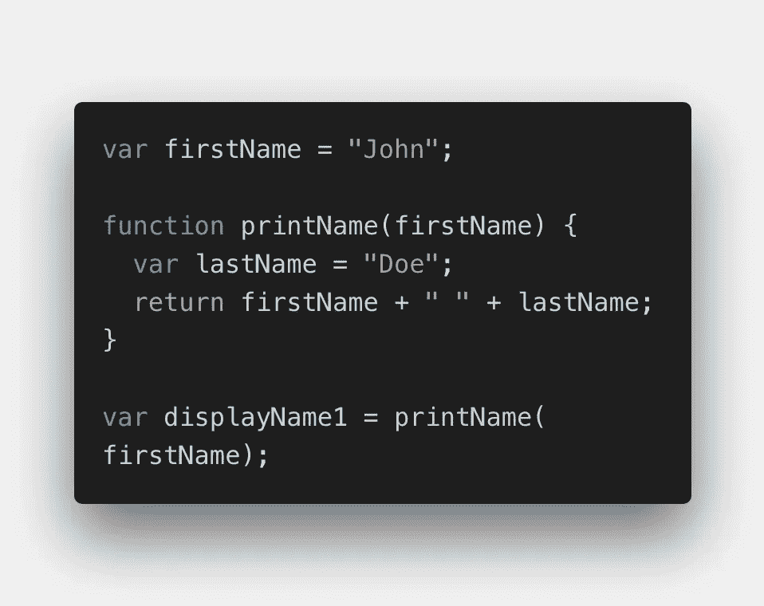
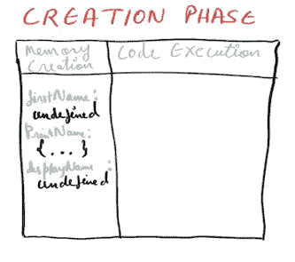
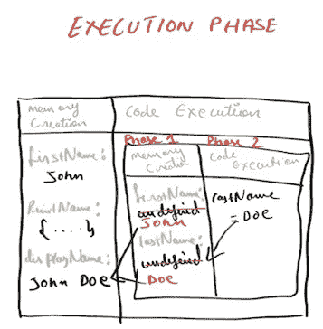
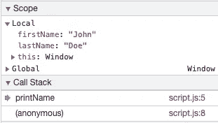

# 执行上下文:理解 JavaScript

> 原文：<https://javascript.plainenglish.io/execution-context-understanding-javascript-9f70302c50be?source=collection_archive---------10----------------------->

Photo by [Florian Olivo](https://unsplash.com/@florianolv) on Unsplash

> 执行上下文是我们在使用 JavaScript 时需要了解的核心概念之一。理解执行上下文将有助于理解其他概念，如提升、范围链、范围、闭包和事件循环。

让我们从定义开始

> E 执行环境是 JavaScript 代码执行和评估的环境。简单地说，JavaScript 中的一切都发生在执行上下文中。

**执行上下文的类型**

**全局执行上下文**:全局 EC 是默认的执行上下文。为什么违约？因为 JS 代码一运行，GEC 就被创建了。

试试这个:创建一个. js 文件并运行它。尽管这个文件没有包含一行代码，GEC 还是被创建了。

GEC 执行这两项任务:

*   它为 Node.js 创建一个全局对象，为浏览器创建一个窗口对象。
*   将 Windows 对象引用到“this”关键字。

**函数执行上下文**:每当一个函数被调用时，一个全新的 EC 被创建。每个函数都有自己的 EC，因此可以有任意数量的 FEC。

在浏览器上下文中，如果代码以*的严格模式值执行，则此*未定义，否则它是函数执行上下文中的窗口对象。

**Eval 函数** **执行上下文**:在 Eval 函数内部执行的代码得到自己的执行上下文。

**执行上下文分两个阶段创建**

*   **内存创建阶段**:在这个阶段，内存被分配给变量和函数，并存储在键值对中。
*   **代码执行阶段**:该阶段逐行执行代码并赋值。

*为了更好的理解，我们来看一个小程序，我们来潜水*

我们已经知道 EC 分为两个阶段，第一个是内存创建，第二个是代码执行。

在第一阶段，JS 逐行浏览代码，并为变量和函数分配内存。

对于变量，JS 指定了一个特殊的关键字 undefined。在函数的情况下，函数的整个代码被复制和赋值。

我来详细说明一下。内存被分配给所有的全局函数和变量。

*名字被分配了一个未定义的特殊关键字。*

*打印名称是整个代码分配给它的功能。*

*displayName 也是一个变量，因此，未定义被分配给它。*

**在第二阶段**，JS 再次逐行运行代码。现在代码正在执行，所有的计算和评估都将在这里进行。

一旦 JS 遇到 printName()的函数调用，就会在 GEC 内部创建一个全新的 EC，如上图所示。同样，将遵循 FEC 的创建和执行阶段的整个流程。

现在，当 JS 遇到 return 关键字时，它返回调用函数的程序的控制权，这是 GEC，我们得到的输出为 *John Doe* 。

整个程序执行完毕后，GEC 被删除了。这里需要理解的一个重要概念是**调用栈**。

> C 所有栈维护 EC 的执行顺序。

调用堆栈遵循 LIFO(后进先出)

在下图中，我们可以看到上面代码的调用堆栈。

在调用堆栈中，我们有两个 EC，一个是 FEC，另一个是 GEC。您也可以在浏览器中尝试这样做，方法是执行 inspect 并导航到 source 选项卡。

不要忘记添加断点😇。

## 结论

我们已经了解了什么是电子商务，电子商务有多少种类型。我们还通过一个例子了解了电子商务的两个非常重要的阶段以及它们是如何工作的。了解这些话题不仅扩展了我们的知识，还让我们知道事物是如何运作的。

*我这篇文章的灵感来自阿克谢·塞尼的 Namastey JavaScript 教程，它对我理解 JS 和成为一名更好的程序员帮助很大。*

*如果您觉得本文有帮助，请点击👏按钮并在下面随意评论！*

如果我忘记了要补充的东西或者只是一条建议，请联系我。

请务必看看我的其他文章

[虚拟 DOM:为什么在 React js 中](https://medium.com/@amnah.k/virtual-dom-and-react-1232be73e028)

[让我们简单了解一下有人监督和无人监督](https://chatbotsmagazine.com/lets-know-supervised-and-unsupervised-in-an-easy-way-9168363e06ab)

聊天机器人:下一件大事

*更多内容请看*[***plain English . io***](http://plainenglish.io/)