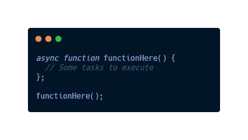
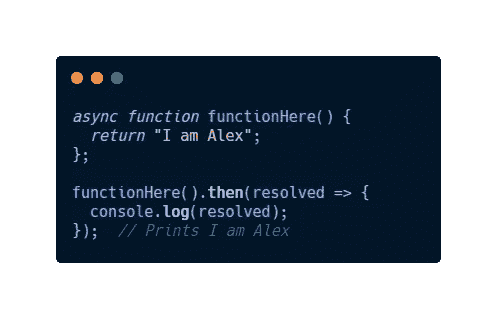
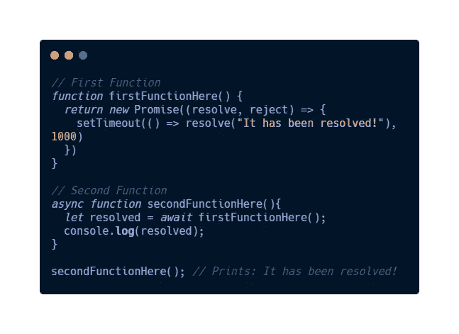
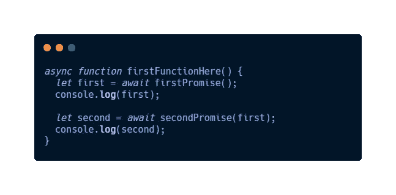
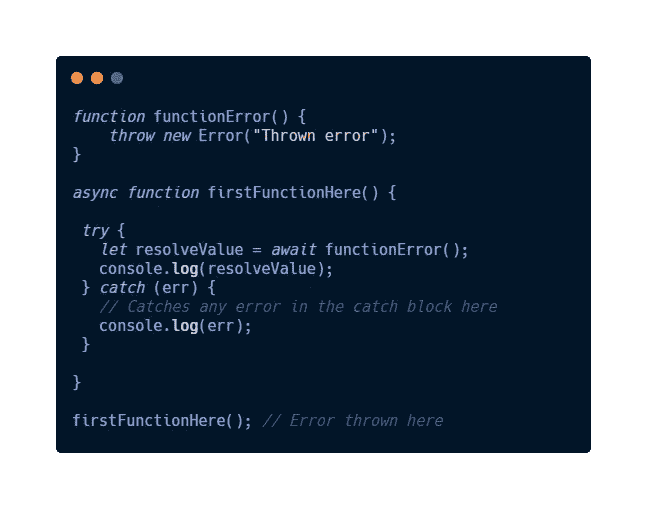
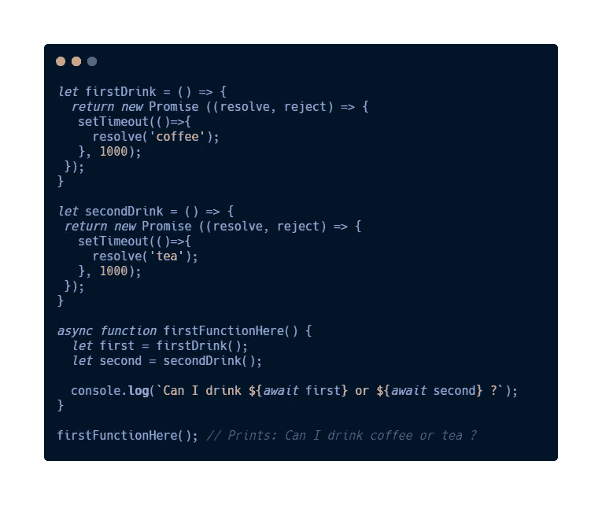
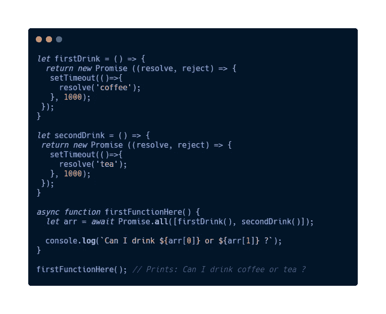

# 解释:关于异步 JavaScript 你需要知道的

> 原文：<https://javascript.plainenglish.io/explained-all-you-need-to-know-about-asynchronous-javascript-d8ba58a11ed5?source=collection_archive---------14----------------------->

## 先说' **ay-SIHN-kro-nuhs' JavaScript。**

在阅读本文之前，以下是先决条件:

Photo by [Joshua Aragon](https://unsplash.com/@goshua13?utm_source=medium&utm_medium=referral) on [Unsplash](https://unsplash.com?utm_source=medium&utm_medium=referral)

*   [JavaScript 基础知识](https://carbon.now.sh/?bg=rgba%28171%2C+184%2C+195%2C+1%29&t=night-owl&wt=none&l=javascript&ds=false&dsyoff=20px&dsblur=68px&wc=true&wa=false&pv=56px&ph=56px&ln=false&fl=1&fm=Hack&fs=15px&lh=131%25&si=false&es=1x&wm=false&code=let%2520firstDrink%2520%253D%2520%28%29%2520%253D%253E%2520%257B%250A%2520%2520return%2520new%2520Promise%2520%28%28resolve%252C%2520reject%29%2520%253D%253E%2520%257B%250A%2520%2520%2520setTimeout%28%28%29%253D%253E%257B%250A%2520%2520%2520%2520%2520resolve%28%27coffee%27%29%253B%250A%2520%2520%2520%257D%252C%25201000%29%253B%250A%2520%257D%29%253B%250A%257D%250A%250Alet%2520secondDrink%2520%253D%2520%28%29%2520%253D%253E%2520%257B%250A%2520return%2520new%2520Promise%2520%28%28resolve%252C%2520reject%29%2520%253D%253E%2520%257B%250A%2520%2520%2520setTimeout%28%28%29%253D%253E%257B%250A%2520%2520%2520%2520%2520resolve%28%27tea%27%29%253B%250A%2520%2520%2520%257D%252C%25201000%29%253B%250A%2520%257D%29%253B%250A%257D%250A%250Aasync%2520function%2520firstFunctionHere%28%29%2520%257B%250A%2520%2520let%2520arr%2520%253D%2520await%2520Promise.all%28%255BfirstDrink%28%29%252C%2520secondDrink%28%29%255D%29%253B%250A%250A%2520%2520console.log%28%2560Can%2520I%2520drink%2520%2524%257Barr%255B0%255D%257D%2520or%2520%2524%257Barr%255B1%255D%257D%2520%253F%2560%29%253B%250A%257D%250A%250AfirstFunctionHere%28%29%253B%2520%252F%252F%2520Prints%253A%2520Can%2520I%2520drink%2520coffee%2520or%2520tea%2520%253F)
*   JavaScript 中的类
*   JavaScript 中的模块
*   [JavaScript 中的承诺](/explained-all-you-need-to-know-about-javascript-promises-5d35df9d9919)

# 类比

Photo by [Rob Schreckhise](https://unsplash.com/@robschreckhise?utm_source=medium&utm_medium=referral) on [Unsplash](https://unsplash.com?utm_source=medium&utm_medium=referral)

一般来说，asynchronous——发音为 **ay-SIHN-kro-nuhs** ，来源于希腊语 ***asyn-*** ，意为“**不与**”和 ***chronos*** ，意为“**time**”——是一个形容词，描述时间上不协调的事件。

通常在构建网站或 web 应用程序时，我们肯定会遇到异步操作——我们可以在转移到其他任务时等待的操作。例如，从数据库获取数据并向特定网络发出请求。

## JavaScript 是特殊的。为什么？

JavaScript 是**非阻塞**的，这意味着 JavaScript 为程序提供了在等待长时间运行的任务完成时继续运行其他代码的机会。这项耗时的任务在后台执行，而其余代码继续执行。JavaScript 使用一个**事件循环**，它使我们能够在等待异步操作完成的同时执行代码。

随着 JavaScript 的不断发展，2017 年发布的 **ES8** 引入了一种全新的使用`async`和`await`处理异步操作的方式。`async`和`await` 在 JavaScript 中充当了语法糖的角色，它并没有引入任何功能，也没有任何伟大的特性。

Picture from Google

## 什么是**句法糖**？

简而言之，**语法糖**构建在一种编程语言中，它允许增加我们代码的可读性和可伸缩性，同时保持其语法简洁。

Photo by [Mae Mu](https://unsplash.com/@picoftasty?utm_source=medium&utm_medium=referral) on [Unsplash](https://unsplash.com?utm_source=medium&utm_medium=referral)

# async 和 await 关键字

我们使用`async`关键字来编写处理异步任务的函数。

例如:

Example of **async**

`async`函数总是返回一个承诺，这意味着它符合链接目的。有了`async`，就可以用`.then()`和`.catch()`连锁了。

例如:

Example of chaining

*   从上面的例子中，我们创建了一个名为`functionHere()`的函数，它返回一个字符串，具体来说是“T10”。
*   然后我们调用该函数并用`.then()`链接它，然后它将把解析后的值打印到控制台上，即“`I am Alex`”。

那么`await`呢？

在 JavaScript 中，我们通常在代码中将`async`和`await`合并在一起。在上面的例子中，独立的`async`，`async`几乎不能执行这么多。

`await`返回承诺的解析值，`await`暂停`async`函数的执行，直到给定的承诺被解析。如果一个特定的`Promise`被拒绝，那么`await`将向控制台抛出一个被拒绝值的错误。

举个例子，

Example of **await**

*   首先，我们创建了第一个函数，它有一个`Promise`，这个函数的`setTimeout()`带有`reject`或`resolve`。
*   然后，我们用`async`和`await`创建了第二个函数。这就是`async` 和`await`发挥作用的地方。
*   在我们的`async`函数`secondFunctionHere()`中，我们加入了`await`来暂停代码的执行，直到在**一秒**后`firstFunctionHere()`被解决。然后，我们将解析后的值附加到一个名为`resolved`的变量中，然后我们将解析后的值记录在函数中。
*   最后，我们调用了名为`secondFunctionHere()`的函数，它将为我们提供解析后的值`It has been resolved!`。

# 2)处理依赖承诺

`async`和`await`的真正吸引力在于处理一系列相互依赖的异步任务。最初我们将使用`.then()`来处理相互依赖的承诺，但是在本文中，我们将学习如何使用`await`来处理它。

举个例子，

Example of **promises** depend on one another

*   首先，我们用`async`关键字做一个函数。
*   在这个函数中，我们将创建一个变量来保存等待承诺的解析值。在这种情况下，我们将`await firstPromise()`保存到`first`变量中，然后我们将记录它。
*   之后，我们创建另一个名为`second`的变量，它将保存承诺的解析值`secondPromise(first)`。
*   最后但同样重要的是，我们将`second`的值记录到控制台。

作为链接`.then()`函数的替代方法，`async...await`语法使开发人员调试代码变得更加容易，因为它节省了一些输入并提高了代码的可读性。

# 3)处理错误

每个人都讨厌错误，但是有一种方法可以测试我们的代码是否有错误。我们可以一起使用`try...catch`和`async...await`关键词。此外，`try...catch`也允许同步和异步代码的共享错误处理。

举个例子，

Example of **try…catch**

*   在第一个函数中，我们创建了一个错误`thrown new Error(“Thrown error”);`。
*   我们用`async...await`创建另一个函数，并使用`try...catch`来捕捉代码中任何潜在的错误。
*   在我们的`try`块中，我们创建了一个变量并用`await`关键字设置了`functionError()`,意思是我们将暂停我们的程序来检查它是被**解决了**还是被**拒绝了**。
*   由于函数会抛出一个错误，那么`catch`块将开始捕捉错误。
*   最后，我们将它记录到控制台，这将导致一个错误。

# 4)处理独立承诺

为什么要处理独立承诺？有时我们会遇到这样一种情况，即多个`async`函数包含多个承诺，这些承诺在执行时并不相互依赖。那我们应该怎么做呢？

举个例子，

Example of **independent promises**

*   在顶部，我们编写了解析值为`coffee`的`firstDrink()`函数和解析值为包含`setTimeout()`的`tea`函数的`secondDrink()`。
*   然后我们用`async...await`创建另一个函数。然后，我们为`firstDrink()`和`secondDrink()`函数声明每个变量。我们用`await`创造我们的承诺。为什么？**因为上面的例子是独立承诺。**
*   最后，我们将只在最后用`await`进行字符串插值，它将处理独立的承诺，然后返回`Can I drink coffee or tea ?`。
*   如此说来，`firstDrink()`和`secondDrink()`异步操作可以同时运行。
*   通过在函数中使用我们的`async`关键字，我们应该能够利用 ***的并发性，*** 的意思是在重叠的时间段内运行的多个异步操作。

# 5)使用 Promise.all

利用 ***并发*** 的另一种方法是在处理多个承诺时使用`await`和`Promise.all([])`。通过使用这个，我们可以将一个承诺数组作为参数传递给`Promise.all([])`，这意味着只有当数组中的所有承诺都被解析时，承诺才会被解析。

在`Promise.all([])`中，每个承诺都有一个解析后的值，它将存储在一个数组中。然而，如果`Promise.all([])`里面的承诺之一失败，那么一切都将失败，这就是所谓的 ***失败快*** 。一旦有一个承诺被拒绝，它不会等待其余的异步操作完成。

举个例子，

Example of **Promise.all([ ])**

*   在上面的例子中，我们创建了两个将返回解析值的函数。
*   然后我们用`async`创建一个函数，在这个函数中，我们将创建一个名为`arr`的变量，它将`await`并使用`Promise.all([])`。
*   允许我们利用异步性——两个异步任务中的每一个都可以并发处理。
*   然后，我们将一组承诺作为参数传递给`Promise.all([])`，它将返回一个承诺。每个承诺的解析值将存储在一个数组中。
*   最后但同样重要的是，我们通过使用括号符号访问解析的值来将其记录到控制台。我们会得到`Can I drink coffee or tea ?`。

# 关键外卖

1.  `async...await`是内置在 JavaScript 中的语法糖，与使用导致 ***回调地狱*** 的回调相比，它增加了我们代码的可读性。
2.  在我们的`async`函数中使用`try...catch`关键字来处理代码中的错误。
3.  编写相互依赖而不相互依赖的代码。
4.  在`async`函数中，我们使用`await`来暂停我们代码的执行，直到一个异步任务完成，并且承诺不再挂起，这意味着它已经被解决。
5.  通过使用允许异步操作同时发生的`async`函数来利用并发性。

# 结论

太好了！您已经到了本文的结尾，这就是您需要了解的关于 JavaScript 中异步性和`async...await`用法的全部内容。你从这篇文章中学到了什么吗？希望你觉得这篇文章有用，谢谢你的阅读。

更多阅读:

 [## 新手应该知道的 JavaScript 迭代器

### 迭代器平滑了我们的代码，增加了可读性

javascript.plainenglish.io](/iterators-in-javascript-you-should-know-as-a-newbie-c1bf23fb50b2) 

*通过*[***LinkedIn***](https://www.linkedin.com/in/eugene-goh-5236241a9/)*和*[***Twitter***](https://twitter.com/EugeneGohHere)***与我联系。***

*更多内容请看*[*plain English . io*](http://plainenglish.io/)