# 解释:所有你需要知道的关于 JavaScript 的承诺

> 原文：<https://javascript.plainenglish.io/explained-all-you-need-to-know-about-javascript-promises-5d35df9d9919?source=collection_archive---------8----------------------->

## 你的父母答应过给你买你想要的东西吗？

在您开始阅读本文之前，您需要了解以下先决条件:

*   [JavaScript 基础知识](https://medium.com/dev-genius/master-javascript-basics-in-8-minutes-97b3c679eade)
*   JavaScript 中的类
*   JavaScript 中的模块

Photo by [Andrew Petrov](https://unsplash.com/@andrewwwpetrov?utm_source=medium&utm_medium=referral) on [Unsplash](https://unsplash.com?utm_source=medium&utm_medium=referral)

## JavaScript 中的异步操作是什么？

异步操作是指允许计算机在等待异步操作完成的同时继续执行其他代码的操作。也就是说，我们可以通过使用异步方法来节省时间，并防止程序暂停。

**异步操作**的一个真实例子是当你的机器人帮你做家务时；在此期间你可以做任何你想做的事情。

计算机也是如此。我们在编程中也使用异步方法。例如，像向数据库发出网络请求这样的操作可能会很乏味并且非常耗时，但是 JavaScript 有能力在等待其完成的同时执行其他任务。

让我们深入研究使用`Promise`处理异步操作的现代 **JavaScript** 。

# JavaScript 中的宏任务

在理解 JavaScript 中的 Promise 之前，应该先理解 macrotasks。宏任务使开发人员能够以同步方式异步执行任务。JavaScript 中有一些宏任务。比如`[**setInterval**](https://developer.mozilla.org/en-US/docs/Web/API/WindowOrWorkerGlobalScope/setInterval)`、`[**setImmediate**](https://developer.mozilla.org/en-US/docs/Web/API/Window/setImmediate)`、`[**setTimeout**](https://developer.mozilla.org/en-US/docs/Web/API/WindowOrWorkerGlobalScope/setTimeout)`、T14。

但是为了这篇文章，我将只通过`setTimeout`。那么，`setTimeout`到底是做什么的呢？`setTimeout`是一个**节点 API** **(也称为 web API)** ，它对延迟后要执行的任务进行排序。`setTimeout`接收一个回调函数和你希望它延迟多少毫秒。

例如:

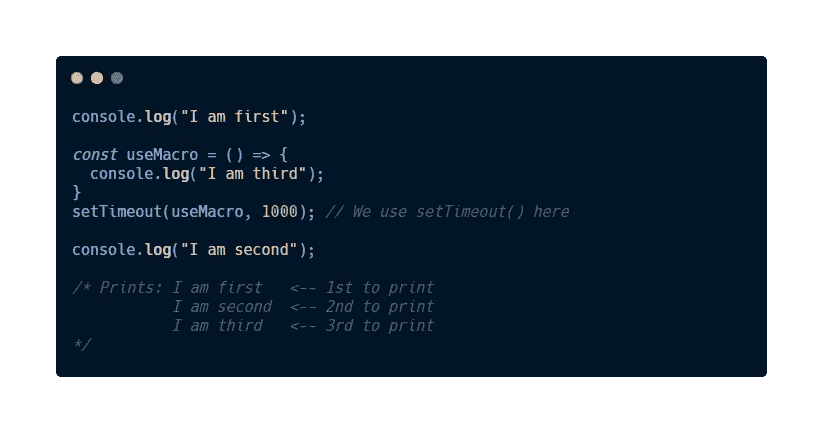

Example of **setTimeout( )**

*   从上面的例子中，我们将首先完成同步操作，即`console.log(“I am first”);`,它将压入堆栈并打印到控制台。

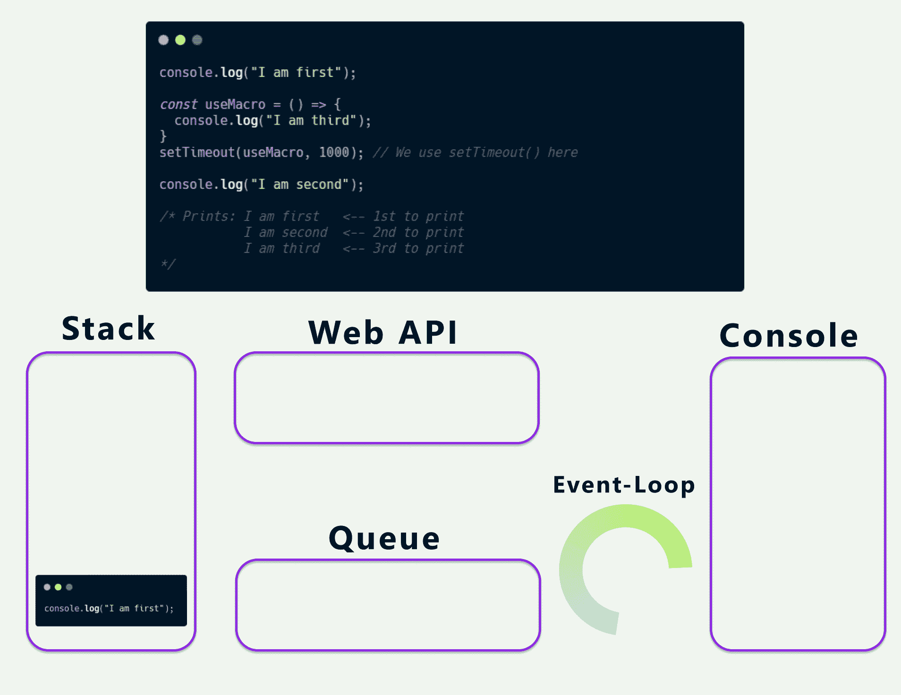

Example of **console.log(“I am first”);**

*   接下来是`console.log(“I am second”);`。

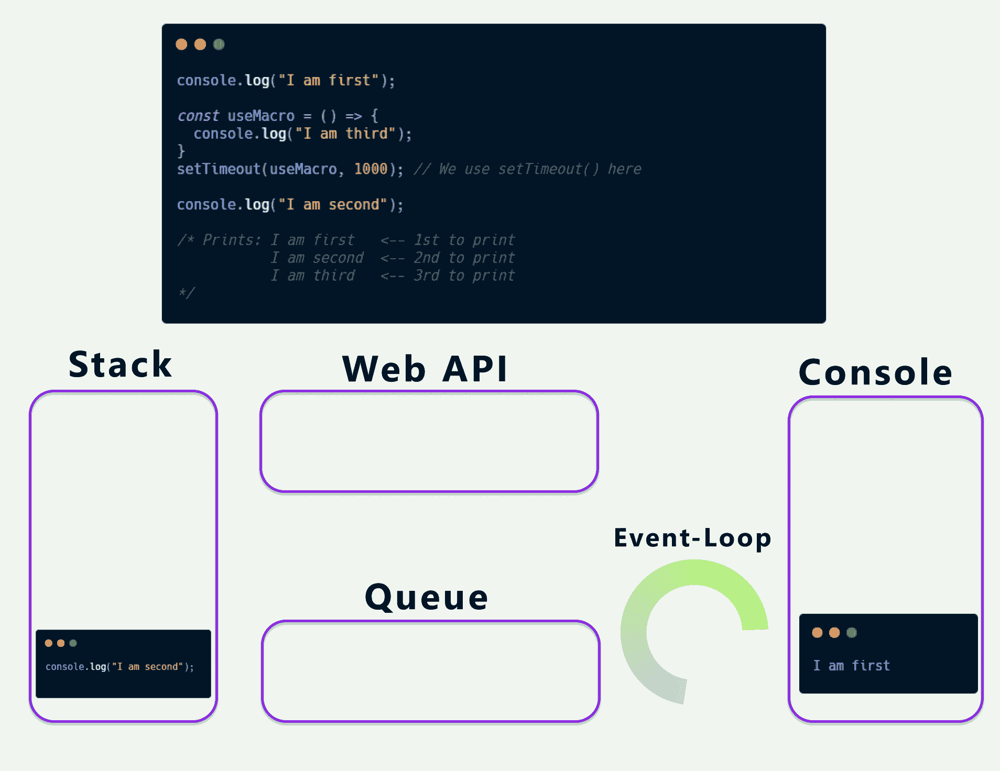

Example of **console.log(“I am second”);**

*   然后到了`useMacro`回合，`useMacro`只会在 1 秒后执行。这种延迟是异步执行的。这意味着我们的程序不会在延迟期间突然停止。它仍在运行，但现在在一个队列中。我将在下面的图片中解释更多关于队列的内容。以防你需要一些数学帮助:

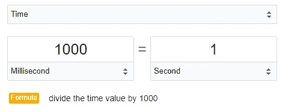

millisecond to second

*   `setTimeout( )`将在栈为空时被推入栈中，回调函数将被推入 Web API 进行处理。

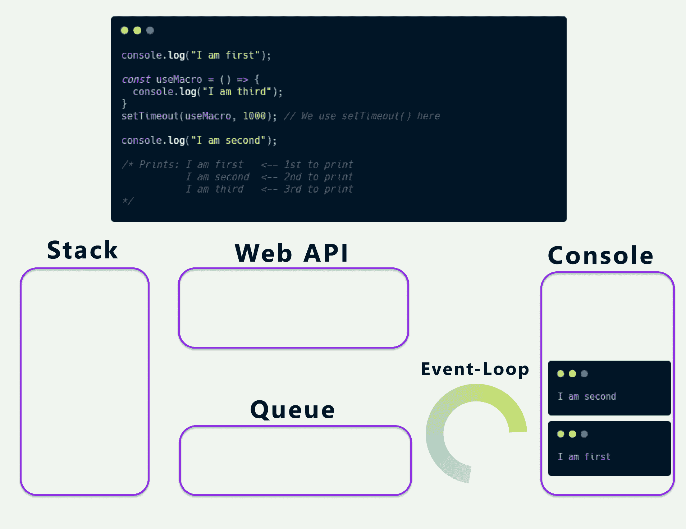

Example of **setTimeout( )**

*   Web API 会将回调发送到队列中，并等待完成。

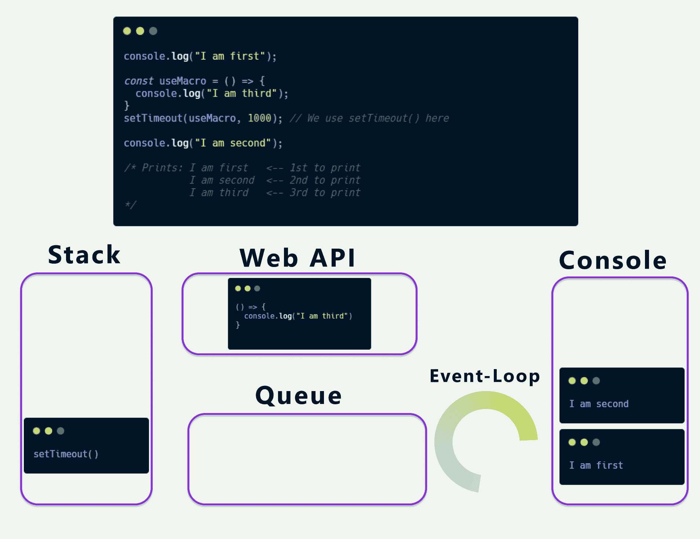

Example of **setTimeout( )**

*   1 秒钟后，队列中的回调函数将被推入堆栈，并记录到控制台的`I am third`。

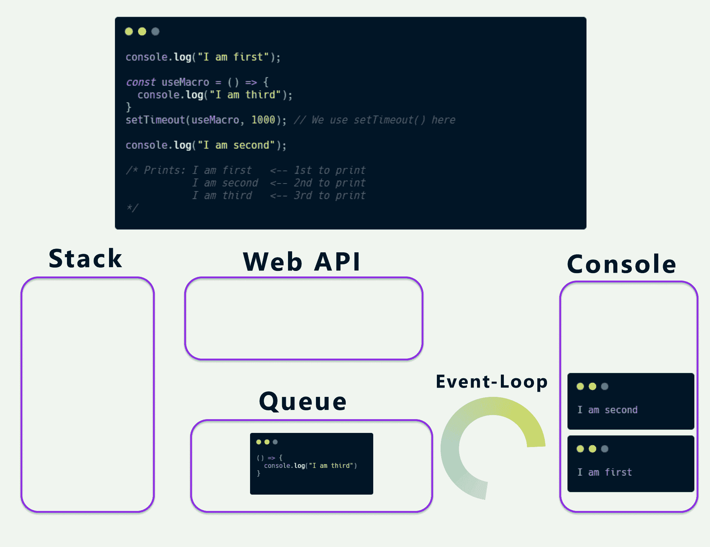

Example of **console.log(“I am third”)**

*   在异步 JavaScript 中，有一个东西叫做 [**事件循环**](https://developer.mozilla.org/en-US/docs/Web/JavaScript/EventLoop) 。Event-loop 的工作是充当**队列**和**堆栈之间的中间人；如果堆栈中什么都没有，那么队列中的代码将被推入堆栈并开始执行。**
*   在`useMacro`可以运行之前，同步代码将首先运行。最后，在所有的同步代码之后，`useMacro`将运行并返回`I am third`到控制台。
*   这就是我们最终会得到的结果:

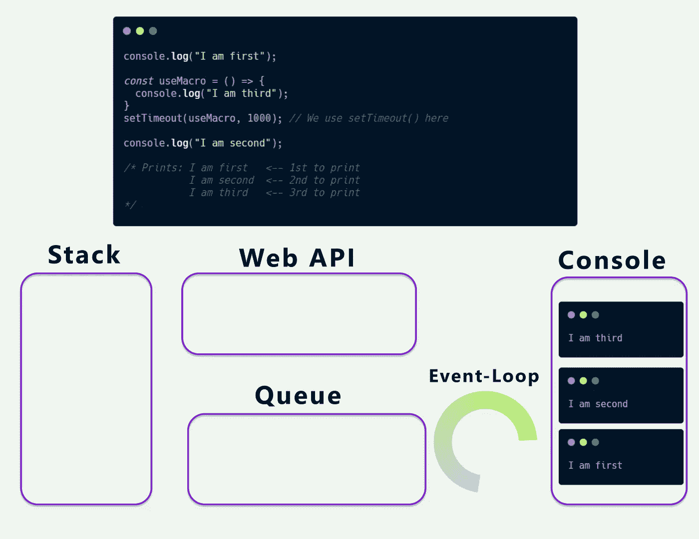

Example of the final result

# 那么，什么是承诺呢？

承诺是表示异步操作的未来结果(*成功*或*失败*)的对象。

承诺由三种状态组成:

*   **待定**:尚未完成操作的初始状态。
*   **已履行**:操作已成功完成，承诺具有已解析的值。
*   **拒绝**:操作失败，承诺有失败原因。通常会导致一个`Error`。

一个现实生活中的承诺的例子:

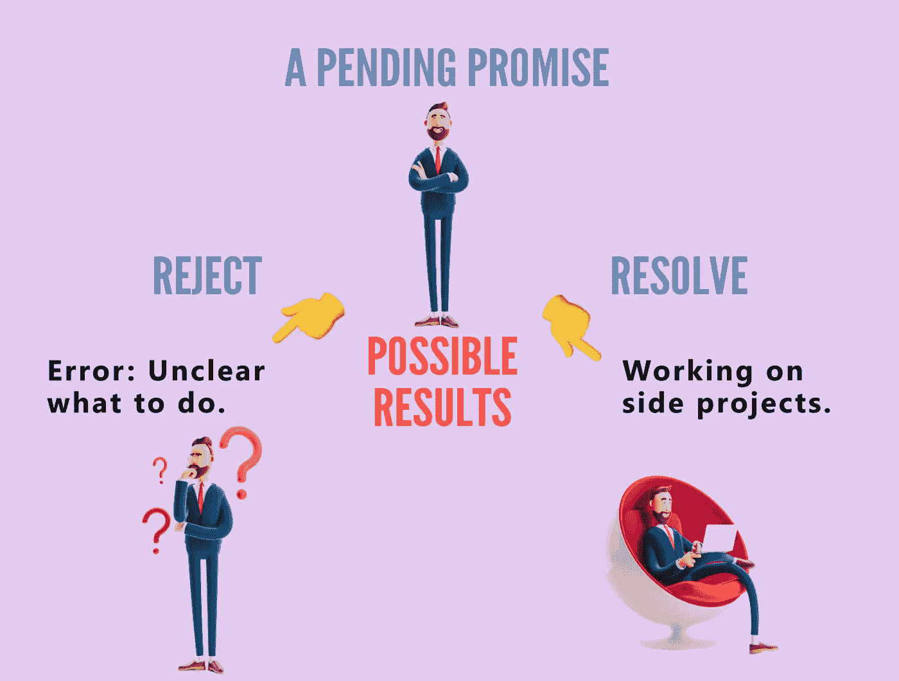

An example of a **promise**

从上图可以看出，承诺初始状态将一直处于 ***等待*** 模式。如果它被解析，那么它将有一个解析值，否则如果它被拒绝，它将有一个`Error`来说明失败的原因。

# 承诺对象长什么样？

我们使用`new`关键字和`Promise`构造函数方法来创建一个新的`Promise`对象。

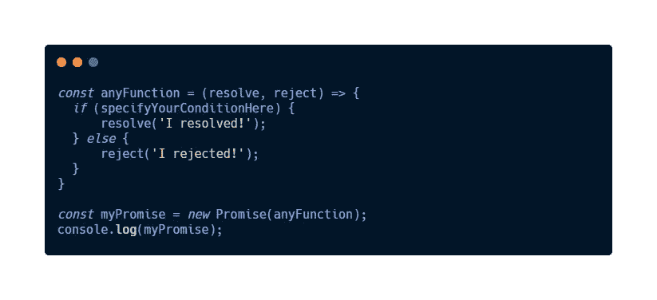

An example of a **promise object**

*   首先，我们将制作一个函数，该函数也被称为 ***执行函数。*** 从上面的例子来看，`anyFunction`就是我们的 ***执行程序功能*** 。
*   ***执行器函数*** 将接收两个函数作为参数，它们将决定未来的结果。
*   `resolve`和`reject`是作为参数的两个函数。
*   如果`specifyYourConditionHere`为**真**，那么`resolve( )`代码将运行并返回`‘I resolved!’`。然后将*承诺的状态*从**待决**变为**已履行**。
*   否则`reject( )`代码将运行并返回`‘I rejected!’`。然后将*承诺的状态*从**待决**变为**拒绝**。
*   `Promise`构造函数接受一个函数参数，即 ***执行器函数*** ，开始异步运行代码。结果将是**解决**或**拒绝**。

# 如何使用承诺？

由于`Promise`的初始状态将始终处于**待定**模式，承诺将始终有一个未来结果，要么**履行**要么**拒绝**。

但是你有没有问过自己，在它运行完`Promise`之后，我能做什么？

我们可以使用`.then( )`来跟进另一个动作。这个方法总是返回一个`Promise`。

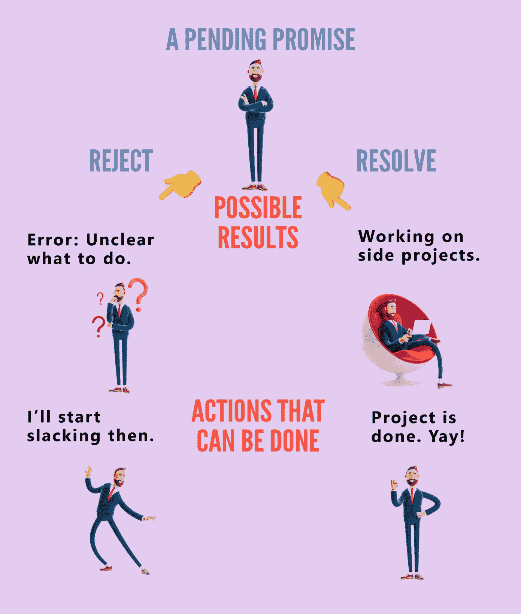

An example of using `**promise**`

从上面的例子来看，

*   如果`pending promise`得到`resolve`的结果，这意味着**满足**，那么项目完成。
*   如果一个`pending promise`得到一个`reject`的结果，这意味着**被拒绝**，那么它将开始偷懒。

供您参考，`.then( )`是一个高阶函数，它使用**两个参数**来表示**回调函数**。两个参数的**称为**处理程序**。**

有哪些**两个经手人**？

1.  第一个处理程序称为**成功处理程序**、`onFulfilled`。它应该包含表明承诺已解决的逻辑。
2.  第二个处理程序被称为**故障处理程序**、`onRejected`。它应该包含表明承诺被拒绝的逻辑。

# 如何使用成功/失败处理程序作为回调函数？

当**被解决**或**被拒绝**时，为了处理一个成功或失败的承诺，我们可以将成功和失败处理程序传递到一个**回调函数**，然后用`.then( )`调用它，如下所示:

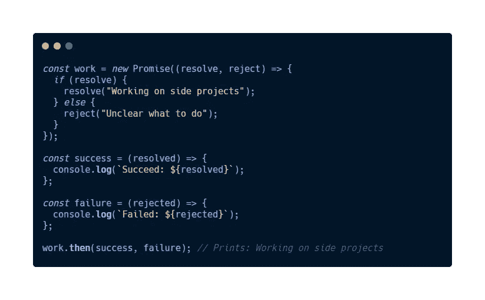

An example of **success/failure handlers** using **callback functions**

从上面的例子来看:

*   `work`是一个承诺，用一个条件语句检查它是否被解析，然后它将返回一个被解析的值`Working on side projects`，否则返回一个被拒绝的值`Unclear what to do`。
*   然后我们将定义一个函数`success( )`和`failure( )`。然后我们将打印传递给它的参数。
*   接下来，我们用`.then( )`调用`work`，传入`success( )`和`failure( )`函数。
*   您可能已经知道，它将被解析并返回一个值，然后记录到控制台`Working on side projects`。

## 为什么不遵循关注点分离(SoC)规则？

以上只是开始，遵循[**【SoC】**](https://en.wikipedia.org/wiki/Separation_of_concerns)**的规则，这就是`.catch( )`功能发挥作用的地方。**

**该函数将只接受一个参数`onRejected`，并返回拒绝的原因。`.catch( )`实现与`.then( )`相同的功能，但仅用于抓住`Error`。**

**例如:**

**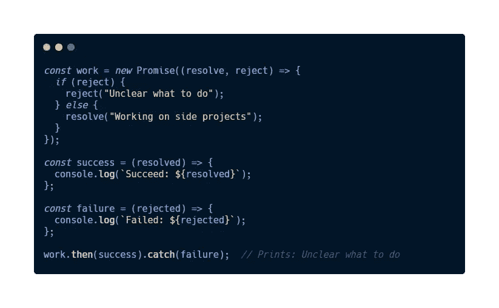**

**Example of **SoC****

**图中有一个使用`.catch( )`的代码片段。由于`reject`为真，因此我们将返回`Unclear what to do`作为拒绝的理由。**

**通过实现 **SoC，**我们能够提高代码的可读性，并在代码的某个特定部分出错时更容易调试。**

## **如何使用承诺。所有()？**

**如果您有一大堆承诺呢？你会等到所有的承诺都一一解决吗？这就是`Promise.all( )`发挥作用的地方。**

**`Promise.all( )`接受一系列承诺，但只回报一个承诺。**

*   **如果数组中的每个承诺都被解析，那么`Promise.all( )`将返回一个包含解析值的承诺。**
*   **如果数组中的单个承诺被拒绝，则后续等待解析的承诺也将被拒绝，也称 ***快速失败*** ，则`Promise.all( )`返回包含拒绝原因的承诺。**

**例如:**

**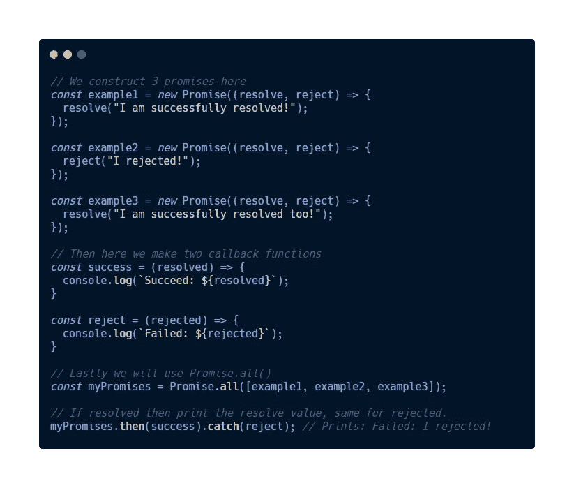**

**Example of **Promise.all( )****

*   **综上所述，我们有**三个** **承诺**等待完成。**
*   **其次，我们使用**成功**和**失败处理程序**作为**回调函数**。**
*   **然后我们创建一个变量，存储`Promise.all( )`。**
*   **`Promise.all( )`将决定**三个承诺**是**拒绝**还是**决议**。**
*   **最后，我们调用变量`myPromises`和`.then( )`返回解析值和`.catch( )`拒绝原因。**
*   **由于**一个承诺**被拒绝即`example3`，那么`.catch( )`将会尽力找出被拒绝的原因即`Failed: I rejected!`。**

# ****结论****

**这就是 JavaScript 中的承诺。请记住，承诺是能够解决或**拒绝的东西——它将永远处于**等待模式**。你从这篇文章中学到了什么吗？我希望你觉得这篇文章有用，谢谢你的阅读。****

***通过*[***LinkedIn***](https://www.linkedin.com/in/eugene-goh-5236241a9/)*和*[***Twitter***](https://twitter.com/EugeneGohHere)***与我联系。*****

***更多内容请看*[*plain English . io*](http://plainenglish.io/)**