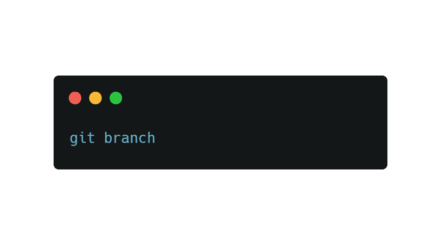

# 解释:Git 中需要的基本命令

> 原文：<https://javascript.plainenglish.io/explained-basic-commands-youll-need-in-git-843d7ccfc3bb?source=collection_archive---------16----------------------->

## 版本控制技术

在阅读本文之前，以下是先决条件:

*   关于 [GitHub](https://github.com/) 的知识
*   基本的命令行知识

**Git 是一个被定义为行业标准版本控制系统的软件。什么是版本控制系统？**

Photo by [Reka Illyes](https://unsplash.com/@reka_illyes91?utm_source=medium&utm_medium=referral) on [Unsplash](https://unsplash.com?utm_source=medium&utm_medium=referral)

一个**版本控制系统**是一个允许开发者对一个文件进行修改的系统，随时跟踪你对你的项目所做的修改，并恢复修改。作为开发人员，很好地理解 Git 对您的日常工作至关重要。为了提高生产率并与其他开发人员在项目上合作，您还需要 Git。总而言之，Git 是一个可以让你穿越时空回到过去的软件。

让我们开始在项目中使用 Git 的旅程。

# 下载 Git

首先也是最重要的，你将需要从 [**Git 的官网**](https://git-scm.com/) 下载 Git。下载后，您会看到类似这样的内容:

Example of **Git**

要检查**是否成功安装**，使用以下命令:

Example of `**version**`

是啊！它已成功安装。

最后但同样重要的是，您需要按照 GitHub 文章给出的步骤设置 **Git 用户名**和**电子邮件**。

 [## 在 Git 中设置您的用户名

### Git 使用用户名将提交与身份相关联。Git 用户名和你的 GitHub 用户名不一样…

docs.github.com](https://docs.github.com/en/github/getting-started-with-github/setting-your-username-in-git)  [## 设置您的提交电子邮件地址

### 您可以在 GitHub 和您的计算机上设置用于创作提交的电子邮件地址。GitHub 使用您的提交…

docs.github.com](https://docs.github.com/en/github/setting-up-and-managing-your-github-user-account/setting-your-commit-email-address) 

# Git 工作流

## 1)基本 Git 工作流程

在项目中使用 Git 命令之前，让我们先了解一些基本的 Git 工作流。如图所示，工作流程可以分为 3 个部分。

Example of Git workflow

*   **当前目录**:这是初始化之后，我们接下来讲初始化的地方。您对任何文件所做的所有更改都将被跟踪。例如，添加、删除、重构文件，以及修改代码库中的一些代码。初始化后，Git 将始终跟踪您所做的所有修改。
*   **暂存区**:将自己制作的文件添加到目录中的地方。它就像是**当前目录**和**存储库**之间的中间人。
*   存储库:Git 存储您之前所做更改的地方

# Git 命令

## 2) git 初始化

这是初始化阶段，继续在 Git bash 中打开你的项目目录。我们将首先初始化存储库。输入如下所示的命令:

Example of **initialization**

输入这个命令后，您的项目将开始跟踪您通过 Git 对项目所做的更改。`init`基本上只是表示**初始化**。

> 注意:如果您不在 Git 存储库中或者没有初始化存储库，您将无法使用 Git 命令。

## 3) git 状态

检查您对存储库所做更改的状态。使用此命令:

Example of checking the status

通过使用这个，Git 将向您显示文件的哪一部分或者哪些文件已经被修改或编辑。

## 4) git 添加

将文件添加到临时区域的命令。我们可以通过键入以下命令来添加到临时区域:

Example of adding files

就是这样！您的文件已被添加到**暂存区**。要验证您的文件是否已经添加到暂存区域，只需输入命令`git status`。

当你有许多文件准备上演，这是恼人的权利键入`git add`一个接一个？通过键入以下命令，您可以轻松地将所有文件添加到临时区域:

Example of add all files

`.`仅仅意味着轻松地将所有文件添加到暂存区。

## 5) git 差异

一个命令，用于区分文件中已更改和尚未转移的部分。

Example of differentiating changes

## 6) git 提交-m " "

提交是我们基本 Git 工作流的最后一步。提交将把来自暂存区的更改存储在存储库中。

An example of committing

`git commit`是一个命令，在这个命令中你将做某事。`-m`代表你应该给出的信息，任何描述性信息都可以。请注意，你应该始终包括一个引号，并应写在现在时。一个简短的描述性信息就足够了，你不需要一个长篇大论的信息。

## 7) git 日志

要引用项目的早期版本，请使用以下命令:

Refer to the earlier version of a project

输入命令后，您将看到一个长 SHA 代码，即所谓的 40 个字符的 SHA，它充当提交的唯一名称、提交的日期和时间、提交的作者(即您)以及提交的消息。

一个 40 个字符的 SHA 的例子应该是这样的:`039dc572b05d175a89b879a3d606d3b15e2bebc1`。

## 那么，你为什么要回顾一段代码的历史呢？

1.  你不能 100%保证你的项目工作流程会顺利进行。如果你为你的程序实现了一个新特性，而你的程序出了问题，那该怎么办？
2.  如果您想在以前版本的代码的基础上实现一些新特性，该怎么办？

认识到上述问题后，当你在自己的项目或团队中工作时，一个好的提交消息是必须的。

# 分支

## 什么是分支？

一个分支基本如下图所示。

Photo by [Delaney Archer](https://unsplash.com/@delanerosee?utm_source=medium&utm_medium=referral) on [Unsplash](https://unsplash.com?utm_source=medium&utm_medium=referral)

在项目协作中，开发人员通常会打开多个*分支*，通过将它们从`master`分支中分离出来以防止出现问题，从而试验项目中的不同特性。这些分支随后将合并到具有新特征的`master`分支中。

为了给你总结 Git 中的分支，我在下面做了一个可视化的图片。

Example of branches

# 分支中的命令

## 1) git 分支 branch_name

要创建新的分支，只需键入以下命令:

Example of creating branches

一定要给你的分支起一个描述你正在做的事情的名字，或者足够的描述性，让其他人知道你正在尝试用你创建的分支做什么。注意，创建分支不能有空格。例如，`your branch name`无效，因为它包含空格。

## 2) git 分支

要检查您所在的分支，请键入以下命令:

Example of branch

输入之后，您将能够在 Git Bash 中看到输出的分支。带*(星号)的表示您当前所在的分支。

## 3) git 检验

基本上，到目前为止，您已经创建了几个分支，如下所示:

Types of branches you have

假设你想换一个名为`branch2`的分支。你可以像这样使用`git checkout`。

Example of switching branch

更改分支后，您可以在不影响`master`分支的情况下，在另一个分支上开发新特性。你不必担心你的工作流，你实现的特性会损害你的项目。

## 4)提交新的分支

你现在感到安全了，因为你在另一个分支上实现的新特性不会影响到`master`分支，不是吗？现在，你必须承诺一个新的分支，具体来说就是`branch2`。

要向新分支上的临时区域添加新的更改，请键入以下命令:

Example of adding changes to the staging area

在暂存之后，您希望用如下描述性消息提交它:

Example of committing

## 5)合并

你已经为你的新分支增加了大量的功能。你会怎么做？当然，我们会把它合并到`master`分支。我们称这个过程为 ***合并*** 过程。

在合并之前，你应该通过键入`git checkout master`首先切换到`master`分支。我们的目标是用在`branch2`分支上所做的改变来更新`master`。为此，我们将输入 merge 命令:

Example of merging

## 6)删除分支

一切终将结束，就像 Git 中的分支一样。首先，您创建它们，在分支上实现特性，将它们集成到`master`分支中，然后分支的最终目标是合并它。这标志着我们分公司生命周期的结束！您肯定需要这个命令来保持 Git 分支的整洁。

Example of deleting a branch

上面的命令只是意味着我们删除了分支，剩下的只是`master`分支。

Example of one branch

总结一下分支，Git 分支在测试不同版本的新特性时非常重要，不会破坏主分支和整个项目。

# 结论

这标志着 Git 命令基础教程的结束。关于 Git 命令的基础知识，我已经介绍了您应该知道的一切。你从这篇文章中学到了什么吗？希望你觉得这篇文章有用，谢谢你的阅读。

更多阅读:

 [## 解释:关于异步 JavaScript 你需要知道的

### 先说‘ay-SIHN-kro-nuhs’JavaScript。

javascript.plainenglish.io](/explained-all-you-need-to-know-about-asynchronous-javascript-d8ba58a11ed5) 

*通过*[***LinkedIn***](https://www.linkedin.com/in/eugene-goh-5236241a9/)*和*[***Twitter***](https://twitter.com/EugeneGohHere)***与我取得联系。***

*更多内容请看*[*plain English . io*](http://plainenglish.io/)