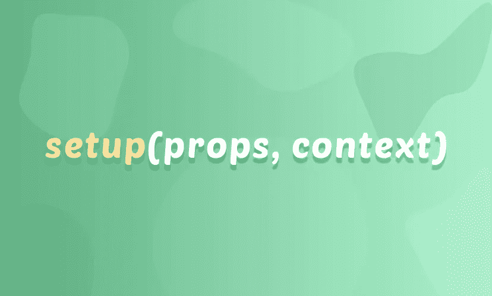

# 对 Vue 上下文参数的解释——一个组合 API 教程

> 原文：<https://javascript.plainenglish.io/explaining-the-vue-context-argument-a-composition-api-tutorial-864f9c3a41ce?source=collection_archive---------21----------------------->


Photo by [Joshua Aragon](https://unsplash.com/@goshua13?utm_source=medium&utm_medium=referral) on [Unsplash](https://unsplash.com?utm_source=medium&utm_medium=referral)

当在 Vue 3 [组合 API](https://learnvue.co/2020/01/4-vue3-composition-api-tips-you-should-know/) 中工作时，有全新的方式来访问组件功能。在本文中，我们将看看设置函数的上下文参数。

这些改变是必要的，因为在组合 API 中，我们没有像在选项 API 中那样引用`this`。

在 Options API 中，我们可以在任何选项中调用`console.log(this)`,并获得对组件本身的引用——让我们能够访问它的属性、计算属性、数据等等。

```
export default { 
  props: { lastName: String, }, 
  data() { 
    return { 
      name: 'hello' 
    } 
  }, 
  created() { 
    console.log(this.lastNameModifiers) // props are on `this` 
    console.log(this.name) // data is on `this` 
    this.createdMethod() // methods are on `this` 
  }, 
  methods: { 
    createdMethod() { 
      console.log('created' )
    } 
  } 
}
```

然而， [Vue 3 允许我们使用组合 API](https://learnvue.co/2020/12/setting-up-your-first-vue3-project-vue-3-0-release/) ，其中我们所有的代码都位于一个`setup`函数中。这意味着 setup 是我们声明反应数据、方法和计算属性的地方。

```
import { ref } from 'vue' export default { 
  props: { lastName: String, }, 
  setup () { 
    // how do we access props without this??
    const createdMethod = () => { 
      console.log('created')
    } 
    const name = ref('hello') 
    createdMethod() 
    return { 
      createdMethod, 
      name 
    } 
  } 
}
```

Setup 在我们的组件实例实际创建之前运行，由于我们的 setup 属性实际上是我们为组件定义所有内容的地方，因此**不再使用`this`引用**组件本身。

# 那么我们如何访问组件属性呢？

Composition API 为我们提供了访问重要组件信息的替代方法，比如它的 props 和 slots。



这是可能的，因为我们的设置函数采用了**两个属性**，让我们可以访问一些组件属性:`props`和`context`。

这三个属性是:

1.  `context.attrs` -**非属性**传递给我们的组件
2.  `context.slots` -一个包含我们所有**模板槽的渲染函数**的对象
3.  `context.emit` -我们的组件向**发出事件**的方法

让我们更深入地了解一下其中的每一项。

# 1.上下文.属性

同样，`context.attrs`包含了传递给组件的所有非属性。

这是什么意思？

当我们实际使用我们的组件时，我们添加的任何没有在我们的 props 中声明的元素属性都将在`context.attrs`中可用

假设我们有一个自定义组件，它接受一个名为 value 的属性。

```
export default { 
  props: { value: String, }, 
  setup (props, context) { 
    console.log(context.attrs) 
  } 
}
```

然后在父组件中，我们传递给它几个属性。

```
<template> 
  <custom-component :value="value" test="hi" @close="close" /> </template>
```

我们的日志语句的结果将是:


如您所见，它包含了除我们声明的道具之外的所有内容。这包括事件监听器和 HTML 属性。

这里需要注意的一点是 attrs 是**非反应式**。也就是说，如果我们想要应用副作用来响应属性值的改变，我们应该使用非更新的生命周期钩子。

# 上下文.插槽

接下来，`context.slots`有点令人困惑，所以让我们通过一个例子来看看它什么时候有用。

简而言之，`context.slots`让我们可以访问每个槽的[渲染方法。当我们编写自己的**自定义渲染函数**而不使用模板代码时，这很有用。](https://learnvue.co/2019/12/using-component-slots-in-vuejs%20-%20an-overview/)

Vue 建议在大多数用例中使用模板，但是如果你真的想使用 Javascript 的全部功能，我们可以创建自己的渲染函数。

[Vue 文档中的例子](https://v3.vuejs.org/guide/render-function.html)使用自定义渲染方法的一个很好的例子是，如果我们创建一个组件，它根据道具的值使用不同的等级标题来渲染槽值。

在这段代码中，我们对所有 6 个标题选项使用了 v-if 和 v-else-if 条件。如你所见，有很多重复的代码，看起来非常混乱。

相反，我们可以使用 render 函数以编程方式生成标题。对于组合 API 设置函数，看起来是这样的。

```
import { h } from 'vue'export default { 
  props: { 
    level: Number, 
  }, 
  setup (props, context) { 
    console.log('here') 
    return () => 
      h( 
        'div', 
        {}, // props and attributes: OPTIONAL 
        /* MISSING!! this is where children go, for us our slot */ 
      ) 
  } 
}
```

然而，我们如何让我们的插槽渲染？？

这就是`context.slots`发挥作用的地方。

通过允许我们访问每个插槽的渲染函数，我们可以很容易地将插槽添加到渲染函数中。每个插槽都可以通过其名称来访问，因为我们没有明确地命名我们的插槽，所以它被命名为 default。

```
import { h } from 'vue'export default { 
  props: { 
    level: Number, 
  }, 
  setup (props, context) { 
    console.log('here') 
    return () => 
      h( 
        'div', 
        {}, // props and attributes: OPTIONAL 
        context.slots.default() /* renders our slot */
      ) 
  } 
}
```

现在，如果我们用这样一个简单的父组件运行它

```
<template> 
  <child-component :level="1"> Hello World </child-component> </template>
```

这是我们完成的 DOM 的样子。


Our H1 is programmatically created with our slot

太棒了。

所以，你可能不会经常使用 context.slots，但是当你编写复杂的 Javascript 渲染函数时，它是一个强大的特性。

# 上下文.发出

最后，`context.emit`取代了`this.$emit`，成为我们从组件向[发出事件的方式。](https://learnvue.co/2020/01/a-vue-event-handling-cheatsheet-the-essentials/)

这对于向父组件发送任何类型的事件都很有用，不管有没有数据。

假设我们想要创建一个 X 按钮，它发出一个名为`close`的事件。

然后在我们的父组件中，我们可以用`v-on`指令监听这个关闭事件。

```
<modal-component @close="handleClose" />
```

要获得在 Vue 中使用 [emit 的完整指南，请查看这篇文章](https://learnvue.co/2021/05/a-guide-to-vue-emit-how-to-emit-custom-events-in-vue/)或 [YouTube 教程](https://youtu.be/EEeaG0BTBQo)！

# 在设置中我们不能访问什么

到目前为止，我们已经看到了组合 API 如何让我们访问四个不同的属性:`props`、`attrs`、`slots`和`emit`。

但是由于安装程序在我们的组件实例创建之前运行，我们**将不能**访问这三个组件属性:

这些是我们在`setup`内部声明的属性，但是我们没有一个内置的方法来访问所有数据属性的列表。

# 最后的想法

在本文中，我们已经了解了 Composition API 如何访问一些组件属性。

因为我们不能像 Options API 那样访问它，所以 setup 函数有两个参数可以用来访问组件的 props、attrs、slots 和 emit 方法。

通过使用 props 和上下文参数，我们可以访问强大的组件属性，并为所有类型的 Vue 项目添加完整的功能。

如果你有任何问题，请在下面的回复中留下！

[***如果你有兴趣学习更多关于 Vue 3 的知识，下载我的免费 Vue 3 基本知识备忘单，比如 Composition API、Vue 3 模板语法等等。***](https://learnvue.co/vue-3-essentials-cheatsheet/)

*原载于 2021 年 6 月 3 日 https://learnvue.co**T21*[。](https://learnvue.co/2021/06/explaining-the-vue-context-argument-a-composition-api-tutorial/)