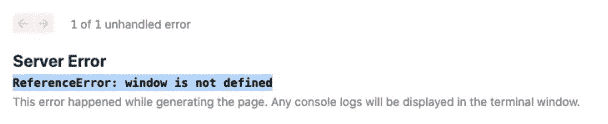

# 探索 Next.js 中的动态导入

> 原文：<https://javascript.plainenglish.io/exploring-next-js-dynamic-import-ccb28a03e7f9?source=collection_archive---------2----------------------->


# 为什么要做动态导入

现在我们使用像 webpack 这样的工具来捆绑我们的 JavaScript，它把我们所有的 JavaScript 放到一个 bundle.js 文件中。它节省了我们许多工作。但问题是，随着现代网站变得越来越复杂，这个文件可能会很大。当浏览器处理这个巨大的 bundle.js 文件时，加载时间可能会长到足以赶走用户。当用户对一个网站来说就是一切的时候，我们绝对不希望这样的事情发生。

为了避免这种情况发生，我们希望单独加载模块。当页面第一次渲染时，所有的模块同时被加载，不管是否需要。现在，我们希望在实际需要的时候加载模块。这叫做代码分解。通过动态导入，我们可以很容易地将代码分割应用到我们的项目中。

# JavaScript 解决方案

一般来说，我们导入如下模块:

```
Import Sample from ‘./Sample’
```

这是静态导入。然而，从 ES6 开始，关键字“import”开始通过调用返回承诺的函数来支持动态导入。

```
import(‘./Sample’).then(( Sample )=>{ });
```

它还支持关键字 await。

```
let Sample = await import(‘./Sample’);
```

如果您正在使用 Create React App 或 Next.js，该功能将立即可用。但对于那些配置了自己的项目的人来说却不是这样。他们必须按照 webpack 的官方指南配置更多的东西。

[](https://webpack.js.org/guides/code-splitting/) [## 代码分割| webpack

### 提示本指南扩展了入门指南中提供的示例。请确保您至少熟悉…

webpack.js.org](https://webpack.js.org/guides/code-splitting/) 

# 反应溶液

由于这个功能不够强大，React 为我们提供了其他的解决方案:React.lazy 和悬念。挺好学的。首先，我们在 React.lazy()中调用一个函数，并在其中进行动态导入。然后我们将 React.lazy()赋给一个变量。就这样，组件已经导入并准备好进行渲染了。那么这就是我们需要悬念的时候了。我们用悬念来包装这个组件。它提供了一个后备道具。我们传递给 fallback prop 的内容将在等待组件导入时呈现。

React.lazy and Suspense

这些都是很棒特性，但是 SSR(服务器端渲染)不具备。React 官方推荐可加载组件作为 SSR(服务器端渲染)解决方案。你可以在 GitHub 上查一下。

[](https://github.com/gregberge/loadable-components) [## gregberge/可加载组件

### React 代码分割变得简单。在没有压力的情况下减少你的包裹尺寸，✂️ ✨.npm install @loadable/component 参见…

github.com](https://github.com/gregberge/loadable-components) 

# Next.js 解决方案

我们终于说到重点了。Next.js 为我们提供了“next/dynamic ”,解决了我们上面提到的所有问题。它甚至可以做得更多。

基本用法就像我们对 import()所做的那样。

next/dynamic

它还提供了一个类似我们刚刚在上面介绍的 React 悬念的功能。将“加载”组件添加到 dynamic()中。当加载组件时，它呈现消息。把你想展示的东西传到‘加载’里就行了。

next/dynamic with loading

这些都是用 SSR(服务器端渲染)完成的。太棒了，省了我们很多工作。但是如果我们不想用 SSR(服务器端渲染)做动态导入呢？其实这种情况经常发生。当我们想使用来自 npm 的包时。我们首先下载它，然后我们必须从这个包中导入模块到我们的组件中。您可能会得到一个错误:“窗口未定义”，如下所示:



这是因为窗口对象只在浏览器中可用。它不存在于服务器端。并且有很多包使用了 window 对象。为了避免这个错误，我们不应该使用 SSR(服务器端渲染)进行动态导入。要关闭它，我们所要做的就是在 dynamic()中添加一个简单的对象。

next/dynamic without ssr

顺便说一下，Next.js 支持 JavaScript 的 import()。你可以像我们不使用 Next.js 一样使用它。不同的是在 Next.js 中，它也可以使用 SSR(服务器端渲染)。

# 结论

有了“next/dynamic ”,我们可以在所有情况下处理动态导入。如果您正在 React 项目中使用 Next.js，并且还不知道它，那么您最好跟上！