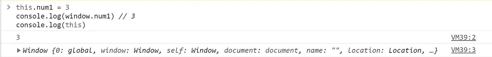
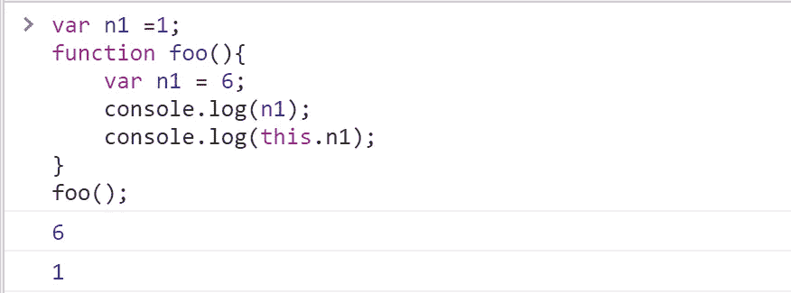
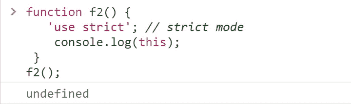
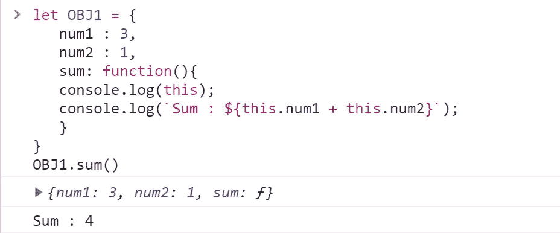
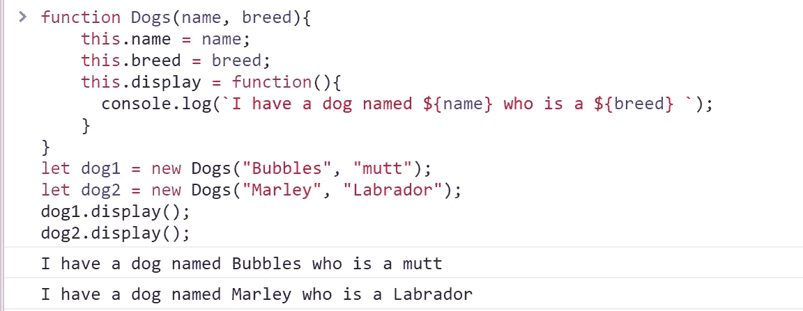
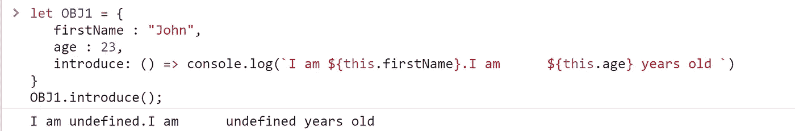
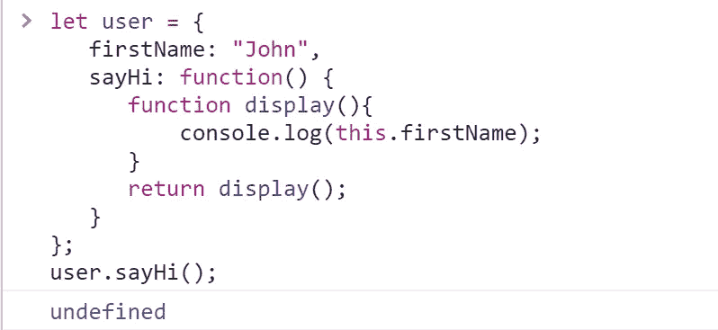
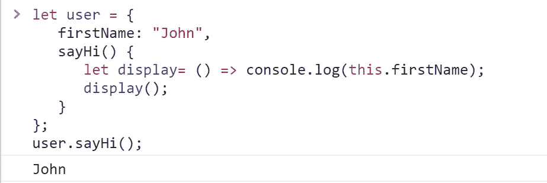
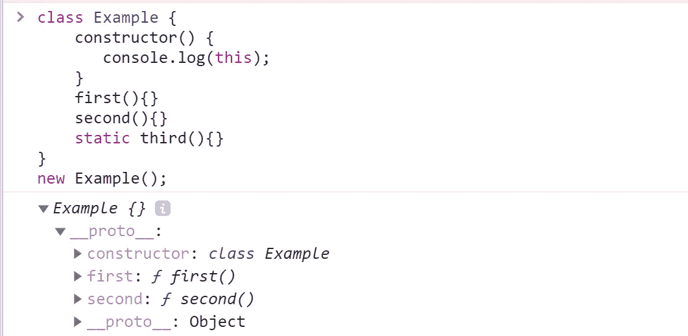

# 探索不同执行上下文中的 JavaScript“this”关键字

> 原文：<https://javascript.plainenglish.io/exploring-this-in-different-contexts-af10e2248ddd?source=collection_archive---------12----------------------->


Photo by [Prateek Katyal](https://unsplash.com/@prateekkatyal?utm_source=medium&utm_medium=referral) on [Unsplash](https://unsplash.com?utm_source=medium&utm_medium=referral)

JavaScript 中的“this”关键字指的是执行当前函数的对象。“this”关键字在不同的上下文中有不同的作用，可能很难理解，尤其是对新人来说，这可能会令人望而生畏。在这篇文章中，我解释了“这个”在不同上下文中的行为。

## **全球背景**

在全局上下文中，即在任何函数或对象之外，“this”关键字指的是窗口对象。

例如:

```
this.num1 = 3
console.log(window.num1) // 3
console.log(this) //window object
```

输出:



“this”的工作方式也随着它执行的模式(严格模式或默认模式)而变化。在全局上下文中，在任一模式下，this 的用法总是指窗口对象。

## **常规功能**

在函数内部,“this”关键字仍然引用全局对象。尽管在严格模式下，“this”只会返回“undefined”。

例如:

```
function foo(){
    return this;
}
console.log(foo()); //window object
```

让我们在函数内部和外部声明一个同名的变量，并尝试在函数内部引用带有' this '的变量。输出会是什么？它会指向局部变量还是全局变量？

```
var n1 =1;
function foo(){
    var n1 = 6;
    console.log(n1);   // 6
    console.log(this.n1);   //1
}
foo();
```

输出:



正如我们在上面的输出中看到的，用这个调用函数内部的变量会引用全局变量，而没有这个，它会引用局部变量。

在严格模式下的函数中使用“this ”:

```
function f2() {
   ‘use strict’; // strict mode
    console.log(this);
 }
f2();
```

输出:



## **对象方法**

当一个函数被定义为一个对象的属性时，它就被称为方法。方法中的“this”与函数中的“this”不同。理解这里的工作原理是很重要的，因为两者返回不同的值。这里的“this”指的是该方法所属的对象。

例如:

```
OBJ1:{
   num1 : 3,
   num2 : 1,
   sum: function(){
   console.log(this);
   console.log(`Sum : ${this.num1 + this.num2}`);
   }
}
OBJ1.sum()
```

输出:



在上面的例子中，“this”被设置为对象“obj1 ”,并且可以访问它的所有属性，正如我们从 **console.log(this)的输出中看到的。**

## **构造函数**

构造函数是通过在函数名前面加上“new”关键字来定义的。

语法:

```
let dog1 = new Dogs(‘Bubbles’, ‘mutt’); //By convention constructors should start with capital letter.
```

这里 dog1 是新创建的构造函数 Dogs 的对象。构造函数用于初始化对象。构造函数中的“this”关键字类似于它在方法中的工作方式。它引用构造函数的对象。

例如:

```
function Dogs(name, breed){
    this.name = name;
    this.breed = breed;
    this.display = function(){
      console.log(`I have a dog named ${name} who is a ${breed} `);
    }
}
let dog1 = new Dogs("Bubbles", "mutt");
let dog2 = new Dogs("Marley", "Labrador");
dog1.display();
dog2.display();
```

在上面的例子中，“this”指向调用它的相应对象，即 dog1 或 dog2。

在执行过程中，“this”被转换为 dog1，因此它本质上与 dog 1 . name = name；相同。dog1.breed =品种；

输出:



## **箭头功能**

箭头函数实际上没有自己的上下文。如果在 arrow 函数中使用“this ”,它将引用其外部函数。

例如:

```
var window = this;
var get = (() =>this)
console.log(get() === window); //True
```

这里，“this”指的是窗口对象。因此我们不应该使用箭头函数作为方法，因为它们会引用窗口对象。

例如:

```
let OBJ1 = {
   firstName : “John”,
   age : 23,
   introduce: () => console.log(`I am ${this.firstName}.I am      ${this.age} years old `)
}
OBJ1.introduce();
```

输出:



正如您从上面的输出中所看到的，arrow 函数“import”指向全局对象，因此返回 undefined。

然而，箭头函数确实有一个特殊的功能。让我们看看下面的例子:

```
let user = {
   firstName: “John”,
   sayHi: function() {
      function display(){
          console.log(this.firstName);
      }
      return display();
   }
};
user.sayHi();
```

输出:



正如我们所看到的，函数显示在对象内部，并且“这”仍然指向全局对象。这是因为 display()是使用一个简单的函数调用来调用的，正如我们之前看到的，函数中定义的“这个”将总是引用全局对象。

这就是箭头功能出现的地方。当我们实际上不想有一个单独的“这个”，而是从外部上下文中获取名字的值时，这是很有用的。

```
let user = {
   firstName: “John”,
   sayHi() {
      let display= () => console.log(this.firstName);
      display();
   }
};
user.sayHi();
```

输出:



我们得到了输出 John，因为箭头函数中的“这个”指向它的外部函数。

## **类**

类中的“this”关键字的工作方式类似于它在函数中的工作方式，因为在 JavaScript 中，类是通过函数实现的。除了这里的“this”指的是一个对象，类的所有方法都被添加到它的原型中。

例如:

```
class Example {
    constructor() {
       console.log(this);
    }
    first(){}
    second(){}
    static third(){}
}
new Example();
```

输出:



***注:*** *这里，静态方法不是对象的一部分，它们是类的属性。只有非静态方法被添加到对象的原型中。*

有关如何使用“this”的更多信息，请点击此处的链接。

*多内容于* [*中*](http://plainenglish.io/)