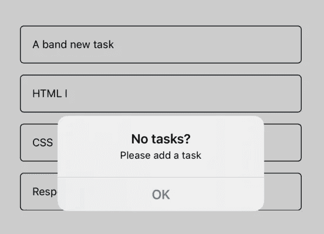
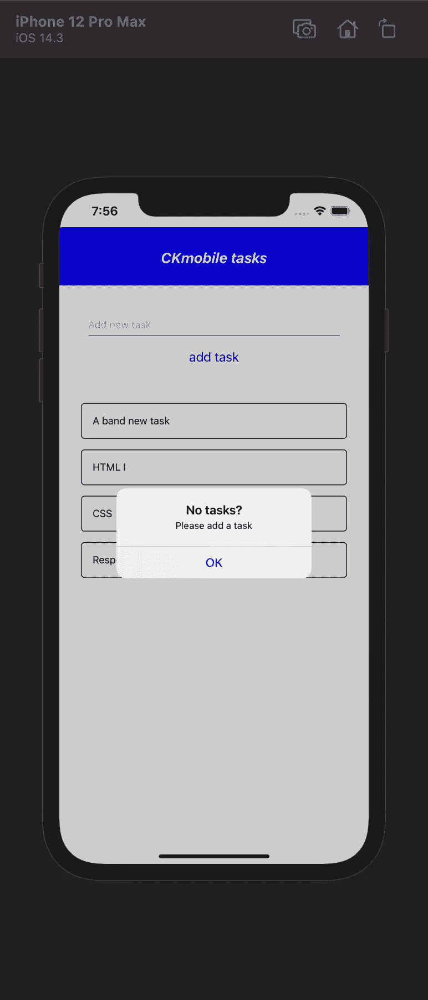

# Expo React 本地待办事项应用程序第 4 部分—创建警告消息

> 原文：<https://javascript.plainenglish.io/expo-react-native-part-4-alert-message-370306581e28?source=collection_archive---------10----------------------->

## 创建警报消息



在本文中，我们将添加一些验证。如果输入字段为空，并且用户按下“添加任务”按钮。

完整内容:

[第 1 部分—创建基本布局和标题组件](https://medium.com/javascript-in-plain-english/react-native-todo-part-i-9f0a028bea4a)

[第 2 部分—创建项目组件](https://ckmobile.medium.com/expo-react-native-todo-part-2-a14e60ad003c)

第 3 部分— [创建 AddTask 组件来插入一个新任务](https://ckmobile.medium.com/expo-react-native-todo-part-3-6e6ab60661db?source=your_stories_page-------------------------------------)

第 4 部分— [出现错误时发出警报](https://medium.com/javascript-in-plain-english/expo-react-native-part-4-alert-message-370306581e28?source=your_stories_page-------------------------------------)

第 5 部分— [当您单击键盘以外的位置时，关闭键盘](https://ckmobile.medium.com/expo-react-native-part-5-dismiss-keyboard-78fba7b5cfff?source=your_stories_page-------------------------------------)

第 6 部分— [Expo React 本地第 6 部分—删除项目](https://ckmobile.medium.com/expo-react-native-part-6-delete-item-adee12a04942?source=your_stories_page-------------------------------------)

第 7 部分— [使用 flexBox 解决屏幕外问题。](https://ckmobile.medium.com/expo-react-native-part-7-fix-the-last-item-get-pushed-off-the-screen-64ffdd3e6eb0?source=your_stories_page-------------------------------------)

相关课程:

[](https://www.udemy.com/course/react-native-expo-for-multiplatform-ios-android-mobile-app-development/?couponCode=830C04545808D5CC2FFE) [## React native Expo 支持多平台移动应用开发

### 他是一名注册教师，在 javascript、物理、数学和统计方面有超过 10 年的教学经验…

www.udemy.com](https://www.udemy.com/course/react-native-expo-for-multiplatform-ios-android-mobile-app-development/?couponCode=830C04545808D5CC2FFE) [](https://www.udemy.com/course/complete-react-course-w-hooks-react-router-redux-usecontext/?referralCode=B192869617ADE079536F) [## React-React Hook Redux 2021 在 4 小时内的完整指南

### 他是一名注册教师，在 javascript、物理、数学和统计方面有超过 10 年的教学经验…

www.udemy.com](https://www.udemy.com/course/complete-react-course-w-hooks-react-router-redux-usecontext/?referralCode=B192869617ADE079536F) 

会弹出一个警告信息，让用户知道在按下按钮之前应该在输入框中输入一些内容。

首先，我们需要在顶部导入警报。

```
import { StyleSheet, Text, View, FlatList, SafeAreaView, **Alert** } from 'react-native';
```

在 addTask 函数中，我们将检查文本是否存在，如果存在，我们将把它添加到列表中，否则我们将显示警告消息。

```
const addTask = text => {if (!text) {Alert.alert('No tasks?', 'Please add a task', { text: 'OK' })} else {setTasks(prevTodos => {return [{ task: text, id: uuidv4() }, ...prevTodos]})}}
```

我们需要做的是通过一些不同的论点。第一个是警报的标题。第二个是某种消息，我们将说“请添加一个任务”。

最后一个参数是代表警告消息上的按钮。这里，我们指定该按钮的文本为“OK”。



Youtube 上的免费教程:

[](https://www.youtube.com/channel/UCu4-4FnutvSHVo9WHvq80Ww) [## ckmobile

### 无论你是在后台还是前台工作，JavaScript 现在都非常重要。NodeJS、Angular、VueJS 或 React all…

www.youtube.com](https://www.youtube.com/channel/UCu4-4FnutvSHVo9WHvq80Ww) 

关注我们:

[](https://www.linkedin.com/company/ckmobi/) [## Ckmobile | LinkedIn

### CK mobile | LinkedIn 上有 34 个关注者。主要关注面向初学者的 JavaScript 教程以及不同的 JavaScript…

www.linkedin.com](https://www.linkedin.com/company/ckmobi/) 

[https://twitter.com/ckmobilejavasc1](https://twitter.com/ckmobilejavasc1)