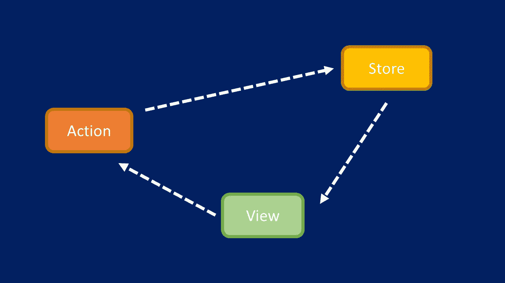
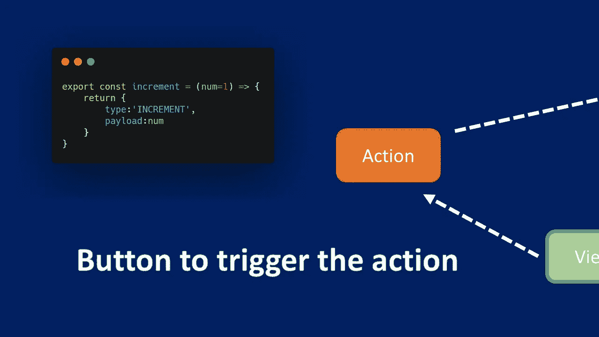
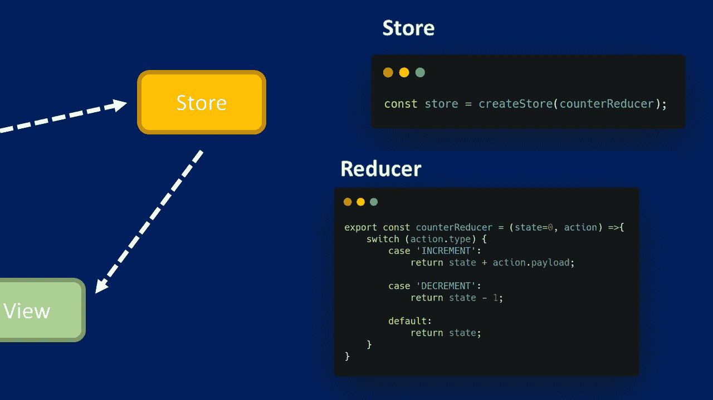
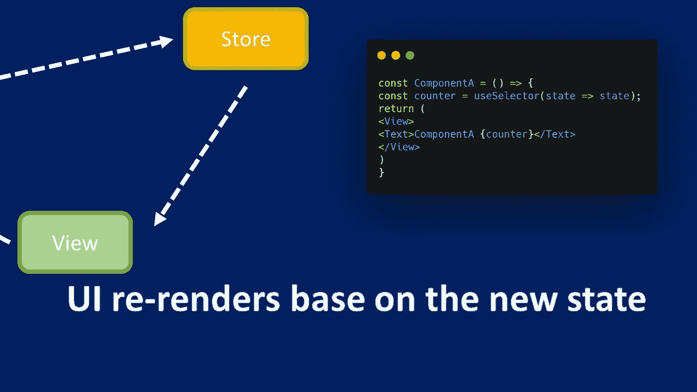
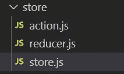
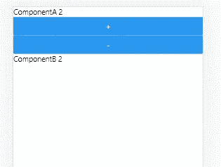
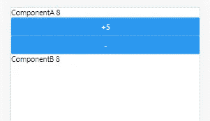

# Expo React Native Redux 入门(React Redux)

> 原文：<https://javascript.plainenglish.io/expo-react-native-redux-9f9e3cb04967?source=collection_archive---------6----------------------->

## 视图、动作、存储、状态和归约器的简单说明

在本文中，我们将对 redux 做一个简单的解释，包括视图、动作、状态和 redux。之后，我们将创建一个应用程序来演示这一点。

## 数据流



一个简单的解释是视图包含按钮来调度动作。

存储中的缩减器根据动作和当前状态决定如何更新状态(真实的来源)。

UI 基于最新状态重新呈现。

## 视图→操作



首先，视图中会有一个按钮来触发动作创建者。

```
const ComponentA = () => {const dispatch = useDispatch();return (<View><Button title="+5" onPress={()=>dispatch(increment(5))}/></View>)}
```

动作创建器是一个创建并返回动作对象的函数。

Action 包含一个类型字段，它通常是一个描述性的名称，这里是“INCREMENT”，因为我们想要增加值。

另一个字段是 payload，这是附加信息，这里是“num”，表示我们要添加的数字

```
export const increment = (num=1) => {return {type:'INCREMENT',payload:num}}
```

## 行动→存储



存储是通过传入一个 reducer 创建的。这里我们将减速器命名为“反减速器”

Reducer 决定如何更新状态。

减速器的规则

*   基于状态和动作计算新的状态值
*   必须通过复制现有状态进行不可变的更新，并修改副本。不允许直接更新状态
*   不得执行任何异步逻辑或计算随机值

```
export const counterReducer = (state=0, action) =>{switch (action.type) {case 'INCREMENT':return state + action.payload;case 'DECREMENT':return state - 1;default:return state;}}
```

## 商店→查看



状态更新后，UI 将基于新状态重新呈现。

选择器是从存储状态值中提取特定信息片段的功能。在这里，由于我们使用 react，所以使用 useSelector()从 Redux 存储状态中提取特定数据。

```
const ComponentA = () => {const counter = useSelector(state => state);return (<View><Text>ComponentA {counter}</Text></View>)}
```

## 开始项目

要使用 redux，我们需要安装以下软件包。

```
npm install redux react-redux
```

## 动作、减速和存储

创建“store”文件夹，在文件夹内创建 action.js、reducer.js 和 store.js



在 action.js 中，我们创建了两个函数，一个是增量，另一个是减量。

```
export const increment = () => {return {type:'INCREMENT',}}export const decrement = () => {return {type:'DECREMENT'}}
```

在 reducer.js 中，我们将初始状态设置为 0，并将动作传递给 reducer。如果类型为“增量”，状态将增加 1。如果类型为“减量”，状态将减 1。否则将返回当前状态。

```
export const counterReducer = (state=0, action) =>{switch (action.type) {case 'INCREMENT':return state + 1;case 'DECREMENT':return state - 1;default:return state;}}
```

现在我们可以去创建一个商店。

在 store.js 中，我们需要从刚刚创建的“redux”和 counterReducer 导入 createStore

```
import {createStore} from 'redux';import {counterReducer} from './reducer';const store = createStore(counterReducer);export default store;
```

## 组件 A

在组件 A 中，我们将添加两个按钮来增加和减少值。从动作中导入增量和减量。从“react-redux”导入 useSelector 和 useDispatch。一个是从商店获取状态。另一个是调度动作和更新状态。

```
import React from 'react'import { View, Text, Button } from 'react-native'import {useSelector, useDispatch} from 'react-redux'import {increment,decrement} from '../store/action'const ComponentA = () => {const counter = useSelector(state => state);const dispatch = useDispatch();return (<View><Text>ComponentA {counter}</Text><Button title="+" onPress={()=>dispatch(increment())}/><Button title="-" onPress={()=>dispatch(decrement())}/></View>)}export default ComponentA
```

## 成分 B

接下来，我们还要创建另一个组件。这个组件只是显示状态。这只是为了说明分量 A 和 B 具有相同的值。

```
import React from 'react'import { View, Text } from 'react-native'import {useSelector} from 'react-redux'const ComponentB = () => {const counter = useSelector(state => state);return (<View><Text>ComponentB {counter}</Text></View>)}export default ComponentB
```

App.js

最后，我们需要在 App.js 中导入组件 A 和组件 B。从' react-redux '中导入提供者，用提供者包装这两个组件，并使 redux 存储对这两个组件可用。

```
import React from 'react';import { StyleSheet } from 'react-native';import ComponentA from './components/ComponentA';import ComponentB from './components/ComponentB';import {Provider} from 'react-redux';import store from './store/store'export default function App() {return (<Provider store={store}><ComponentA/><ComponentB/></Provider>);}const styles = StyleSheet.create({container: {flex: 1,backgroundColor: '#fff',alignItems: 'center',justifyContent: 'center',},});
```

现在，如果您测试应用程序，可以通过按“+”或“-”按钮将该值更改 1。



## 有效负载在运行

为了使增量可以定制，我们需要对 action creator 进行一些修改。

在 action.js 中，我们添加了参数并将默认值设置为 1，因此如果函数中没有值传递，它将假定值增加 1。

```
export const increment = (num=1) => {return {type:'INCREMENT',payload:num}}
```

回到 App.js，我们从+1 更改为+5，然后将值 5 传递给函数，您应该会看到值增加了 5。

```
import React from 'react'import { View, Text, Button } from 'react-native'import {useSelector, useDispatch} from 'react-redux'import {increment,decrement} from '../store/action'const ComponentA = () => {const counter = useSelector(state => state);const dispatch = useDispatch();return (<View><Text>ComponentA {counter}</Text>**<Button title="+5" onPress={()=>dispatch(increment(5))}/>**<Button title="-" onPress={()=>dispatch(decrement())}/></View>)}export default ComponentA
```



**源代码:**

[](https://www.udemy.com/course/react-native-expo-for-multiplatform-ios-android-mobile-app-development/?couponCode=75C8FF31C25264702211) [## React native Expo 支持多平台移动应用开发

### 他是一名注册教师，在 javascript、物理、数学和统计方面有超过 10 年的教学经验…

www.udemy.com](https://www.udemy.com/course/react-native-expo-for-multiplatform-ios-android-mobile-app-development/?couponCode=75C8FF31C25264702211) 

**免费 YouTube 教程:**

[](https://www.youtube.com/channel/UCu4-4FnutvSHVo9WHvq80Ww?sub_confirmation=1) [## ckmobile

### 无论你是在后台还是前台工作，JavaScript 现在都非常重要。NodeJS、Angular、VueJS 或 React all…

www.youtube.com](https://www.youtube.com/channel/UCu4-4FnutvSHVo9WHvq80Ww?sub_confirmation=1) 

**关注我们:**

[https://www.linkedin.com/company/ckmobi/](https://www.linkedin.com/company/ckmobi/)

[https://twitter.com/ckmobilejavasc1](https://twitter.com/ckmobilejavasc1)