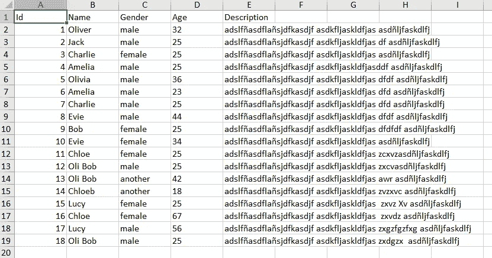

# 使用 JavaScript &&制表器导出数据

> 原文：<https://javascript.plainenglish.io/export-data-using-the-javascript-tabulator-5814fa5c6e0f?source=collection_archive---------5----------------------->

## 如何以 1 比 10 的比例减小生成的文件大小

Photo by [https://undraw.co/](https://undraw.co/search)

[制表器](http://tabulator.info/)是一个很棒的 JavaScript 库，它允许我们从 JavaScript Array、AJAX 数据源、HTML 或 JSON 格式的数据中在几秒钟内创建**交互式**表格。

Html table created with Tabulator and JavaScript

# 问题是

制表软件直接允许我们下载不同格式的数据，如 CSV、XLSX 或 PDF，但是当我们将数据导出到 XLSX 文件时，我们会得到一个不愉快的惊喜。

如果我们不打算导出大量数据，这是没有问题的，但是当我们想要导出一个大的数据集时，我们会看到结果文件非常大。

例如，如果我们从一个 XLSX 格式的原始文件开始，有 30000 行 40 列，大小大约为 6 MB，提取这些数据并使用制表器使用，然后使用制表器再次将其导出为 XLSX 格式，我们将会看到生成的文件将增长到 60MB 左右。

如果我们打开这个文件，我们可以看到它与原始内容相同，但是大小非常不同。

现在，如果我们再次用 [Microsoft Excel](https://en.wikipedia.org/wiki/Microsoft_Excel) 保存它，我们将会看到尺寸是如何神奇地再次缩小的。

## 那么，发生了什么事？

发生的情况是，当您用 Microsoft Excel 保存文件时，会应用一种压缩算法来压缩文件，这是制表程序无法做到的。

制表器内部使用 [SheetJs](https://sheetjs.com/) 将您的表格数据导出到 XLSX，但不允许我们配置 SheetJs 内部使用的数据压缩算法。

## 例子

首先，让我们创建一个例子，我们将使用制表器和 JavaScript 创建一个交互式 html 表格。

第一种方法是直接使用制表器创建表格，并将其数据导出到 XLSX 文件中。

在第二个方案中，我们将使用制表器创建表格，但我们将修改制表器导出到 XLSX 格式的方式，以直接使用 SheetJs，但不会失去制表器默认提供的导出数据的功能。

## 第一种方法

Initial solution.

## 结果

Html table in the browser.

现在，我们可以通过点击“下载 XLSX”按钮将表格数据导出为 XLSX 格式的文件，结果得到一个 20KB 大小的 data.xlsx 文件。

如果我们现在用 Microsoft Excel 打开并保存该文件，大小将减少到只有 9 KB。

出现这种情况是因为 Microsoft Excel 在保存文件时使用了压缩算法，而制表程序没有。

# 解决方案

解决这个问题并使用 SheetJS 压缩算法通过制表器导出到 XLSX 的方法之一是使用以下技巧:

首先，我们修改我们调用的导出到 XLSX 的函数，这样它生成 JSON 代码作为响应，而不是 XLSX。我们这样做是为了不丢失任何行和列的格式。

Download xlsx listener

当文件下载准备就绪时，我们截取调用，而不是返回带有下载内容的 blob(请记住，我们已经将其修改为 json)，我们使用 SheetJS 从 json 直接生成 XLSX，但告诉它在创建文件时使用压缩算法。

Download ready function

## 最终代码

Final solution

如果您现在再次尝试导出，您会看到文件从 20KB 变成 9KB。如果要导出的数据量很大，这种差异会更大。

# 最后的想法

在这篇文章中，我们已经看到了如何改进如何制表导出到 XLSX 格式，避免文件占用过大的大小。如您所见，它非常简单，几乎不需要任何代码。

希望你觉得有用！当然，代码还可以改进，但是我打算简单地展示我们开始时的问题的解决方案。

*更多内容尽在*[*plain English . io*](http://plainenglish.io/)