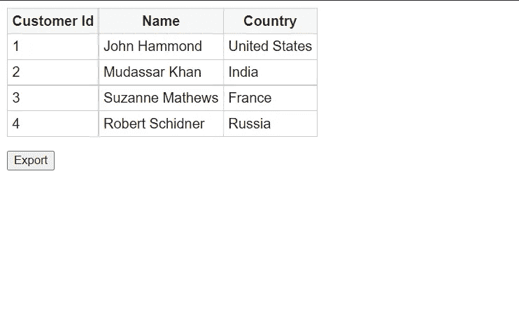
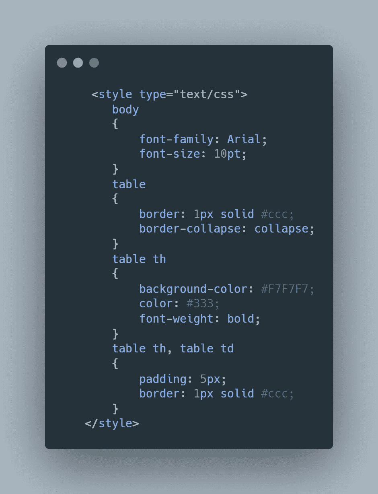
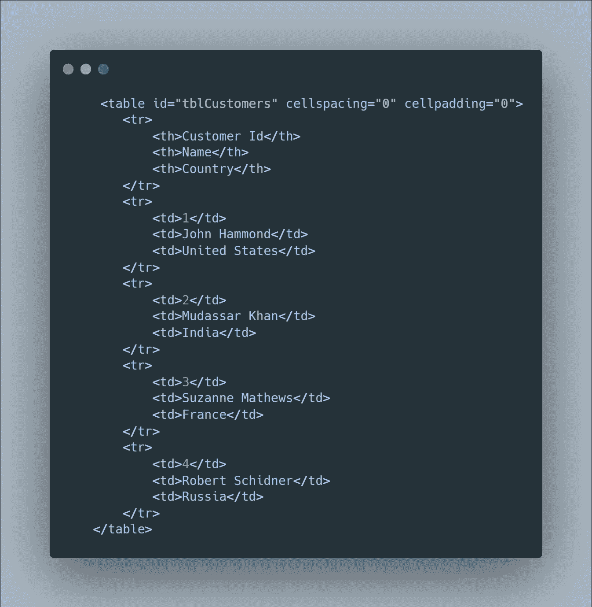
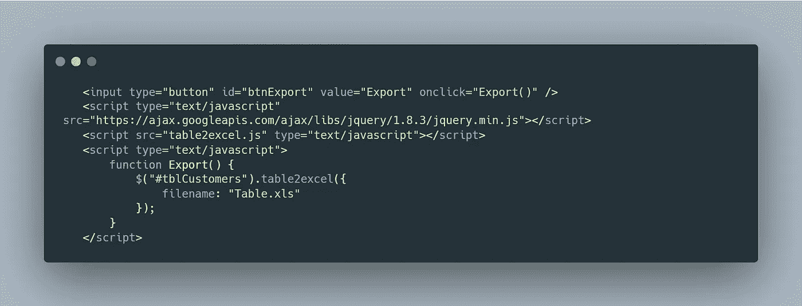
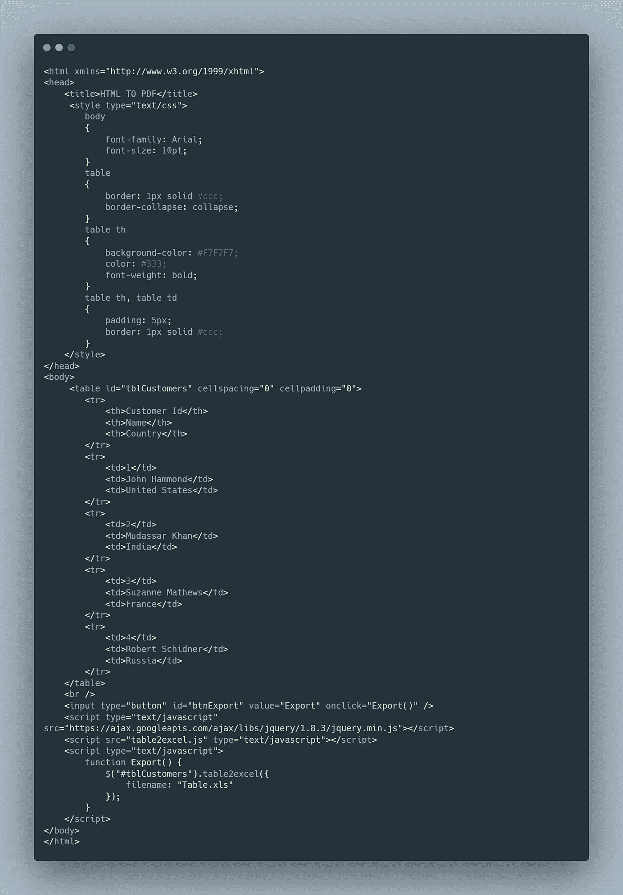

# 使用 JavaScript 插件将 Excel(XSL)文件从 HTML 表格导出到 Excel

> 原文：<https://javascript.plainenglish.io/export-excel-xsl-file-from-html-using-table-to-excel-javascript-plugin-b613325425fc?source=collection_archive---------11----------------------->

> 在本教程中，我们将学习如何轻松地将任何 HTML 表格导出到 excel 文件。为此，我们只需要使用几个 jQuery 插件和 Ajax。

这里我已经创建了一个 HTML 表格，它有一个最小的设计和一个导出按钮。当按下按钮时，将生成所需的 excel 文件。这是座右铭。

网页应该是这样的。我知道你可以用更吸引人的方式设计一个 HTML 表格。

**所需插件:**

2.在你的 head 标签的末尾加上这个。

CSS

这是我的 HTML 表格内容。不要忘记在表标记中添加“id”。这将会改变我们的游戏规则。

HTML TABLE

现在添加一个按钮，通过它我们可以调用一个函数来生成我们的 excel 文件。

就这样了，伙计们。这样，我们就可以从 HTML 表格中生成一个 excel 文件。看看最终的代码库就知道了。

非常感谢你一直读到最后。如果你需要帮助，可以联系我。编码快乐！✌✌✌✌✌

> ***接我:***
> 
> ***Web:****[*https://ankandas.netlify.app/****Instagram:***](https://ankandas.netlify.app/)[*https://www.instagram.com/*](https://www.instagram.com/ankan_designer/)*ankan _ designer/* ***GitHub:****[*https://github.com/*](https://github.com/Ankan982)**

****更多内容请看*[***plain English . io***](http://plainenglish.io/)***