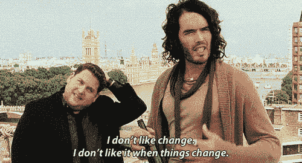

# 您现在可以将反应组件导出为图像

> 原文：<https://javascript.plainenglish.io/export-react-components-as-images-15168b73b0eb?source=collection_archive---------2----------------------->

## 使用 html2canvas


Photo by [Carlos Muza](https://unsplash.com/@kmuza?utm_source=unsplash&utm_medium=referral&utm_content=creditCopyText) on [Unsplash](https://unsplash.com/s/photos/web-app?utm_source=unsplash&utm_medium=referral&utm_content=creditCopyText)

我最近的任务是实现逻辑，用网页上的数据可视化来捕获反应组件，并将其导出为图像。其他数据可视化库(如[高级图表](https://www.highcharts.com/))允许将图形导出为图像。然而，我们需要一个来同时导出一页上的多个图表。

这就是 [html2canvas](https://www.npmjs.com/package/html2canvas) 派上用场的地方。

这个包通过读取 DOM 元素及其样式，然后根据这些数据生成一个画布图像，来生成一个“屏幕截图”。它完全在客户端运行，所以您不必担心任何请求/服务器支持。

首先，安装 npm 包。

```
npm i html2canvas
```

现在我们已经安装了它，我们可以导入我们的组件了。

```
import *html2canvas* from "html2canvas";
```

现在我们可以像这样使用`html2canvas`。

```
const capture = () => {
  html2canvas(document.body).then(function(canvas) {
    document.body.appendChild(canvas);
  });
}
```

在这个函数中，`html2canvas`将一个 DOM 元素作为参数，从中生成一个画布图像，然后返回一个包含画布元素的`Promise`。我们可以使用`Promise`履行处理程序(`.then()`)访问它，然后用它做我们想做的任何事情。在我的例子中，我需要生成一个图像并为用户下载。

这个库对我的用例来说很棒，除了一个警告。

如果存在*任何水平溢出*，它将只捕获可见的内容。被溢出滚动隐藏的 DOM 元素的任何部分都被切断了。

这意味着我需要补偿页面调整大小时隐藏的任何数据可视化效果。我可以垂直堆叠可视化效果，但是这可能很复杂。

## 1.项目管理期望

在 sprint 过程中对商定的规格进行更改通常是不理想的(除非绝对没有办法在给定的时间框架内满足要求)。因为这个问题已经达成一致，改变布局会破坏开发过程，并且需要与产品团队和设计师进行更多的讨论(更多的会议，更多的时间)。

## 2.用户体验

最初设计并接受最初的用户界面是有充分理由的。当您有多个可视化效果、附带表格等时，纯垂直布局并不理想。当应用程序不是移动的时候。并排比较更加困难，并且导出的图像最终会非常高，因此并不总是 PowerPoint 演示文稿的最佳布局。

那么，我如何能够保持现有的 UI 不变，同时捕获所有相关的数据(即使它暂时被隐藏)？我的解决方案有点非正统(有点反 react 模式)，但是我从关于[堆栈溢出](https://stackoverflow.com/questions/59159579/html2canvas-jspdf-cut-off-image)的一个问题中获得了灵感。

基本上，我需要做的是暂时使`html`和`body`标签足够大，以容纳数据可视化，而容器不会隐藏任何数据。一旦足够大，捕获数据，生成画布图像，然后将`html`和`body`标签设置回它们的原始大小。

大小需要是动态的，而不仅仅是设置足够大的静态宽度来适应大多数情况(如果我只有两个项目要可视化，我不需要我的容器是 10，000 像素宽)。在某些情况下，容器根本不需要调整大小。那么，我该如何适应需要可视化的一个、两个、十个或更多项目的宽度呢？

这是我的函数。

```
const exportAsPicture = () => { var html = document.getElementsByTagName('HTML')[0]
  var body =  document.getElementsByTagName('BODY')[0]
  var htmlWidth = html.clientWidth;
  var bodyWidth = body.clientWidth;
  var data = document.getElementById('exportContainer')
  var newWidth = data.scrollWidth - data.clientWidth if (newWidth > data.clientWidth){
    htmlWidth += newWidth
    bodyWidth += newWidth
  } html.style.width = htmlWidth + 'px'
  body.style.width = bodyWidth + 'px' html2canvas(data).then((canvas)=>{
    var image = canvas.toDataURL('image/png', 1.0);
    var fileName = currentExport.split("Export")[0] + '.png'
    saveAs(image, fileName)
  })
}
```

首先，我得到了`html`和`body`的宽度。我需要这些来决定我的起始宽度。然后我捕获容器的`clientWidth`和`scrollWidth`。`[clientWidth](https://developer.mozilla.org/en-US/docs/Web/API/Element/clientWidth)`是元素的内部宽度，以像素为单位。它包括填充，但不包括边框、边距和滚动条。

`[scrollWidth](https://developer.mozilla.org/en-US/docs/Web/API/Element/scrollWidth)`该值是否等于元素在不使用水平滚动条的情况下适合视窗中所有内容所需的最小宽度(即，如果没有溢出，则为我的容器的宽度)。

那么，为什么我们需要这两种价值观呢？因为我希望宽度变化是动态的(相对于需要可视化的项目数量)，所以我想比较一下`clientWidth`和`scrollWidth`，看看我是否需要改变宽度。



如果`clientWidth` *是* *而不是*小于`scrollWidth`(容器中没有溢出/隐藏的部分)，那么我就保持`html`和`body`的宽度不变。如果`clientWidth` *比`scrollWidth`小*(这里*是*容器的一部分被隐藏了)我需要把`scrollWidth`和`clientWidth`的差值加到`html`和`body`的宽度上。

一旦宽度足够大，我就使用`html2canvas`来捕获容器中的 DOM 元素，生成一个 canvas 元素，然后通过`canvas.toDataURL(‘image/png’, 1.0).`从 canvas 元素创建一个 DataURL

`[canvasToDataURL](https://developer.mozilla.org/en-US/docs/Web/API/HTMLCanvasElement/toDataURL)`返回一个[数据 URI](https://developer.mozilla.org/en-US/docs/Web/HTTP/Basics_of_HTTP/Data_URIs) ，包含由`type`参数指定格式的图像表示(默认为 [PNG](https://en.wikipedia.org/wiki/Portable_Network_Graphics) )。返回的图像分辨率为 96 dpi。我添加的`1.0`是一个编码器选项，用于确定图像质量(在 0 和 1 之间)。从`canvasToDataURL`返回的值将如下所示。

```
data:image/png;base64,iVBORw0KGgoAAAANSUhEUgAABPMAAAXSCAYAAAB956qJAAAgAElEQVR4XuydB7QkRfWHi7jknDNIFgQEJAclCgiSRRABJSNBcpYcVCQoUaLkj...
```

一旦我们有了这个，我们可以在我们的第一个`Promise`处理程序中返回它，在那里我们将新生成的图像传递给`saveAs`。参见下面的`saveAs`代码。

```
const saveAs = (blob, fileName) =>{
  var elem = *window*.document.createElement('a');
  elem.href = blob
  elem.download = fileName;
  elem.style = 'display:none;';
  (*document*.body || *document*.documentElement).appendChild(elem);
  if (typeof elem.click === 'function') {
    elem.click();
  } else {
    elem.target = '_blank';
    elem.dispatchEvent(new *MouseEvent*('click', {
      view: *window*,
      bubbles: true,
      cancelable: true
    }));
  }
  *URL*.revokeObjectURL(elem.href);
  elem.remove()
}
```

虽然看起来这个函数有很多功能，但它基本上只是创建了一个`a`标签，将图像数据指定为`href`，然后将`a`标签作为下载链接。我们模拟一个点击事件，触发下载，然后我们在下载完成后移除`a`标签，以免将其永久添加到 DOM 中。

现在你知道了。您现在可以使用`html2canvas`和上面的代码开始下载 React 组件作为图像。这篇文章的代码可以在 [GitHub](https://github.com/macro6461/html2canvas-demo) 上找到。

[*在这里将你的免费中级会员升级为付费会员*](https://matt-croak.medium.com/membership) *，每月只需 5 美元，你就可以获得数千位作家的无限量无广告故事。这是一个附属链接，你的会员资格的一部分帮助我为我创造的内容获得奖励。谢谢大家！*

# 参考

[](https://github.com/macro6461/html2canvas-demo) [## macro 6461/html 2 can vas-演示

### 通过在 GitHub 上创建帐户，为 macro6461/html2canvas-demo 开发做出贡献。

github.com](https://github.com/macro6461/html2canvas-demo) [](https://www.npmjs.com/package/html2canvas) [## html2canvas

### JavaScript 截图

www.npmjs.com](https://www.npmjs.com/package/html2canvas) [](https://stackoverflow.com/questions/59159579/html2canvas-jspdf-cut-off-image) [## Html2canvas / jspdf 截图

### 我想为我的项目中的一个元素制作一个 pdf，但是图像一直在右边被截断。我使用 jspdf 和…

stackoverflow.com](https://stackoverflow.com/questions/59159579/html2canvas-jspdf-cut-off-image) [](https://developer.mozilla.org/en-US/docs/Web/API/Element/clientWidth) [## Element.clientWidth

### 对于内联元素和没有 CSS 的元素，Element.clientWidth 属性为零；否则就是内宽…

developer.mozilla.org](https://developer.mozilla.org/en-US/docs/Web/API/Element/clientWidth) [](https://developer.mozilla.org/en-US/docs/Web/API/Element/scrollWidth) [## Element.scrollWidth

### Element.scrollWidth 只读属性是元素内容宽度的度量值，包括不包含内容的内容

developer.mozilla.org](https://developer.mozilla.org/en-US/docs/Web/API/Element/scrollWidth) [](https://developer.mozilla.org/en-US/docs/Web/API/HTMLCanvasElement/toDataURL) [## HTMLCanvasElement.toDataURL()

### HTMLCanvasElement.toDataURL()方法返回一个数据 URI，其中包含格式为…

developer.mozilla.org](https://developer.mozilla.org/en-US/docs/Web/API/HTMLCanvasElement/toDataURL) 

*更多内容请看*[***plain English . io***](https://plainenglish.io/)