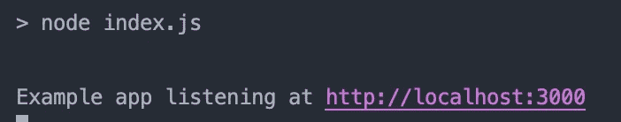

# Expressjs—入门和基本路由

> 原文：<https://javascript.plainenglish.io/express-js-getting-started-basic-routing-938d8b629fe2?source=collection_archive---------6----------------------->


## 什么是快递

Express 是用于服务器端 web 应用程序的 Node.js 框架。Express 基于 Node.js 特性构建，提供简单快速的 web 和移动服务器解决方案。它是开源框架，由 Node.js 社区维护。还有许多其他的基于 Express 的图书馆，许多大的科技公司都在他们的后端服务中使用 Express。在官方页面查看哪些公司在使用 Express。

在 GitHub Express repository 上有 52.3k 星和 8.8k 叉。你可以从他们的官方快递库查看。

## 装置

初始化 npm package.json 后，可以如下安装。如果你还没有，你可以用`npm init -y`初始化

```
npm
npm install express --saveyarn
yarn add express
```

## 你好世界快运

让我们在应用程序中创建新文件`index.js`

```
const express = require('express')
const app = express()
const port = 3000app.get('/', (req, res) => {
  res.send('Hello World!')
})app.listen(port, () => {
  console.log(`Example app listening at [http://localhost:${port}`](http://localhost:${port}`))
})
```

为了能够运行这些代码，让我们在`package.json`中添加`start`脚本，如下所示

```
"start": "node index.js",
```

现在一切都准备好测试了！在您终端上，您可以通过

```
yarn start 
```



我们可以转到 [http://localhost:3000/](http://localhost:3000/) ，然后看到我们的应用程序正在使用`Hello World!`运行


## 快速基本路由

路由是 web 服务器开发中最重要的主题之一。这些路由决定了应用程序将如何响应特定的端点。这些端点在我们的应用程序中用`path`和特定的 HTTP 请求`GET, POST, PUT, DELETE...`来定义。你可以在 [Mozilla 的 HTTP 请求方法](https://developer.mozilla.org/en-US/docs/Web/HTTP/Methods)中了解更多关于 HTTP 请求的信息。

每个路由都可以有处理程序，当路由匹配时执行这些处理程序。

路线定义示例

```
app.METHOD(PATH, HANDLER)
```

如果我们以 Hello world 为例

```
app: is an instance of express
METHOD: get
PATH: '/'
HANDLER: 
(req, res) => {
  res.send('Hello World!')
}--------------------------------------------------------------------app.get('/', (req, res) => {
  res.send('Hello World!')
})
```

让我们在应用程序中创建另一条路线，并通过更多的例子来看看它们是如何工作的。

让我们添加更多的路线到我们的`index.js`文件中

在根航路上用`Hello World!`响应(`/`)

```
app.get('/', function (req, res) {
  res.send('Hello World!')
})
```

响应根路由上的 POST 请求(`/`)，应用程序的主页:

```
app.post('/', function (req, res) {
  res.send('Got a POST request')
})
```

响应对`/user`路线的上传请求:

```
app.get('/user', function (req, res) {
  res.send('Got a GET request at /user')
})
```

响应对`/user`路线的上传请求:

```
app.put('/user', function (req, res) {
  res.send('Got a PUT request at /user')
})
```

响应对`/user`路由的删除请求:

```
app.delete('/user', function (req, res) {
  res.send('Got a DELETE request at /user')
})
```

最后，我们的 index.js 将如下所示。

现在是时候用不同的路线测试我们的应用程序了

你可以使用 [Postman](https://www.postman.com) 或者 CURL 来测试你的路径。

对于每个路由测试 url，您可以在终端中运行这些 CURL 命令并获得响应！

```
curl -X GET [http://localhost:3000/](http://localhost:3000/) 
=> Hello World!'curl -X POST [http://localhost:3000/](http://localhost:3000/) 
=> Got a POST requestcurl -X GET [http://localhost:3000/](http://localhost:3000/)user 
=> Got a GET request at /usercurl -X POST [http://localhost:3000/](http://localhost:3000/)user 
=> Got a POST request at /usercurl -X DELETE [http://localhost:3000/](http://localhost:3000/)user 
=> Got a DELETE request at /user
```

现在，您可以看到我们所有的终端都在按预期工作。

仅此而已！我将继续为 Express 添加新的教程，并在这里编辑参考资料。

如果你在做这个教程或你的成功故事时有任何问题，请在下面评论！

谢谢你读到这里！

下面是教程的 GitHub repo:[速成课](https://github.com/hadnazzar/express-lessons)

*如果你觉得这篇文章很有帮助，你可以通过使用我的推荐链接注册一个* [***中级会员来访问类似的文章***](https://melihyumak.medium.com/membership) *。*

***跟我上*** [**推特**](https://twitter.com/hadnazzar)


Subscribe for more on [Youtube](https://www.youtube.com/c/TechnologyandSoftware?sub_confirmation=1)

# 编码快乐！

梅利赫