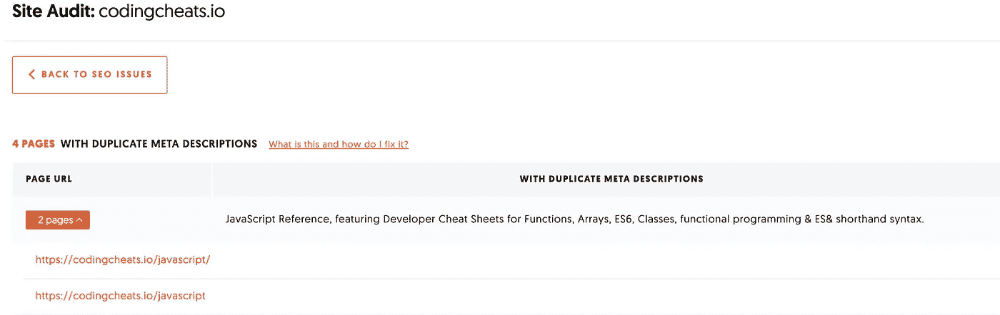
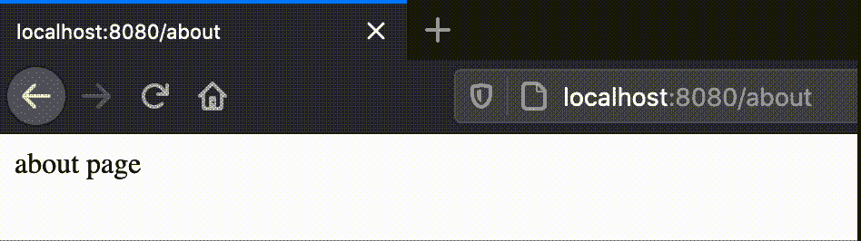
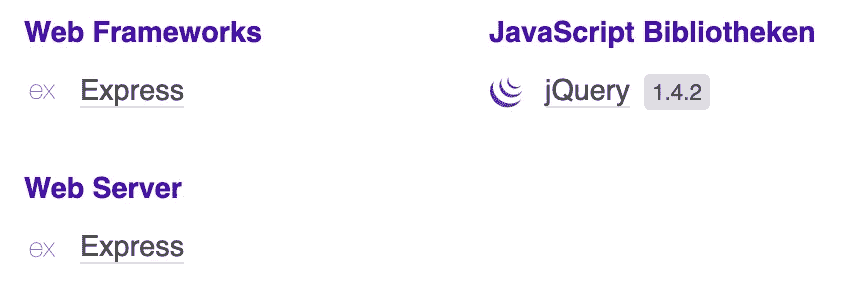

# 针对 Express.js 应用程序的 3 个简单优化

> 原文：<https://javascript.plainenglish.io/express-js-optimizations-52d8ef61bb27?source=collection_archive---------1----------------------->

## 生产就绪应用程序的简单而有效的技巧


Source: the author

# 1.修复结尾斜线

尾随斜线是出现在 URL 末尾的斜线。看起来是这样的:`localhost:8080/about/` —末尾的斜线就是所谓的**尾随斜线**。这实际上是为了标记在这个路径下可以找到更多的内容，所以它是一个目录。

问题是，Express.js 用相同的响应(相同的页面)来回答带有和不带有尾随斜杠的路径，因此它可以在带有和不带有尾随斜杠的情况下被调用。在下面的基本代码示例中，当我们打开`localhost:8080/about`和`localhost:8080/about/`时，So Express 会提供相同的页面:

```
app.get(‘/about’, (req, res) => {
  res.send(‘about page’)
})
```

这些尾随斜线有什么问题？他们可能会导致一个糟糕的搜索引擎优化排名。搜索引擎区分两个 URL，因此会注意到重复的内容出现在网站上。

我在我的[网站](http://codingcheats.io)上遇到了这个问题，正如你所看到的，它被我使用的一个 SEO 工具归类为一个问题。



Site audit from Ubersuggest

我不是 SEO 专家，也没有人真正知道搜索引擎的算法到底是如何工作的——但是在像 Ubersuggest 这样的 SEO 工具中，尾随斜线被认为是一个严重的 SEO 问题。

**以下是修复方法。**

为此，我们可以使用一个简单的中间件来检查每个传入的请求。如果请求包含尾部斜杠，它将被删除。



Source: the author

这个中间件应该没有问题地工作——甚至 [URL 和查询参数](https://medium.com/javascript-in-plain-english/query-strings-url-parameters-d1a35b9a694f)也应该仍然工作，因为中间件只删除了不必要的尾部斜杠。

# 2.关闭由割台供电

你有没有想过像 Wappalyzer 这样的工具是怎么知道你的 web 服务器是基于 Express.js 的？



Source: the author

这是因为 Express.js 发送了一个默认的 HTTP 头——这个头叫做 *X-Powered-By* 。您可以在浏览器的网络选项卡中轻松找到它:


Source: the author

**但是我们为什么要禁用这个表头呢？**

首先，它使你的应用程序的整体响应更大——即使只是最小的。

第二，它让每个人都看到你的应用是基于 Express.js 的，这没什么好羞愧的，但我们应该永远做最坏的打算。
在这种情况下，潜在的攻击者会收集有关您系统的信息来寻找漏洞。

好在失能，不费吹灰之力。我们只需要下面一行，我们应该将它插入实例创建的正下方:

```
const app = express()app.disable('x-powered-by');
```

# 3.压缩

使用压缩可以如此简单。尤其是对于用 Express.js 交付的较大页面，这是值得的。多亏了 NPM 模块*压缩，*我们可以只用一行代码就大规模压缩我们的内容。
这不仅适用于静态内容，也适用于 res.send-responses。

可以用`npm install compression`安装中间件。

它必须包含在顶部，即在 express.static 之前，否则，它只能在有限的范围内工作。
这里有一个正确整合的例子:

```
const compression = require("compression")
....app.use(compression())app.use('/static', express.static('public'))
```

这一行做了很多。例如，我创建了一个静态页面，通常大小为 18.7 kb——经过压缩；只有 1.3 kb。一个巨大的差异，即使它总是依赖于文档。默认情况下，中间件使用 gzip 压缩。

## [加入我的简讯，了解最新消息](http://eepurl.com/hacY0v)